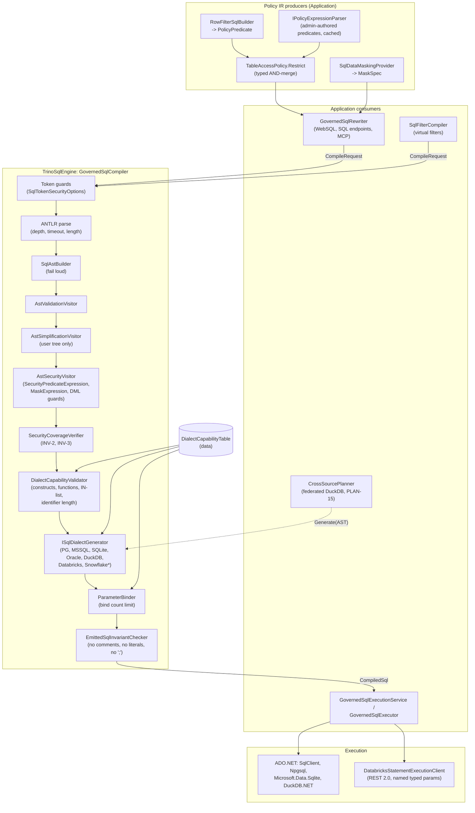
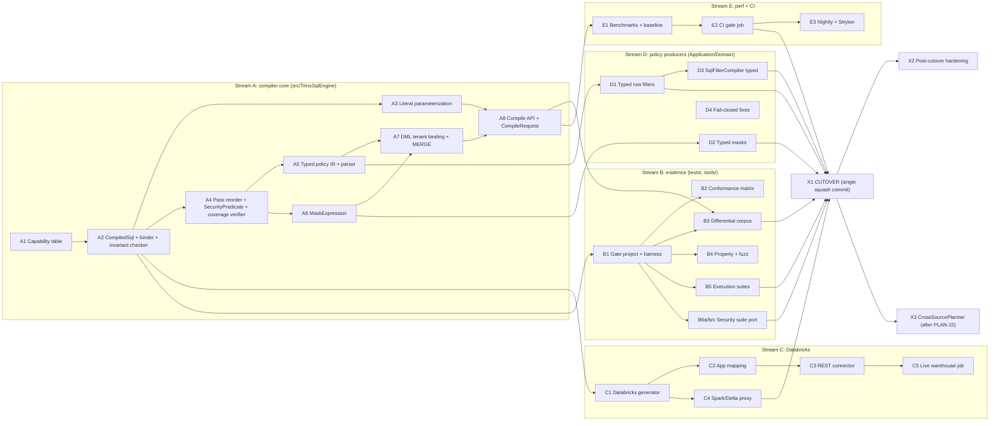

# Implementation Plan: AST Target Dialect Generator - Single-Path Compiler Cutover

**Document ID:** `PLAN-AST-DIALECT-GEN-16` (implementation plan, Phase 2 of the 6-phase lifecycle)
**Date:** 2026-10-10
**Status:** IN PROGRESS - Phase 2 delivered, awaiting Phase 3 security review
**Author:** Solution Architect (`csharp-architect`)
**Parent plan:** [00-master-plan-overview.md](00-master-plan-overview.md)
**Requirements baseline:** [2026-10-10-req-ast-dialect-generator.md](2026-10-10-req-ast-dialect-generator.md) (PRD, Phase 1)
**Supersedes:** [2026-10-06-implementation-plan-ast-dialect-generator.md](2026-10-06-implementation-plan-ast-dialect-generator.md) (German draft, kept for history only)
**Amends:** [ADR-017 §2](../adr/ADR-017-distributed-state-ast-generator-and-rbac.md) (amendment text in §13; Phase 6 writes it)
**Branch base:** `feat/ast-target-dialect-generator` (commit `6985be1`)

---

## 0. Summary

The end state is **one** governed SQL compiler. Every SQL text produced by WebSQL, SQL endpoints, MCP dataset tools and virtual filters goes through:

```
Trino SQL -> token guards -> ANTLR parse -> typed AST -> simplify (user tree only)
         -> security injection (typed policy nodes) -> coverage verification
         -> dialect capability validation -> dialect emitter -> CompiledSql(text, bound parameters)
```

The legacy `RlsListener` / `TokenStreamRewriter` path, the `SqlRewriterEngine` switch, `ShadowDualRun` and `TrustedSqlExpression` are deleted in this track. There is no runtime engine flag, no shadow mode and no production observation window. Confidence comes from a **pre-merge, CI-enforced evidence gate** (§9) that runs while legacy still exists. When it is green, a single squash-merged cutover commit switches all consumers and deletes legacy. The rollback is `git revert` of that commit.

Scope additions over the PRD (stakeholder decisions, §1):

- Every value reaches the database as a bind parameter. This covers user literals, tenant values, policy values and mask arguments.
- Policy row filters and column masks become typed AST nodes. `TrustedSqlExpression` and raw-fragment splicing are removed.
- DML (`INSERT`, `UPDATE`, `DELETE`, `MERGE`) runs through the AST path in the first cut.
- **Databricks** becomes a new production dialect with a generator, a capability entry, a runtime connector and DML/`MERGE` semantics.
- **Snowflake** stays an experimental dialect: generator only, never executable in production.

---

## 1. Stakeholder Decisions and How They Override the PRD

| ID | Decision (binding) | PRD items overridden or resolved |
|---|---|---|
| SD-1 | **One code path.** AST compiler only. `RlsListener`, `TokenStreamRewriter` rewriting, `SqlRewriterEngine`, `RlsOptions.RewriterEngine` and `ShadowDualRun` are removed within this track. | Replaces increments 0-5, FR-1 (typed engine selector), FR-3 (kill switch), INV-8 (engine transparency, reduced to compiler version and dialect in audit), INV-9 (shadow isolation, obsolete), AP-8 (selector removed instead of typed). Answers Q-1 with option (a). |
| SD-2 | **No production observation window.** The evidence comes from a CI gate before merge: a classified differential corpus against legacy (zero `ast-looser`), property-based and differential fuzzing, real execution on SQL Server, PostgreSQL and Oracle (Testcontainers), SQLite and DuckDB (in process) and Spark/Delta (Databricks proxy), plus the carried-over SEC-xx/SQ-xx security suites. | Replaces FR-2, NFR-5, AP-5, the staging and production shadow ACs (AC-1.5, AC-1.6, AC-5.1) and Q-2. AP-2 (big-bang risk) is mitigated by the gate (§9) and accepted by the stakeholder. |
| SD-3 | **Best practice throughout.** sqlglot/Calcite/jOOQ-style design. All values are bound. `TrustedSqlExpression` policy and mask fragments become typed AST nodes: they are parsed once, cached and fail closed. A per-dialect capability table enforces correct limits (SQLite 32,766; Oracle's 1,000-item IN-list limit kept separate from its bind limit), and queries over a limit are rejected. Input token guards are kept. RLS predicates provably survive the simplifier. A BenchmarkDotNet gate measures against legacy with the PRD budgets. | Resolves G-3, G-4, G-5, G-6, G-7, AP-3, AP-7, AP-9. Answers Q-4 (reject), Q-7 (in scope) and Q-8 (PRD budgets accepted). |
| SD-4 | **DML from the start.** `INSERT`/`UPDATE`/`DELETE`, and `MERGE` (the grammar supports it, see §6.4), go through the AST path in the first cut. This includes WITH CHECK OPTION semantics, the unfiltered-DML guard and masked-column write protection. | Folds increment 3 into the single cutover. Answers Q-5. |
| SD-5 | **Snowflake is experimental.** It has a generator only, is clearly marked and is not in the production capability list. | Answers Q-3. Matches PRD §6.3 for Snowflake. |
| SD-6 | **ADR-017 is amended** to reflect SD-1..SD-7 (exact text in §13). | Answers Q-6. |
| SD-7 | **Databricks is a fully supported production dialect**, not experimental. It gets a generator (backtick quoting, `:name` markers, `LIMIT`/`OFFSET`, Unity Catalog three-part names, function and type mapping), a capability entry, DML on Delta (`UPDATE`, `DELETE`, `MERGE`), a Spark/Delta CI proxy, golden tests and an optional live SQL Warehouse job. | New scope beyond the PRD. Adds stream C (§11). |

PRD content that stays binding: invariants INV-1..INV-7 (§8.1), the anti-pattern rulings AP-1, AP-3, AP-4, AP-6, AP-7, AP-9 and AP-10 (plus the new AP-11 from §3.6: no Trino-style domain compaction of security predicates), the NFR-2/NFR-3 performance budgets, the NFR-4 limit sourcing, NFR-6 observability (minus shadow metrics), NFR-7 compatibility and NFR-8 language.

---

## 2. Additional Findings from Phase 2 (Beyond PRD G-1..G-8)

These were found while reading the code at `6985be1`. Each finding is handled by a work package.

| ID | Finding | Location | Handled by |
|---|---|---|---|
| F-1 | The mask dialect mapping falls back to PostgreSQL for any unmapped dialect (`_ => TargetSqlDialect.PostgreSql`). A Databricks or DuckDB table would silently get PostgreSQL mask SQL. This is a fail-open default. | `src/Autheris.Application/Services/SqlDataSourceExecutor.cs:568-588` | WP-D4 |
| F-2 | `RlsOptions.TargetDialect` defaults to `Ansi`. ANSI has `MaxParameterBudget => int.MaxValue` and no executable backend. | `src/TrinoSqlEngine/IRlsPolicyProvider.cs:283`, `AnalyticalDialectGenerators.cs:15` | WP-A8 |
| F-3 | The tenant predicate is a string-escaped **literal** spliced into the filter text (`$"{tenantColumn} = '{tenantId.Value.Replace("'", "''")}'"`). | `src/Autheris.Application/Sql/Services/GovernedSqlRewriter.cs:541` | WP-D1 |
| F-4 | `SqlFilterCompiler.Compile` post-processes the generated SQL with `string.Replace` on a quoted alias. This is a raw-text operation inside the "typed" pipeline. | `src/Autheris.Application/VirtualFilters/SqlFilterCompiler.cs:366-370` | WP-D3 |
| F-5 | Named client parameters are emitted as `__param_name` / `@name` and later restored by a regular expression over the secured SQL text (`RestoreClientParameters`). | `GovernedSqlExecutionService.cs:417-429`, `SqlDialectGeneratorBase.cs:607-641` | WP-A2, cutover WP-X1 |
| F-6 | There are two divergent limit tables: `DatabaseParameterBudgetProvider` (SQLite 999, Oracle 1,000, PostgreSQL 10,000, Databricks 10,000) and the generator `MaxParameterBudget` values (SQLite 999, Oracle 1,000, PostgreSQL 65,535). | `src/Autheris.Infrastructure/Persistence/DatabaseParameterBudgetProvider.cs`, `Ast/Generators/*` | WP-A1 |
| F-7 | Databricks exists as `DatabaseDialect.Databricks` (provider aliases `databricks`, `spark`, `sparksql`). It has quoting and normalization helpers, but no `TargetSqlDialect`, no generator, no driver (`SqlConnectionFactory`: "Oracle and Databricks are dialects without a driver here") and no mapping in `SqlDialectMapper`. | `src/Autheris.Domain/Common/DatabaseDialect.cs`, `SqlConnectionFactory.cs:31`, `SqlDialectMapper.cs` | Stream C |
| F-8 | The grammar supports `MERGE INTO ... USING ... WHEN [NOT] MATCHED` (`SqlBase.g4:229-231, 874-882`). The AST builder and legacy path reject it, and there is no `MergeStatement` node. `WHEN NOT MATCHED BY SOURCE` is not in the grammar. | `SqlBase.g4`, `SqlAstBuilder.cs:151` | WP-A7 |
| F-9 | `CrossSourcePlanner` (federated DuckDB, track PLAN-FEDERATED-VF-DUCKDB-15) calls the DuckDB generator directly and executes the returned string. | `src/Autheris.Application/Sql/Services/CrossSourcePlanner.cs:278` | WP-X3 (coordinated) |
| F-10 | `SqlDialectMapper.IsExecutable` covers only SQL Server, PostgreSQL and SQLite. Oracle has a generator and container tests, but no runtime driver in the gateway. | `SqlDialectMapper.cs:40` | Open question OQ-1 |
| F-11 | The simplifier runs **after** security injection and folds `WHERE` trees. The injected deny-all filter `1 = 0` and contradiction folding can interact with injected predicates (PRD G-6). | `FastSqlEngine.cs:815-816` | WP-A4 |
| F-12 | `AstSecurityVisitor.BuildDialectMaskExpression` returns dialect SQL strings and is also called from the GraphQL/data-source executor. | `SqlDataSourceExecutor.cs:574-595` | WP-A6, WP-D2 |

---

## 3. Target Architecture

### 3.1 Component diagram



`*` Snowflake: generator only, `DialectSupportTier.Experimental`. `CompileRequest` rejects it unless `AllowExperimentalDialect` is set, which only test code may set (enforced by an architecture test).

### 3.2 Pass ordering decision (INV-3)

**Decision:** simplification moves **before** security injection and only ever sees the user's tree. Two independent mechanisms then protect injected predicates:

1. **Opaque marker node.** Every injected RLS predicate is wrapped in `SecurityPredicateExpression` (sealed record, §4.3). The base `SqlAstRewriter` does not descend into it, and every visitor that runs after `AstSecurityVisitor` is forbidden to construct, remove or rewrite it. An architecture test checks this with reflection over all `SqlAstRewriter` subclasses.
2. **Structural post-condition.** After injection, `SecurityCoverageVerifier` walks the final AST and checks that every `NamedTableSource` that resolves to a physical table is wrapped in a secured subquery whose `WHERE` contains the expected `SecurityPredicateId` as a top-level conjunct, in every scope listed in INV-2. Masked columns must be `MaskExpression` nodes. Failure throws `SecurityCoverageException` (fail closed). The verifier runs in production on every compile, not only in tests. Its cost is linear in the node count (budget in NFR-2).

Why not keep the simplifier after injection and add an oracle? With the simplifier before injection, the invariant holds by construction. The oracle (property test G5-c) then checks it continuously instead of carrying it alone. Optimizing the injected predicates themselves has no measurable value.

### 3.3 Source semantics decision

WebSQL users write SQL in Trino syntax, and legacy forwards their text, so they get **backend semantics** today (null ordering, integer division, collation). The AST emitter keeps **backend semantics with Trino syntax**: it translates syntax and functions, but it does not inject semantic shims (for example forced `NULLS LAST` or integer-division rewrites). If it did, results would change compared with legacy, and the differential gate would turn that change into noise. Every intentional deviation is listed in the conformance matrix as `semantic-note`. This needs stakeholder confirmation (OQ-5).

### 3.4 Literal parameterization rules (INV-4, SD-3)

The emitter turns every value into a bind parameter.

- **Bound:** every `LiteralExpression` (string, numeric, boolean value in a comparison, date/time typed literal values, `IntervalLiteralExpression` values), every tenant value, every policy value and every mask argument (mask character, prefix/suffix lengths, HMAC key, jitter decimals).
- **Deduplicated:** identical `(type, value)` pairs within one statement reuse one marker. Every production dialect supports marker reuse (`$n`, `@pN`, `?NNN`, `:pN`). Without reuse, `SELECT a + 1 ... GROUP BY a + 1` fails on PostgreSQL.
- **Emitted inline, closed allow-list** (validated `long` in invariant culture, never text from the input):
  - `LIMIT`/`OFFSET`/`FETCH`/`TOP` row counts (the value is clamped by the gateway anyway);
  - `ORDER BY` and `GROUP BY` ordinals (a bound ordinal would sort by a constant);
  - window frame offsets;
  - `CAST` type parameters (`DECIMAL(p,s)`, `VARCHAR(n)`);
  - `EXTRACT`/`date_trunc`/interval **unit keywords**;
  - `NULL`, `TRUE`, `FALSE` keywords;
  - the canonical `1 = 0` deny-all.
- **Proof:** `EmittedSqlInvariantChecker` scans the emitted text with a dialect-aware lexer. It skips quoted identifiers and rejects any `'`, `--`, `/*`, `;`, dollar quote or `E'` outside them. The only exception is the constant format literals of the dialect's registered `BindExpressionTemplates` (§3.6), which the emitter registers by position. Numeric tokens may appear only at positions the emitter registered in an allow-list position set during emission.

### 3.5 Policy IR (SD-3, INV-5)

Policies are compiled to typed nodes **once**, at the point where they are produced:

- **Structured producers build the AST directly.** These are consent row filters (`ConsentRowFilter`: column, operator, JSON value), the tenant predicate, virtual filters and correlated row-filter subqueries. No text is involved.
- **Admin-authored predicates** (access-profile `RowFilterPredicate`, Casbin row-filter strings) are parsed by `IPolicyExpressionParser`:
  - the canonical policy syntax is Trino SQL (identical to user SQL);
  - strict token guards apply;
  - columns are resolved against the table's catalog columns (allow-list);
  - functions are checked against the function allow-list;
  - named markers `:name` become `PolicyParameterExpression`.
  
  Parse results are cached by `(SHA-256 of text, table identity, catalog version)` in a bounded `MemoryCache`. A parse failure denies the table (fail closed) and produces an operator-visible validation error at configuration load (`GatewayStartupValidator` and options reload).
- `TableAccessDecision` gains a typed `RowFilter` (`PolicyPredicate?`). `CombinedRowFilterSql` remains for the non-AST consumers outside this track (§7.3), but it is **rendered from the typed IR** by the same dialect generator (`PolicyPredicateRenderer`). Text and AST therefore cannot drift.

### 3.6 Reference design: Trino's own JDBC pushdown generator

Trino generates target-dialect SQL itself when it pushes work down to JDBC connectors (`plugin/trino-base-jdbc`, with one `JdbcClient` subclass per database). Its source is the closest production reference for this track. What we adopt and what we reject:

| Trino mechanism (source) | What it does | Decision for Autheris |
|---|---|---|
| `DefaultQueryBuilder` returns `PreparedQuery(String query, List<QueryParameter> parameters)`; an IN list is `nCopies(n, writeFunction.getBindExpression())` | Every value is a `QueryParameter` and is never inlined. Typed setters (`LongWriteFunction`, `SliceWriteFunction`, ...) bind at execution; null values use `setNull`. | **Adopt.** This is the model for `CompiledSql` + `BoundParameter` and typed binders (§4.2). |
| `WriteFunction.getBindExpression()`, e.g. Oracle `TO_DATE(?, 'SYYYY-MM-DD')`, `TO_TIMESTAMP(?, ...)` | A per-type, per-dialect **bind wrapper** around the placeholder, so the remote type is exact. | **Adopt** as `BindExpressionTemplate` per `(dialect, SqlParameterType)` in the capability table (§4.5). Templates are fixed constants reviewed in Phase 3, never data. This also mitigates R-2 (PostgreSQL parameter type inference). |
| Only constants inlined: `ALWAYS_TRUE = "1=1"`, `ALWAYS_FALSE = "1=0"` ("not all databases support booleans") | The only text constants are tautology and contradiction. | **Adopt.** Matches the §3.4 inline allow-list. |
| `BaseJdbcClient.quoted(name)` doubles the quote character; `quoted(catalog, schema, table)` skips empty parts | Identifier delimiting with escaping of the closing delimiter. | **Adopt.** The existing generators already do this; Databricks uses the same rule with backticks (§6.1). |
| `JdbcConnectorExpressionRewriterBuilder`: `withTypeClass("numeric_type", ...)`, `.map("$equal(left: numeric_type, right: numeric_type)").to("left = right")`, `.add(new RewriteStringComparison())` | Declarative, typed, per-dialect expression and function mapping rules. If no rule matches, the expression is simply not pushed down. | **Adopt the declarative style** for per-dialect function mapping (`DialectFunctionMap` data in the capability table instead of `switch` code). **Adapt the fallback:** Trino can evaluate an unpushed expression itself; the gateway cannot, so no matching rule means **reject** (INV-1). |
| `limitFunction()` + `isLimitGuaranteed()`; `topNFunction()` + `supportsTopN()`; `supportsMerge()` defaults to `false` | Capability flags decide what is pushed down. A connector that implements a function without its guarantee flag throws. | **Adopt** as capability flags `LimitGuaranteed`, `SupportsMerge`, ... (§4.5). The gateway's `EnforcedMaxRows` relies on `LimitGuaranteed = true` for every production dialect; a dialect without it is rejected. |
| `SqlServerClient`: `OFFSET/FETCH` with `ORDER BY (SELECT NULL)` instead of `TOP`; `NULLS FIRST/LAST` emulated with a `CASE WHEN col IS NULL THEN 1 ELSE 0 END` helper key; `supportsTopN` is false for char/varchar keys ("remote database can be case insensitive") | Dialect-specific pagination and null-ordering emulation; collation awareness. | The existing SQL Server generator already matches the pagination and null-ordering emulation. The collation note becomes a `semantic-note` in the conformance matrix (backend semantics, §3.3). Trino quotes SQL Server identifiers with `"`, which assumes `QUOTED_IDENTIFIER ON`; we keep brackets, because they do not depend on that session setting. |
| `SQL_SERVER_MAX_LIST_EXPRESSIONS = 500` ("SqlServer supports 2100 parameters ... space for about 4 big IN predicates"); `ORACLE_MAX_LIST_EXPRESSIONS = 1000` | IN-list limits are tracked separately from the bind limit. | **Adopt** the separation (`MaxInListItems` next to `MaxBindParameters`, §5). We keep Oracle at 1,000 (ORA-01795) and SQL Server unbounded except by the bind limit, because the gateway rejects instead of re-planning. |
| **Domain compaction** (`domain-compaction-threshold`, default 256 in the Trino Oracle connector docs): large IN lists are pushed down as a simpler **range** predicate | This widens the remote filter, which is safe in Trino only because Trino re-applies the exact filter on the returned rows. | **Reject (new anti-pattern AP-11).** The gateway does not re-filter, so widening a security predicate would make RLS looser. Over-limit IN lists are rejected (Q-4), never compacted. |
| `varcharLiteral(value)` (quote doubling) is used only for `COMMENT` statements, because Oracle cannot bind them | Literal emission is limited to statements without bind support. | **Not needed.** The compiler emits no DDL, so no literal path exists (INV-4). |
| `SqlFormatter` (Trino AST to Trino SQL text) | Canonical printer of the source dialect. | **Model** for the test-only `TrinoSourceRenderer` used by the round-trip identity gate G3. |

Trino OSS has no Databricks/Spark JDBC client, so there is no upstream reference for §6. Its Delta Lake connector reads table files directly and does not generate SQL.

Sources (Trino master, read 2026-10-10):

- https://github.com/trinodb/trino/blob/master/plugin/trino-base-jdbc/src/main/java/io/trino/plugin/jdbc/DefaultQueryBuilder.java
- https://github.com/trinodb/trino/blob/master/plugin/trino-base-jdbc/src/main/java/io/trino/plugin/jdbc/BaseJdbcClient.java
- https://github.com/trinodb/trino/blob/master/plugin/trino-base-jdbc/src/main/java/io/trino/plugin/jdbc/expression/JdbcConnectorExpressionRewriterBuilder.java
- https://github.com/trinodb/trino/blob/master/plugin/trino-oracle/src/main/java/io/trino/plugin/oracle/OracleClient.java
- https://github.com/trinodb/trino/blob/master/plugin/trino-sqlserver/src/main/java/io/trino/plugin/sqlserver/SqlServerClient.java
- https://trino.io/docs/current/connector/oracle.html (domain compaction threshold)

---

## 4. Interfaces and Types

Namespaces are relative to `TrinoSqlEngine` unless stated otherwise. All new types are `sealed`, records are immutable, collections are `ImmutableArray`/`FrozenDictionary`, and nullable is enabled.

### 4.1 Compile API (replaces `RewriteRls` and `GenerateGovernedSql`)

```csharp
namespace TrinoSqlEngine;

public interface ISqlEngine
{
    CompiledSql Compile(ReadOnlyMemory<char> sql, CompileRequest request, CancellationToken cancellationToken);

    // Unchanged:
    (SqlBaseParser.SingleStatementContext Tree, CommonTokenStream Tokens) Parse(ReadOnlyMemory<char> sql, SqlTokenSecurityOptions? tokenOptions = null, CancellationToken cancellationToken = default);
    (SqlBaseParser.StandaloneExpressionContext Tree, CommonTokenStream Tokens) ParseExpression(ReadOnlyMemory<char> sql, SqlTokenSecurityOptions? tokenOptions = null, CancellationToken cancellationToken = default);
    SqlQueryMetadata Analyze(ReadOnlyMemory<char> sql);
    SqlQueryMetadata Analyze(ReadOnlyMemory<char> sql, SqlTokenSecurityOptions? tokenOptions, CancellationToken cancellationToken = default);
}

/// <summary>Immutable compile input. Replaces the mutable RlsOptions bag on the governed path.</summary>
public sealed record CompileRequest
{
    public required TargetSqlDialect TargetDialect { get; init; }            // no default (F-2)
    public required GovernancePolicy Policy { get; init; }
    public required SqlTokenSecurityOptions TokenGuards { get; init; }       // kept, defense in depth (AP-3)
    public StatementPermissions Statements { get; init; } = StatementPermissions.ReadOnly;
    public long EnforcedMaxRows { get; init; }
    public bool TranslateTrinoDateFunctions { get; init; }
    public bool EnforceCatalogProjection { get; init; }
    public IReadOnlySet<string>? AllowedFunctions { get; init; }
    public IReadOnlySet<string>? AllowedTableFunctions { get; init; }
    public bool AllowExperimentalDialect { get; init; }                      // test-only; architecture test enforces
}

[Flags]
public enum StatementPermissions { ReadOnly = 0, Insert = 1, Update = 2, Delete = 4, Merge = 8 }

/// <summary>Typed governance input (replaces string providers and PolicyFiltersAreTargetDialectSql).</summary>
public sealed record GovernancePolicy
{
    public required IPolicyPredicateProvider RowFilters { get; init; }
    public required IColumnMaskProvider Masks { get; init; }
    public required ITableCatalog Catalog { get; init; }                     // columns, data types, tenant column
    public required TenantBinding Tenant { get; init; }
    public DmlGuardOptions Dml { get; init; } = DmlGuardOptions.Strict;
    public IReadOnlySet<string> TablesWithConsentRowFilter { get; init; } = FrozenSet<string>.Empty;
    public IReadOnlySet<string> TablesWithMaskedColumns { get; init; } = FrozenSet<string>.Empty;
    public RowFilterSubqueryStrategy SubqueryStrategy { get; init; }
}

public sealed record TenantBinding(string ParameterName, object Value, SqlParameterType Type);

public sealed record DmlGuardOptions(
    bool EnforceWithCheckOption,
    bool RequireTenantColumnInInsert,
    bool DisallowTenantColumnModificationInUpdate,
    bool RejectUnfilteredDml,
    bool RejectMaskedColumnsInDml,
    bool RejectMaskedColumnsInPredicates,
    bool RejectConsentFilteredInsert,
    bool RejectWholeRowReferencesInDml)
{
    public static DmlGuardOptions Strict { get; } = new(true, true, true, true, true, true, true, true);
}
```

### 4.2 Output types

```csharp
namespace TrinoSqlEngine.Ast.Emit;

public sealed record CompiledSql(
    string Sql,
    ImmutableArray<BoundParameter> Parameters,
    TargetSqlDialect Dialect,
    SqlStatementClass StatementClass,
    ImmutableArray<SecurityPredicateId> AppliedPredicates,
    string CompilerVersion);

public enum SqlStatementClass { Select, Insert, Update, Delete, Merge }

/// <param name="Marker">Exact marker text in Sql (e.g. "$3", "@p2", ":p4", "?5").</param>
/// <param name="Name">Provider binding name (SqlClient "@p2", Npgsql positional "", Oracle "p4", Databricks "p4").</param>
public readonly record struct BoundParameter(
    string Marker,
    string Name,
    int Ordinal,
    object? Value,
    SqlParameterType Type,
    ParameterOrigin Origin);

public enum ParameterOrigin { ClientNamed, ClientPositional, QueryLiteral, Tenant, Policy, Mask }

public enum SqlParameterType
{
    String, Int32, Int64, Decimal, Double, Boolean, Date, Timestamp, TimestampTz, Time, Binary, Null
}

/// <summary>Binds CompiledSql to a provider command. One implementation per ADO.NET provider family.</summary>
public interface ICompiledSqlBinder
{
    bool CanBind(TargetSqlDialect dialect);
    void Bind(DbCommand command, CompiledSql compiled, IReadOnlyDictionary<string, object?> clientParameterValues);
}
```

Client named parameters (`@name`, `:name`) appear in the AST as `ParameterReference` with `ParameterOrigin.ClientNamed`. The binder resolves their values from `clientParameterValues`, so no SQL text is rewritten (F-5).

### 4.3 New and changed AST nodes

```csharp
namespace TrinoSqlEngine.Ast.Nodes;

/// <summary>Injected RLS predicate. Opaque to every rewriter after AstSecurityVisitor (INV-3).</summary>
public sealed record SecurityPredicateExpression(
    Expression Predicate,
    SecurityPredicateId Id,
    SecurityScope Scope) : Expression;

public readonly record struct SecurityPredicateId(string TableIdentity, int Ordinal);

public enum SecurityScope { Root, Subquery, CteBody, SetOperationBranch, Lateral, ScalarSubquery, ExistsSubquery, InSubquery, DmlTarget, DmlSource, MergeSource, MergeTarget }

/// <summary>A value bound by the gateway (tenant, policy, mask argument). Never originates from request text.</summary>
public sealed record PolicyParameterExpression(string Name, SqlParameterType Type) : Expression;

/// <summary>Semantic column mask. The generator renders it per dialect (replaces mask TrustedSqlExpression).</summary>
public sealed record MaskExpression(MaskKind Kind, ColumnReference Column, MaskArguments Arguments) : Expression;

public enum MaskKind { Nullify, Redact, PartialMask, Hmac, GeoJitter, Constant }

public sealed record MaskArguments(
    PolicyParameterExpression? Constant = null,
    PolicyParameterExpression? KeepPrefix = null,
    PolicyParameterExpression? KeepSuffix = null,
    PolicyParameterExpression? MaskChar = null,
    PolicyParameterExpression? HmacKey = null,
    int? Decimals = null);                                    // structural, inline-allowed

/// <summary>MERGE (grammar: SqlBase.g4 #merge / mergeCase). WHEN NOT MATCHED BY SOURCE is not supported by the grammar.</summary>
public sealed record MergeStatement(
    NamedTableSource Target,
    TableSource Source,
    Expression On,
    ImmutableArray<MergeClause> Clauses) : SqlStatement;

public abstract record MergeClause(Expression? Condition) : SqlNode;
public sealed record MergeUpdateClause(Expression? Condition, ImmutableArray<UpdateAssignment> Assignments) : MergeClause(Condition);
public sealed record MergeDeleteClause(Expression? Condition) : MergeClause(Condition);
public sealed record MergeInsertClause(Expression? Condition, ImmutableArray<SqlIdentifier>? Columns, ImmutableArray<Expression> Values) : MergeClause(Condition);

// REMOVED at cutover: public sealed record TrustedSqlExpression(string Sql) : Expression;
```

### 4.4 Policy providers (typed)

```csharp
namespace TrinoSqlEngine.Governance;

public interface IPolicyPredicateProvider
{
    bool ShouldApplyPolicy(TableIdentity table);
    PolicyPredicate GetPredicate(TableIdentity table);        // deny-all is PolicyPredicate.DenyAll, never null
}

public interface IColumnMaskProvider
{
    bool HasMask(TableIdentity table, string column);
    MaskSpec GetMask(TableIdentity table, string column);
}

public sealed record PolicyPredicate(
    Expression Expression,                                    // contains PolicyParameterExpression, never values
    FrozenDictionary<string, PolicyValue> Parameters,
    string Fingerprint)                                       // stable hash for plan cache
{
    public static PolicyPredicate DenyAll { get; } = /* 1 = 0 */;
    public PolicyPredicate And(PolicyPredicate other);        // typed AND-merge; conflicting parameter -> PolicyConflictException
}

public readonly record struct PolicyValue(object? Value, SqlParameterType Type);

public sealed record MaskSpec(MaskKind Kind, MaskArguments Arguments, FrozenDictionary<string, PolicyValue> Parameters);

public interface IPolicyExpressionParser
{
    /// <summary>Parses canonical (Trino) policy text once; cached; throws PolicyParseException (fail closed).</summary>
    PolicyPredicate Parse(string policySql, PolicyParseContext context);
}

public sealed record PolicyParseContext(
    TableIdentity Table,
    IReadOnlyList<string> AllowedColumns,
    IReadOnlySet<string> AllowedFunctions,
    IReadOnlyDictionary<string, PolicyValue> Parameters,
    long CatalogVersion);

/// <summary>Renders typed IR to dialect text for the non-AST string consumers (single source of truth).</summary>
public interface IPolicyPredicateRenderer
{
    (string Sql, IReadOnlyDictionary<string, object?> Parameters) Render(PolicyPredicate predicate, TargetSqlDialect dialect, string parameterPrefix = "@__gql_");
}
```

### 4.5 Dialect capability table

```csharp
namespace TrinoSqlEngine.Ast.Capabilities;

public enum DialectSupportTier { Production, Experimental, Internal }   // Internal = ANSI (tests and audit rendering only)

public sealed record DialectCapabilities(
    TargetSqlDialect Dialect,
    DialectSupportTier Tier,
    int MaxBindParameters,
    int? MaxInListItems,
    int MaxIdentifierLength,                // characters; Oracle and PostgreSQL measured in bytes, see IdentifierLengthUnit
    IdentifierLengthUnit IdentifierLengthUnit,
    char IdentifierOpenQuote,
    char IdentifierCloseQuote,
    ParameterMarkerStyle MarkerStyle,
    bool SupportsMarkerReuse,
    PaginationStyle Pagination,
    bool SupportsWithTies,
    bool SupportsNullsFirstLast,
    BooleanRepresentation Booleans,
    bool SupportsMerge,
    bool SupportsLateral,
    bool SupportsGroupingSets,
    bool SupportsFilterClause,
    bool SupportsTryCast,
    bool LimitGuaranteed,                   // Trino isLimitGuaranteed(); required for production dialects
    FrozenDictionary<SqlParameterType, string> BindExpressionTemplates,   // Trino WriteFunction.getBindExpression(), e.g. "CAST({0} AS bigint)"
    DialectFunctionMap Functions,           // declarative Trino-function -> dialect rules (Trino rewriter DSL style); no match = reject
    string LimitSource);                    // citation key into §5 table

/// <summary>Declarative function mapping, analogous to Trino's JdbcConnectorExpressionRewriterBuilder.map(...).to(...).</summary>
public sealed record DialectFunctionMap(FrozenDictionary<string, FunctionRewriteRule> Rules);
public sealed record FunctionRewriteRule(string TrinoName, ImmutableArray<string> ArgumentTypeClasses, string TargetTemplate);

public enum ParameterMarkerStyle { AtNamedOrdinal /* @p0 */, DollarOrdinal /* $1 */, QuestionOrdinal /* ?1 */, ColonNamedOrdinal /* :p1 */, ColonOrdinal /* :1 */ }
public enum PaginationStyle { LimitOffset, OffsetFetch, TopOrOffsetFetch }
public enum BooleanRepresentation { Native, Integer01, Number1 }
public enum IdentifierLengthUnit { Characters, Bytes }

public interface IDialectCapabilityProvider
{
    DialectCapabilities Get(TargetSqlDialect dialect);       // unknown dialect -> ArgumentOutOfRangeException
}

/// <summary>Typed, auditable limit rejection (INV-7). Replaces DialectLimitExceededException.</summary>
public sealed class SqlLimitExceededException : SecurityException
{
    public SqlLimitKind Kind { get; }
    public TargetSqlDialect Dialect { get; }
    public long Requested { get; }
    public long Maximum { get; }
}

public enum SqlLimitKind { BindParameters, InListItems, IdentifierLength, QueryLength, NestingDepth }
```

`Autheris.Infrastructure.Persistence.DatabaseParameterBudgetProvider` delegates to `IDialectCapabilityProvider` for the dialects that have a `TargetSqlDialect` mapping (F-6). The chunked executor keeps its own safety buffer.

### 4.6 Generator contract

```csharp
namespace TrinoSqlEngine.Ast.Generators;

public interface ISqlDialectGenerator
{
    TargetSqlDialect TargetDialect { get; }
    DialectCapabilities Capabilities { get; }
    CompiledSql Generate(SqlStatement statement, ParameterSource values, CancellationToken cancellationToken = default);
    void GenerateExpression(Expression expression, ref ValueStringBuilder builder, SqlEmitterContext context);
}

/// <summary>Supplies gateway-bound values for PolicyParameterExpression nodes; query literals come from the AST.</summary>
public sealed record ParameterSource(
    FrozenDictionary<string, PolicyValue> PolicyValues,
    IReadOnlyDictionary<string, object?> ClientNamedValues);

public sealed class SqlEmitterContext
{
    public TargetSqlDialect Dialect { get; }
    public DialectCapabilities Capabilities { get; }
    public string BindValue(object? value, SqlParameterType type, ParameterOrigin origin);   // dedup + marker
    public string BindPolicy(PolicyParameterExpression parameter);
    public void RegisterInlineNumericPosition(int start, int length);                     // for EmittedSqlInvariantChecker
    public ImmutableArray<BoundParameter> Parameters { get; }
}
```

The emitter buffer stays a pooled `ValueStringBuilder` (AP-7: "zero allocation" applies to the buffer only).

### 4.7 Compiler pipeline (internal)

```csharp
namespace TrinoSqlEngine;

internal sealed class GovernedSqlCompiler(
    FastSqlEngine parser,
    IDialectCapabilityProvider capabilities,
    TimeProvider timeProvider)
{
    public CompiledSql Compile(ReadOnlyMemory<char> sql, CompileRequest request, CancellationToken ct)
    {
        // 1 dialect tier gate  2 token guards + parse  3 build  4 validate  5 simplify (user tree)
        // 6 secure  7 coverage verify  8 capability validate  9 emit  10 bind-count check  11 emitted-text invariant check
    }
}
```

`FastSqlEngine.Compile` delegates to it. Telemetry: span `sql.compile` with attributes `sql.target_dialect`, `sql.statement_class`, `sql.compiler_version` and `sql.bind_count`. Counters: `autheris.sql.compile.rejected{dialect,reason}` and `autheris.sql.limit_rejected{dialect,kind}`. No literals and no tenant values (NFR-6).

---

## 5. Dialect Capability Table (Data, With Sources)

Values marked **(verify)** are not confirmed by vendor documentation and must be confirmed by the named execution test before cutover. Until then the conservative value applies (fail closed).

| Dialect | Tier | Bind limit | IN-list limit | Identifier max | Markers | Pagination | Notes and sources |
|---|---|---|---|---|---|---|---|
| PostgreSQL | Production | 65,535 | none (bounded by bind limit) | 63 bytes | `$n` | `LIMIT/OFFSET`, `FETCH ... WITH TIES` | Bind: Int16 count in the Bind message [PG-PROTO]. Identifier: `NAMEDATALEN-1`, silently truncated, so the gateway **rejects** names longer than 63 bytes [PG-LEX]. |
| SQL Server | Production | 2,100 | none (bounded by bind limit) | 128 chars | `@pN` | `TOP` / `OFFSET ... FETCH` (synthetic `ORDER BY (SELECT NULL)`) | 2,100 parameters per RPC [MSSQL-CAP]. No `NULLS FIRST/LAST` syntax (emulated with `CASE`, already built). |
| SQLite | Production | 32,766 | none | unbounded | `?NNN` | `LIMIT/OFFSET` | `SQLITE_MAX_VARIABLE_NUMBER` default 32,766 since 3.32.0 [SQLITE-LIM]. The value is checked at startup with `sqlite3_limit(SQLITE_LIMIT_VARIABLE_NUMBER, -1)` against the bundled engine; the effective limit is the minimum of table and runtime **(verify, WP-A1 test)**. |
| Oracle | Production (compiler) | 32,767 **(verify)** | **1,000** | 128 bytes (12.2+) | `:pN` | `OFFSET ... FETCH` | IN-list: ORA-01795 [ORA-01795]. The bind limit is not in the Oracle logical-limits reference [ORA-LIM]. 32,767 follows jOOQ [JOOQ]; a binary-search probe against the Oracle Free container confirms it. Identifier: 128 bytes since 12.2 [ORA-NAMES]. The gateway does not split IN-lists (Q-4: reject). |
| DuckDB | Production | 65,535 **(verify)** | none | unbounded | `$n` | `LIMIT/OFFSET` | No published limit [DUCK-PREP]. The conservative value is checked by an in-process probe. |
| Databricks | Production | 1,000 **(verify, provisional)** | none known | 255 chars | `:pN` (named) | `LIMIT/OFFSET` | Named markers need DBR 12.1+, unnamed `?` DBR 13.3+, and the two styles cannot be mixed [DBX-PARAM]. No documented parameter count limit for the Statement Execution API [DBX-SEA]. 1,000 is a provisional fail-closed budget; the live warehouse probe (WP-C5) raises it to the measured value minus 10%. Unity Catalog object names have at most 255 characters and are stored lower-case [DBX-UC]. |
| Snowflake | **Experimental** | 1,000 **(unverified)** | 16,384 **(unverified)** | 255 chars | `:N` | `LIMIT/OFFSET` | No execution target (SD-5). Never selectable in production (`DialectSupportTier.Experimental`). |
| ANSI | Internal | n/a | n/a | n/a | `?n` | `OFFSET ... FETCH` | Used only for audit rendering and tests. `CompileRequest` rejects it. |

The existing `QueryLength` limit (65,536 chars), nesting depth (100) and parse-tree depth (3,000) stay engine-wide limits in `FastSqlEngine` (INV-7).

Sources:

- [PG-PROTO] https://www.postgresql.org/docs/current/protocol-message-formats.html
- [PG-LEX] https://www.postgresql.org/docs/current/sql-syntax-lexical.html
- [MSSQL-CAP] https://learn.microsoft.com/en-us/sql/sql-server/maximum-capacity-specifications-for-sql-server
- [SQLITE-LIM] https://www.sqlite.org/limits.html
- [ORA-01795] https://docs.oracle.com/error-help/db/ora-01795/
- [ORA-LIM] https://docs.oracle.com/en/database/oracle/oracle-database/19/refrn/logical-database-limits.html
- [ORA-NAMES] https://docs.oracle.com/en/database/oracle/oracle-database/19/sqlrf/Database-Object-Names-and-Qualifiers.html
- [JOOQ] https://www.jooq.org/doc/latest/manual/sql-building/dsl-context/custom-settings/settings-inline-threshold/
- [DUCK-PREP] https://duckdb.org/docs/current/sql/query_syntax/prepared_statements.html
- [DBX-PARAM] https://docs.databricks.com/aws/en/sql/language-manual/sql-ref-parameter-marker
- [DBX-SEA] https://docs.databricks.com/api/workspace/statementexecution
- [DBX-UC] https://docs.databricks.com/aws/en/data-governance/unity-catalog/requirements and https://docs.databricks.com/sql/language-manual/sql-ref-names.html
- [DBX-MERGE] https://docs.databricks.com/aws/en/delta/merge

---

## 6. Databricks Dialect Design (SD-7)

### 6.1 Generator (`DatabricksDialectGenerator`)

| Concern | Emission rule |
|---|---|
| Identifiers | Always delimited with backticks. An embedded `` ` `` is doubled to ` `` `. Names are emitted as written, without folding. Unity Catalog lower-cases object names and column lookups are case-insensitive. Names longer than 255 characters are rejected. |
| Qualified names | `catalog.schema.table` (Unity Catalog three-part name). Each part is delimited separately. Four or more parts are rejected. The gateway's `TableIdentifier` decides whether a default catalog is prepended from data-source options (`Databricks:Catalog`). |
| Parameters | Named `:p1..:pN` only (DBR 12.1+). Named and positional markers are never mixed. The `BoundParameter.Name` is `p1..pN`. |
| String literals | **Never emitted.** Spark/Databricks interprets backslash escapes inside `'...'` literals (see `DatabaseDialect.cs:145`). All values are bound (§3.4). The generator throws `InvalidOperationException` if a string `LiteralExpression` reaches it, which is a defense-in-depth assertion. |
| Booleans | Native `TRUE`/`FALSE`. |
| Pagination | `LIMIT n` / `LIMIT n OFFSET m` (`OFFSET` support **(verify)** on the Spark proxy and the live warehouse). `FETCH FIRST ... WITH TIES` is rejected (`SupportsWithTies = false`). |
| Null ordering | `NULLS FIRST/LAST` are passed through when written. Defaults are backend semantics (§3.3; Spark sorts ascending with nulls first). Listed as `semantic-note`. |
| Types (`CAST`/`TRY_CAST`) | `varchar(n)`/`char(n)`/`varchar` -> `STRING`; `double` -> `DOUBLE`; `real` -> `FLOAT`; `decimal(p,s)` -> `DECIMAL(p,s)`; `timestamp` -> `TIMESTAMP_NTZ` **(verify DBR 13.3+)**; `timestamp with time zone` -> `TIMESTAMP`; `varbinary` -> `BINARY`; `json` is rejected. `TRY_CAST` is native. |
| Date functions (`TranslateTrinoDateFunctions`) | `date_add(unit, n, x)` -> `timestampadd(UNIT, n, x)`; `date_diff(unit, a, b)` -> `timestampdiff(UNIT, a, b)`; `date_trunc('unit', x)` -> `date_trunc('UNIT', x)` with a bound unit keyword from a closed set; `now()` -> `current_timestamp()`; `x +/- INTERVAL` -> `x +/- INTERVAL n UNIT` with an inline structural unit and a bound amount. |
| Functions | `strpos(s, t)` -> `instr(s, t)`; `regexp_like` -> `rlike` (only if allow-listed); `approx_distinct` -> `approx_count_distinct`; `arbitrary` -> `any_value`; `IS DISTINCT FROM` is native; `||` is native. Anything not in `SupportedFunctions` is rejected (INV-1). |
| Unsupported, rejected | `UNNEST` (would need `LATERAL VIEW explode`), `GROUPS` frames, `MATCH_RECOGNIZE`, `TABLESAMPLE`, Trino time travel (already rejected by token guards). `LATERAL` subqueries are accepted only after the Spark proxy confirms them **(verify)**. |
| Set operations | `UNION [ALL]`, `INTERSECT [ALL]`, `EXCEPT [ALL]` are native. |
| Grouping | `GROUPING SETS`, `ROLLUP`, `CUBE` and the aggregate `FILTER (WHERE ...)` clause are native. |

### 6.2 DML on Delta

Databricks has no `WITH CHECK OPTION`, and Delta `CHECK` constraints are static per table, so they cannot carry a per-request tenant. Check-option semantics are therefore enforced **by the compiler for every dialect, Databricks included**, without relying on any database feature:

| Statement | Enforcement (compile time, fail closed) |
|---|---|
| `INSERT ... VALUES` | The tenant column must be in the column list. Each row's tenant value must be a literal equal to the expected tenant. The verified literal is then **replaced** by the gateway-bound `PolicyParameterExpression(tenant)`, so the executed value never comes from the request. |
| `INSERT ... SELECT` / set operations | The tenant projection position must be a literal equal to the expected tenant (existing `VerifyInsertSource`). It is replaced by the bound tenant parameter. The source query gets full RLS (INV-2, `SecurityScope.DmlSource`). Wildcard projections are rejected. |
| `UPDATE` | RLS is AND-ed into `WHERE` as a `SecurityPredicateExpression`. The unfiltered-DML and tautology guard runs on the user's `WHERE` before injection. Assignments to the tenant column and to masked columns are rejected. Delta tables only; a non-Delta target is a backend error that is surfaced as a typed error. |
| `DELETE` | As for `UPDATE`, without assignments. |
| `MERGE` | Target RLS is AND-ed into `ON` as a `SecurityPredicateExpression(Scope = MergeTarget)`. Rows of another tenant can therefore never be `MATCHED`, which means they can never be updated or deleted. The source table or subquery gets full RLS (`MergeSource`). `WHEN MATCHED ... UPDATE` must not assign the tenant column or masked columns. `WHEN NOT MATCHED ... INSERT` must list the tenant column with a literal equal to the expected tenant; the literal is replaced by the bound parameter. A trivially true `ON` (after simplification) or an `ON` without a column reference is rejected as unfiltered DML. `WHEN NOT MATCHED BY SOURCE` is not in the grammar, so it fails at parse time. Tables with consent row filters reject `MERGE` that contains an `INSERT` clause (as SQ-07 does for `INSERT`). |

Databricks executes one statement per Statement Execution API call and has no multi-statement transaction. The executor never sends `BEGIN`/`COMMIT` for Databricks. Delta guarantees ACID per statement. The `MERGE` multiple-match error (`DELTA_MULTIPLE_SOURCE_ROW_MATCHING_TARGET_ROW_IN_MERGE`) [DBX-MERGE] is surfaced as a typed DML error.

### 6.3 Runtime connector

- **Choice:** the Databricks SQL **Statement Execution API 2.0** (REST) over `HttpClient`, using `SecureOutboundHttp.CreatePrimaryHandler` and `SsrfProtectionHandler` with a host allow-list. It needs no native driver, supports named and typed parameters, and uses one statement per call. Rejected alternatives: the Simba ODBC driver (native install and license acceptance in CI) and the ADBC C# Databricks driver (younger; can be re-evaluated later).
- **Contract:** `DatabricksSqlConnection : DbConnection` and `DatabricksSqlCommand : DbCommand` adapters (minimal: `ExecuteReaderAsync` and `ExecuteNonQueryAsync`). `SqlConnectionFactory` returns them for `DatabaseDialect.Databricks`, so `GovernedSqlExecutor` and the binder work unchanged. Results use `INLINE` + `JSON_ARRAY` with `byte_limit`, and a typed reader maps the result manifest schema. `EXTERNAL_LINKS` is out of scope; results over the byte limit raise a typed "result too large" error.
- **Options:** `DataSources:<name>:Provider = databricks` plus:

  ```json
  "Databricks": {
    "Host": "adb-123.azuredatabricks.net",
    "WarehouseId": "abc123",
    "Catalog": "main",
    "Schema": "default",
    "Auth": { "Mode": "OAuthM2M", "ClientId": "...", "ClientSecretRef": "kv://databricks-sp-secret" },
    "WaitTimeoutSeconds": 30,
    "ByteLimit": 26214400
  }
  ```

  `Auth.Mode` is `OAuthM2M` (default) or `Pat`. Secrets come only through `IKeyVaultSecretProvider`. `GatewayStartupValidator` fails startup when the host is missing or not on the allow-list, the auth mode is unknown, or a plaintext secret is used outside Development.

---

## 7. Consumer Migration

### 7.1 Engine and options

| Item | Change |
|---|---|
| `ISqlEngine` | Add `Compile` (WP-A8). At cutover, remove `RewriteRls` (2 overloads) and `GenerateGovernedSql` (3 overloads). |
| `FastSqlEngine` | Remove `SqlRewriterEngine` (line 232), the `RewriteRls` dispatch (748-776), `RunLegacyRewrite` (778-787) and the `ShadowDualRun` branch. `GenerateGovernedSql` becomes `GovernedSqlCompiler`. |
| `RlsOptions` | Removed from the governed path at cutover. Its token-guard properties move to `SqlTokenSecurityOptions` (already exists) and its DML switches to `DmlGuardOptions`. `RewriterEngine` and `PolicyFiltersAreTargetDialectSql` are deleted. `RlsOptions` stays only if `SqlQueryAnalyzer` still needs it; otherwise it is deleted. |
| `GatewayOptions.WebSql.SqlRewriterEngine` | Deleted. `GatewayStartupValidator` **fails startup** if `WebSql:SqlRewriterEngine` is still present in configuration. The message says the key was removed and that no engine switch exists. Without this, operators could believe they still have a kill switch. |
| `appsettings*.json`, Helm, compose | No current file sets the key (verified). Phase 6 checks deployment samples under `deploy/` and `charts/` again. |
| DI (`GatewaySqlEngineServiceExtensions`) | Register `IDialectCapabilityProvider` (singleton), `IPolicyExpressionParser` (singleton, bounded cache), `IPolicyPredicateRenderer`, `ICompiledSqlBinder` implementations (one per provider) and `DatabricksStatementExecutionClient` (typed `HttpClient`). `ISqlEngine` stays `FastSqlEngine`. |

### 7.2 Application consumers

| Consumer | Migration |
|---|---|
| `GovernedSqlRewriter` (`src/Autheris.Application/Sql/Services/GovernedSqlRewriter.cs`) | Stage 3 collects `PolicyPredicate` per table (typed tenant predicate with a bound `__autheris_tenant` parameter, F-3) and `MaskSpec` per column. Stage 4 builds a `CompileRequest` instead of `RlsOptions` (lines 666-704). Stage 5 calls `_sqlEngine.Compile`, and the plan cache stores `CompiledSql`. The `engine:` fingerprint segment (714) and the engine argument to `ComputePolicyHash` (725) are removed. `IsExecutable` gains Databricks (WP-C2). `GovernedRewrite.Sql` becomes `GovernedRewrite.Compiled` (`CompiledSql`); `InternalParameters` are merged into `CompiledSql.Parameters`. |
| `GovernedSqlExecutionService` / `GovernedSqlExecutor` | Binding goes through `ICompiledSqlBinder`. `RestoreClientParameters` and `ClientParameterPlaceholderPrefix` handling are deleted (F-5). Audit records store `sql.compiler_version`, dialect and bind count, plus the redacted SQL via `AnonymizeSqlForAudit`, which is kept. |
| `ICompiledSqlQueryPlanCache` / `CompiledSqlQueryPlanCache` | The value type changes from `string` to `CompiledSql`, and the engine string disappears from `ComputePolicyHash`. The key is unchanged otherwise: query hash, dialect, tenant, policy hash, data source. Values in `CompiledSql` derived from policy are covered by the policy hash; client named values are bound per request and never cached. |
| `SqlFilterCompiler.Compile` | Returns `PolicyPredicate` (a typed `ExistsExpression` correlated to `autheris_target`) instead of a string. The `string.Replace` alias rewrite becomes an AST rewrite of the alias binding (F-4). A string-returning facade used by non-AST consumers renders through `IPolicyPredicateRenderer`. `RewriterEngine = "AstCompiler"` is deleted. |
| `RowFilterSqlBuilder` / `ConsentResolutionService` | `BuildCombinedRowFilterParameterized` builds `PolicyPredicate` directly from `ConsentRowFilter` (column, operator, JSON value). Every value becomes a `PolicyParameterExpression`; `IN` gets one parameter per item and is subject to the dialect IN-list limit. The string API renders from the IR. |
| `TableAccessDecision` (`Autheris.Domain`) | Adds `PolicyPredicate? RowFilter`. `WithMandatoryPredicate` and `TableAccessPolicy.Restrict` merge with `PolicyPredicate.And`, where a conflicting parameter causes a deny (existing rule). `CombinedRowFilterSql` and `MandatoryRowPredicateSql` are rendered from the IR. Domain must not reference `TrinoSqlEngine` (architecture rule), so the typed predicate is carried as an opaque `IRowPolicy` abstraction in Domain and implemented in Application. Phase 3 should confirm the layering. |
| `TableAccessPolicy` (`profile.RowFilterPredicate`, line 538) | Parsed through `IPolicyExpressionParser` at profile load. A parse failure denies the table and is reported by startup/reload validation. |
| `SqlDataMaskingProvider.GetMaskExpressionForRule` | Returns `MaskSpec`. The HMAC key name joins `MaskSpec.Parameters`. The string variant is kept for non-AST consumers and renders through the generator. |
| `SqlDataSourceExecutor` (568-595) | Uses `SqlDialectMapper.ToTargetDialect` (explicit; throws for unmapped dialects) instead of `_ => PostgreSql` (F-1). |
| `SqlDialectMapper` | Adds `DatabaseDialect.Databricks <-> TargetSqlDialect.Databricks` and `DuckDb` where a `DatabaseDialect` exists. `IsExecutable` adds Databricks. |
| `DatabaseParameterBudgetProvider` | Delegates to the capability table (F-6). |
| `CrossSourcePlanner` (PLAN-15 owned file) | After PLAN-15 merges, it switches to `Generate(...)` returning `CompiledSql` and binds DuckDB `$n` parameters (WP-X3). Until then, a transitional `ISqlDialectGenerator.GenerateInlineForInternalPlan` method keeps it compiling. That method is internal and allowed only for in-process DuckDB staging plans (an architecture test pins the single caller), and it is deleted in WP-X3. |

### 7.3 Out of scope (string consumers kept, rendered from IR)

`CombinedRowFilterSql` is also read by: `GovernedDataQueryService`, `GatewayExecutionService.FilterRows`, `GovernedConnectorReader`, the lakehouse executors (`DeltaLakeDataSourceExecutor`, `LakehouseDataSourceExecutor`, `IcebergRestCatalogFederationService`), `StreamRlsPolicyEnforcer`, `GovernedProcedureExecutionService`, `SqlProcedureRowScopeResolver`, `TreeSqlCompiler` (GraphQL, ADR-004), `DuckDbOlapEndpoints`, `FederatedStagingService`, `ConsentCacheService` and `CachedConsentEnvelope`. These pipelines are not the WebSQL compiler. After WP-D1 they consume text rendered from the typed IR, so there is one source and no drift. Moving them onto typed IR is a follow-up track (OQ-4).

### 7.4 Documentation references (Phase 6 checklist input)

- `docs/features/f-dialect-01-ast-target-dialect-pushdown.md`: single engine, dialect tiers, Databricks, the bind-everything rule, the capability table, `MERGE`. Remove "proven/impossible" wording (AP-1).
- `docs/features/f-data-02-governed-websql.md`: remove engine selection, add the Databricks data-source configuration and typed limit errors.
- `docs/features/f-gov-09-virtual-filters.md`, `f-gov-14-federated-virtual-filters.md`: typed predicate output.
- `src/TrinoSqlEngine/README.md` (lines 22-23, 65, 96, 394 describe `RlsListener`): rewrite in the cutover commit, because it is code-adjacent.
- `docs/adr/ADR-017-*.md`: amendment §13.
- `docs/features/README.md`: register any new feature doc (none is required; F-DIALECT-01 is updated).

---

## 8. Security Invariants (Carried From the PRD, Adapted)

### 8.1 Invariant-to-evidence mapping (Phase 3 refines)

| ID | Invariant | Example tests | Property/generated | Fuzz/differential/execution |
|---|---|---|---|---|
| INV-1 | Fail closed on unknown rules, nodes, functions, dialects and capabilities | `AstBuilderFailLoudTests`, new `DialectCapabilityValidatorTests` | G5-a: generated ASTs with unsupported nodes always throw | Grammar fuzz: no unhandled exception type other than the typed rejections |
| INV-2 | Complete policy coverage in all scopes, including DML and `MERGE` source/target | `AstSecurityVisitor{Rls,Cte,Dml}Tests`, new `MergeSecurityTests` | G5-c: `SecurityCoverageVerifier` on every generated query | G6 row visibility oracle on every engine |
| INV-3 | Predicate preservation | `SecurityPredicateOpacityTests` (architecture) | G5-c: injected IDs present at the expected scope after the full pipeline | Stryker mutants on the simplifier and visitor are killed |
| INV-4 | Values bound, identifiers quoted and resolved | `LiteralParameterizationTests`, `IdentifierQuotingTests` per dialect | G5-d: emitted text has zero literal tokens outside allow-listed positions | Hostile identifier corpus executed on all engines |
| INV-5 | No trusted raw fragments (strengthened: `TrustedSqlExpression` deleted) | `PolicyExpressionParserTests` with hostile values | G5-e: generated hostile policy values round-trip as parameters | Execution with hostile values: exact match, no injection |
| INV-6 | No source comments or whitespace in output | `SafeTokenEmissionSql3Tests` | G5-d | `EmittedSqlInvariantChecker` in production |
| INV-7 | Bounded resources, typed limit errors | `DialectLimitTests` per dialect (bind, IN-list, identifier) | G5-f: generated near-limit queries | Container probes for the verify-marked limits |
| INV-8' | Compiler transparency: compiler version and dialect in audit and span | `AuditRecordTests` | n/a | n/a |
| INV-10 (new) | DML check option: no write can produce or modify a row outside the caller's tenant, and masked columns are not writable | `AstSecurityDmlPrecedenceTests`, `MergeSecurityTests`, carried SQ-07 | G5-g: generated DML | G6-DML: execute and assert that the other tenant's row multiset is unchanged |

---

## 9. Test Strategy and CI Gate

### 9.1 Test projects

| Project | Content | Runs |
|---|---|---|
| `tests/TrinoSqlEngine.Tests` (existing) | Unit tests, conformance matrix (G2), round-trip and property tests on in-memory ASTs (G3, G5 in-memory part), ported security suites (G7). | Every PR |
| `tests/Autheris.Tests.SqlCompilerGate` (**new**) | Differential corpus (G4), execution suites on every engine (G6), property tests with execution oracles (G5 execution part). Testcontainers (MsSql, PostgreSql, Oracle), Microsoft.Data.Sqlite, DuckDB.NET, Spark/Delta container, optional live Databricks. FsCheck.Xunit 3.4. | `sql-compiler-gate` CI job |
| `tests/Autheris.Tests.Unit`, `Autheris.Tests.Integration` (existing) | Application-level suites (`AstCompilerWebSqlTests`, `AstCompilerHmacSql4Tests`, `GovernedSqlPlanCacheTests`, `SecurityReviewRemediationCoverageTests`, `CorrelatedRowFilterAliasTests`), migrated to `Compile`. | Every PR |
| `tests/Autheris.Tests.Architecture` (existing) | Opacity of `SecurityPredicateExpression`; no `TrustedSqlExpression`; no reference to `RlsListener`/`TokenStreamRewriter`; `AllowExperimentalDialect` only under `tests/`; single caller of `GenerateInlineForInternalPlan`. | Every PR |
| `benchmarks/Autheris.Benchmarks` (existing) | `SqlCompilerBenchmarks` (G8). | `sql-compiler-gate` job (short run) and nightly (full run) |

### 9.2 Corpora

- **Seed corpus** (committed under `tests/Autheris.Tests.SqlCompilerGate/Corpus/`): every SQL string from the existing legacy and AST test files is extracted once by a script into `*.sql` fixtures with metadata (`statement_class`, `expected`), plus `ComplexTrinoBenchmarkQueriesTests`. Target: at least 1,000 read-only and 200 DML statements.
- **Fixture schema:** two or three tables per scenario. Each has a tenant column, rows for tenants A and B, distinct per-tenant **marker values** in every column (for example `A-17`, `B-17`), masked columns with known clear values, NULL-heavy columns and duplicate keys. The same schema DDL is generated per dialect from one C# model.
- **Hostile corpus:** identifiers and values containing `'`, `"`, `` ` ``, `]`, `\`, `--`, `/*`, `$$`, `E'`, Unicode homoglyphs, NUL and 10,000-character values. Used as user values, policy values and mask arguments.

### 9.3 Gate components

| Gate | Definition | Threshold |
|---|---|---|
| **G1 Build and tests** | `dotnet build Autheris.sln`, `dotnet test Autheris.sln` | All green |
| **G2 Conformance matrix** | sqlglot-style `validate_all` fixtures: Trino input -> expected SQL text and expected parameter list per dialect, plus `semantic-note` entries. A reflection test fails if a concrete `Expression` or `SqlStatement` record type has neither a fixture nor an explicit `rejected-for-dialect` entry, per dialect. | At least 300 cases per production dialect (PostgreSQL, SQL Server, SQLite, Oracle, DuckDB, Databricks) and 100 for Snowflake; 100% node coverage |
| **G3 Round-trip identity** | FsCheck generates typed ASTs; `TrinoSourceRenderer` (test-only) prints Trino SQL; `SqlAstBuilder` parses it back; the result must be structurally equal (sqlglot `validate_identity`). | 10,000 cases per PR run (fixed seed set plus one random seed that is logged); 200,000 nightly |
| **G4 Differential corpus vs legacy** (exists only until cutover) | Each corpus statement is compiled by legacy (`RewriteRls`, `LegacyTokenStream`) and AST (`Compile`), executed on SQLite, PostgreSQL, SQL Server and Oracle with the same fixture, and classified by multiset hash of typed, normalized rows: `identical`, `equivalent-result`, `ast-stricter` (AST rejects, legacy accepts), `ast-looser` (AST returns rows, or writes, that legacy did not, or legacy rejects and AST accepts), `ast-error`. DuckDB and Databricks have no legacy support, so they use a **cross-dialect differential** instead: AST-DuckDB and AST-Databricks results must equal AST-PostgreSQL results on the same fixture, except for `semantic-note` cases. | **0 `ast-looser`.** Every `ast-stricter`/`ast-error` entry is listed in `accepted-differences.json` with a justification; that file is owned by security reviewers through CODEOWNERS. At cutover the observed legacy result multisets are frozen into `golden-results/*.json`, so G4 continues as a regression suite without legacy. |
| **G5 Property and fuzz** | FsCheck generators over joins, set operations, CTEs (including recursive), subqueries in every position, window functions, grouping sets, pagination, DML and `MERGE`. Oracles: (a) fail-closed typing (INV-1); (b) TLP partition oracle (SQLancer): `Q` = `Q WHERE p` UNION ALL `Q WHERE NOT p` UNION ALL `Q WHERE p IS NULL`, as multisets; (c) `SecurityCoverageVerifier` plus the RLS visibility oracle: no result row contains a marker of tenant B; (d) no literal, comment or `;` in emitted text; (e) hostile policy values round-trip exactly; (f) limit boundary: `max` passes, `max + 1` throws the typed exception; (g) DML: the other tenant's row multiset is unchanged. Grammar-based fuzzing: random token sequences from `SqlBase.g4` lexer vocabulary must parse-reject or compile, and must never produce an unexpected exception type. | PR: 10,000 generated queries per in-process engine (SQLite, DuckDB), 1,000 per container engine. Nightly: 100,000 per in-process engine, 10,000 per container. Failing seeds are committed to `Corpus/regressions/`. |
| **G6 Real execution** | Testcontainers: SQL Server 2022, PostgreSQL 17, Oracle Free 23ai. In process: SQLite (bundled), DuckDB (DuckDB.NET 1.5.x). Spark 4.0 + Delta 4.0 container (Databricks proxy, §9.4). Suites: result equality (G4 and cross-dialect), RLS row visibility, masked values never in clear, DML check option (`INSERT VALUES`, `INSERT SELECT`, `UPDATE`, `DELETE`, `MERGE`), limit probes for every value marked **(verify)** in §5. | All green |
| **G7 Security regression** | Ported suites from `SecurityRemediationTests`, `SecurityReview20261002SqTests`, `Sql1BracketLexerDifferentialTests`, `DmlLimitAndAliasSql78Tests`, `AstSecurityDmlPrecedenceTests`, `TrinoParserComplianceTests`, `SecurityReviewRemediationCoverageTests`, `CorrelatedRowFilterAliasTests` and `AuditArchitectureHardeningAu01To19Tests`. Every legacy SEC/SQ/SQL/SR15 ID keeps at least one test asserting the **same or a stricter** outcome on the AST path. A traceability test checks the ID list against `SecurityRegressionCatalog.cs`. Stryker.NET mutation testing runs nightly on `Ast/Visitors/AstSecurityVisitor.cs`, `Ast/Visitors/AstSimplificationVisitor.cs`, `Ast/Security/*` and `Ast/Emit/*`. | 100% ID traceability; Stryker mutation score at least 85% (break threshold) |
| **G8 Performance** | BenchmarkDotNet `SqlCompilerBenchmarks` over a 200-query corpus (0.5 KB, 4 KB and 64 KB buckets) with `[MemoryDiagnoser]`; legacy and AST are measured in the **same job**. | AST/legacy at most 1.5x (P95, P99); allocated bytes at most 1.25x; 0 LOH (Gen2/LOH counters) up to 64 KB; absolute P99 under 2 ms up to 4 KB. After cutover, compared with `benchmarks/baselines/sql-compiler-legacy.json` (frozen in the cutover PR); fail on more than 10% allocation regression. Time is compared by ratio on the same runner to avoid noise from shared CI hardware. |
| **G9 Live Databricks** (optional, secret-gated) | Same G6 suites against a Databricks SQL Warehouse in a per-run schema of a dedicated catalog, dropped afterwards. Runs nightly, on demand, and on a PR labeled `sql-cutover`. Skipped (not failed) when the `DATABRICKS_HOST` secret is absent. | Green before Databricks is listed as `Production` in the cutover PR (OQ-2) |

### 9.4 Databricks evidence model

1. **Golden SQL (G2):** at least 300 conformance fixtures for Databricks syntax and parameter lists.
2. **Spark/Delta CI proxy (G6):** a pinned-digest container from the official `apache/spark` 4.0 image with `delta-spark` 4.0, ANSI mode on (`spark.sql.ansi.enabled=true`, matching Databricks SQL warehouses), `DeltaSparkSessionExtension` and `DeltaCatalog`.
   - A small Python runner (`tests/Autheris.Tests.SqlCompilerGate/Spark/runner.py`, run with `docker exec` through Testcontainers `ExecAsync`) reads `{sql, params:[{name,value,type}]}` JSON from stdin, runs `spark.sql(sql, args=...)` (Spark named parameter markers, the same `:name` syntax as Databricks) and returns typed JSON rows.
   - Three-part names are tested as `spark_catalog.<schema>.<table>`.
   - DML and `MERGE` run on Delta tables.
3. **Live warehouse (G9):** optional and secret-gated. It also runs the bind-limit probe that replaces the provisional 1,000 budget.
4. **Remaining semantic gap (risk R-7):** OSS Spark plus Delta is not Databricks SQL. It lacks Photon, Unity Catalog name resolution and privileges, runtime-specific functions (for example `TIMESTAMP_NTZ` details), DBR-specific error classes and the Statement Execution API surface (result manifest, byte limits). G6 on the proxy proves syntax and Delta DML semantics; only G9 proves the connector and Unity Catalog behavior.

### 9.5 CI workflow definition

`.github/workflows/ci.yml` gains a job `sql-compiler-gate` that is **required** on `main` through branch protection.

```yaml
sql-compiler-gate:
  needs: build-and-test
  runs-on: ubuntu-latest           # Docker available for Testcontainers
  timeout-minutes: 60
  steps:
    - checkout, setup .NET 10, restore --locked-mode
    - dotnet test tests/TrinoSqlEngine.Tests -c Release --filter "Category=SqlGate"                 # G2, G3, G5 in-memory, G7
    - dotnet test tests/Autheris.Tests.SqlCompilerGate -c Release                                   # G4, G5 exec, G6
      env: { FSCHECK_REPLAY_SEEDS: "Corpus/regressions", SQLGATE_PROFILE: "pr" }
    - dotnet test tests/Autheris.Tests.Architecture -c Release
    - dotnet run -c Release --project benchmarks/Autheris.Benchmarks -- --filter "*SqlCompiler*" --job short --exporters json
    - dotnet run --project tools/SqlGate.BenchCheck -- benchmarks/results benchmarks/baselines       # G8 thresholds
sql-compiler-gate-nightly:
  schedule: "0 2 * * *"
  - same as above with SQLGATE_PROFILE=nightly; Stryker.NET (G7 mutation); G9 if secrets are present
```

A path filter is deliberately **not** used: the gate runs on every PR, because policy producers live outside `src/TrinoSqlEngine`.

**Cutover precondition:** G1-G8 are green on the cutover PR head; the nightly profile (G3/G5 extended and Stryker) is green on the cutover PR's base commit; G9 is green if Databricks is to be listed as Production (OQ-2); there is a Phase 3 sign-off and a Phase 5 approval.

---

## 10. Legacy Removal List (Cutover Commit WP-X1)

| # | Item | Location | Call sites to migrate |
|---|---|---|---|
| L-1 | `RlsListener` (980 lines, `TokenStreamRewriter`, `[Obsolete]`) | `src/TrinoSqlEngine/RlsListener.cs` | `FastSqlEngine.RunLegacyRewrite` (783); `tests/TrinoSqlEngine.Tests/TrinoParserComplianceTests.cs:136,151`; `tests/Autheris.Tests.Unit/Security/CorrelatedRowFilterAliasTests.cs:161,174`; `tests/Autheris.Tests.Unit/Security/SecurityReviewRemediationCoverageTests.cs:65,103` |
| L-2 | `FastSqlEngine.SqlRewriterEngine` property | `src/TrinoSqlEngine/FastSqlEngine.cs:229-232` | Tests that set it (`SecurityRemediationTests`, `AstSecurityDmlPrecedenceTests`, `DmlLimitAndAliasSql78Tests`, `LegacyVsAstDifferentialTests`) |
| L-3 | `RewriteRls` (2 overloads), `RunLegacyRewrite`, `ShadowDualRun` branch, `#pragma warning disable CS0618` | `FastSqlEngine.cs:743-787`; `ISqlEngine.cs:14-26` | `GovernedSqlRewriter.cs:740`; around 120 test call sites (`SecurityRemediationTests` 52, `TrinoParserComplianceTests` 24, `SecurityReview20261002SqTests` 17, others) through the test helper from WP-B1 |
| L-4 | `GenerateGovernedSql` (3 overloads) | `FastSqlEngine.cs:794-830`; `ISqlEngine.cs:28-41` | `SqlFilterCompiler.cs:365`; AST test files (`Ast/*EmissionTests`, `DialectGenerators/*Tests`, `AstSqliteExecutionTests`, integration tests in `MsSql/PostgreSql/OracleIntegrationTests.cs`) |
| L-5 | `FormatTableAlias` (2 overloads), `LastIdentifierPart`, `BuildTsqlLimitClause` (used only by legacy) | `src/TrinoSqlEngine/FastSqlEngine.Rewrite.cs` (whole file) | none outside `RlsListener` (verified) |
| L-6 | `RlsOptions.RewriterEngine`, `RlsOptions.PolicyFiltersAreTargetDialectSql` | `src/TrinoSqlEngine/IRlsPolicyProvider.cs:113-119, 149-155` | `GovernedSqlRewriter.cs:702-703`; `SqlFilterCompiler.cs:356`; tests in `TargetDialectRowFilterTests`, `AstCompilerHmacSql4Tests`, `AstCompilerWebSqlTests` |
| L-7 | String policy interfaces `IRlsPolicyProvider`, `DefaultRlsPolicyProvider`, `IColumnMaskingPolicyProvider`, `DefaultColumnMaskingPolicyProvider` | `IRlsPolicyProvider.cs:6-106` | `GovernedSqlRewriter.cs:655-670`; `SqlFilterCompiler.cs:358`; tests. Replaced by `IPolicyPredicateProvider`/`IColumnMaskProvider`. |
| L-8 | `TrustedSqlExpression` node and its handling | `Ast/Nodes/Expressions.cs:15`; `SqlDialectGeneratorBase.cs:574`; `SqlAstRewriter.cs:61`; `AstSecurityVisitor.cs:44-47, 209-210, 1264` | `AuditArchitectureHardeningAu01To19Tests.cs:471,488` (rewrite to `MaskExpression`) |
| L-9 | `AstSecurityVisitor.BuildDialectMaskExpression` (string) | `AstSecurityVisitor.cs` | `SqlDataSourceExecutor.cs:574,589` -> `IPolicyPredicateRenderer`/mask renderer |
| L-10 | `GatewayOptions.WebSql.SqlRewriterEngine` | `src/Autheris.Domain/Options/GatewayOptions.cs:1428-1435` | `GovernedSqlRewriter.cs:703,714,725`; `AstCompilerHmacSql4Tests.cs:67`; `AstCompilerWebSqlTests.cs:67`; `GovernedSqlPlanCacheTests`; `BoundedPlanCacheTests` |
| L-11 | Engine argument in `ComputePolicyHash` and the `engine:` fingerprint | `CompiledSqlQueryPlanCache.cs`; `GovernedSqlRewriter.cs:714,725` | `GovernedSqlPlanCacheTests`, `BoundedPlanCacheTests` |
| L-12 | `RestoreClientParameters`, the `__param_` placeholder emission and `IsSynthetic` name passthrough | `GovernedSqlExecutionService.cs:417-429`; `SqlDialectGeneratorBase.cs:607-641` | Replaced by `ICompiledSqlBinder` |
| L-13 | `DialectLimitExceededException`, `MaxParameterBudget` per generator | `Ast/Generators/DialectLimitExceededException.cs`; the 7 generator overrides | Replaced by `SqlLimitExceededException` and the capability table |
| L-14 | `LegacyVsAstDifferentialTests` (4 tests) | `tests/TrinoSqlEngine.Tests/Differential/` | Superseded by G4; deleted, with `golden-results/*.json` frozen |
| L-15 | Legacy description in `src/TrinoSqlEngine/README.md` | lines 22-23, 65, 96, 394 | Rewritten in the cutover commit |

**Kept (AP-3):** `SqlTokenSecurityOptions` and every input token guard; `SqlQueryAnalyzer`; `SqlParameterExtractor`; the ANTLR listener generation (the analyzer needs it); `RowFilterAliases`; `SqlFunctionPolicy` and `SqlFunctionAllowlists`; `AnonymizeSqlForAudit`; `UnfilteredDmlException`. Removing a guard requires a per-guard security sign-off (PRD AP-3).

---

## 11. Work Packages (TDD, Ordered, Committable)

Conventions:

- Each work package is one PR (or one commit on the cutover branch for WP-X1). Tests are written first, Red-Green-Refactor.
- "Files" lists the primary write set. Packages in **different streams with disjoint file sets** can run in parallel worktrees.
- A package is done when its acceptance criteria are met, `dotnet build Autheris.sln` is green, the full test suite is green and the gate components that exist so far are green.

### 11.1 Dependency and stream overview



**Parallel streams after A2 lands:** A (A3..A8), B (B1..B6), C (C1, C4), D (D4 immediately; D1/D2 after A5/A6), E (E1 after A8). The file sets are disjoint except where §11.7 says otherwise.

### 11.2 Stream A: compiler core

**WP-A1 Dialect capability table** (Stream A; files `src/TrinoSqlEngine/Ast/Capabilities/*` (new), `Ast/Generators/*DialectGenerator*.cs` (budget getters only), `src/Autheris.Infrastructure/Persistence/DatabaseParameterBudgetProvider.cs`)

- Tests first:
  - `DialectCapabilitiesTests`: the exact values from §5 per dialect; Snowflake is `Experimental` and ANSI is `Internal`.
  - `UnknownDialect_Throws`.
  - `SqliteRuntimeLimitProbeTests`: `sqlite3_limit` value is at least the table value, and the effective limit is the minimum.
  - `DatabaseParameterBudgetProviderTests`: delegates to the table for mapped dialects; Databricks is 1,000 (provisional).
  - `OracleInList1001_ThrowsSqlLimitExceeded(Kind=InListItems)` and `OracleBind_IsNotInListLimit`.
  - `ProductionDialects_AreLimitGuaranteed`, `BindExpressionTemplates_AreConstantAndContainOnePlaceholder`, `FunctionMap_NoMatch_Rejects` (Trino rewriter-DSL style, §3.6).
  - `LargeInList_IsNeverCompactedToRange` (AP-11).
- Acceptance: G-4 fixed; one source for limits; `SqlLimitExceededException` has `Kind`, `Dialect`, `Requested` and `Maximum`.

**WP-A2 `CompiledSql`, emitter parameter accounting, binder, emitted-text checker** (Stream A; files `Ast/Emit/*` (new), `Ast/Buffer/SqlEmitterContext.cs`, `Ast/Generators/SqlDialectGeneratorBase.cs` (`FormatParameter` and the `Generate` entry), `ISqlDialectGenerator.cs`)

- Tests first:
  - `ParameterAccountingTests`: named, positional, synthetic and generated markers are all counted; mixed queries at `max` pass and at `max + 1` throw (all dialects, closes G-3).
  - `MarkerStyleTests` per dialect, including marker reuse.
  - `CompiledSqlBinderTests` for SqlClient, Npgsql (positional), Sqlite, Oracle (`BindByName`) and DuckDB.
  - `EmittedSqlInvariantCheckerTests`: it rejects `'`, `--`, `/*`, `;`, `$$`, `E'` outside quoted identifiers; it accepts them inside delimited identifiers with correct escaping; it accepts numeric tokens only at registered positions.
- Acceptance: the existing emission tests are green through an adapter (`GenerateSql(string)` temporarily wraps `Generate` and inlines nothing new); there is no behavior change for current consumers.

**WP-A3 Literal parameterization** (Stream A; files `SqlDialectGeneratorBase.cs` (literal and typed-literal formatting), dialect generators' literal overrides)

- Tests first:
  - `LiteralParameterizationTests`: string, numeric, date and interval values become parameters with the right `SqlParameterType`.
  - `Dedup_SameLiteral_SameMarker`.
  - `GroupByExpression_WithLiteral_ExecutesOnPostgres` (SQLite in-process; PostgreSQL in B5).
  - `AllowListedInlinePositions` (LIMIT, ordinals, frame offsets, cast params, unit keywords).
  - `NoLiteralTokensInOutput` property test (G5-d, in-memory).
- Acceptance: INV-4 holds for all generators. The existing emission tests are updated to the expected-parameter format (conformance style).
- Conflict note: touches the same generator files as A4 and C1. Run sequentially within Stream A, and land it before C1 starts generator-specific literal code.

**WP-A4 Pass reordering, `SecurityPredicateExpression`, `SecurityCoverageVerifier`** (Stream A; files `Ast/Nodes/Expressions.cs` (new node), `Ast/Visitors/SqlAstRewriter.cs`, `AstSecurityVisitor.cs` (wrap injected predicates), `Ast/Security/SecurityCoverageVerifier.cs` (new), `FastSqlEngine.cs` (`GenerateGovernedSql` ordering))

- Tests first:
  - `SimplifierRunsBeforeSecurity_InjectedDenyAllSurvives`.
  - `ContradictionFolding_DoesNotTouchInjectedPredicate`.
  - `CoverageVerifier_Throws_WhenScopeMissingPredicate` for each `SecurityScope` (a hand-built AST without injection).
  - Architecture test `NoRewriterDescendsIntoSecurityPredicate`.
  - G5-c property test (in-memory).
- Acceptance: INV-3 by construction plus a runtime post-condition; G-6 closed.

**WP-A5 Typed policy IR and `IPolicyExpressionParser`** (Stream A; files `src/TrinoSqlEngine/Governance/*` (new), `AstSecurityVisitor.cs` (consume `IPolicyPredicateProvider` alongside the legacy string provider))

- Tests first:
  - `PolicyExpressionParserTests`: canonical Trino predicates parse; unknown column -> `PolicyParseException`; disallowed function -> exception; `:name` -> `PolicyParameterExpression`; comment, semicolon or subquery to a non-catalog table -> reject.
  - `PolicyParseCache_HitsOnSameTextAndCatalogVersion`, `Cache_InvalidatesOnCatalogVersion`.
  - `PolicyPredicate_And_ConflictingParameter_Throws`.
  - `HostilePolicyValues_AreBound` (INV-5, all dialects).
- Acceptance: the AST path accepts typed policies. The string provider still works for legacy (it is additive; deletion comes at X1).

**WP-A6 `MaskExpression`** (Stream A; files `Ast/Nodes/Expressions.cs`, `Ast/Generators/*` (mask emission), `AstSecurityVisitor.cs` (projection masking))

- Tests first:
  - `MaskEmissionTests` per dialect and `MaskKind`, including HMAC per dialect (the SQLite UDF `gateway_hmac_sha256`, pgcrypto `hmac`, SQL Server and Oracle as built today).
  - `MaskArguments_AreBound`.
  - `MaskedColumn_NeverInClear` (SQLite execution).
- Acceptance: masks no longer require `TrustedSqlExpression` on the AST path.

**WP-A7 DML tenant binding and `MERGE`** (Stream A; files `Ast/Nodes/SqlStatement.cs` (`MergeStatement`), `Ast/Builder/SqlAstBuilder.cs` (`#merge`), `AstSecurityVisitor.cs` (`VisitMergeStatement`, tenant literal -> parameter), generators (`GenerateMerge`))

- Tests first:
  - `MergeBuilderTests`.
  - `MergeSecurityTests`: target RLS in `ON`; source RLS; tenant column assignment rejected; masked column assignment rejected; insert-clause tenant literal mismatch rejected; trivially true `ON` rejected; consent-filtered table with insert clause rejected.
  - `MergeEmission` per dialect: SQL Server, PostgreSQL 15+, Oracle, DuckDB 1.4+ **(verify)** and Databricks support `MERGE`. SQLite does not support `MERGE` and must reject it as `SupportsMerge = false`.
  - `InsertTenantLiteral_ReplacedByBoundTenantParameter`.
  - G5-g (in-memory part).
- Acceptance: INV-10 for all DML classes; capability-gated `MERGE`.

**WP-A8 `Compile` API and `CompileRequest`** (Stream A; files `ISqlEngine.cs`, `FastSqlEngine.cs`, `GovernedSqlCompiler.cs` (new), `IRlsPolicyProvider.cs` (`TargetDialect` default removed for the new request only))

- Tests first:
  - `Compile_RequiresTargetDialect` (compile-time `required`, plus a runtime guard for `default`).
  - `Compile_RejectsExperimentalDialect_UnlessAllowed`.
  - `Compile_RejectsAnsi`.
  - `Compile_SpanAttributes`.
  - Architecture test `AllowExperimentalDialect_OnlyInTests`.
- Acceptance: `Compile` is available next to the legacy API. F-2 is fixed for the new API.

### 11.3 Stream B: evidence

**WP-B1 Gate project and harness** (Stream B; files `tests/Autheris.Tests.SqlCompilerGate/**` (new), `Autheris.sln`)

- Tests first: harness self-tests: `FixtureSchema_IdenticalAcrossDialects` and `MultisetHash_StableUnderOrdering`.
- Acceptance:
  - A container fixture per engine is available (with the podman host override, see repository notes).
  - The `SqlRewriteHarness` helper `Rewrite(EngineKind, sql, policy)` runs legacy or AST while legacy exists. After X1 it supports AST only.

**WP-B2 Conformance matrix** (Stream B; files `tests/TrinoSqlEngine.Tests/Conformance/**` (new))

- Tests first: the fixtures themselves (Red until generators match), plus `NodeCoverageReflectionTest`.
- Acceptance: G2 thresholds; Databricks fixtures are added by C1.

**WP-B3 Differential corpus** (Stream B; files `tests/Autheris.Tests.SqlCompilerGate/Differential/**`, `Corpus/**`, `tools/SqlCorpusExtractor/` (new))

- Tests first: `Classifier_DetectsLooser` (a mutant AST visitor in test code that drops CTE RLS must be classified `ast-looser`); `Classifier_AcceptsListedStricter`.
- Acceptance: G4 is green with 0 `ast-looser`; `accepted-differences.json` is reviewed by Phase 3.

**WP-B4 Property-based and grammar fuzz** (Stream B; files `tests/TrinoSqlEngine.Tests/Properties/**`, `tests/Autheris.Tests.SqlCompilerGate/Properties/**`)

- Tests first: the generators with shrinking, and oracles (a)-(g) from G5.
- Acceptance: G3 and G5 thresholds; seed replay from `Corpus/regressions/`.

**WP-B5 Execution suites** (Stream B; files `tests/Autheris.Tests.SqlCompilerGate/Execution/**`)

- Tests first: per engine, RLS visibility, mask, DML check option, `MERGE`, limit probes, hostile corpus.
- Acceptance: G6 is green for SQL Server, PostgreSQL, Oracle, SQLite and DuckDB. Spark is added by C4.

**WP-B6a/b/c Security suite port** (Stream B; **parallel by file**)

- B6a: `tests/TrinoSqlEngine.Tests/SecurityRemediationTests.cs`.
- B6b: `SecurityReview20261002SqTests.cs`, `Sql1BracketLexerDifferentialTests.cs`, `DmlLimitAndAliasSql78Tests.cs`, `AstSecurityDmlPrecedenceTests.cs`, `TrinoParserComplianceTests.cs`.
- B6c: `tests/Autheris.Tests.Unit/Security/{SecurityReviewRemediationCoverageTests,CorrelatedRowFilterAliasTests,AuditArchitectureHardeningAu01To19Tests}.cs`.
- Tests first: `SecurityRegressionCatalog` traceability test (Red until every ID is mapped). Each test becomes `[Theory]` over `EngineKind` through the harness, asserting the same or a stricter outcome. Text assertions on legacy formatting become semantic assertions (exception type, AST shape or SQLite execution).
- Acceptance: G7 traceability is 100%.

### 11.4 Stream C: Databricks

**WP-C1 Databricks dialect and generator** (Stream C; files `IRlsPolicyProvider.cs` (`TargetSqlDialect.Databricks` enum value appended, never renumbered), `Ast/Generators/DatabricksDialectGenerator.cs` (new), `SqlDialectGeneratorFactory.cs`, `Ast/Capabilities/*` (Databricks entry), `SqlFunctionAllowlists.cs` (Databricks set), `tests/TrinoSqlEngine.Tests/Conformance/Databricks/**`)

- Tests first:
  - `DatabricksIdentifierQuotingTests` (backtick doubling, three-part names, more than 255 characters rejected, four parts rejected).
  - `DatabricksParameterMarkerTests` (named only, reuse, never mixed).
  - `DatabricksStringLiteral_NeverEmitted`.
  - `DatabricksPaginationTests` (`LIMIT`/`OFFSET`; `WITH TIES` rejected).
  - `DatabricksCastTypeTests`.
  - `DatabricksDateFunctionTests`.
  - `DatabricksFunctionMappingTests`.
  - `DatabricksRejectsUnnest`.
  - `DatabricksMergeEmissionTests`.
  - At least 300 conformance fixtures.
- Acceptance: G2 for Databricks.
- Conflict note: touches the factory, capability and allow-list files shared with Stream A, so it starts after A3 and coordinates with A7 for `GenerateMerge`.

**WP-C2 Application dialect mapping** (Stream C; files `src/Autheris.Application/Sql/SqlDialectMapper.cs`, `GovernedSqlRewriter.cs` (the `IsExecutable` message only), `Autheris.Application/Services/ChunkedQueryExecutor.cs`, `DatabaseParameterBudgetProvider.cs`)

- Tests first: `SqlDialectMapper_Databricks_RoundTrip`, `IsExecutable_IncludesDatabricks`, and a WebSQL rejection message test.
- Acceptance: Databricks data sources reach `Compile`.
- Conflict note: `GovernedSqlRewriter.cs` is also changed by X1. C2 changes only the single message line, and X1 rebases on it.

**WP-C3 Databricks REST connector** (Stream C; files `src/Autheris.Infrastructure/Databricks/**` (new), `SqlConnectionFactory.cs`, `GatewayOptions.cs` (`DatabricksDataSourceOptions` added), `GatewayStartupValidator.cs` (Databricks section), DI registration)

- Tests first:
  - `DatabricksStatementExecutionClientTests` with a `HttpMessageHandler` stub: request shape, named typed parameters, culture-invariant value serialization, null parameters, `PENDING` -> poll -> `SUCCEEDED`, `FAILED` -> typed error, byte-limit truncation -> typed error, cancellation -> `cancel` call.
  - `DatabricksDataReaderTests` (manifest type mapping).
  - `SsrfHandler_BlocksNonAllowListedHost`.
  - `StartupValidator_RejectsPlaintextSecretOutsideDevelopment`.
  - `NoMultiStatementTransactions`.
- Acceptance: WebSQL against a stubbed Databricks works end to end in unit tests.

**WP-C4 Spark/Delta CI proxy** (Stream C; files `tests/Autheris.Tests.SqlCompilerGate/Spark/**` (container builder, `runner.py`, fixture DDL as Delta tables))

- Tests first: `SparkProxy_ExecutesNamedParameters`, `SparkProxy_MergeOnDelta`, and the G6 suites parameterized with the Databricks dialect.
- Acceptance: G6 is green on the proxy; the §5/§6 **(verify)** items for `OFFSET`, `LATERAL` and `TIMESTAMP_NTZ` are resolved or turned into rejections.

**WP-C5 Live warehouse job** (Stream C/E; files `.github/workflows/ci.yml` (nightly job section), `tests/Autheris.Tests.SqlCompilerGate/Live/**`)

- Tests first: `LiveDatabricks_SkipsWithoutSecrets`, the G6 suites against the warehouse, and `BindLimitProbe` (binary search; writes the measured value into the run summary).
- Acceptance: G9 is runnable. The capability value is updated from the measured value in a follow-up commit.

### 11.5 Stream D: policy producers

**WP-D1 Typed row filters and tenant predicate** (Stream D; files `src/Autheris.Domain/Interfaces/TableAccessDecision.cs`, `Autheris.Application/Services/RowFilterSqlBuilder.cs`, `Autheris.Application/Policy/TableAccessPolicy.cs`, `Autheris.Application/Sql/Policy/PolicyPredicateRenderer.cs` (new))

- Tests first:
  - `RowFilterSqlBuilder_BuildsTypedPredicate_ForEveryOperator`.
  - `RenderedString_EqualsLegacyString_Semantically` (execution on SQLite).
  - `Restrict_TypedAnd_ConflictDenies`.
  - `AccessProfilePredicate_ParsedOnce_FailClosedOnInvalid`.
  - `TenantPredicate_IsBoundParameter`.
- Acceptance: one typed source; the string consumers in §7.3 are unchanged behaviorally (their existing suites stay green).

**WP-D2 Typed masks** (Stream D; files `Autheris.Application/Sql/Masking/SqlDataMaskingProvider.cs`, `SqlDataSourceExecutor.cs` (mask call sites))

- Tests first: `MaskSpec_ForEveryRuleType`, `HmacKey_IsParameter`, `RenderedMask_MatchesPreviousOutput` (execution).
- Acceptance: masks are typed; the string facade renders from `MaskSpec`.

**WP-D3 `SqlFilterCompiler` typed output** (Stream D; files `Autheris.Application/VirtualFilters/SqlFilterCompiler.cs`, `MandatoryRowFilterResolver` call sites)

- Tests first: `Compile_ReturnsTypedExists_CorrelatedToAutherisTarget`, `NoStringReplaceOnSql` (architecture), and the existing virtual-filter suites.
- Acceptance: F-4 fixed.
- Coordination: the virtual-filter files are also edited by PLAN-FEDERATED-VF-DUCKDB-15. Rebase after that track merges, or agree on the merge order (§11.7).

**WP-D4 Fail-closed fixes** (Stream D; **can start immediately**; files `SqlDataSourceExecutor.cs:568-588`, `GatewayStartupValidator.cs` (obsolete-key detection prepared but inactive until X1))

- Tests first: `MaskDialectMapping_UnmappedDialect_Throws` (F-1).
- Acceptance: no `_ => PostgreSql` fallback remains in the src tree (grep-based architecture test).

### 11.6 Stream E: performance and CI

**WP-E1 Benchmarks and baseline** (Stream E; files `benchmarks/Autheris.Benchmarks/SqlCompilerBenchmarks.cs` (new), `benchmarks/baselines/` (new), `tools/SqlGate.BenchCheck/` (new))

- Tests first: `BenchCheck` unit tests for the threshold evaluation.
- Acceptance: the first run's legacy and AST numbers are recorded in §15 of this plan; G8 thresholds are evaluated.

**WP-E2 CI gate job** (Stream E; files `.github/workflows/ci.yml`)

- Acceptance: the `sql-compiler-gate` job runs G1-G8 on PRs; branch protection is requested from the repository owner.

**WP-E3 Nightly profile and Stryker.NET** (Stream E; files `.github/workflows/ci.yml` (nightly), `stryker-config.json` (new))

- Acceptance: nightly G3/G5 extended and Stryker at least 85% on the listed files.

### 11.7 Cutover and follow-ups

**WP-X1 CUTOVER** (single squash-merged commit; prepared on branch `feat/ast-cutover` as reviewable commits)

1. `GovernedSqlRewriter` switches to typed policies and `Compile`; the plan cache stores `CompiledSql`; the executor and execution service bind through `ICompiledSqlBinder`.
2. Delete L-1..L-15.
3. Activate the startup check for the obsolete `WebSql:SqlRewriterEngine` key.
4. The harness drops `EngineKind.Legacy`; freeze the `golden-results/*.json` and `benchmarks/baselines/sql-compiler-legacy.json` produced on the pre-cutover head.
5. Rewrite `src/TrinoSqlEngine/README.md`.

- Tests first:
  - Architecture tests `NoLegacyRewriterTypes` and `NoTrustedSqlExpression`.
  - `StartupFails_WhenSqlRewriterEngineConfigured`.
  - `AstCompilerWebSqlTests` and `AstCompilerHmacSql4Tests` without the engine parameter.
  - `GovernedSqlPlanCacheTests` with `CompiledSql`.
- Acceptance: §9.5 cutover precondition. The commit message states the revert procedure (§12.2).

**WP-X2 Post-cutover hardening** (after X1; small PRs)

- Remove the temporary `GenerateSql(string)` adapter from A2.
- Raise the Databricks bind budget from the C5 measurement.
- Hand over to Phase 6 documentation.

**WP-X3 `CrossSourcePlanner` parameterization** (after PLAN-15 merges)

- Switch to `CompiledSql` with DuckDB `$n` binding.
- Delete `GenerateInlineForInternalPlan`.
- Tests: `FederatedPlan_BindsParameters` and the existing federated suites.

**File-conflict matrix (shared files):**

| File | Packages | Rule |
|---|---|---|
| `Ast/Generators/SqlDialectGeneratorBase.cs` | A2, A3, A4, A6, A7 | Sequential within Stream A |
| `AstSecurityVisitor.cs` | A4, A5, A6, A7 | Sequential within Stream A |
| `SqlDialectGeneratorFactory.cs`, `Ast/Capabilities/*`, `SqlFunctionAllowlists.cs` | A1, C1 | C1 after A3 |
| `GovernedSqlRewriter.cs` | C2 (one line), D1 (Stage 3 only), X1 | D1 and C2 before X1; X1 rebases |
| `SqlDataSourceExecutor.cs` | D2, D4 | D4 first (small), then D2 |
| `GatewayStartupValidator.cs`, `GatewayOptions.cs` | C3, D4, X1 | Different sections; X1 last |
| `SqlFilterCompiler.cs`, `CrossSourcePlanner.cs` | D3, X3, and the PLAN-15 track | Wait for PLAN-15 merge or agree on order |
| `.github/workflows/ci.yml` | E2, E3, C5 | Sequential within Stream E |

---

## 12. Risks and Rollback

### 12.1 Risk register

| ID | Risk | Likelihood | Impact | Mitigation |
|---|---|---|---|---|
| R-1 | The AST path is looser than legacy in an untested construct, causing a cross-tenant leak (big-bang exposure, SD-1/SD-2) | Medium | Critical | G4 zero `ast-looser`; G5-c visibility oracle on generated queries; `SecurityCoverageVerifier` in production; G7 traceability; Stryker; Phase 3 sign-off. Accepted residual risk per SD-2. |
| R-2 | Bind-everything changes backend behavior: plan reuse, implicit typing (for example `$1` typed `text` vs `integer` in PostgreSQL), and parameter-sniffing plans in SQL Server | High | Medium | Typed `SqlParameterType` from AST literal types; per-dialect `BindExpressionTemplates` (Trino `WriteFunction.getBindExpression` pattern, §3.6) for exact remote types; conformance fixtures; G4 equality on real engines; G8 benchmarks. |
| R-3 | Policy authoring breakage: existing admin-authored row-filter predicates written in target-dialect syntax fail to parse, so their tables are denied | Medium | High (availability) | Fail closed by design. A startup/reload validator lists every unparsable predicate; a migration note goes to Phase 6; a one-off validation tool (`tools/PolicyPredicateLint`) runs before deploy. Needs stakeholder confirmation (OQ-3). |
| R-4 | Simplifier semantics change, now on the user tree (three-valued logic) | Low | Medium | Runs before injection, so the security impact is removed. G5-b (TLP) catches result changes. |
| R-5 | Result-equivalence false positives (ordering, float formatting, collation) | High | Low | Multiset hashing, typed normalization, and `semantic-note` classification. |
| R-6 | CI cost and flakiness (Oracle and Spark containers, 60-minute job) | Medium | Medium | Container reuse per test collection; PR versus nightly profiles; seeds replayed deterministically; podman/Docker host override documented. |
| R-7 | **Semantic gap between the Spark/Delta proxy and Databricks SQL** (Photon, Unity Catalog resolution, DBR-specific functions and types, error classes, Statement Execution API behavior). Databricks has no Testcontainer. | High | High | G9 live job; Databricks held from the Production list until G9 is green (OQ-2); provisional fail-closed bind budget; anything not verified is rejected rather than emitted. |
| R-8 | The Databricks bind-parameter limit is undocumented | High | Medium | Provisional 1,000 (fail closed) until the live probe measures it. |
| R-9 | Merge conflicts with PLAN-FEDERATED-VF-DUCKDB-15 (`CrossSourcePlanner`, virtual filters) | High | Low | Transitional internal API; X3 after PLAN-15; D3 ordered with PLAN-15. |
| R-10 | Performance budget missed because of the coverage verifier, invariant checker and parameter dedup | Medium | Medium | G8 gate before cutover; the verifier and checker are linear scans over pooled buffers; the plan cache absorbs repeats. |
| R-11 | Domain/Application layering: `TableAccessDecision` (Domain) cannot reference `TrinoSqlEngine` AST types | Medium | Low | `IRowPolicy` abstraction in Domain; Phase 3 and the architecture tests confirm it. |
| R-12 | `MERGE` + `INSERT` side channel: a unique-key violation reveals that another tenant's key exists | Medium | Medium | The same exposure exists for plain `INSERT` today. Phase 3 decides: accept and document, or reject `MERGE ... INSERT` on tables with cross-tenant unique keys. |

### 12.2 Rollback

- **Mechanism:** `git revert <cutover-sha>` of the single squash commit WP-X1, followed by a normal release. This restores legacy, the engine switch and the string policy path in one step. There is **no runtime flag** (SD-1).
- **Revertability:** every package before X1 is additive and keeps legacy working. Packages after X1 (X2, X3) must not depend on deleted legacy code in a way that blocks the revert. Rule: no package after X1 may modify a file that X1 deleted. CI enforces this with an architecture test listing the deleted paths.
- **Rehearsal:** in the cutover PR, CI checks out `HEAD~1` and runs G1. The PR description contains the exact revert command and the expected build.
- **Data:** the cutover changes no schema or configuration format, apart from the removed key. Reverting needs no data migration. If an operator set `WebSql:SqlRewriterEngine` after the cutover, they must remove it before deploying a revert, because the old default is legacy anyway.

---

## 13. ADR-017 Amendment (Exact Text for Phase 6)

Phase 6 appends the following section to `docs/adr/ADR-017-distributed-state-ast-generator-and-rbac.md`. The existing German body is left as is; whether to translate it is a separate documentation decision.

```markdown
## Amendment 2026-10-10: §2 AST Target Dialect Generator (supersedes the §2 "Garantie" paragraph)

### Decision
1. The governed SQL path has exactly one implementation: the AST compiler
   (parse -> typed AST -> simplify user tree -> inject typed security predicates -> verify coverage ->
   validate dialect capabilities -> emit -> bind). The token-stream rewriter (`RlsListener`), the
   `WebSql:SqlRewriterEngine` setting and the `ShadowDualRun` mode were removed. There is no runtime engine
   switch; rollback is a code revert of the cutover commit.
2. Every value reaches the database as a bind parameter (user literals, tenant, policy and mask values).
   Only validated structural integers (row limits, ordinals, frame offsets, type parameters) and keywords are
   emitted inline. Row filters and column masks are typed AST nodes; raw trusted SQL fragments are not used.
3. Dialect limits come from a capability table (bind-parameter count, IN-list size, identifier length).
   Statements over a limit are rejected with a typed error; they are never split or truncated.
4. Production dialects: PostgreSQL, SQL Server, SQLite, Oracle, DuckDB, Databricks. Snowflake is experimental
   (generator only, not executable). ANSI is internal.
5. INSERT, UPDATE, DELETE and MERGE are compiled on the same path. WITH CHECK OPTION semantics, the
   unfiltered-DML guard and masked-column write protection are enforced by the compiler for every dialect,
   independent of database features.
6. Input token guards (`SqlTokenSecurityOptions`) remain as defense in depth.

### Assurance wording
The former statement that token differentials, comment injection and dialect bypasses are "constructively
impossible" is withdrawn. The security properties are named invariants (INV-1..INV-10 in the implementation
plan) that are enforced in code and continuously tested by the CI gate `sql-compiler-gate` (conformance matrix,
differential corpus, property-based and grammar fuzzing, execution on real engines, mutation testing).

### Consequences
- Positive: one rewriter for WebSQL, SQL endpoints, MCP tools and virtual filters; no policy drift between
  engines; structural removal of raw-fragment splicing.
- Negative: big-bang cutover risk, mitigated by the pre-merge evidence gate; admin-authored row-filter
  predicates must be written in canonical (Trino) syntax; Databricks production evidence depends on a
  Spark/Delta proxy plus an optional live warehouse job.

References: docs/plans/2026-10-10-req-ast-dialect-generator.md, docs/plans/2026-10-10-plan-ast-dialect-generator.md
```

Phase 6 also corrects the ADR-017 status line for §2 once WP-X1 has merged.

---

## 14. Hand-Off Notes for Phase 3 (`csharp-security-expert`)

Please review and extend this plan with security test criteria. Specific decisions that need your sign-off or a counter-proposal:

1. **INV-3 design (§3.2):** simplifier before injection, plus the opaque `SecurityPredicateExpression` and the production `SecurityCoverageVerifier`. Is the scope list (`SecurityScope`) complete? Look in particular at lateral joins, `VALUES` sources, recursive CTE bodies and `MERGE` source/target.
2. **Literal allow-list (§3.4):** confirm that the inline structural integer positions are acceptable under "every value is bound", and that `EmittedSqlInvariantChecker` should run in production (proposed) rather than only in tests. Review the per-dialect `BindExpressionTemplates` (§3.6, Trino `getBindExpression` pattern): they are the only fixed text that wraps a placeholder, for example Oracle `TO_DATE(:p1, 'SYYYY-MM-DD')`, so the checker must allow-list their format literals.
3. **Policy IR boundary (§3.5, §4.4):** canonical Trino syntax for admin-authored predicates; the parser restrictions (subqueries only to catalog tables? correlated `EXISTS` allowed?); cache key and invalidation on catalog change; fail-closed deny plus operator reporting. Also the `IRowPolicy` layering in Domain (R-11).
4. **DML/MERGE (§6.2):** replacing the verified tenant literal with the bound tenant parameter; `MERGE` target RLS in `ON`; the unique-key existence side channel (R-12); whether `MERGE ... INSERT` on consent-filtered tables must be rejected (proposed: yes).
5. **Databricks:**
   - SSRF allow-list for the warehouse host;
   - OAuth M2M secret handling through Key Vault;
   - no string literals ever emitted (backslash escape semantics);
   - the provisional bind budget;
   - whether Databricks may be Production before a green G9 (OQ-2).
6. **Gate thresholds (§9.3):** 0 `ast-looser`; who signs `accepted-differences.json`; Stryker at least 85%; property test volumes. Please add security mutants that the gate must kill. Proposed minimum: drop CTE RLS, drop set-operation branch RLS, skip scalar subquery, unmask the wildcard expansion, allow the tenant column in `UPDATE SET`, accept a trivially true `MERGE ON`, emit a string literal unbound, bypass the IN-list limit.
7. **Token guards (AP-3):** confirm that all of `SqlTokenSecurityOptions` stays. Decide the Databricks-specific guard profile; proposed: `RejectBackslashInStrings = true` for Databricks input as well, even though no literal is emitted.
8. **Audit (INV-8'):** the compiler version, dialect and bind count in the audit record are enough; parameter values must never be logged.
9. **Removed key (§7.1):** fail-fast on the obsolete `WebSql:SqlRewriterEngine` key versus warn-and-ignore. Proposed: fail fast.
10. **Rollback (§12.2):** the git-revert-only model with no runtime flag (stakeholder decision SD-1). Please verify the revert rehearsal is sufficient from a security-operations perspective.

---

## 15. Open Questions and Conflicts Needing Stakeholder Input

| ID | Question | Default assumed in this plan |
|---|---|---|
| OQ-1 | **Oracle runtime.** The gateway has no Oracle driver (`SqlDialectMapper.IsExecutable` excludes Oracle, F-10). Does "production dialect" for Oracle include adding an ODP.NET runtime path to WebSQL in this track? | No. Oracle is production-grade at compiler level with container evidence; runtime wiring is a follow-up. |
| OQ-2 | **Databricks production status versus evidence.** SD-7 says "fully supported production", but real Databricks evidence needs a live warehouse (no Testcontainer). Who provides the workspace, warehouse and service principal for G9? Is a green G9 mandatory before Databricks is listed as Production? | Mandatory. Without G9, Databricks ships compiler- and connector-complete, but it is held from the Production list (configuration rejects it) until the first green G9 run. **This partly conflicts with SD-7 and needs a decision.** |
| OQ-3 | **Policy predicate syntax migration.** Admin-authored row-filter predicates must be canonical Trino syntax; existing target-dialect predicates are denied (fail closed) until rewritten. Acceptable? | Yes, with a lint tool and a migration note. |
| OQ-4 | **Non-AST string consumers (§7.3).** GraphQL tree compiler, lakehouse, streaming, procedures and data query service keep consuming `CombinedRowFilterSql`, rendered from typed IR. Moving them onto typed IR is a follow-up track. Agreed? | Yes, follow-up track. |
| OQ-5 | **Source semantics (§3.3).** Backend semantics with Trino syntax (no null-ordering or integer-division shims), matching today's legacy behavior. Agreed? | Yes. |
| OQ-6 | **Literal allow-list (§3.4).** Structural integers and keywords inline; all values bound. Agreed interpretation of "nothing reaches the database as raw text"? | Yes. |
| OQ-7 | **Branch protection.** Making `sql-compiler-gate` a required check needs repository-admin action. | The repository owner enables it in WP-E2. |

**Benchmark results (filled by WP-E1):** legacy versus AST P95/P99 and allocated bytes per bucket: _pending WP-E1_.

---

## 16. Changelog

- 2026-10-10: Added §3.6 "Reference design: Trino's own JDBC pushdown generator" (per user input): adopted `PreparedQuery`/`QueryParameter`, bind-expression templates, the declarative function-rewrite DSL and capability flags; rejected domain compaction (AP-11).
- 2026-10-10: Initial English implementation plan (Phase 2). Supersedes the German 2026-10-06 plan. Incorporates stakeholder decisions SD-1..SD-7 (single path, pre-merge evidence gate, bind-everything, typed policy IR, DML and `MERGE` in the first cut, Snowflake experimental, ADR-017 amendment, Databricks production dialect). Defines architecture, interfaces, capability table, removal list, consumer migration, gate G1-G9, work packages in streams A-E plus the cutover, risks, rollback and the Phase 3 hand-off.
