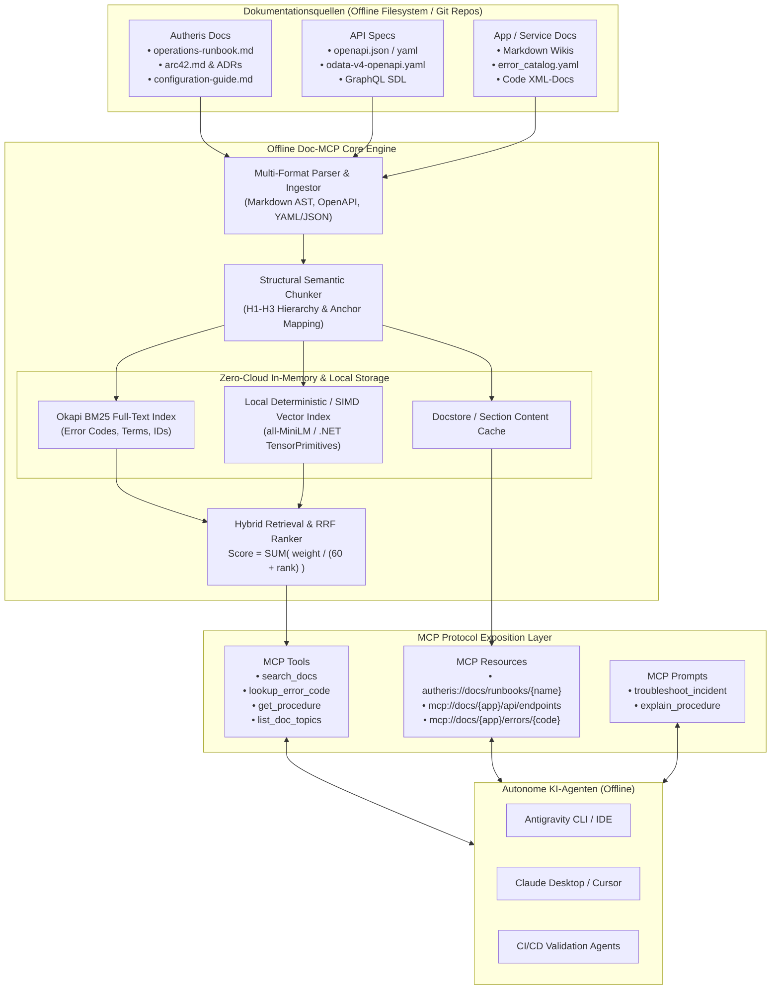
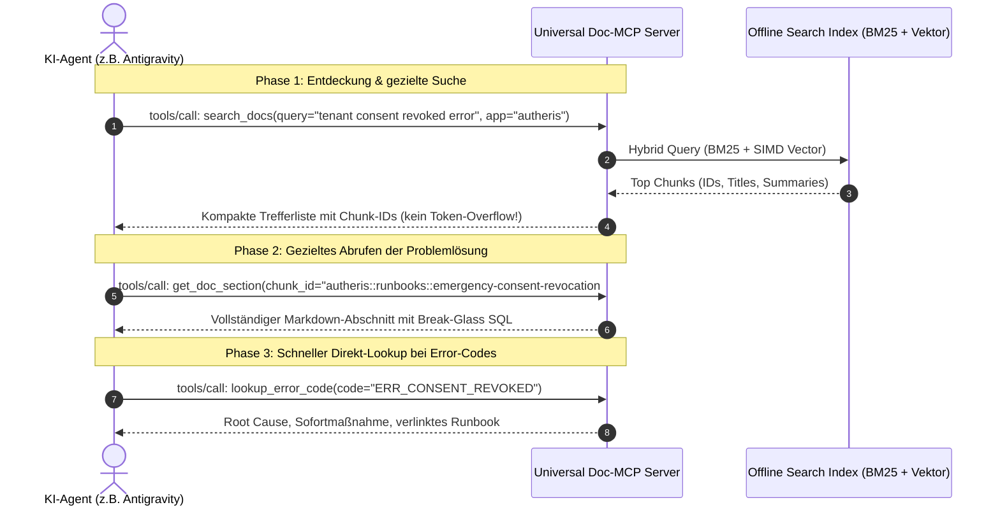
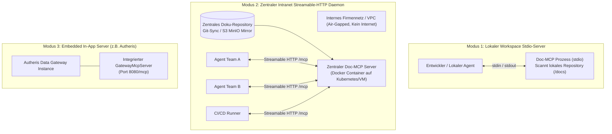
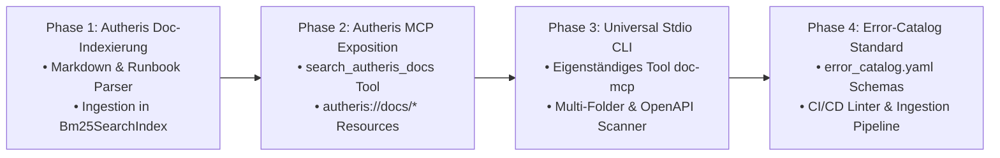

# Architekturkonzept: Offline Doc- & Runbook-MCP-Gateway

> **Status:** Genehmigungsreif / Architektur-Blueprint  
> **Geltungsbereich:** Autheris Core Platform & Enterprise API/Application Documentation  
> **Zielumgebung:** 100% Offline / Air-Gapped (Zero Cloud Dependency, Zero Internet Egress)  
> **Zielgruppe:** Autonome KI-Agenten (Antigravity CLI, IDE-Copilots, Claude Desktop, Cursor, CI/CD-Bots)

---

## 1. Executive Summary & Problemstellung

### 1.1 Die Herausforderung: Das "Documentation Gap" autonomer KI-Agenten
Wenn KI-Agenten in komplexen Enterprise-Umgebungen Code modifizieren, Fehler debuggen oder Betriebsvorfälle (Incidents) analysieren, stehen sie vor gravierenden Hürden:
1. **Air-Gapped & Offline-Restriktion:** In geschützten Rechenzentren, Banken oder Industrieumgebungen existiert kein Zugriff auf das öffentliche Internet (keine Google-Suche, keine Cloud-Vektordatenbanken wie Pinecone oder Weaviate, keine OpenAI-Embeddings-APIs).
2. **Token-Window-Exhaustion:** Das blinde Injizieren von Hunderten Markdown-Dateien oder riesigen OpenAPI-Spezifikationen in den Kontext überfordert das Token-Budget und treibt Latenzen und Kosten unerträglich in die Höhe.
3. **Halluzinationen bei Fehlercodes & Runbooks:** Generische Sprachmodelle kennen proprietäre Fehlercodes (z.B. `ERR_CASBIN_DENIED`, `ODATA_STREAM_FAIL_04`) oder firmenspezifische Notfall-Prozeduren ("Emergency Consent Revocation", Break-Glass-SQL) nicht.
4. **Dokumentations-Fragmentierung:** Wissen liegt verstreut vor – Markdown-Runbooks, arc42-Architekturen, ADRs, Swagger/OpenAPI-Specs, Fehlerkataloge in Repositories.

### 1.2 Die Lösung: Der universelle Offline Doc-MCP-Server
Ein lokaler **Model Context Protocol (MCP)** Server fungiert als semantische Brücke zwischen den Agenten und den offline vorliegenden Wissensquellen:
- **Zweistufige Progressive Disclosure:** Der Agent erhält über kompakte Such-Tools (`search_docs`, `lookup_error_code`) hochpräzise Snippets und liest vollständige Kapitel/Runbooks erst bei Bedarf über MCP-Resources (`mcp://docs/...`).
- **100% Lokale Hybrid-Retrieval-Engine:** Kombination aus Okapi BM25 (präzise auf exakte Fehlercodes, Methodennamen und Tabellen) und hardware-beschleunigtem lokalem Vektor-Matching (Cosine-Similarity via SIMD) – komplett ohne externe APIs.
- **Multi-Applikations-Fähigkeit:** Identischer Standard für Autheris, interne Microservices, Third-Party-APIs und Legacy-Systeme.

---

## 2. Gesamtarchitektur & Datenfluss



---

## 3. Teil A: Spezifische Bereitstellung für Autheris

Autheris verfügt in seinem Repository bereits über eine reichhaltige Dokumentationslandschaft (`/root/autheris/docs`), darunter:
- [`operations-runbook.md`](file:///root/autheris/docs/operations-runbook.md) (Notfall-Revocation, Break-Glass-SQL, Health Checks, Incident Response)
- [`arc42.md`](file:///root/autheris/docs/architecture/arc42.md) & [`developer-guide.md`](file:///root/autheris/docs/developer-guide.md)
- [`ADR-001`](file:///root/autheris/docs/adr/) bis `ADR-018` (Architektur-Entscheidungen, z.B. Casbin RBAC, AST-Pushdown, Stored Procedures)
- [`features/`](file:///root/autheris/docs/features/) (Detaillierte Spezifikationen von F-AI-01 bis F-SEC-04)
- [`odata-v4-openapi.yaml`](file:///root/autheris/docs/openapi/odata-v4-openapi.yaml) (API-Definition)

Für Autheris gibt es zwei komplementäre Bereitstellungswege:

### Weg 1: Native Erweiterung des bestehenden Autheris Gateway MCP Servers
Da Autheris bereits einen vollständigen MCP-Server auf Basis von `ModelContextProtocol.AspNetCore` betreibt ([`GatewayMcpServer.cs`](file:///root/autheris/src/Autheris.Api/Mcp/GatewayMcpServer.cs)) und eine eigene SIMD-beschleunigte Hybrid-Search-Engine ([`Bm25SearchIndex.cs`](file:///root/autheris/src/Autheris.Application/Catalog/Search/Bm25SearchIndex.cs) und [`VectorSearchIndex.cs`](file:///root/autheris/src/Autheris.Application/Catalog/Search/VectorSearchIndex.cs)) besitzt, wird das Gateway direkt um Doc-Search erweitert.

#### Erweiterung der MCP-Tools in Autheris:
```json
{
  "name": "search_autheris_docs",
  "description": "Searches Autheris documentation, architecture specs, ADRs, and operational runbooks for error causes, procedures, and implementation patterns.",
  "inputSchema": {
    "type": "object",
    "required": ["query"],
    "properties": {
      "query": { "type": "string", "description": "Search query or error code (e.g. 'Emergency Consent Revocation' or 'ERR_CASBIN_DENIED')" },
      "category": { 
        "type": "string", 
        "enum": ["all", "runbook", "architecture", "adr", "api", "feature"],
        "default": "all",
        "description": "Optional category filter"
      },
      "limit": { "type": "integer", "default": 5, "description": "Maximum number of results to return" }
    }
  }
}
```

```json
{
  "name": "lookup_autheris_procedure",
  "description": "Retrieves the exact step-by-step remediation procedure or operational runbook for an Autheris incident or operational task.",
  "inputSchema": {
    "type": "object",
    "required": ["procedureName"],
    "properties": {
      "procedureName": { "type": "string", "description": "Name or keyword of the procedure (e.g. 'consent_revocation', 'sqlite_lock_recovery', 'rolling_update')" }
    }
  }
}
```

#### Erweiterung der MCP-Ressourcen in Autheris:
In [`GatewayMcpServer.cs`](file:///root/autheris/src/Autheris.Api/Mcp/GatewayMcpServer.cs) werden dynamische Ressourcen-URIs registriert:
- `autheris://docs/runbooks/{procedureId}`: Liefert den exakten Runbook-Abschnitt (z.B. Break-Glass-SQL für Consent-Revocation).
- `autheris://docs/adr/{adrNumber}`: Liefert die Architecture Decision Record (z.B. ADR-017 für RBAC/AST-Dialekte).
- `autheris://docs/features/{featureId}`: Liefert die Spezifikation eines Feature-Moduls.
- `autheris://docs/arc42/section/{sectionNumber}`: Liefert arc42-Abschnitte (Bausteinsicht, Laufzeitsicht, Qualitätsanforderungen).

---

### Weg 2: Autonomer Workspace Stdio-Server für Entwickler & Agenten
Wenn ein Agent lokal im Codebase arbeitet (z.B. mit Antigravity CLI, Cursor oder Claude), soll er Dokumentation auch durchsuchen können, **ohne dass das Autheris-Gateway kompiliert oder gestartet sein muss**.

Hierzu wird ein leichtgewichtiger lokaler Stdio-Server konfiguriert:
- **Speicherort im Projekt:** `/root/autheris/tools/doc-mcp-server`
- **Konfiguration in Antigravity (`~/.gemini/config/mcp_config.json` oder `.agents/mcp_config.json`):**

```json
{
  "mcpServers": {
    "autheris-docs": {
      "command": "dotnet",
      "args": [
        "run",
        "--project",
        "/root/autheris/tools/doc-mcp-server/Autheris.DocMcpServer.csproj",
        "--",
        "--docs-dir",
        "/root/autheris/docs"
      ],
      "env": {
        "DOTNET_ENVIRONMENT": "Production",
        "DOC_INDEX_CACHE": "/root/autheris/.doc_index_cache"
      }
    }
  }
}
```

> [!TIP]
> Alternativ kann ein Single-File Python- oder Go-Script verwendet werden (`python3 /root/autheris/tools/mcp_docs.py`), das zero external dependencies hat und SQLite FTS5 für die Offline-Volltextsuche nutzt.

---

## 4. Teil B: Generisches Konzept für beliebige APIs & Applikationen

Um Dokumentationen beliebiger APIs, Microservices oder Legacy-Systeme offline über MCP bereitzustellen, wird ein **universelles Ingestion- und Serving-Framework** ("Universal Doc-MCP Bridge") definiert.

```
┌────────────────────────────────────────────────────────────────────────┐
│                   UNIVERSAL DOC-MCP ARCHITECTURE                       │
├────────────────────────────────────────────────────────────────────────┤
│                                                                        │
│   [ Markdown Wikis ]   [ OpenAPI / Swagger ]   [ Error Catalogs ]      │
│   [ Runbooks / arc42]  [ GraphQL Schemas   ]   [ Code Docstrings]      │
│            │                     │                     │               │
│            ▼                     ▼                     ▼               │
│   ┌────────────────────────────────────────────────────────────────┐   │
│   │           Multi-Source Ingestion & Normalizer Layer            │   │
│   └────────────────────────────────────────────────────────────────┘   │
│                                  │                                     │
│                                  ▼                                     │
│   ┌────────────────────────────────────────────────────────────────┐   │
│   │              Canonical Document Chunk Model (IR)               │   │
│   │   - doc_id, app_id, category, title, content, anchor, tags     │   │
│   └────────────────────────────────────────────────────────────────┘   │
│                                  │                                     │
│                                  ▼                                     │
│   ┌────────────────────────────────────────────────────────────────┐   │
│   │             Offline Dual-Index Storage (Zero-Cloud)            │   │
│   │   [Okapi BM25 / SQLite FTS5]  +  [Local SIMD Embeddings Index] │   │
│   └────────────────────────────────────────────────────────────────┘   │
│                                  │                                     │
│                                  ▼                                     │
│   ┌────────────────────────────────────────────────────────────────┐   │
│   │                      MCP Protocol Engine                       │   │
│   │   • search_docs         • get_doc_section                      │   │
│   │   • lookup_error_code   • list_available_apps                  │   │
│   │   • get_endpoint_doc    • list_procedures                      │   │
│   └────────────────────────────────────────────────────────────────┘   │
│                                  ▲                                     │
│                    Stdio / Streamable HTTP                             │
│                                  │                                     │
│                       [ AI Coding Agents ]                             │
└────────────────────────────────────────────────────────────────────────┘
```

---

### 4.1 Die Multi-Source Ingestion Pipeline

Verschiedene Dokumentationsformate werden über typisierte Konnektoren in ein einheitliches Zwischenformat (Intermediate Representation) überführt:

| Format / Quelle | Typische Artefakte | Extrahierte Metadaten & Strukturierung |
| :--- | :--- | :--- |
| **Markdown / arc42** | `*.md`, `docs/`, MkDocs, Docusaurus | Aufteilung an Headings (H1/H2/H3). Titel, Hierarchie, Code-Blöcke, Tabellen, interne Anker. |
| **OpenAPI / Swagger** | `openapi.yaml`, `swagger.json` | Aufteilung pro Endpoint (`POST /v1/orders`). Extrahiert: Query/Path-Parameter, Request/Response-Bodies, HTTP-Statuscodes, Fehlerbeschreibungen (`400`, `401`, `404`, `500`). |
| **Error Catalogs** | `error_catalog.yaml`, JSON, CSV | Extrahiert: `code`, `component`, `severity`, `symptom`, `rootCause`, `remediationSteps`, `runbookUrl`. |
| **Runbooks / SOPs** | `runbooks/*.md`, Incident Guides | Extrahiert: `incident_type`, `triggers`, `verification_command`, `step_by_step_fix`, `rollback_procedure`. |
| **GraphQL SDL** | `schema.graphql` | Types, Queries, Mutations, Directives, Deprecations, Field-Docstrings. |

---

### 4.2 Das kanonische Dokumentenmodell (Canonical Chunk Model)

Jeder Dokumentationsschnipsel wird als strukturierter Chunk normalisiert:

```json
{
  "chunk_id": "autheris::runbooks::emergency-consent-revocation#1-3",
  "app_id": "autheris",
  "app_version": "2.4.0",
  "category": "runbook",
  "title": "Emergency Consent Revocation - Direct Database Fallback (Break-Glass)",
  "content": "### 1.3 Direct Database Fallback (Break-Glass)\nIf the GraphQL API is inaccessible, update the governance database directly...\n\n```sql\nUPDATE CONSENTS SET is_revoked = 1, ...\n```",
  "summary": "Direct SQL break-glass procedure to revoke consent when GraphQL API is down.",
  "keywords": ["revokeConsent", "emergency", "break-glass", "CONSENTS", "POLICY_EPOCHS"],
  "error_codes": ["ERR_CONSENT_UNAUTHORIZED", "AUTH_FAIL_09"],
  "source_file": "docs/operations-runbook.md",
  "anchor_id": "13-direct-database-fallback-break-glass",
  "updated_at": "2026-10-10T00:00:00Z"
}
```

---

### 4.3 Die Offline Search Engine: Hybrid RRF (BM25 + Local SIMD Embeddings)

Standard-RAG scheitert offline, weil Embeddings-Modelle wie `text-embedding-3-small` eine Internetverbindung zu OpenAI erfordern. Gleichzeitig ist reine semantische Suche bei technischen Dokumenten oft unterlegen: Ein Agent, der nach `ERR_DB_084` oder `UpdatePolicyEpochs` sucht, benötigt einen **exakten lexikalischen Treffer** und keine vage Assoziation.

#### Die Lösung: Lokaler Dual-Index mit Reciprocal Rank Fusion
1. **Okapi BM25 Index (Lexikalisch):**
   - Höchstgewichtung auf `error_codes`, `keywords` und `title`.
   - Tokenisierung mit Unterstützung für CamelCase, snake_case und Dot-Notation (`Autheris.Application.Mcp`).
   - Implementierbar als In-Memory-Index in C# / Go oder via SQLite FTS5 (Zero External Dependencies).
2. **Lokaler Vektor-Index (Semantisch):**
   - **Variante A (Deterministic Hash/SIMD, Zero-Size):** Lokale n-Gramm-Projektion über .NET `System.Numerics.Tensors.TensorPrimitives` (wie im Autheris `CatalogSearchEngine`). Benötigt 0 MB Modell-Downloads!
   - **Variante B (Offline Small ONNX Model, ca. 80 MB):** Lokales Embedding mit `all-MiniLM-L6-v2` oder `bge-small-en-v1.5` über die `Microsoft.ML.OnnxRuntime` oder Python `fastembed`. 100% lokal auf CPU ausführbar.
3. **Reciprocal Rank Fusion (RRF):**
   $$\text{RRF Score}(d) = \frac{W_{\text{bm25}}}{60 + \text{Rank}_{\text{bm25}}(d)} + \frac{W_{\text{vec}}}{60 + \text{Rank}_{\text{vec}}(d)}$$

---

### 4.4 Das standardisierte MCP Tool- & Resource-Interface

Jeder universelle Doc-MCP Server stellt die folgenden 5 Standard-Tools und Ressourcen bereit:



#### Tool-Spezifikationen:

1. `search_docs`
   - **Zweck:** Semantische & Volltext-Suche über alle Dokumentationen, Runbooks und APIs.
   - **Parameter:** `query` (string), `app_id` (optional string), `category` (optional: `runbook`, `api`, `architecture`, `error`, `config`), `limit` (int, default 5).
   - **Rückgabe:** Kompakte Liste mit `chunk_id`, `title`, `summary`, `relevance_score`, `source_file`.

2. `get_doc_section`
   - **Zweck:** Gezieltes Nachladen eines konkreten Markdown-Abschnitts oder API-Endpunkts anhand der `chunk_id`.
   - **Rückgabe:** Vollständiger Markdown-Inhalt inklusive Tabellen und Code-Snippets.

3. `lookup_error_code`
   - **Zweck:** Direktes Abrufen von Ursache und Lösung für einen bestimmten Fehlercode oder Exception-Namen.
   - **Parameter:** `error_code` (string), `app_id` (optional string).
   - **Rückgabe:** Strukturierte Problem- & Handlungsanweisung:
     - *Bedeutung / Ursache*
     - *Typische Log-Meldungen*
     - *Sofortmaßnahme (Workaround)*
     - *Verlinktes Runbook / Behebungs-Prozedur*

4. `get_api_endpoint`
   - **Zweck:** Detaillierte Spezifikation eines REST- oder GraphQL-Endpunkts (aus OpenAPI/SDL).
   - **Parameter:** `app_id` (string), `path` (string), `method` (string).
   - **Rückgabe:** Erforderliche Header, Query/Path-Parameter, Request-Schema, Error-Responses (`4xx`/`5xx`) und cURL-Beispiel.

5. `list_applications`
   - **Zweck:** Übersicht aller im Offline-MCP-Server indexierten Applikationen und deren Dokumentationsstand.

---

### 4.5 Standard-Error-Catalog Schema für Teams (`error_catalog.yaml`)

Damit Entwicklerteams neuer APIs und Services ihre Fehler und Runbooks agentengerecht und offline pflegen können, wird ein standardisiertes Schema empfohlen:

```yaml
# Schema: error_catalog.yaml (liegt im Root des Service-Repositories)
app: payment-service
version: 1.2.0

errors:
  - code: PAY_ERR_3001
    name: IdempotencyKeyConflict
    http_status: 409
    severity: high
    symptom: "Client receives HTTP 409 Conflict with payload 'Concurrent transaction in progress'."
    root_cause: "A request with the same Idempotency-Key was received while the first request was still executing in Garnet/Redis."
    troubleshooting:
      - "Check telemetry logs for duplicate client submissions."
      - "Verify Garnet cache latency and lock acquisition timeouts."
    resolution:
      - "Advise client to wait with exponential backoff (Retry-After header)."
      - "If locked permanently: Execute clear-lock command from runbook."
    runbook_ref: "docs/runbooks/idempotency_recovery.md#manual-lock-clearing"

  - code: PAY_ERR_5002
    name: PaymentProviderTimeout
    http_status: 504
    severity: critical
    symptom: "Outbound payment authorization webhook to core banking timed out after 5000ms."
    root_cause: "Core banking connection pool exhausted or network partition."
    troubleshooting:
      - "Run 'ping core-banking.internal' and inspect Envoy mesh egress metrics."
    resolution:
      - "Switch circuit breaker to fallback queue via admin CLI: 'pay-cli circuit break core-banking'."
    runbook_ref: "docs/runbooks/circuit_breaker_operations.md"
```

---

## 5. Bereitstellungs-Modi (Deployment Topologies)

Je nach Anwendungsfall und Unternehmensnetzwerk stehen drei Bereitstellungstopologien zur Verfügung:



### Vergleich der Bereitstellungsmodi

| Kriterium | Modus 1: Lokaler Stdio-Server | Modus 2: Zentraler Intranet Daemon | Modus 3: Embedded In-App |
| :--- | :--- | :--- | :--- |
| **Laufzeit-Abhängigkeit** | Nur lokales Runtime (`dotnet`, `python` oder Single-Binary) | Docker-Container im lokalen Intranet | Die Zielapplikation selbst |
| **Netzwerk-Bedarf** | 0 (Reine Inter-Process Communication via Stdio) | Nur LAN / internes VPC (kein WAN/Internet) | Nur Port der Applikation |
| **Wartungsaufwand** | Pro Entwickler / Workspace konfiguriert | Einmalig zentral gepflegt & via CI aktualisiert | Teil des Applikations-Deployments |
| **Multi-App-Fähigkeit** | Scannt konfigurierten Workspace-Ordner | Aggregiert Dutzende Services zentral | Fokussiert auf die eigene Applikation |
| **Idealer Einsatzzweck** | Autheris Core-Entwicklung, Antigravity CLI | Enterprise-weite API-Landschaft, Microservices | Standalone-Betrieb von Gateways/Plattformen |

---

## 6. Schritt-für-Schritt Implementierungsplan



### Phase 1: Ingestion & Indexer für Autheris Docs (Quick-Win)
1. **Doc-Scanner Service:** Einleseservice, der beim Start von Autheris alle `.md`-Dateien in `/root/autheris/docs` durchsucht.
2. **Heading-basierter Chunker:** Zerlegt `operations-runbook.md`, `arc42.md` etc. an H1-, H2- und H3-Tags und erzeugt strukturierte `DocChunk`-Records.
3. **Index-Aufbau:** Einpflegen in eine dedizierte Instanz von [`Bm25SearchIndex.cs`](file:///root/autheris/src/Autheris.Application/Catalog/Search/Bm25SearchIndex.cs) und `VectorSearchIndex.cs`.

### Phase 2: Integration in `GatewayMcpServer.cs`
1. Registrierung von `search_autheris_docs` und `lookup_autheris_procedure` in [`McpToolRegistry.cs`](file:///root/autheris/src/Autheris.Application/Mcp/Services/McpToolRegistry.cs).
2. Bereitstellung der MCP-Ressourcen in `ReadNativeResourceAsync`:
   - `autheris://docs/runbooks/{name}`
   - `autheris://docs/adr/{id}`
   - `autheris://docs/api/{spec}`
3. Registrierung der Server-Instruktionen, damit verbundene LLM-Agenten automatisch wissen, dass sie die Doku abfragen können.

### Phase 3: Bereitstellung der Universal Stdio Doc-MCP Bridge
1. Bereitstellung eines eigenständigen CLI-Tools (z.B. in C# AOT oder Python Single-Script) unter `/root/autheris/tools/doc-mcp`.
2. Unterstützt Konfigurationsparameter:
   ```bash
   doc-mcp --docs "/root/autheris/docs" --openapi "/root/autheris/docs/openapi" --app "autheris"
   ```
3. Registrierung in Antigravity CLI via `~/.gemini/config/mcp_config.json`.

### Phase 4: Rollout auf weitere APIs & Microservices
1. Definition des `error_catalog.yaml`-Standards in Template-Repositories.
2. Bereitstellung einer Config-Datei `doc_sources.json`, in der beliebig viele Pfade zu Dokumentationen anderer Services hinterlegt werden:
   ```json
   {
     "sources": [
       { "app": "autheris", "type": "markdown", "path": "/root/autheris/docs" },
       { "app": "billing-api", "type": "openapi", "path": "/services/billing/openapi.yaml" },
       { "app": "customer-svc", "type": "error_catalog", "path": "/services/customer/error_catalog.yaml" }
     ]
   }
   ```

---

## 7. Sicherheits-, Governance- & Performance-Garantien

1. **100% Air-Gapped & Offline:**
   - Keinerlei Outbound-Netzwerkverbindungen zu externen Cloud-LLMs, Search-Engines oder Vektordatenbanken.
   - Alle Indizes laufen rein in-memory oder auf lokalen SQLite-Dateien.
2. **Schutz des Token-Budgets:**
   - Suchergebnisse liefern standardmäßig nur Metadaten, Relevanz-Score und eine prägnante Zusammenfassung (max. 150 Tokens).
   - Ausführlicher Markdown-Text oder vollständige Schemas werden erst geladen, wenn der Agent gezielt `get_doc_section` oder `read_resource` aufruft.
3. **Sub-Millisekunden-Latenz:**
   - In-Memory Okapi BM25 und SIMD-Vektorberechnung liefern Ergebnisse in unter 2 ms.
   - Keine spürbare Verzögerung in Agenten-Loops.
4. **Tenant- & ReBAC-Isolation (Optional):**
   - Falls Dokumente vertrauliche Sicherheits-ADRs enthalten, kann der aus Autheris bekannte ReBAC-Zanzibar-Filter vorgeschaltet werden, sodass interne Audit-Runbooks nur für Agents mit entsprechenden Rollen sichtbar sind.
