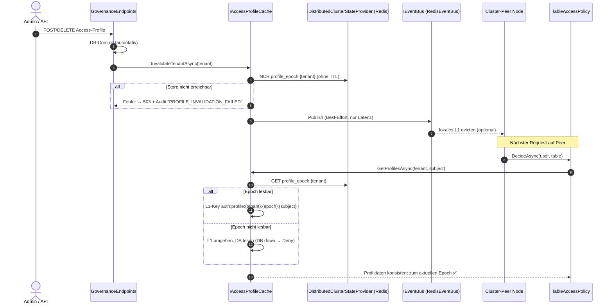

# Implementierungsplan: Distributed State, Cache-Invalidierung & Concurrency-Härtung

**Dokument-ID:** `PLAN-ARCH-01-DISTRIBUTED-STATE`  
**Referenzen:** [Architektur-Review 2026-10-09](2026-10-09-architecture-review.md) (Befunde AR-01, AR-02, AR-03, AR-04, AR-12)  
**Rolle:** C# & .NET Solution Architect  
**Status:** Überarbeitet nach Plan-Review 2026-10-09 – bereit zur Umsetzung ⏳  

---

## 1. Ausgangslage & Problemstellung (verifiziert gegen Code, Branch `feat/ast-target-dialect-generator`)

Im Architektur-Audit des Multi-Node- und Cluster-Betriebs wurden fünf Schwachstellen bezüglich Cache-Konsistenz, Concurrency und Distributed State identifiziert. Der Ist-Stand weicht teilweise vom Review ab (bereits teilweise behoben):

1. **AR-01 (Stale-Grant-Window bei Zugriffsprofilen):**  
   `src/Autheris.Application/Policy/TableAccessPolicy.cs:103-116` hält weiterhin ein **statisches** `_profileCache` sowie ein statisches `s_activeMemoryCache` (gesetzt im Konstruktor `:146-149`). `InvalidateCache` ist `static` und entfernt inzwischen **auch** aus `IMemoryCache` (`:110`); `GovernanceEndpoints.cs:660-662` und `:778-783` entfernen den Schlüssel zusätzlich direkt. Der **lokale** Teil von AR-01 ist damit bereits behoben.  
   **Offen:**
   - Keine knotenübergreifende Invalidierung: Die Endpoints inkrementieren zwar `profile_epoch:{tenant}` (`GovernanceEndpoints.cs:667,788`), dieser Zähler wird aber **nirgends gelesen** (nur Tests `AccessProfileTests.cs:707,821`). Peers behalten Profile bis zu 5 Minuten.
   - Rückgabewert `null` von `IncrementAsync` (Store nicht erreichbar, `RedisClusterStateProvider.cs:115-119`) wird ignoriert.
   - Race „Load-after-Invalidate“: Ein paralleler Request liest das alte Profil aus der DB, die Invalidierung läuft, danach schreibt der Request den alten Wert zurück in den Cache (`TableAccessPolicy.cs:560-565`) → erneutes 5-Minuten-Fenster, auch single-node.
   - Statischer Zustand (`s_activeMemoryCache`, `_profileCache`) koppelt Testläufe und DI-Container.
2. **AR-02 (Unbeobachtete ReBAC-Invalidierung):**  
   `ZanzibarRebacEvaluator.InvalidateTenantCache(string)` (`src/Autheris.Application/Security/Rebac/Services/ZanzibarRebacEvaluator.cs:86-95`) feuert `IncrementGenerationAsync()` und `PublishInvalidationAsync()` als `_ =`-Tasks; Fehler werden nur geloggt (`:98-117`). Der Zähler `rebac:generation` wird **geschrieben, aber nie gelesen** – es existiert keine Drift-Erkennung. Aufrufer: `RebacEndpoints.cs:102,144`; Interface `IRebacEvaluator.cs:22`.
3. **AR-03 (Verlustbehaftete Invalidierungszustellung):**  
   `InProcessChannelEventBus.cs:20-29` nutzt `BoundedChannelFullMode.DropOldest` (10.000). Single-Node ist das unkritisch, da `EpochValidationService` (`:197-217`) und ReBAC (`InvalidateLocal`) lokal synchron invalidieren. Im Multi-Node-Betrieb ist Redis bereits **erzwungen** (`GatewayServiceCollectionExtensions.cs:155-157`, `:1513-1520`) und es wird `RedisEventBus` registriert (`:246,260`). Das eigentliche Restrisiko ist daher **Redis Pub/Sub (at-most-once)**: Nachrichten während Verbindungsabbruch, Subscriber-Neustart oder Handler-Fehler gehen verloren; nur ReBAC räumt bei `ConnectionRestored` (`ZanzibarRebacEvaluator.cs:55-59`), Access-Profile gar nicht.
4. **AR-04 (Hybrid-Zustand bei Shared State & Differential Privacy):**  
   - `DifferentialPrivacyEngine._budgets` (`src/Autheris.Application/Governance/Services/DifferentialPrivacyEngine.cs:16`) ist lokal; Budgetprüfung erfolgt in `PerturbAsync` (Daily-Rollover, `PrivacyBudgetExhaustedException`), dazu `GetBudgetAsync`/`ResetBudgetAsync`. Das Budget multipliziert sich mit der Knotenanzahl.
   - `FocusCostAccountingService` nutzt bereits `IDistributedClusterStateProvider.IncrementAsync` (Micro-Einheiten, `:132`); `_localSpend` (`:26`) ist nur noch **Fallback bei Store-Ausfall** → Restbefund: fail-open-Fallback.
   - Weitere hybride Zustände aus dem Review (`McpSessionStore`, `HitLStepUpApprovalService`, `ClientTierResolver`, `DbtHealthCircuitBreaker`, `SubgraphCanaryRouter`, Golden Queries) und der ADR-017-Status sind **nicht** Gegenstand der Phasen 1–4, siehe §3.6.
5. **AR-12 (Lock-Serialisierung bei Casbin-Evaluierung):**  
   Immutable Snapshots existieren bereits: `PolicySnapshot` mit `FrozenDictionary<string, Enforcer>` (`CasbinEnforcementService.cs:80-105`), Publikation via `lock (_syncLock)` + `Interlocked.Exchange` (`:344-351`), lock-freies Lesen via `Volatile.Read` (`:207,626`). **Offen** ist allein `lock (enforcer)` um die Auswertung (`:687`), weil die im Snapshot enthaltene Casbin-`Enforcer`-Instanz selbst ein mutabler, nicht threadsicherer Objektgraph ist (F-4).

---

## 2. Zielarchitektur & Lösungsdesign

Leitprinzip: **Korrektheit darf nicht von der Zustellung einer Push-Nachricht abhängen.** Push-Events (Pub/Sub) sind nur eine Latenzoptimierung; die Autorität liegt in einem **gelesenen, monotonen Epoch-Zähler** im Cluster-Store, der in den Cache-Schlüssel bzw. die Cache-Validierung eingeht (Pull-Validierung analog `EpochValidationService`). Ist der Epoch nicht lesbar → kein Cache-Hit, autoritative Quelle lesen; ist auch diese nicht verfügbar → Deny.



---

## 3. Technische Spezifikation der Komponenten

### 3.1 AR-01: Instanzbasierte `IAccessProfileCache`-Abstraktion mit Epoch-Keying

Statische Caches in `TableAccessPolicy` (`_profileCache`, `s_activeMemoryCache`, `InvalidateCache`, `ClearCache`) werden vollständig entfernt; Aufrufer (`GovernanceEndpoints.cs:660-662,778-783`, `AccessProfileTests.cs:330`) werden auf den Dienst umgestellt.

```csharp
namespace Autheris.Application.Policy.Interfaces;

public interface IAccessProfileCache
{
    /// Liefert die Profile des Subjekts. Wirft AccessProfileSourceUnavailableException,
    /// wenn weder ein epoch-validierter Cache-Eintrag noch die DB verfügbar ist (Aufrufer: Deny).
    ValueTask<IReadOnlyList<AccessProfile>> GetProfilesAsync(TenantId tenantId, string subject, CancellationToken ct = default);

    /// Bump des Tenant-Epochs im Cluster-Store + Best-Effort-Publish. Wirft bei Store-Ausfall.
    Task InvalidateTenantAsync(TenantId tenantId, CancellationToken ct = default);
}
```

- **Epoch-Keying:** Vor jedem Lookup wird `profile_epoch:{tenant}` gelesen; L1-Schlüssel `auth:profile:{tenant}:{epoch}:{subject}`, TTL 5 Minuten, `Size = 1`. Der Epoch wird **vor** dem DB-Load gelesen und der Eintrag unter genau diesem Epoch abgelegt → Load-after-Invalidate-Race ist ausgeschlossen (ein veralteter Load landet unter einem bereits überholten Schlüssel).
- **Epoch-Zähler ohne TTL:** Die bisherige TTL von 30 Tagen (`GovernanceEndpoints.cs:667,788`) entfällt, da ein abgelaufener Zähler bei 1 neu startet und alte L1-Schlüssel wieder gültig machen könnte. Alternativ: Epoch-Wert mit Store-Generation-Nonce kombinieren.
- **Lese-Kosten:** Der Epoch-Read darf pro Tenant lokal für max. `DegradedMaxStalenessSeconds`-analog konfigurierbare 1 s gecacht werden (`AccessProfileEpochCacheMilliseconds`, Default 1000, Range 0–5000); das ist das maximal akzeptierte Stale-Fenster und wird dokumentiert.
- **Invalidierungsgranularität:** Tenant-weit (ein Profil kann über `AssignedSubjects` und `AllUserSids`/Gruppen-SIDs viele Subjekte betreffen, `TableAccessPolicy.cs:578-590`); Subjekt-genaue Invalidierung ist nicht ausreichend.
- **Single-Node ohne Cluster-Store:** `InMemoryClusterStateProvider` liefert den Epoch lokal; gleiches Verhalten, ohne Netzwerk.
- **Endpoints:** `InvalidateTenantAsync` wird **nach** dem DB-Commit aufgerufen; scheitert der Epoch-Bump, antwortet der Endpoint mit `503` und schreibt ein Audit-Event (`PROFILE_INVALIDATION_FAILED`). Die DB-Änderung bleibt bestehen; Peers sind über den nicht lesbaren/unveränderten Epoch höchstens bis zum L1-TTL stale → deshalb zusätzlich: bei fehlgeschlagenem Bump lokales L1 vollständig leeren und den Tenant für `≤ TTL` als „non-authoritative“ markieren (L1-Bypass auf diesem Knoten).

### 3.2 AR-02: Awaited ReBAC-Invalidierung mit Generation-Validierung

- `IRebacEvaluator.InvalidateTenantCache(string)` → `Task InvalidateTenantCacheAsync(string tenantId, CancellationToken ct = default)` (Tenant-Typ bleibt `string`, da `RebacTuple.TenantId` string ist; Umstellung auf `TenantId` ist nicht Teil dieses Plans). Aufrufer `RebacEndpoints.cs:102,144` und Tests (`RebacClusterInvalidationTests`, `RebacCacheGenerationTests`, `RebacZanzibarTests`) werden angepasst.
- `IncrementCounterAsync(GenerationKey)` und `PublishAsync` werden `await`et; Exceptions werden **nicht** mehr geschluckt.
- **Pull-Validierung (neu, schließt AR-02 und AR-03 für ReBAC):** Jeder Decision-Cache-Eintrag speichert die zum Zeitpunkt der Auswertung gelesene `rebac:generation` (pro Tenant: `rebac:generation:{tenant}`). `CheckAsync` liest die aktuelle Generation (lokal max. 1 s gecacht); weicht sie ab oder ist sie nicht lesbar → Cache-Miss und Neuauswertung gegen den `IRebacStore`. Damit ist eine verlorene Pub/Sub-Nachricht harmlos.
- **Fehlerfall Bump:** Scheitert `IncrementCounterAsync`, wird der lokale Tenant-Cache geleert, der Tenant lokal als `DegradedRebacState` markiert (Decision-Cache für diesen Tenant deaktiviert, bis ein Bump gelingt) und die Exception an den Endpoint propagiert (`503`, Audit-Event `REBAC_INVALIDATION_FAILED`). Die Tupel-Änderung selbst ist im `IRebacStore` bereits persistiert; Peers sehen sie spätestens über die Generation-Validierung bzw. nach `CacheTtlSeconds`.
- **Ist-Restrisiko dokumentieren:** Ohne Pull-Validierung bliebe das Stale-Fenster bei Publish-Verlust `Rebac.CacheTtlSeconds` lang.

### 3.3 AR-03: Zustellgarantien explizit machen statt Kanal-Aufspaltung

Eine Aufspaltung in einen `ISecurityInvalidationChannel` mit `FullMode.Wait` löst das Multi-Node-Problem nicht (Redis Pub/Sub bleibt at-most-once) und bringt Backpressure in den Request-Pfad. Stattdessen:
- **Korrektheit über Pull-Validierung** (§3.1, §3.2, bestehend: `EpochValidationService`). Push bleibt Best-Effort.
- **`IEventBus` dokumentieren:** XML-Doc „keine Zustellgarantie; nicht für sicherheitsrelevante Korrektheit verwenden“.
- **`InProcessChannelEventBus`:** Invalidierungskanäle (`autheris:rebac:invalidate`, Epoch-Kanal aus `EpochValidationService`, Profil-Kanal) werden in `PublishAsync` synchron an Subscriber dispatcht oder auf einen zweiten, nicht verwerfenden Channel geroutet; Drops auf dem Hauptkanal werden per Metrik `autheris_eventbus_dropped_total{channel}` gezählt.
- **`ConnectionRestored`:** Auch `IAccessProfileCache` leert bei Reconnect sein L1 (heute nur ReBAC).
- **Startup-Gate:** Bereits vorhanden (`GatewayServiceCollectionExtensions.cs:155-157`, `:1518-1520`, NF-HA-02) – kein neues `GatewayOptions.Cluster.Mode`. Nur Test ergänzen, dass `MultiNodeClusterMode`/`Replicas > 1` ohne Redis außerhalb Development fehlschlägt (falls noch nicht abgedeckt).

### 3.4 AR-04: Atomare Cluster-Zähler für Differential Privacy & FinOps

`IDistributedClusterStateProvider` erhält eine atomare Check-and-Consume-Operation mit **dreiwertigem** Ergebnis (der bestehende `IncrementAsync` fällt bei Store-Ausfall auf lokale Buchung zurück und ist daher für DP ungeeignet):

```csharp
public enum BudgetConsumeOutcome { Consumed, Exhausted, StoreUnavailable }

ValueTask<(BudgetConsumeOutcome Outcome, long ConsumedAfter)> TryConsumeBudgetAsync(
    string key, long cost, long limit, TimeSpan ttl, CancellationToken ct = default);
```

- **Redis:** Ein Lua-Skript (`GET`, Prüfung `current + cost <= limit`, `INCRBY`, `EXPIRE` bei Neuanlage) – eine atomare Operation, kein GET→INCRBY.
- **Einheiten:** Epsilon wird in ganzzahlige Micro-Epsilon (`ε × 1_000_000`, gerundet **auf**) umgerechnet; kein `INCRBYFLOAT` (Rundungsdrift).
- **Schlüssel:** `dp:budget:{tenantBoundClientId}:{yyyyMMdd UTC}` mit TTL 48 h; der Tagesbezug ersetzt `CheckAndApplyDailyRollOver`. `tenantBoundClientId` kommt aus `ResolveTenantBoundClientId` (`GovernanceEndpoints.cs`), nicht aus dem rohen `clientId`.
- **`DifferentialPrivacyEngine`:** Konstruktor erhält optional `IDistributedClusterStateProvider`; `PerturbAsync` ruft `TryConsumeBudgetAsync` **vor** der Rauschberechnung. `Exhausted` → `PrivacyBudgetExhaustedException` + Audit `DP_BUDGET_EXHAUSTED`; `StoreUnavailable` → **Fail-Closed** (Exception, kein Ergebnis, Audit `DP_BUDGET_STORE_UNAVAILABLE`); niemals lokale Fallback-Buchung. `GetBudgetAsync`/`ResetBudgetAsync` lesen/löschen denselben Schlüssel (Reset auditiert).
- **Ohne Cluster-Store** (Single-Node): `InMemoryClusterStateProvider` implementiert dieselbe Semantik mit `lock`; lokales `_budgets` entfällt.
- **FinOps (`FocusCostAccountingService`):** Der lokale Fallback bei Store-Ausfall (`:76`, `:153`) bleibt für die *Abrechnung* zulässig, die *Budget-Durchsetzung* (Hard-Limit) muss bei `null` aus `IncrementAsync` jedoch fail-closed blockieren; Metrik/Log für Fallback-Buchungen.

### 3.5 AR-12: Lock-freie Casbin-Auswertung

Snapshot-Publikation (`Volatile.Read`/`Interlocked.Exchange`) ist **bereits umgesetzt** (`CasbinEnforcementService.cs:194-207,344-351,626`) und bleibt unverändert. Zu ersetzen ist nur `lock (enforcer)` (`:687`):
- **Option A (bevorzugt):** Die Deny/Allow-Schleifen arbeiten bereits über `tenantRulesSnapshot` (`ImmutableArray<CasbinRuleMetadata>`); die verbleibenden `enforcer.Enforce(...)`-Aufrufe (`:743`) werden durch eine reine, zustandslose Matcher-Funktion auf den Snapshot-Regeln ersetzt. Kein geteilter mutabler Zustand → kein Lock.
- **Option B:** Pro Snapshot ein `ObjectPool<Enforcer>` je Tenant (Enforcer-Instanzen aus denselben immutable Regeln gebaut); jeder Request leiht exklusiv eine Instanz.
- Voraussetzung für beide: Nachweis per Test, dass Casbin.NET-`Enforcer.Enforce` ohne Lock **nicht** threadsicher ist (Begründung für F-4 dokumentieren) bzw. Option A ergebnisgleich ist (Property-Test gegen bestehende `CasbinAbacPropertyTests`).
- Deny-before-Allow und Fail-Closed bei Exceptions (`try` um die Auswertung) bleiben unverändert.

### 3.6 Nicht im Scope / Folgearbeiten (AR-04-Rest)

- ADR-017 wird im Rahmen von Phase 3 auf „Teilweise umgesetzt“ gesetzt, mit Liste der verbleibenden lokalen Zustände (`McpSessionStore`, `HitLStepUpApprovalService`, `ClientTierResolver`, `DbtHealthCircuitBreaker`, `SubgraphCanaryRouter`, Golden Queries) und Bewertung je Zustand (sicherheitsrelevant ja/nein).
- Migration von Session-/HitL-State als autoritativer Cluster-State ist ein eigener Plan.

---

## 4. Phasen & Umsetzungsschritte

1. **Phase 1 (AR-01):** `IAccessProfileCache` + `InMemory`/Cluster-Epoch, Entfernung aller statischen Member in `TableAccessPolicy`, Endpoint-Umstellung inkl. 503/Audit, Epoch ohne TTL.
2. **Phase 2 (AR-02 + AR-03):** Async-Invalidierung, Generation-Pull-Validierung im ReBAC-Decision-Cache, Degraded-State, `ConnectionRestored` für Profile, Drop-Metrik/Routing im In-Process-Bus, `IEventBus`-Doku.
3. **Phase 3 (AR-04):** `TryConsumeBudgetAsync` (Lua + InMemory), DP-Engine-Umstellung fail-closed, FinOps-Hard-Limit fail-closed, ADR-017-Status.
4. **Phase 4 (AR-12):** Entfernung `lock (enforcer)` per Option A (Fallback B).
5. Phasen sind unabhängig voneinander mergebar; Phase 2 hängt nur am Pattern aus Phase 1 (Epoch-Pull), nicht am Code.

**Rollout:** Epoch-Keying ändert nur L1-Schlüssel (kein persistierter Zustand) → kein Migrationsschritt. DP-Budgets starten nach Deploy mit leerem Tageszähler (dokumentieren; optional Seed aus lokalem Stand verwerfen). Mixed-Version-Cluster während Rolling-Update: alte Knoten ignorieren `profile_epoch` → Rolling-Update-Fenster ≤ 5 min Stale-Risiko, im Release-Hinweis nennen.

---

## 5. Abnahmekriterien (TDD, je Kriterium ein benannter Test)

**AR-01** (`tests/Autheris.Tests.Unit/AccessProfiles/`)
- [ ] `ProfileChange_OnNodeA_IsVisibleOnNodeB_WithoutBusMessage`: zwei `TableAccessPolicy`-Instanzen mit getrennten `IMemoryCache`, gemeinsamem `InMemoryClusterStateProvider`, **kein** Event-Bus; nach `InvalidateTenantAsync` auf A liefert B nach Ablauf des Epoch-Lese-Caches (Fake-`TimeProvider`) das neue Profil.
- [ ] `StaleLoad_AfterInvalidate_IsNotServed`: DB-Load blockiert per `TaskCompletionSource`, Invalidierung läuft dazwischen, Folge-Request liest frisch.
- [ ] `EpochStoreUnavailable_BypassesCache_AndDbUnavailable_Denies`.
- [ ] `InvalidationFailure_Returns503_AndWritesAudit` (Endpoint-Test).
- [ ] Architekturtest: `TableAccessPolicy` hat keine `static` Felder vom Typ `IMemoryCache`/`ConcurrentDictionary`.

**AR-02/AR-03** (`tests/Autheris.Tests.Unit/Security/`)
- [ ] `LostInvalidationMessage_PeerStillReevaluates`: Bus verwirft alle Nachrichten (Fake), Generation-Bump über gemeinsamen Zähler → Replica B liefert Deny nach Revocation.
- [ ] `GenerationBumpFailure_PropagatesException_AndDisablesTenantCache`.
- [ ] `InProcessBus_UnderSaturation_DoesNotDropInvalidationChannel` (Kapazität 1, 10.000 Telemetrie-Events + 1 Invalidierung → Handler aufgerufen) und Drop-Metrik > 0 für Telemetrie.
- [ ] Bestehende `RebacClusterInvalidationTests`/`RebacCacheGenerationTests` grün nach Signaturänderung.

**AR-04** (`tests/Autheris.Tests.Unit/` + `tests/Autheris.Tests.Integration/` mit Redis-Testcontainer)
- [ ] `ParallelConsume_AcrossTwoEngines_NeverExceedsLimit`: 2 Engines, gemeinsamer Store, 1.000 parallele Requests à ε=0,1 bei Limit 10 → genau 100 erfolgreich (InMemory und Redis-Lua).
- [ ] `StoreUnavailable_FailsClosed_AndAudits`.
- [ ] `DailyKey_RollsOverAtUtcMidnight` (Fake-`TimeProvider`).
- [ ] `EpsilonRounding_UsesCeilingMicroUnits`.

**AR-12** (`tests/Autheris.Tests.Unit/`)
- [ ] `ConcurrentEnforce_MatchesSequentialResults`: 10.000 parallele Auswertungen (gemischt Allow/Deny, mehrere Tenants) liefern dieselben Entscheidungen wie sequenzielle Auswertung, während parallel `LoadPolicyFromText` Snapshots tauscht.
- [ ] Architektur-/Source-Test: kein `lock (enforcer)` mehr in `CasbinEnforcementService`.
- [ ] Property-Test: Option-A-Matcher ergebnisgleich zu Casbin-`Enforce` über `CasbinAbacPropertyTests`-Generatoren.

---

## 6. Security Architecture Review & Ergänzungen (Security Expert)

> [!IMPORTANT]
> **Sicherheits-Invariante 1: Fail-Closed bei nicht-autoritativem Zustand**  
> Ist der Epoch im Cluster-Store nicht lesbar, wird kein L1-Eintrag verwendet, sondern die autoritative Quelle (Governance-DB) gelesen. Ist auch diese nicht verfügbar, wird der Zugriff **verweigert** (`AccessProfileSourceUnavailableException` → Deny), nicht auf einen Maskierungsmodus herabgestuft: Ein Herabstufen auf `MaskingPolicyMode.Default` würde profilgebundene Restriktionen (Row-Filter, `Strict`) verlieren und ist daher **nicht** fail-closed. Ein `Unmasked`-Profil darf ausschließlich aus einem epoch-validierten Eintrag oder frisch aus der DB stammen.

> [!CAUTION]
> **Sicherheits-Invariante 2: Integrität der Cluster-Kommunikation**  
> Korrektheit hängt nicht an Push-Nachrichten (§2). Invalidierungsnachrichten sind idempotent und können höchstens zusätzliche Cache-Misses auslösen; sie werden daher **niemals** wegen Zeitstempel/Drift verworfen (ein verworfenes Invalidate wäre fail-open). Schutz des Redis-Kanals und der Epoch-/Budget-Zähler erfolgt über Redis-ACL (eigener User, nur benötigte Key-Präfixe/Kanäle), TLS und Netzwerksegmentierung; das ist Bestandteil der Deploy-Härtung. Eine HMAC-Signatur ist nur für Nachrichten erforderlich, die Rechte **gewähren** (z. B. HitL-Approvals) – nicht Gegenstand dieses Plans.

> [!TIP]
> **Sicherheits-Invariante 3: Atomares Lua-Scripting für Epsilon-Budgets**  
> Das Auslesen und Dekrementieren des Differential-Privacy-Budgets darf nicht als Zwei-Schritt-Operation (GET -> INCRBY) erfolgen (TOCTOU). Prüfung `consumed + cost <= limit` und Buchung erfolgen in einem einzigen atomaren Redis-Lua-Skript, das bei Überschreitung sofort `Exhausted` liefert; die Engine triggert dann das Audit-Event `DP_BUDGET_EXHAUSTED`. Store-Ausfall ist `StoreUnavailable` und führt zur Verweigerung (keine lokale Ersatzbuchung).
