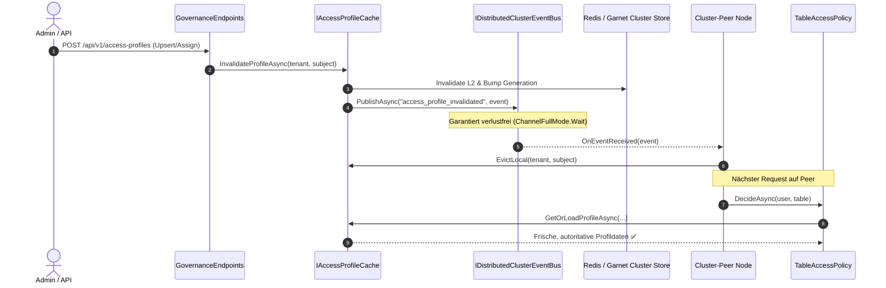

# Implementierungsplan: Distributed State, Cache-Invalidierung & Concurrency-Härtung

**Dokument-ID:** `PLAN-ARCH-01-DISTRIBUTED-STATE`  
**Referenzen:** [Architektur-Review 2026-10-09](2026-10-09-architecture-review.md) (Befunde AR-01, AR-02, AR-03, AR-04, AR-12)  
**Rolle:** C# & .NET Solution Architect  
**Status:** Bereit zur Umsetzung ⏳  

---

## 1. Ausgangslage & Problemstellung

Im Architektur-Audit des Multi-Node- und Cluster-Betriebs wurden fünf Schwachstellen bezüglich Cache-Konsistenz, Concurrency und Distributed State identifiziert:

1. **AR-01 (Stale-Grant-Window bei Zugriffsprofilen):**  
   In `TableAccessPolicy.cs` (`InvalidateCache`) wird nur ein statisches `_profileCache`-Dictionary geräumt. Wenn `IMemoryCache` injiziert ist, verbleiben Profile unter `access_profile:{tenant}:{subject}` bis zu 5 Minuten unbereinigt im Speicher. Es existiert keine knotenübergreifende Invalidierung via Event-Bus.
2. **AR-02 (Unbeobachtete ReBAC-Invalidierung):**  
   In `ZanzibarRebacEvaluator.cs` (`InvalidateTenantCache`) werden `IncrementGenerationAsync()` und `PublishInvalidationAsync()` als unobserved Tasks (`_ =`) gefeuert. Schlägt die Veröffentlichung fehl, verbleiben Cluster-Peers auf veralteten ReBAC-Tupeln, ohne Retry oder Fail-Closed-Zustand.
3. **AR-03 (Verlustbehafteter In-Process-Event-Bus bei Lastspitzen):**  
   `InProcessChannelEventBus.cs` nutzt `BoundedChannelFullMode.DropOldest` (Kapazität 10.000). Epoch-Bumps und Invalidierungsereignisse teilen sich diese Queue mit Telemetrie- und Audit-Events und können unter Volllast still verworfen werden.
4. **AR-04 (Hybrid-Zustand bei Shared State & Differential Privacy):**  
   Entgegen ADR-017 halten `DifferentialPrivacyEngine._budgets` und `FocusCostAccountingService._localSpend` lokale `ConcurrentDictionary`-Instanzen. Ein Client-Datenschutzbudget multipliziert sich dadurch mit der Knotenanzahl.
5. **AR-12 (Globale Lock-Serialisierung bei Casbin-Evaluierung):**  
   `CasbinEnforcementService.cs` nimmt `lock (enforcer)` um jede Richtlinienauswertung. Alle Autorisierungsprüfungen eines Mandanten blockieren sich gegenseitig an einem gemeinsamen Monitor.

---

## 2. Zielarchitektur & Lösungsdesign



---

## 3. Technische Spezifikation der Komponenten

### 3.1 AR-01: Dedizierte `IAccessProfileCache`-Abstraktion & Epoch-Integration

Bisherige statische Caches in `TableAccessPolicy` werden vollständig entfernt. Einführung eines dedizierten Dienstes mit L1/L2-Verhalten:

```csharp
namespace Autheris.Application.Policy.Interfaces;

public interface IAccessProfileCache
{
    ValueTask<AccessProfileResolutionResult?> GetProfileAsync(TenantId tenantId, string subject, CancellationToken ct = default);
    Task InvalidateAsync(TenantId tenantId, string subject, CancellationToken ct = default);
    Task InvalidateTenantAsync(TenantId tenantId, CancellationToken ct = default);
}
```

- **Schlüsselstruktur:** `auth:profile:{tenant}:{subject}` mit TTL 5 Minuten.
- **Invalidierungs-Kopplung:** Veröffentlichung eines typisierten `AccessProfileInvalidationEvent` über den Event-Bus bei jeder Profiländerung in `GovernanceEndpoints.cs`.

### 3.2 AR-02: Awaited & Resiliente ReBAC-Invalidierung

Umstellung von `InvalidateTenantCache` in `ZanzibarRebacEvaluator.cs`:
- Signatur ändern auf `public async Task InvalidateTenantCacheAsync(TenantId tenantId, CancellationToken ct = default)`.
- `IncrementGenerationAsync` und `PublishInvalidationAsync` explizit `await`en.
- Bei Ausfall des Event-Busses: Markierung des lokalen Tenants als `DegradedRebacState` (Fail-Closed für sensible Tabellenabfragen analog zu `EpochValidationService`).

### 3.3 AR-03: Verlustfreier Kanal für Sicherheits-Invalidierungen

Aufspaltung des Nachrichtenbusses:
- **System-/Audit-Events:** Weiterhin über Durchsatz-Kanal mit `BoundedChannelFullMode.Wait` oder gepuffertem Drop.
- **Sicherheits- & Invalidierungs-Kanal (`ISecurityInvalidationChannel`):**
  - Feste Konfiguration: `BoundedChannelFullMode.Wait`.
  - Dedizierte Kapazität (z. B. 5.000 Einträge).
  - Im Multi-Node-Cluster: Zwingende Konfiguration von Redis/Garnet (`GatewayOptions.Cluster.Mode == ClusterMode.Distributed`); Startabbruch außerhalb von `Development`, falls kein verteilter Bus konfiguriert ist.

### 3.4 AR-04: Atomare Cluster-Zähler für Differential Privacy & FinOps

Ersetzung des lokalen `ConcurrentDictionary` in `DifferentialPrivacyEngine.cs`:
```csharp
public async ValueTask<bool> TryConsumeBudgetAsync(string clientId, double epsilonCost, CancellationToken ct = default)
{
    var key = $"dp:budget:{_tenant}:{clientId}";
    // Atomare Ausführung via IDistributedClusterStateProvider / Redis Lua Script
    return await _clusterState.TryConsumeFloatBudgetAsync(key, maxBudget: _maxEpsilon, delta: epsilonCost, ct);
}
```

### 3.5 AR-12: Lock-freie Casbin-Auswertung via Immutable Snapshots

- `CasbinEnforcementService`: Trennung von Mutation und Evaluation.
- Bei Richtlinienänderungen wird ein atomarer `Volatile.Write` auf eine unveränderliche `PolicySnapshot`-Instanz ausgeführt.
- Laufende `EnforceAsync`-Aufrufe lesen lock-frei die Referenz des aktuellen Snapshots (`Volatile.Read(ref _currentSnapshot)`), wodurch das globale `lock (enforcer)` entfällt.

---

## 4. Phasen & Umsetzungsschritte

1. **Phase 1 (AR-01 & AR-02):** Implementierung von `IAccessProfileCache`, Entfernung des statischen Dictionarys, Await-Kette in ReBAC.
2. **Phase 2 (AR-03):** Dedizierter ungesättigter Invalidierungskanal mit Fail-Closed-Startup-Gate bei Multi-Node.
3. **Phase 3 (AR-04):** Cluster-State-Budgetierung für Differential Privacy.
4. **Phase 4 (AR-12):** Lock-freie Snapshot-Evaluation in Casbin.
5. **Phase 5 (Verifikation):** Multi-Threaded Concurrency- und Cluster-Simulations-Unit-Tests.

---

## 5. Abnahmekriterien

- [ ] Profiländerungen eines Nutzers werden auf Peer-Knoten ohne Verzögerung wirksam (Latenz < 100 ms).
- [ ] Kein statisches Dictionary existiert mehr in `TableAccessPolicy`.
- [ ] ReBAC-Invalidierungsfehler führen zu Fail-Closed statt veralteter Autorisierung.
- [ ] Differential-Privacy-Budgets bleiben über mehrere Knoten hinweg strikt atomar gebunden.
- [ ] 10.000 parallele Casbin-Evaluierungen laufen ohne Thread-Lock-Starvation durch.
