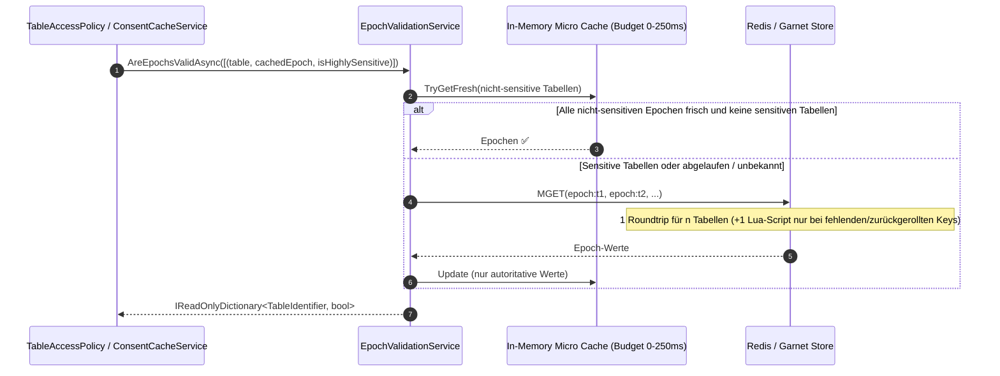

# Implementierungsplan: Performance, Caching-Strategien & Dialekt-Konsistenz

**Dokument-ID:** `PLAN-ARCH-03-PERFORMANCE-CACHING-DIALECTS`  
**Referenzen:** [Architektur-Review 2026-10-09](2026-10-09-architecture-review.md) (Befunde AR-08, AR-09, AR-10, AR-13, AR-14, AR-15, AR-19)  
**Rolle:** C# & .NET Solution Architect / Performance Engineer  
**Status:** Bereit zur Umsetzung ⏳ (Revision 2: Code-Referenzen gegen Branch `feat/ast-target-dialect-generator` verifiziert)  

---

## 1. Ausgangslage & Flaschenhälse

Die Architektur- und Performance-Analyse deckte mehrere Latenztreiber, Skalierungsbegrenzungen und Unstimmigkeiten zwischen Dokumentation und Code auf:

1. **AR-09 (Sequenzielle Redis-Epochen-Abfragen auf dem Hot-Path):**  
   Jeder Consent-Cache-Treffer (`ConsentCacheService.GetCachedDecisionAsync`, `src/Autheris.Infrastructure/Cache/ConsentCacheService.cs:105` für L1, `:141` für L2) ruft `EpochValidationService.IsEpochValidAsync` auf, das über `GetCurrentEpochCoreAsync` (`src/Autheris.Infrastructure/Cache/EpochValidationService.cs:76-122`) **pro Tabelle** ein Redis `StringGetAsync` ausführt. `GetCurrentEpochsAsync` (`:124-134`) iteriert sequenziell. Da `IConsentCacheService` nur eine Einzeltabellen-API anbietet, entsteht pro Tabelle und Request ein Roundtrip; das gefährdet „P99 < 15 ms“ (arc42 1.2).  
   Zusätzlich: Die Rollback-Recovery (`:90-99`) ist ein nicht-atomares Read-then-`SET`, und die bereits vorhandene Option `EpochValidationOptions.PipelinedMGetEnabled` (`src/Autheris.Domain/Options/GatewayOptions.cs:718`) ist **toter Konfigurationsschalter** (nirgends gelesen).
2. **AR-10 & AR-19 (Plan-Cache Thundering Herd & deterministische Registrierung):**  
   `CompiledSqlQueryPlanCache.SetCompiledSql` (`src/Autheris.Application/Sql/CompiledSqlQueryPlanCache.cs:102-105`) leert bei `MaxCachedPlans = 10_000` den gesamten Cache (`_cache.Clear()`); Größenprüfung und Schreiben sind nicht atomar; abgelaufene Einträge werden nur beim Lookup entfernt (`:69-73`). `GovernedSqlExecutionService` nimmt den Cache optional entgegen (`ICompiledSqlQueryPlanCache? planCache = null`, `src/Autheris.Application/Sql/Services/GovernedSqlExecutionService.cs:93`, Nutzung `:780-813`), obwohl der Host ihn bereits registriert (`src/Autheris.Api/Extensions/GatewayServiceCollectionExtensions.cs:558`). Keine Hit/Miss-Metriken.
3. **AR-08 (Sqlite-Mutex als globaler Durchsatzdeckel):**  
   `SqliteGovernanceRepository` (`src/Autheris.Infrastructure/Persistence/SqliteGovernanceRepository.cs:20-25`) hält **eine** `SqliteConnection` und ein `SemaphoreSlim(1,1)`; über die Partials 54 Sperr-Aufrufe (davon 18 in `.Consent.cs`). WAL ist bereits konfiguriert (`SqliteGovernanceRepository.Schema.cs:22-35`) – wirkungslos, solange nur eine Verbindung existiert.
4. **AR-13 (Dialekt-Inkonsistenz & Dokumentations-Drift):**  
   arc42 (`docs/architecture/arc42.md:36,54`) behauptet native Ausführung für Oracle und Databricks; `SqlConnectionFactory` (`src/Autheris.Infrastructure/Persistence/SqlConnectionFactory.cs:31-38`) unterstützt nur Sqlite, SqlServer, PostgreSql. Die Enums `Domain.Common.DatabaseDialect` (`PostgreSql, SqlServer, Sqlite, Databricks, Oracle`) und `TrinoSqlEngine.TargetSqlDialect` (`Ansi, PostgreSql, SqlServer, Sqlite, DuckDb, Snowflake, Oracle`, `src/TrinoSqlEngine/IRlsPolicyProvider.cs:349-358`) sind nicht deckungsgleich. Es existieren bereits **vier voneinander abweichende Inline-Mappings**: `GovernedSqlExecutionService.cs:697-702` (ohne Oracle, fail-closed), `GovernedSqlExecutionService.cs:1725-1730` und `:1740-1745` (mit Oracle, aber **Fallback `_ => TargetSqlDialect.PostgreSql`** – Databricks wird stillschweigend mit PostgreSQL-Quoting/-Syntax generiert, fail-open) sowie `src/Autheris.Application/VirtualFilters/SqlFilterCompiler.cs:357-360` (mit Oracle). Tote Databricks-Pfade: `src/Autheris.Application/Services/SqlDataSourceExecutor.cs:337,681,695,710`.
5. **AR-14 & AR-15 (Service-Locator, optionale Sicherheits-Kollaborateure & Sync-over-Async):**  
   `EpochValidationService` nimmt `IServiceProvider` (`EpochValidationService.cs:21,33,42`) und löst lazy `ITableMetadataRepository` auf (`:148`); fällt ohne Event-Bus auf `new InProcessChannelEventBus()` zurück (`:38`). `TableAccessPolicy` nimmt Sicherheits-Kollaborateure nullable entgegen (`IConsentCacheService?`, `IPolicyEnforcementService?`, `IRebacEvaluator?`, `GatewayOptions?`; `src/Autheris.Application/Policy/TableAccessPolicy.cs:94-98`). `BasicAuthAttemptGuard` (`src/Autheris.Api/Security/BasicAuthAttemptGuard.cs:183-187,260-262,293-295`) enthält Sync-Wrapper mit `.AsTask().GetAwaiter().GetResult()`, aktuell nur von `tests/Autheris.Tests.Unit/BasicAuthOptimizationTests.cs:129-145` genutzt.

---

## 2. Technische Lösungsarchitektur

### 2.1 AR-09: Batching & Pipelining von Epochen-Abfragen mit lokalem Micro-Cache



- **Neue Batch-API (neu, existiert noch nicht):** `IEpochValidationService.AreEpochsValidAsync(IReadOnlyList<EpochCheck> checks, CancellationToken ct)` mit `record EpochCheck(TableIdentifier Table, long CachedEpoch, bool IsHighlySensitive)`. Zusätzlich eine Batch-Variante in `IConsentCacheService` (`GetCachedDecisionsAsync(tenant, sid, tables, contextHash)`), damit der Aufrufer in `TableAccessPolicy` alle Tabellen einer Abfrage in einem Schritt validiert. Ohne diese API bringt MGET keinen Gewinn, weil heute pro Tabelle einzeln aufgerufen wird.
- **MGET:** `IDatabase.StringGetAsync(RedisKey[])`; aktiviert über die bereits vorhandene Option `PipelinedMGetEnabled` (wird damit erstmals verdrahtet). `GetCurrentEpochsAsync` nutzt denselben Pfad.
- **Atomare Rollback-Recovery:** Ersetzt Read-then-`SET` (`EpochValidationService.cs:90-99`) durch ein Lua-Script `SET key max(current, highestSeen+1)` bzw. `INCR` für fehlende Keys – ein Roundtrip für alle betroffenen Keys.
- **Micro-Cache (neue Option `EpochValidationOptions.LocalStalenessBudgetMilliseconds`, `[Range(0, 250)]`, Default `0` = aus):** Nicht zu verwechseln mit `DegradedMaxStalenessSeconds` (30 s, nur Degraded-Modus). Regeln:
  - Nur **autoritative** Redis-Werte werden gepuffert (nie Fallback-Werte aus dem `catch`-Pfad `:112-116`).
  - Rollback-Erkennung (`_highestSeenRedisEpoch`) bleibt für jeden Redis-Wert aktiv; der Micro-Cache liefert nie einen Wert < `highestSeen`.
  - Sofortige lokale Invalidierung bei `InvalidateEpochAsync` (`:195`), beim Event-Bus-Handler (`:57-66`) und bei `ConnectionRestored` (`:46-51`).
  - Im Degraded-Modus (`!IsConnected`) gilt ausschließlich die bestehende Logik `:141-183`; der Micro-Cache wird nicht konsultiert.
  - Bounded: Einträge nur für bekannte Tabellen-Keys, Obergrenze `MaxLocalEpochEntries` (Default 50.000), Überschreitung → kein Caching statt Clear.

### 2.2 AR-10 & AR-19: Bounded LRU Cache, vollständiger Cache-Key & Metriken für den Plan-Cache

- **Eviction:** Ersatz von `ConcurrentDictionary` + Hard-Clear durch eine **dedizierte** `MemoryCache`-Instanz (`new MemoryCache(new MemoryCacheOptions { SizeLimit = MaxEntries, CompactionPercentage = 0.1 })`), jeder Eintrag `Size = 1`, `AbsoluteExpirationRelativeToNow = TTL`. Nicht die global registrierte `IMemoryCache` verwenden (ein globales `SizeLimit` würde alle anderen `Set`-Aufrufe ohne `Size` mit `InvalidOperationException` brechen). Hinweis: `MemoryCache`-Kompaktierung ist kein striktes LRU (Priorität → Ablauf → LRU), für diesen Zweck ausreichend; Abnahme prüft nur „kein Komplett-Clear“.
- **Cache-Key-Vollständigkeit (SEC-CACHE-01):** `CompiledSqlPlanKey` (`CompiledSqlQueryPlanCache.cs:16-21`) enthält heute `QueryHash, Dialect, TenantId, PolicyHash`. `ComputePolicyHash` (`:203-285`) deckt RLS-Prädikate, Masken, No-RLS-Tabellen, Consent-/Mask-Tabellenlisten, MaxRows, DML, Rewriter-Engine und Subquery-Strategie ab. **Fehlend und zu ergänzen:**
  1. `effectiveDataSourceName` – zwei Datenquellen gleichen Dialekts im selben Tenant teilen sonst Pläne (Katalog-Präfix wird vom Generator entfernt, `GovernedSqlExecutionService.cs:520-522`).
  2. Hash der Katalog-Spaltenliste (`tableColumnsMap`, `:339,542`), da sie die `*`-Expansion / `EnforceCatalogProjection` steuert. Eine Spaltenänderung im Katalog darf keinen alten Plan treffen.
  3. Hash von `allowedFunctions` (`:707`) bzw. `AdditionalAllowedFunctions`, sofern der Rewriter sie nutzt.
  - Zusätzlich zum Hash-Vergleich wird beim Treffer neben `RawSql` auch ein `PolicyFingerprint`-String (kanonische Policy-Eingaben) per `string.Equals` verglichen, um 64-bit-Kollisionen über Policy-Kontexte hinweg auszuschließen (heute nur `RawSql`, `:63`). Leere `rawSql`-Überladungen (`:39-47`, `:80-89`) werden entfernt, da sie den Kollisionsschutz aushebeln.
- **Performance-Leitplanke (Entscheidung 09.10.2026):** Die zusätzlichen Key-Bestandteile kosten keine Arbeit je Request: der Spalten-Hash wird beim Laden/Invalidieren des Katalogs je Tabelle vorberechnet und am Metadaten-Objekt gehalten; `PolicyFingerprint` ist derselbe kanonische String, aus dem heute schon `policyHash` gebildet wird (einmal bauen, für Hash und Vergleich wiederverwenden). Abnahme über `PlanCacheBenchmark`: Hit-Pfad ≤ +3 % Zeit und keine zusätzliche Allokation gegenüber dem Stand vor der Änderung.
- **Metriken** (Prometheus-Stil wie `ConsentCacheService.cs:82-85`):
  - `autheris_plan_cache_hits_total`
  - `autheris_plan_cache_misses_total`
  - `autheris_plan_cache_evictions_total` (über `PostEvictionCallbacks`, Reason `Capacity`)
- **Deterministische DI:** Parameter in `GovernedSqlExecutionService` wird nicht-nullable (`ICompiledSqlQueryPlanCache planCache`); neue Option `GatewayOptions.WebSql.PlanCache` (`MaxEntries`, Default 10.000; `0` = deaktiviert via `NullCompiledSqlQueryPlanCache`; `TtlSeconds`, Default 600). Tests nutzen explizit `NullCompiledSqlQueryPlanCache` oder die echte Instanz.

### 2.3 AR-13: Harmonisierung der Dialekt-Enums & arc42-Korrektur

- Ein zentrales Mapping in `TrinoSqlEngine`-nahem Application-Code (`src/Autheris.Application/Sql/SqlDialectMapper.cs`), das die Inline-Switches in `GovernedSqlExecutionService.cs:697-702,1725-1730,1740-1745` und `SqlFilterCompiler.cs:357-360` ersetzt (der PostgreSQL-Default-Fallback entfällt; unbekannte Dialekte werfen):
  ```csharp
  public static class SqlDialectMapper
  {
      // Nur Dialekte mit AST-Generator UND (für Ausführung) Treiber. DatabaseDialect kennt kein DuckDb.
      public static bool TryToTargetDialect(DatabaseDialect dialect, out TargetSqlDialect target) { ... }

      public static TargetSqlDialect ToTargetDialect(DatabaseDialect dialect) => dialect switch
      {
          DatabaseDialect.SqlServer => TargetSqlDialect.SqlServer,
          DatabaseDialect.PostgreSql => TargetSqlDialect.PostgreSql,
          DatabaseDialect.Sqlite => TargetSqlDialect.Sqlite,
          DatabaseDialect.Oracle => TargetSqlDialect.Oracle, // Generator vorhanden, kein Treiber
          _ => throw new NotSupportedException($"Target AST generation not supported for dialect '{dialect}'.")
      };

      public static bool IsExecutable(DatabaseDialect dialect) =>
          dialect is DatabaseDialect.SqlServer or DatabaseDialect.PostgreSql or DatabaseDialect.Sqlite;
  }
  ```
  `GovernedSqlExecutionService` (WebSQL) prüft zusätzlich `IsExecutable` und behält die bestehende Fehlermeldung (`WebSqlPolicyException`). `SqlConnectionFactory` nutzt ebenfalls `IsExecutable`.
- Databricks: Branches in `SqlDataSourceExecutor.cs:337,681,695,710` entfernen (kein Treiber, kein Generator); `DatabaseDialect.Databricks` bleibt nur für Katalog-Parsing (`ParseDialect`) und Quoting/Literal-Escaping (`DatabaseDialect.cs`, `EscapeSqlLiteral`) erhalten, bis eine Entscheidung über Implementierung vorliegt (ADR-Notiz).
- Korrektur von `docs/architecture/arc42.md:36,54`: Oracle als „AST-Dialekt ohne nativen Treiber“, Databricks als „Katalog-Dialekt ohne Generator und Treiber“.

### 2.4 AR-14 & AR-15: Beseitigung von Service-Locator, optionalen Sicherheits-Kollaborateuren und Sync-over-Async

- Neues Interface `ITableSensitivityLookup` (Application) mit `ValueTask<bool> IsSensitiveAsync(TableIdentifier, CancellationToken)`; Implementierung kapselt die bestehende Sensitivitätslogik aus `EpochValidationService.cs:154-160` (`IsHighlySensitive` **oder** sensible Spalten **oder** Maskierungsregeln) über `ITableMetadataRepository` – nicht `IGovernanceRepository`. `EpochValidationService` erhält `ITableSensitivityLookup` per Konstruktor; `IServiceProvider` entfällt. Fail-closed bleibt: Exception → sensitiv.
- `EpochValidationService`: `IEventBus` wird Pflicht-Dependency (kein `new InProcessChannelEventBus()`-Fallback, `:38`); `IOptions<GatewayOptions>` Pflicht.
- `TableAccessPolicy` (`TableAccessPolicy.cs:94-98`): `IConsentCacheService`, `IPolicyEnforcementService`, `IRebacEvaluator`, `GatewayOptions` werden Pflicht; wo „keine“ gültig ist, Null-Objekte nach Vorbild `NullMandatoryRowFilterResolver`.
- Entfernung der Sync-Wrapper `IsLockedOut`, `RecordFailure`, `RecordSuccess` in `BasicAuthAttemptGuard.cs`; Migration von `BasicAuthOptimizationTests.cs:129-145` auf die `…Async`-API.

---

## 3. Umsetzungsphasen (TDD: jeweils zuerst roter Test)

1. **Phase 1 (AR-14 & AR-15):** `ITableSensitivityLookup`, Pflicht-Dependencies in `EpochValidationService` und `TableAccessPolicy`, Entfernung der Guard-Sync-Wrapper.
2. **Phase 2 (AR-09):** Batch-API, MGET, atomare Lua-Rollback-Recovery, Micro-Cache (Default aus), Benchmark.
3. **Phase 3 (AR-10 & AR-19):** Key-Erweiterung (Datenquelle, Spalten-Hash, Fingerprint), dedizierter `MemoryCache`, Metriken, Pflicht-Registrierung + `NullCompiledSqlQueryPlanCache`.
4. **Phase 4 (AR-13):** `SqlDialectMapper`, Entfernung Databricks-Branches, arc42-Update.
5. **Phase 5 (AR-08):** Startup-Warnung, wenn `GovernanceDb:Provider = sqlite` außerhalb `Development` verwendet wird; Dokumentation der Durchsatzgrenze in arc42/Betriebshandbuch. Optional: Reader/Writer-Trennung (ein Writer-Connection mit Lock, Pool von Read-Connections im WAL-Modus) – nur mit Contract-Tests für Read-your-writes im Consent-Pfad. `Cache=Shared` allein löst das Problem nicht (Default-Connection-String `SqliteGovernanceRepository.cs:72` nutzt es bereits).

---

## 4. Abnahmekriterien

**AR-09 (Unit, `tests/Autheris.Tests.Unit/Cache/`)**
- [ ] `AreEpochsValidAsync` mit 5 Tabellen führt genau **einen** `StringGetAsync(RedisKey[])`-Aufruf und **keinen** Einzel-`StringGetAsync` aus (Mock auf `IDatabase`).
- [ ] Bei `PipelinedMGetEnabled = false` bleibt das bisherige Verhalten (Einzel-GET) erhalten.
- [ ] Rollback-Fall (Redis-Wert < `highestSeen`) erzeugt genau einen `ScriptEvaluateAsync`-Aufruf, kein `StringSetAsync`.
- [ ] Micro-Cache: Nach `InvalidateEpochAsync(t)` auf demselben Knoten liefert der nächste Check für einen alten `cachedEpoch` sofort `false` (kein Warten auf Budget).
- [ ] Micro-Cache: Für `IsHighlySensitive = true` wird auch bei frischem lokalem Eintrag Redis gelesen.
- [ ] Micro-Cache: Ein nicht-autoritativer Wert (Redis-Exception) wird nicht gepuffert; der Check liefert `false` (INF-1 bleibt erhalten).
- [ ] Micro-Cache: Nach `ConnectionRestored` ist der lokale Cache leer.

**AR-10/19 (Unit, `CompiledSqlQueryPlanCacheTests`, `GovernedSqlPlanCacheTests`)**
- [ ] Nach `MaxEntries + 1` Einfügungen sind ≥ 90 % der Einträge weiterhin abrufbar (kein Komplett-Clear); `evictions_total` > 0.
- [ ] Gleiche SQL, gleicher Tenant/Dialekt, aber andere Datenquelle → Cache-Miss.
- [ ] Gleiche SQL, aber geänderte Katalog-Spaltenliste → Cache-Miss.
- [ ] Gleiche SQL, anderer Principal mit anderem RLS-Prädikat oder anderer Maske → Cache-Miss (bestehend, als Regressionstest beibehalten).
- [ ] Erzwungene `PolicyHash`-Kollision (Test-Hook) mit abweichendem Fingerprint → Cache-Miss.
- [ ] `MaxEntries = 0` → `NullCompiledSqlQueryPlanCache`, jeder Aufruf kompiliert neu.
- [ ] Architekturtest: `GovernedSqlExecutionService` hat keinen nullable `ICompiledSqlQueryPlanCache`-Parameter.

**AR-13**
- [ ] Unit-Test über alle `DatabaseDialect`-Werte: `ToTargetDialect` liefert erwarteten Wert oder `NotSupportedException` (Databricks); `IsExecutable` stimmt mit `SqlConnectionFactory` überein.
- [ ] Architekturtest: Kein `DatabaseDialect.* => TargetSqlDialect.*`-Switch außerhalb `SqlDialectMapper`.
- [ ] `grep Databricks src/Autheris.Application/Services/SqlDataSourceExecutor.cs` liefert 0 Treffer.

**AR-14/15/08**
- [ ] Architekturtest: Kein Konstruktor in `Autheris.Infrastructure.Cache` und `Autheris.Application.Policy` nimmt `IServiceProvider`.
- [ ] Architekturtest: Kein `.GetAwaiter().GetResult()` in `src/Autheris.Api/Security/**`.
- [ ] Startup-Test: Sqlite-Governance-Provider im Environment `Production` loggt genau eine Warnung.

**Benchmarks (`benchmarks/Autheris.Benchmarks`, BenchmarkDotNet)**
- [ ] Neuer `EpochValidationBenchmark` (Testcontainers-Redis, 1/5/20 Tabellen): Batch-Pfad mit 5 Tabellen ≤ 1,3× der Latenz von 1 Tabelle (Baseline sequenziell ≈ 5×); Ergebnis im PR dokumentiert.
- [ ] Neuer `PlanCacheBenchmark`: Hit-Pfad < 2 µs Median, 0 Allocations > 1 KB; Fill-Szenario mit 20.000 distinct Keys zeigt keinen Spike der Miss-Rate auf 100 %.
- [ ] Bestehende `ConsentCacheBenchmark`-Werte verschlechtern sich um nicht mehr als 5 %.

---

## 5. Security Architecture Review & Ergänzungen (Security Expert)

> [!IMPORTANT]
> **Sicherheits-Invariante 1: Null-Staleness bei sensiblen Tabellen (Zero-Tolerance Revocation)**  
> Das Micro-Caching von Epochen birgt das Risiko einer kurzen Verzögerung beim Berechtigungsentzug (auf **anderen** Knoten bis zur Länge des Budgets).  
> **Architektur-Vorgabe:** Sensitivität wird über dieselbe Definition wie im Degraded-Modus bestimmt (`ITableSensitivityLookup`: `Table.IsHighlySensitive` – d. h. `RequiresFourEyes` oder `Table.IsSensitivityHigh(Sensitivity)`, Rang ≥ 3 / `3_confidential` – **oder** sensible Spalten **oder** Maskierungsregeln). Für diese Tabellen gilt Budget `0`; es wird immer gegen Redis gelesen. Der Aufrufer übergibt das Flag aus bereits geladenen Metadaten (`TableAccessPolicy` hat sie, vgl. `TableAccessPolicy.cs:451`), damit kein zusätzlicher Metadaten-Lookup auf dem Hot-Path entsteht. Unbekannt → sensitiv (fail-closed). Das Restrisiko für nicht-sensitive Tabellen (≤ Budget) wird in arc42 Kapitel 11 dokumentiert; Default-Budget ist `0`.

> [!IMPORTANT]
> **Sicherheits-Invariante 1b: Plan-Cache darf keine Autorisierungsentscheidung speichern**  
> Der Plan-Cache speichert ausschließlich das Rewrite-Ergebnis. Tabellenfreigabe, Consent, Funktions-Allowlist und Katalog-Prüfung laufen bei jedem Request **vor** dem Cache-Lookup (heute so: `GovernedSqlExecutionService.cs` Schritte 1–6 vor `:780`). Ein Test stellt sicher, dass ein gecachter Plan nach Entzug der Tabellenfreigabe nicht mehr ausgeliefert wird (Request wird vor dem Lookup abgelehnt). Jede Eingabe, die das generierte SQL beeinflusst, muss in Key oder Fingerprint stehen (Checkliste im Code-Kommentar von `ComputePolicyHash`).

> [!CAUTION]
> **Sicherheits-Invariante 2: DoS-Schutz für CPU-intensives Password-Hashing**  
> Das Hashing liegt nicht im `BasicAuthAttemptGuard`, sondern in `PasswordHasher` (`src/Autheris.Api/Security/PasswordHasher.cs`, Argon2id, Default 64 MB / 3 Iterationen), aufgerufen aus `BasicAuthenticationHandler`. Dort wird ein `SemaphoreSlim(MaxConcurrentPasswordHashes)` (neue Option, Default `Environment.ProcessorCount`, Wartezeit max. 2 s → `401` ohne Hash-Berechnung, Metrik `autheris_password_hash_rejected_total`) vorgeschaltet. Der Lockout-Check (`IsLockedOutAsync`) läuft **vor** dem Semaphore. Abnahme: Unit-Test mit `MaxConcurrentPasswordHashes = 1` und zwei parallelen Anfragen zeigt max. eine gleichzeitige Hash-Berechnung. Speicherbudget: `MaxConcurrentPasswordHashes × Argon2MemorySizeKb` wird beim Start geloggt.

> [!TIP]
> **Sicherheits-Invariante 3: Strikte Bezeichner-Quoting-Parität über alle Dialekte**  
> Generierte SQL-Bäume dürfen keine ungeprüften Bezeichner enthalten. Quoting: `[schema].[table]` in T-SQL, `"schema"."table"` in PostgreSQL/Oracle/DuckDB, in SQLite nur `"table"` (Schema wird bewusst entfernt, `DatabaseDialect.FormatTableIdentifier`). Bezeichner werden vorher über `DatabaseDialectExtensions.ValidateIdentifier` (`\A[a-zA-Z_][a-zA-Z0-9_]*\z`) bzw. gegen den Metadaten-Katalog validiert. Abnahme: Parametrisierter Test je `TargetSqlDialect` mit Bezeichnern `a]b`, `a"b`, `` a`b ``, `a;--` → Ablehnung oder korrektes Escaping, nie unverändert im Output.
