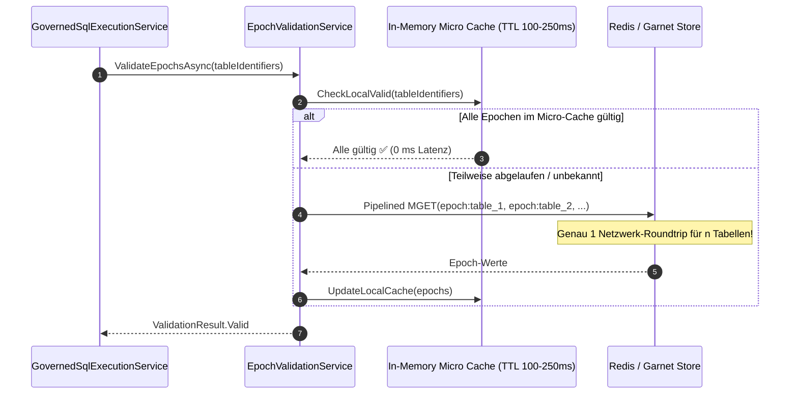

# Implementierungsplan: Performance, Caching-Strategien & Dialekt-Konsistenz

**Dokument-ID:** `PLAN-ARCH-03-PERFORMANCE-CACHING-DIALECTS`  
**Referenzen:** [Architektur-Review 2026-10-09](2026-10-09-architecture-review.md) (Befunde AR-08, AR-09, AR-10, AR-13, AR-14, AR-15, AR-19)  
**Rolle:** C# & .NET Solution Architect / Performance Engineer  
**Status:** Bereit zur Umsetzung ⏳  

---

## 1. Ausgangslage & Flaschenhälse

Die Architektur- und Performance-Analyse deckte mehrere Latenztreiber, Skalierungsbegrenzungen und Unstimmigkeiten zwischen Dokumentation und Code auf:

1. **AR-09 (Sequenzielle Redis-Epochen-Abfragen auf dem Hot-Path):**  
   Bei jeder Consent-Cache-Prüfung fragt `EpochValidationService.cs` (`IsEpochValidAsync`) den aktuellen Epochenwert der Tabelle sequenziell per Redis `GET` ab. Bei komplexen Abfragen mit mehreren Tabellen/Joins erzeugt dies multiple synchrone Netzwerk-Roundtrips, was das Ziel von P99 < 15 ms gefährdet.
2. **AR-10 & AR-19 (Plan-Cache Thundering Herd & deterministische Registrierung):**  
   Erreicht `CompiledSqlQueryPlanCache.cs` die Grenze von 10.000 Einträgen, wird der Cache mit `_cache.Clear()` komplett geleert. Dies löst einen massiven Spike an parallelen AST-Neukompilierungen aus (Thundering Herd). Zudem ist die Registrierung des Plan-Caches in `GovernedSqlExecutionService` optional (`null`-Fallback), was zu abweichendem Verhalten zwischen Test- und Produktionshosts führt.
3. **AR-08 (Sqlite-Mutex als globaler Durchsatzdeckel):**  
   Das `SqliteGovernanceRepository` verwendet eine einzelne `SqliteConnection` mit einem globalen `SemaphoreSlim(1,1)` über 54 Sperr-Aufrufe. Lese- und Schreibvorgänge blockieren sich gegenseitig vollständig.
4. **AR-13 (Dialekt-Inkonsistenz & Dokumentations-Drift):**  
   In arc42 wird native Ausführung für Oracle und Databricks behauptet. `SqlConnectionFactory` unterstützt jedoch nur SQLite, SQL Server und PostgreSQL. Zudem existieren zwei inkonsistente Dialekt-Enums (`Domain.Common.DatabaseDialect` und `TargetSqlDialect`).
5. **AR-14 & AR-15 (Zirkuläre Abhängigkeiten & Sync-over-Async):**  
   `EpochValidationService` nutzt Service-Locator-Muster (`IServiceProvider`), um eine zyklische Abhängigkeit zum Repository aufzubrechen. `BasicAuthAttemptGuard.cs` enthält synchrone Methoden (`.GetAwaiter().GetResult()`), die bei hoher Last zu Thread-Pool-Starvation führen können.

---

## 2. Technische Lösungsarchitektur

### 2.1 AR-09: Batching & Pipelining von Epochen-Abfragen mit lokalem Micro-Cache



- **Pipelining / MGET:** Abfrage mehrerer Tabellen-Epochen in einem einzigen Netzwerk-Call.
- **Micro-Caching:** Epochenwerte werden innerhalb des Staleness-Budgets (konfigurierbar, z. B. 200 ms) im Arbeitsspeicher gepuffert.

### 2.2 AR-10 & AR-19: Bounded LRU Cache & Metriken für den Plan-Cache

- Umstellung von `ConcurrentDictionary` mit Hard-Clear auf `MemoryCache` mit definierter Größenbegrenzung (SizeLimit) und rollierender Eviction (LRU-Prinzip).
- Exponierung von OpenTelemetry / Prometheus-Metriken:
  - `autheris_plan_cache_hits_total`
  - `autheris_plan_cache_misses_total`
  - `autheris_plan_cache_evictions_total`
- Deterministische DI-Registrierung: `ICompiledSqlQueryPlanCache` wird stets als Pflicht-Dependency registriert; eine Deaktivierung erfolgt deklarativ über `GatewayOptions.PlanCache.Enabled = false`.

### 2.3 AR-13: Harmonisierung der Dialekt-Enums & arc42-Korrektur

- Konsolidierung des Dialekt-Mappings:
  ```csharp
  public static class SqlDialectMapper
  {
      public static TargetSqlDialect ToTargetDialect(DatabaseDialect dialect) => dialect switch
      {
          DatabaseDialect.SqlServer => TargetSqlDialect.SqlServer,
          DatabaseDialect.PostgreSql => TargetSqlDialect.PostgreSql,
          DatabaseDialect.Sqlite => TargetSqlDialect.Sqlite,
          DatabaseDialect.DuckDb => TargetSqlDialect.DuckDb,
          _ => throw new NotSupportedException($"Target AST generation not supported for dialect '{dialect}'.")
      };
  }
  ```
- Bereinigung toter Codepfade in `SqlDataSourceExecutor.cs` bezüglich Databricks.
- Korrektur von `docs/architecture/arc42.md`: Klare Kennzeichnung von Oracle und Databricks als „Dialekt-Spezifikation ohne nativen Autheris-Treiber“.

### 2.4 AR-14 & AR-15: Beseitigung von Service-Locator und Sync-over-Async

- Einführung des Interfaces `ITableSensitivityLookup` zur sauberen Entkopplung von `EpochValidationService` und `IGovernanceRepository`.
- Vollständige Entfernung synchroner Wrapper (`.GetAwaiter().GetResult()`) in `BasicAuthAttemptGuard.cs`. Alle Aufrufe in Tests und Produktion laufen strikt asynchron über `Task`/`ValueTask`.

---

## 3. Umsetzungsphasen

1. **Phase 1 (AR-14 & AR-15):** Zyklus aufbrechen via `ITableSensitivityLookup`, Bereinigung synchroner Guard-Wrapper.
2. **Phase 2 (AR-09):** Pipelined MGET und Micro-Caching im `EpochValidationService`.
3. **Phase 3 (AR-10 & AR-19):** LRU-Migration des Plan-Caches und OpenTelemetry-Metriken.
4. **Phase 4 (AR-13):** Dialekt-Harmonisierung und arc42-Dokumentations-Update.
5. **Phase 5 (AR-08):** SQLite-Connection-String Härtung (`Cache=Shared` / WAL-Modus Dokumentation).

---

## 4. Abnahmekriterien

- [ ] Latenz für die Epochenvalidierung von 5 Tabellen sinkt bei Redis-Pipelining auf < 2 ms.
- [ ] Der Plan-Cache erzeugt bei 10.000 Einträgen keinen Thundering-Herd-Effekt mehr.
- [ ] Keine Vorkommen von `.GetAwaiter().GetResult()` in Sicherheits- und Auth-Guards.
- [ ] Keine zirkulären Service-Provider-Aufrufe im `EpochValidationService`.
- [ ] Sämtliche Architektur- und Performance-Tests laufen fehlerfrei durch.

---

## 5. Security Architecture Review & Ergänzungen (Security Expert)

> [!IMPORTANT]
> **Sicherheits-Invariante 1: Null-Staleness bei hochsensiblen Tabellen (Zero-Tolerance Revocation)**  
> Das Micro-Caching von Epochen (100–250 ms) bietet massiven Performance-Gewinn, birgt jedoch das Risiko einer kurzen Verzögerung beim sofortigen Berechtigungsentzug.  
> **Architektur-Vorgabe:** Für Tabellen mit `IsSensitivityHigh = true` (Schutzklasse `3_confidential` oder höher) wird das lokale Micro-Caching zwingend umgangen (`StalenessBudget = TimeSpan.Zero`). Diese Abfragen führen immer einen direkten Pipelined MGET gegen Redis aus. Ein Berechtigungsentzug wirkt hier mit Null-Latenz.

> [!CAUTION]
> **Sicherheits-Invariante 2: DoS-Schutz für CPU-intensives Password-Hashing**  
> Durch die Bereinigung synchroner Wrapper in `BasicAuthAttemptGuard` wird Thread-Pool-Starvation verhindert.  
> Da Argon2id rechen- und speicherintensiv ist, muss zusätzlich ein `SemaphoreSlim(MaxConcurrentPasswordHashes)` (Standard: `ProcessorCount`) vorgeschaltet werden, um zu verhindern, dass eine Flut paralleler Anmeldeversuche den CPU-Kern für die reguläre Gateway-Pipeline blockiert.

> [!TIP]
> **Sicherheits-Invariante 3: Strikte Bezeichner-Quoting-Parität über alle Dialekte**  
> Im Dialekt-Mapping (`TargetSqlDialect`) dürfen generierte SQL-Bäume niemals ungeprüfte Bezeichner enthalten. Alle generierten Spalten und Tabellen müssen zwingend dialektkonform gequotet werden (`[table].[column]` in T-SQL, `"table"."column"` in PostgreSQL, SQLite und DuckDB). Bezeichner müssen vor der Generierung im Metadaten-Katalog validiert sein.

