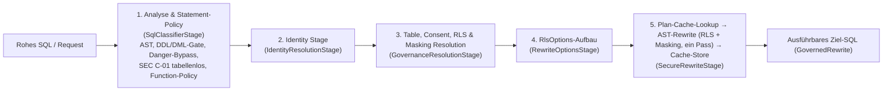

# Implementierungsplan: Refactoring God-Classes, Composition Root & Schichtentrennung

**Dokument-ID:** `PLAN-ARCH-02-REFACTORING-MODULARIZATION`  
**Referenzen:** [Architektur-Review 2026-10-09](2026-10-09-architecture-review.md) (Befunde AR-05, AR-06, AR-07, AR-11, AR-18)  
**Rolle:** C# & .NET Solution Architect  
**Status:** Überarbeitet nach Plan-Review (2026-10-09) – bereit zur Umsetzung ⏳  

---

## 1. Ausgangslage & Problemstellung

Die statische Code- und Architektur-Analyse offenbarte erhebliche Wartbarkeits- und Komplexitätsrisiken durch übergroße Klassen („God Classes“) und Vermischung von Schichtverantwortlichkeiten (Zeilenzahlen verifiziert am Stand `feat/ast-target-dialect-generator`):

1. **AR-05 (God-Classes im Application-Layer):**  
   - `src/Autheris.Application/Sql/Services/GovernedSqlExecutionService.cs` (2.025 Zeilen): `RewriteCoreAsync` (`:138-~850`, ca. 700 Zeilen, Code-Kommentare nummerieren die Schritte 1–7), `ExecuteCoreAsync` (`:862-1135`), `ExecuteQueryBufferedAsync` (`:1249-~1900`), geschachtelte Klasse `SyntheticDataTableReader` (`:1965`). Der Konstruktor (`:80-125`) nimmt eine sehr lange Parameterliste entgegen.
   - Tatsächliche Schrittfolge in `RewriteCoreAsync`: (1) AST-Analyse `:174`, (2) Statement-Typ-Validierung inkl. DML-Freigabe `:200`, (3) Danger-Bypass `:249` gefolgt von SEC C-01 (Tabellenlose Statements ablehnen `:257`) und SEC C-01/H-14 (Function-Policy `:264-281`), (4) Identität auflösen `:283`, (5) RLS-Filter **und** Masking pro Tabelle auflösen `:335-~680`, (6) `RlsOptions` aufbauen `:683`, (7) Plan-Cache-Lookup → `_sqlEngine.RewriteRls(...)` → Cache-Store `:780-850`. RLS-Injektion und Masking werden heute **in einem einzigen AST-Pass** des `TrinoSqlEngine`-Rewriters angewendet, nicht in getrennten Stufen.
   - Weitere God-Classes laut AR-05: `src/Autheris.Application/Governance/CasbinEnforcementService.cs` (1.760 Zeilen) und `src/Autheris.Application/Services/GatewayExecutionService.cs` (1.143 Zeilen).
2. **AR-06 (Monolithische Composition Root `src/Autheris.Api/Extensions/GatewayServiceCollectionExtensions.cs`):**  
   1.692 Zeilen mit ca. 185 DI-Registrierungen und Backend-Verzweigungen. Seiteneffekte während der Registrierung: `new GarnetServerManager(...)` + `StartServer()` (`:229-233`); Sync-over-async ReBAC-Seeding `store.AddTuplesAsync(...).GetAwaiter().GetResult()` in der `IRebacStore`-Factory (`:661`, inkl. hartkodierter Dev-Seed-Tupel `:633-645`); leerer `catch { }` bei der Sqlite-Connection-String-Auswertung in der Startup-Validierung (`:1624`).
3. **AR-07 (Dreifache Duplizierung der Governance-Repositories):**  
   `src/Autheris.Infrastructure/Persistence/{Sqlite,PostgreSql,SqlServer}GovernanceRepository*.cs` umfassen zusammen ca. 14.500 Zeilen (Partials `.Consent` 1.645/1.535/1.549, `.Audit` 1.043/1.040/1.077, `.Schema` 1.088/751/672, `.Catalog` 943/646/669, `.Outbox`, `.VirtualFilters`; `.AccessProfiles` existiert nur für Sqlite). Provider-Contract-Tests existieren nur teilweise und nicht als gemeinsame Suite (`tests/Autheris.Tests.Integration/PostgreSql*ContractTests.cs`, `SqlServer*ContractTests.cs`; kein Sqlite-Pendant, kein `RowScope` für SqlServer).
4. **AR-11 & AR-18 (Architektur-Drift & Schichten-Kopplung):**  
   `src/Autheris.Application/Autheris.Application.csproj:10-24` referenziert `DuckDB.NET.Data.Full`, `Parquet.Net`, `Apache.Arrow`, `Casbin.NET`, `Microsoft.Extensions.Http` und `HotChocolate.Language` (genutzt in `Mcp/Services/PreFlightQuerySimulator.cs`, `Mcp/Services/McpGraphQlTableResolver.cs`, `SchemaRegistry/SchemaLinter.cs`, `SchemaRegistry/ISchemaLinter.cs`). Betroffene Implementierungen: `Olap/DuckDbOlapEngine.cs` (Interface existiert bereits: `Olap/IDuckDbOlapEngine.cs`), `Serialization/ParquetExportService.cs`, `Serialization/ArrowExportService.cs`, `Serialization/ArrowFlightSqlServer.cs`. `src/Autheris.Domain/Options/GatewayOptions.cs` umfasst 1.726 Zeilen mit Infrastrukturdetails (Garnet, Redis, WebSQL); `Autheris.Domain.csproj` referenziert zusätzlich `MemoryPack` und `System.ComponentModel.Annotations` – im Widerspruch zu arc42 4.1 („reiner Domänenkern ohne externe Abhängigkeiten“). Die Architektur-Tests (`tests/Autheris.Tests.Architecture/ArchitectureTests.cs`) prüfen nur Projekt-Namespaces und ASP.NET Core, keine Pakete.

---

## 2. Zielarchitektur & Komponenten-Design

### 2.1 Refaktoriertes Pipeline-Design für den SQL-Rewrite-Pfad (AR-05)

Statt eines 700-zeiligen Monolithen wird eine modulare Pipeline (`ISqlRewritePipeline`) eingeführt. Die Stufen bilden **1:1 die heutige Schrittfolge** ab (keine Umordnung im Zuge des Refactorings):

- Jede Stufe implementiert `ValueTask<RewriteStageResult> ExecuteAsync(RewriteContext context, CancellationToken ct)`; ein Stufenergebnis kann die Pipeline **nur über Exceptions** (`WebSqlPolicyException`, `ArgumentException`) oder über ein explizites `ShortCircuit(GovernedRewrite)` beenden. Short-Circuit ist ausschließlich für Danger-Bypass (S1) und Plan-Cache-Hit (S5) zulässig.
- Die Stufenreihenfolge wird **nicht über DI-Enumeration** (`IEnumerable<IRewriteStage>`) aufgelöst, sondern im Pipeline-Konstruktor als festes, typisiertes Array verdrahtet (siehe Sicherheits-Invariante 1).
- Die Exception-Übersetzung aus `:807-840` (`UnfilteredDmlException`, `AstBuildException`, `SecurityException`, Parser-Timeout) bleibt unverändert in S5 erhalten.
- Ein separater `ITargetDialectGenerator` ist **nicht** Teil dieses Plans; er wird im Branch `feat/ast-target-dialect-generator` bzw. in [plan-architektur-performance-caching-dialekte.md](plan-architektur-performance-caching-dialekte.md) behandelt und später als Implementierungsdetail von S5 eingehängt.
- Die geschachtelte Klasse `SyntheticDataTableReader` wird in eine eigenständige Datei `src/Autheris.Application/Sql/Synthetic/SyntheticDataTableReader.cs` (`internal sealed`) ausgelagert.
- `ExecuteCoreAsync` und `ExecuteQueryBufferedAsync` werden in einen `GovernedSqlExecutor` (Ausführung, Row-Limit-Probe, Audit) extrahiert; der Konstruktor von `GovernedSqlExecutionService` schrumpft auf Pipeline + Executor + Logger.
- **`CasbinEnforcementService` (1.760) und `GatewayExecutionService` (1.143)** werden in diesem Plan nur über die Abnahmeregel (≤ 800 Zeilen) adressiert: Aufteilung in Partials ist **nicht** zulässig; stattdessen Extraktion fachlicher Kollaborateure (z. B. Policy-Laden/Modell-Validierung vs. Enforcement bei Casbin). Umsetzung in Phase 6.

### 2.2 Modularisierung der Composition Root (AR-06)

Aufteilung von `GatewayServiceCollectionExtensions.cs` in kohärente, fokussierte Module im Namespace `Autheris.Api.Extensions.DependencyInjection`:
- `GatewayCoreServiceExtensions.cs`: Basiskomponenten, Optionen, Logging, Validatoren (inkl. Startup-Validierung AU-01/AU-03, E-2).
- `GatewayCachingServiceExtensions.cs`: MemoryCache, Redis, Garnet L1/L2 Provider.
- `GatewayGovernanceServiceExtensions.cs`: Repositories, Consent, Access-Profiles, Ratchet.
- `GatewaySecurityServiceExtensions.cs`: Casbin, ReBAC, ForwardAuth, Token-Revocation.
- `GatewayExecutionServiceExtensions.cs`: SQL-Pipeline, Connectors, OData, OLAP.
- `GatewayMcpServiceExtensions.cs`: Semantic MCP Compiler, Tool-Registry, Stdio Runner.

Die öffentliche Einstiegsmethode bleibt erhalten und ruft die Module in **der heutigen Reihenfolge** auf (relevant für `TryAdd*`-Semantik, „last registration wins“ und die Reihenfolge der `AddHostedService`-Aufrufe, die die Start-Reihenfolge der Hosted Services bestimmt).

**Eliminierung von Startup-Seiteneffekten:**  
- **Garnet:** `GarnetServerManager` wird regulär als Singleton registriert (bereits heute zusätzlich als Hosted Service, `:234`); `StartServer()` wandert in `StartAsync`. Da `ConnectionMultiplexer.Connect(garnetConfig)` (`:245`) `garnetManager.ClientPassword` benötigt und vor dem Serverstart nicht verbinden darf, muss (a) das Passwort weiterhin im Konstruktor aufgelöst werden (heute bereits so, `GarnetServerManager.cs:63`; dabei optional mit `IKeyVaultSecretProvider` aus DI statt `Options.Create(...)`) und (b) der Garnet-Hosted-Service als **erster** Hosted Service registriert werden; die Multiplexer-Factory bleibt lazy (`AbortOnConnectFail = false` beibehalten). SEC H-01 (`--auth Password`, optionales TLS via `RedisConnectionSecurity.ApplyGarnetClientTls`) darf nicht verloren gehen.
- **ReBAC-Seeding:** Das Sync-over-async-Seeding (`:661`) wird in einen `RebacSeedHostedService` verlagert. Die hartkodierten Dev-Tupel (`:633-645`) bleiben strikt an `IsDevelopment()` gebunden; konfigurierte `Rebac.SeedTuples` werden wie bisher in allen Umgebungen geladen. Fehlerverhalten bleibt „Warnung loggen, Start fortsetzen“ – oder wird bewusst (separates Ticket) auf fail-closed geändert; keine stille Änderung im Refactoring.
- **Leerer `catch { }` (`:1624`):** wird durch `catch (ArgumentException)` mit Warn-Log ersetzt. Das heutige Verhalten (Parse-Fehler ⇒ `isSqliteFile = false` ⇒ strengere Produktionsprüfung, fail-closed) bleibt erhalten und wird per Test fixiert.

### 2.3 Bereinigung der Governance-Repositories (AR-07)

**Schritt 0 (Voraussetzung):** Gemeinsame, abstrakte Contract-Test-Suite `GovernanceRepositoryContractTests<TFixture>` in `tests/Autheris.Tests.Integration`, die für **alle drei** Provider (Sqlite in-memory/Datei, PostgreSQL und SQL Server via Testcontainers) läuft. Bestehende `PostgreSql*ContractTests` / `SqlServer*ContractTests` werden darin konsolidiert; fehlende Paare (Sqlite gesamt, `RowScope` für SqlServer, `AccessProfiles`, `Audit`, `Outbox`) werden ergänzt. Erst wenn diese Suite grün ist, beginnt die Extraktion.

Danach Einführung einer abstrakten Basisklasse `BaseGovernanceRepository` mit kleinem Dialekt-Hook (`IGovernanceSqlDialect`):
- Gemeinsame Extraktion von:
  - Tabellen- und Spaltenmetadaten-Mapping.
  - Audit-Log-Formatierung und JSON-Serialisierung (die HMAC-Hash-Kette und deren Eingabe-Kanonisierung bleiben **bytegenau** identisch; Golden-Master-Test über bestehende Audit-Ketten).
  - Generischer Consent-Regel-Auflösung.
- Spezifische Datenbankklassen enthalten nur noch Provider-spezifisches SQL (Dialekt-Eigenheiten wie `ON CONFLICT` vs `MERGE`, Parametrisierung, Advisory-Locks/Transaktions-Isolation).
- Migration erfolgt **pro Partial** (`VirtualFilters` → `Outbox` → `Catalog` → `Schema` → `AccessProfiles` → `Audit` → `Consent`), jeweils als eigener PR mit grüner Contract-Suite für alle drei Provider.

### 2.4 Bereinigung der Schichten & Optionen (AR-11 & AR-18)

- **Schichtentrennung:** Verlagerung von `DuckDbOlapEngine`, `ParquetExportService`, `ArrowExportService` und `ArrowFlightSqlServer` nach `Autheris.Infrastructure` (neue Ordner `Olap/`, `Serialization/`). `Application` behält nur die bereits existierenden Schnittstellen (`IDuckDbOlapEngine`, `IArrowExportService`, `IArrowFlightSqlServer`) bzw. ein neues `IParquetExportService`. Danach Entfernen von `DuckDB.NET.Data.Full`, `Parquet.Net`, `Apache.Arrow` aus `Autheris.Application.csproj`.
- **Entscheidungen (09.10.2026, festzuhalten in ADR-0xx „Erlaubte Fremdabhängigkeiten in Application“):** Leitlinie: verschieben, wenn es den Hot-Path nicht berührt; sonst akzeptierte Ausnahme mit Namespace-Whitelist – keine zusätzliche Indirektion/Mapping-Schicht im Request-Pfad.
  | Abhängigkeit | Entscheidung | Begründung |
  |---|---|---|
  | `Casbin.NET` (`CasbinEnforcementService`, `CasbinModelContract`, `PolicySimulationService`) | **Akzeptierte Ausnahme**, beschränkt auf Namespace `Autheris.Application.Policy.Casbin` | Policy-Auswertung ist Anwendungslogik und Hot-Path; eine Abstraktion dazwischen kostet Allokationen je Entscheidung. Plan 1 §3.5 (Option A) reduziert die Kopplung ohnehin auf das Modell-Parsing. |
  | `Microsoft.Extensions.Http` (`DeclarativeHttpDataSourceExecutor`, `IHttpDataSourcePlugin`) | **Verschieben** von `DeclarativeHttpDataSourceExecutor` nach `Infrastructure/DataSources/Http`; `Application` behält nur `IHttpDataSourcePlugin`/`IDataSourceExecutor` | I/O-Adapter gehört in Infrastructure; Interface-Aufruf statt direkter Klasse ist laufzeitneutral. |
  | `HotChocolate.Language` (MCP, SchemaRegistry) | **Akzeptierte Ausnahme**, Whitelist auf die bestehenden MCP-/SchemaRegistry-Namespaces | Reiner Parser ohne Server-Laufzeit; Umbau brächte nur einen zusätzlichen AST-Übersetzungsschritt. |
  | `MemoryPack` in Domain (AR-18) | **arc42 4.1 korrigieren, nicht verschieben** | Serialisierungs-Attribute an Domain-Typen vermeiden DTO-Kopien auf dem Cache-/Cluster-Pfad; Verschieben würde Mapping je (De-)Serialisierung erfordern. |
  | `TrinoSqlEngine`-Referenz | **arc42-Update** (AR-11), bleibt | Kernkomponente des SQL-Rewrites. |
- **Options-Modularisierung:** Aufteilung der 1.726-zeiligen `GatewayOptions.cs` in Teil-Optionen (`WebSqlOptions`, `CachingOptions`, `ClusterOptions`, `AuditOptions`, `OlapOptions`, `McpOptions`) mit Verschiebung in das jeweils besitzende Projekt. Die Konfigurations-Bindung (Section-Pfade in `appsettings*.json`, Umgebungsvariablen) bleibt **unverändert**; sicherheitsrelevante Computed-Properties (`IsWebSqlGovernanceBypassed`, `IsConsentBypassed`, `Audit.HmacKeyIsFallback`) behalten exakt ihre Semantik. `MemoryPack` verbleibt in Domain (siehe Tabelle oben).
- **Architektur-Tests erweitern:** Paket-/Namespace-Regeln in `ArchitectureTests.cs`: `Application` darf nicht von `DuckDB`, `Parquet`, `Apache.Arrow` abhängen; `Casbin` und `HotChocolate.Language` in `Application` nur in freigegebenen Namespaces (Whitelist); `Application` nicht von `Microsoft.Extensions.Http`.

---

## 3. Phasenplan & Migrationsschritte

| Phase | Aufgabenstellung | Betroffene Bereiche |
|---|---|---|
| **Phase 0** | **Characterization-/Golden-Master-Tests** für `RewriteCoreAsync` (siehe 3.1), Startup-Tests der Composition Root, gemeinsame Repository-Contract-Suite (2.3 Schritt 0) | `tests/Autheris.Tests.Unit`, `tests/Autheris.Tests.Integration` |
| **Phase 1** | Auslagerung von `SyntheticDataTableReader` & Schnittstellen-Definition für `ISqlRewritePipeline` / `RewriteContext` | `src/Autheris.Application/Sql/` |
| **Phase 2** | Refaktorisierung von `RewriteCoreAsync` in die 5 Pipeline-Stufen (eine Stufe pro PR, Golden-Master bleibt grün); Extraktion `GovernedSqlExecutor` | `GovernedSqlExecutionService.cs` |
| **Phase 3** | Modularisierung der Composition Root in Feature-Extension-Methoden & `IHostedService`s (Garnet, ReBAC-Seeding) | `src/Autheris.Api/Extensions/` |
| **Phase 4** | Extraktion von `BaseGovernanceRepository` pro Partial & Beseitigung redundanten Codes | `src/Autheris.Infrastructure/Persistence/` |
| **Phase 5** | Bereinigung von Projekt-Abhängigkeiten (`Application` → `Infrastructure`), Options-Split, Architektur-Tests, arc42/ADR | `.csproj`-Dateien, `GatewayOptions.cs`, `ArchitectureTests.cs`, `docs/arc42` |
| **Phase 6** | Zerlegung `CasbinEnforcementService` und `GatewayExecutionService` | `src/Autheris.Application/Governance/`, `src/Autheris.Application/Services/` |

### 3.1 Characterization-Tests (Phase 0, verpflichtend vor Phase 2)

- **Golden-Master-Korpus:** ≥ 200 SQL-Statements (SELECT/JOIN/CTE/Subquery/UNION, DML mit/ohne WHERE, DDL, tabellenlose Statements, verbotene Funktionen, Table-Functions, `WITH SESSION`) × Benutzerprofile (Consent-Deny-Spalte, maskierte Spalte, RLS-Filter, Virtual Filter, Consent-Row-Filter, ohne SID, Bypass-Flags an/aus) × alle Ziel-Dialekte. Erfasst werden: erzeugtes SQL, Parameter, `accessedTables`, `deliveredRowLimit`, `virtualFilters`, Exception-Typ + Message.
- **Plan-Cache-Tests:** Zwei Benutzer mit gleichem SQL, aber unterschiedlichem RLS/Masking/Consent-Row-Filter/Tenant/Dialekt erhalten **nie** dasselbe Cache-Ergebnis (heute: Key aus `queryHash`, Dialekt, `tenantId`, `policyHash` mit RLS-Filtern, Masking-Ausdrücken, `tablesWithoutRls`, `enforcedMaxRows`, `isDml`, Rewriter-Engine, Consent-Row-Filtern, maskierten Spalten, Subquery-Strategie, `:786-805`).
- **Composition-Root:** Test, der `ServiceCollection` für alle Backend-Varianten (InMemory, Redis, Garnet; Sqlite/PostgreSql/SqlServer) aufbaut und die Menge `(ServiceType, ImplementationType, Lifetime)` sowie die Reihenfolge der `IHostedService`-Registrierungen als Snapshot vergleicht; Test, dass `AddGateway…()` ohne Netzwerkzugriff und ohne Serverstart abläuft.

---

## 4. Abnahmekriterien

- [ ] Keine C#-Datei in `src/` überschreitet 800 Zeilen; die Aufspaltung in `partial`-Dateien zählt dabei **nicht** als Erfüllung für Klassen (Summe aller Partials einer Klasse ≤ 800 Zeilen, außer Repository-Provider-Klassen mit dokumentierter Ausnahme). Automatisiert prüfbar über einen Architektur-Test.
- [ ] `GovernedSqlExecutionService` delegiert den Rewrite vollständig an eigenständig testbare Stufen; jede Stufe hat eigene Unit-Tests inkl. negativer Sicherheitsfälle.
- [ ] Golden-Master-Korpus (3.1) liefert vor und nach jedem Refactoring-PR **identische** Ergebnisse (SQL, Parameter, Exception-Typ).
- [ ] DI-Snapshot (3.1) ist identisch bis auf explizit dokumentierte Änderungen (Garnet/ReBAC-Hosted-Services).
- [ ] Der DI-Container startet nebenwirkungsfrei (kein Netzwerkzugriff, kein Serverstart, kein `GetAwaiter().GetResult()` während `ConfigureServices`) – per Test verifiziert.
- [ ] Gemeinsame Repository-Contract-Suite läuft grün gegen Sqlite, PostgreSQL und SQL Server; Code-Duplikation der Repository-Partials um ≥ 50 % reduziert (gemessen in Zeilen).
- [ ] Performance-Neutralität: BenchmarkDotNet-Vergleich (Rewrite-Pfad von `GovernedSqlExecutionService`, Plan-Cache Hit/Miss) vor/nach Phase 2 – Mittelwert und Allokationen je Operation ≤ +3 %; Pipeline-Stufen fest verdrahtet (keine DI-Enumeration, keine Closures je Request).
- [ ] `Autheris.Application.csproj` enthält kein `DuckDB.NET.Data.Full`, `Parquet.Net`, `Apache.Arrow`, `Microsoft.Extensions.Http` mehr; Ausnahmen (Casbin, HotChocolate.Language, TrinoSqlEngine) sind per ADR/arc42 dokumentiert.
- [ ] Alle bestehenden Tests (Unit, Integration, Architecture, Extensions, TrinoSqlEngine) kompilieren und laufen 100 % grün durch.
- [ ] Architektur-Tests in `tests/Autheris.Tests.Architecture` prüfen zusätzlich Paket-Abhängigkeiten (2.4).

---

## 5. Security Architecture Review & Ergänzungen (Security Expert)

> [!IMPORTANT]
> **Sicherheits-Invariante 1: Strikte Reihenfolge der Pipeline-Stufen (Schutz vor Information Leaks)**  
> Die Ausführungsreihenfolge der Stufen in `ISqlRewritePipeline` ist sicherheitskritisch, wird im Code fest verdrahtet (keine DI-Enumeration, keine Plugin-Registrierung zusätzlicher Stufen) und per Test (`Pipeline_StageOrder_IsFixed`) abgesichert:
> 1. `Analyse & Statement-Policy`: Parser-DoS-Schutz (Tiefen-/Token-Limits, Zeitbudget), DDL-Ablehnung, DML nur bei Freigabe + Autorisierung, Ablehnung tabellenloser Statements (SEC C-01), Function-/Table-Function-/`WITH SESSION`-Policy (SEC C-01/H-14). Der Danger-Bypass bleibt strikt auf Dev/Test beschränkt und **nach** AST-Analyse und Statement-Typ-Prüfung.
> 2. `Identity`: Ohne Benutzer-SID Abbruch, sofern Consent nicht explizit (Dev) umgangen ist.
> 3. `Table, Consent, RLS & Masking Resolution`: Sofortiger Abbruch (`403 Forbidden`) bei `Deny`-Spalten oder unautorisierten Tabellen; Ermittlung von RLS-, Virtual- und Consent-Row-Filtern sowie Masking-Ausdrücken.
> 4. `RlsOptions`-Aufbau inkl. `EnforceFunctionPolicy`.
> 5. `Secure Rewrite`: RLS-Injektion konjunktiv (`(rls_predicate) AND (user_where)`) und Masking im selben AST-Pass; Filter und Sortierung auf maskierten Spalten bleiben verboten (Orakel-/Side-Channel-Schutz); Unfiltered-DML-Guardrail aktiv; alle Werte parametrisiert (`@p_`), keine String-Konkatenation.
>
> Keine Stufe darf eine `WebSqlPolicyException`/`SecurityException` abfangen und in einen Erfolgspfad überführen. Jede im heutigen `RewriteCoreAsync` vorhandene `throw`-Stelle (`grep -n "throw new" GovernedSqlExecutionService.cs` vor Phase 2) wird in einer Checkliste einer Zielstufe und einem Test zugeordnet; der PR, der die letzte Stufe extrahiert, weist die Vollständigkeit dieser Checkliste nach.

> [!CAUTION]
> **Sicherheits-Invariante 2: Verhindern von Plan-Cache Poisoning**  
> Beim Extrahieren des Plan-Cache-Pfads (Phase 2, Stufe 5) darf der Cache-Key niemals reduziert werden. Er muss mindestens alle heute einfließenden Dimensionen enthalten: `RawSql`/`queryHash`, `TenantId`, Ziel-Dialekt und `policyHash` über RLS-Filter, Masking-Ausdrücke, Tabellen ohne RLS, `enforcedMaxRows`, `isDml`, Rewriter-Engine, Consent-Row-Filter, maskierte Spalten und Subquery-Strategie (`GovernedSqlExecutionService.cs:786-805`). Der Cache-Lookup erfolgt ausschließlich **nach** vollständiger Policy-Auflösung (Stufen 1–4), niemals davor. Fehlt eine Komponente, könnte ein Angreifer durch eine vorab ausgeführte weniger eingeschränkte Abfrage den Cache vergiften, sodass nachfolgende eingeschränkte Benutzer unmaskierte Pläne erhalten. Die Plan-Cache-Tests aus 3.1 sind Abnahmebedingung.

> [!IMPORTANT]
> **Sicherheits-Invariante 3: Keine Abschwächung von Startup-Validierungen**  
> Beim Aufteilen der Composition Root bleiben die fail-closed Startup-Prüfungen (AU-01/AU-03 HMAC-Fallback-Verbot und persistenter Audit-Anchor in Produktion, E-2 kein Multi-Node mit Sqlite, unterstützte GovernanceDb-Provider, `ForwardAuthSecretStartupValidator`, `AuditChainIntegrityMonitor`) unverändert aktiv und werden je durch einen Test abgesichert, der eine unsichere Konfiguration mit `ValidationException` scheitern lässt.

> [!TIP]
> **Sicherheits-Invariante 4: Auditierung privilegierter Hosted Services**  
> Bei der Auslagerung von Startup-Seiteneffekten (Garnet-Start, ReBAC-Seeding) in `IHostedService`s agiert jeder Dienst unter einer festen System-Identität (`System:HostedService:{ServiceName}`), und jede Schema-, Tupel- oder Metadatenmutation wird im unveränderlichen Audit-Log protokolliert.

> [!IMPORTANT]
> **Sicherheits-Invariante 5: Provider-Parität der Governance-Repositories**  
> Kein Repository-Refactoring-PR (Phase 4) wird gemergt, solange die gemeinsame Contract-Suite nicht für alle drei Provider grün ist. Consent-, RLS- und Audit-Ketten-Verhalten müssen provider-übergreifend identisch sein (Schutz vor stiller Sicherheitsdivergenz, AR-07).
