# Implementierungsplan: Refactoring God-Classes, Composition Root & Schichtentrennung

**Dokument-ID:** `PLAN-ARCH-02-REFACTORING-MODULARIZATION`  
**Referenzen:** [Architektur-Review 2026-10-09](2026-10-09-architecture-review.md) (Befunde AR-05, AR-06, AR-07, AR-11, AR-18)  
**Rolle:** C# & .NET Solution Architect  
**Status:** Bereit zur Umsetzung ⏳  

---

## 1. Ausgangslage & Problemstellung

Die statische Code- und Architektur-Analyse offenbarte erhebliche Wartbarkeits- und Komplexitätsrisiken durch übergroße Klassen („God Classes“) und Vermischung von Schichtverantwortlichkeiten:

1. **AR-05 (God-Class `GovernedSqlExecutionService`):**  
   Mit 2.025 Zeilen vereint der Service AST-Parsing, Validierung, Consent-Prüfung, RLS-Injektion, Maskierung, Plan-Caching und Datenquellen-Ausführung. Die Methode `RewriteCoreAsync` umfasst allein 700 Zeilen sequenzieller Schritte. Einzelne Sicherheitsstufen können nicht isoliert getestet werden.
2. **AR-06 (Monolithische Composition Root `GatewayServiceCollectionExtensions.cs`):**  
   1.692 Zeilen in einer Datei mit ca. 185 DI-Registrierungen, verschachtelten Fallbacks und schwerwiegenden Seiteneffekten (z. B. Starten eines Garnet-Servers und DB-Verbindungen mitten in der Container-Erstellung).
3. **AR-07 (Dreifache Duplizierung der Governance-Repositories):**  
   `SqliteGovernanceRepository`, `PostgreSqlGovernanceRepository` und `SqlServerGovernanceRepository` umfassen zusammen ca. 14.500 Zeilen nahezu identischen SQL- und Mapping-Codes. Jede Anpassung muss fehleranfällig dreifach nachgezogen werden.
4. **AR-11 & AR-18 (Architektur-Drift & Schichten-Kopplung):**  
   `Autheris.Application` referenziert schwere Infrastruktur-Pakete (`DuckDB.NET`, `Parquet.Net`, `Apache.Arrow`, `Casbin.NET`, `Microsoft.Extensions.Http`) und HotChocolate-Typen. `Autheris.Domain` enthält eine 1.726-zeilige `GatewayOptions.cs` mit Infrastrukturdetails (Garnet, Redis, WebSQL), was dem arc42-Grundsatz eines reinen Domänenkerns widerspricht.

---

## 2. Zielarchitektur & Komponenten-Design

### 2.1 Refaktoriertes Pipeline-Design für den SQL-Rewrite-Pfad (AR-05)

Statt eines 700-zeiligen Monolithen wird eine modulare Chain-of-Responsibility-Pipeline (`ISqlRewritePipeline`) eingeführt:

```mermaid
flowchart LR
    SqlIn["Rohes SQL / Request"] --> S1["1. Parse & Classify Stage<br/>(ISqlClassifierStage)"]
    S1 --> S2["2. Table & Consent Stage<br/>(ITableConsentStage)"]
    S2 --> S3["3. RLS & Virtual Filter Stage<br/>(IRlsFilterInjectionStage)"]
    S3 --> S4["4. Column Masking Stage<br/>(IColumnMaskingStage)"]
    S4 --> S5["5. Dialect Code Generator<br/>(ITargetDialectGenerator)"]
    S5 --> Cache["Plan Cache Store"]
    Cache --> Out["Ausführbares Ziel-SQL"]
```

- Jede Phase implementiert eine klare Schnittstelle `Task<RewriteContext> ExecuteStageAsync(RewriteContext context, CancellationToken ct)`.
- Phasen können mit isolierten xUnit-Tests und Mocks unabhängig voneinander auf Corner-Cases geprüft werden.
- Die geschachtelte Klasse `SyntheticDataTableReader` wird in eine eigenständige Datei in `Autheris.Application.Sql.Synthetic` ausgelagert.

### 2.2 Modularisierung der Composition Root (AR-06)

Aufteilung von `GatewayServiceCollectionExtensions.cs` in kohärente, fokussierte Module im Namespace `Autheris.Api.Extensions.DependencyInjection`:
- `GatewayCoreServiceExtensions.cs`: Basiskomponenten, Optionen, Logging, Validatoren.
- `GatewayCachingServiceExtensions.cs`: MemoryCache, Redis, Garnet L1/L2 Provider.
- `GatewayGovernanceServiceExtensions.cs`: Repositories, Consent, Access-Profiles, Ratchet.
- `GatewaySecurityServiceExtensions.cs`: Casbin, ReBAC, ForwardAuth, Token-Revocation.
- `GatewayExecutionServiceExtensions.cs`: SQL-Pipeline, Dialekt-Generatoren, Connectors, OData.
- `GatewayMcpServiceExtensions.cs`: Semantic MCP Compiler, Tool-Registry, Stdio Runner.

**Eliminierung von Startup-Seiteneffekten:**  
Das Starten von Server-Ressourcen (wie `GarnetServerManager`) und Datenbank-Seedings wird strikt in `IHostedService`-Implementierungen verlagert (z. B. `GarnetServerHostedService`, `GovernanceSeedHostedService`).

### 2.3 Bereinigung der Governance-Repositories (AR-07)

Einführung einer abstrakten Basisklasse `BaseGovernanceRepository`:
- Gemeinsame Extraktion von:
  - Tabellen- und Spaltenmetadaten-Mapping.
  - Audit-Log-Formatierung und JSON-Serialisierung.
  - Generischer Consent-Regel-Auflösung.
- Spezifische Datenbankklassen (`PostgreSqlGovernanceRepository`, `SqlServerGovernanceRepository`, `SqliteGovernanceRepository`) enthalten nur noch Provider-spezifisches SQL (Dialekt-Eigenheiten wie `ON CONFLICT` vs `MERGE`, Parametrisierung und Advisory-Locks).

### 2.4 Bereinigung der Schichten & Optionen (AR-11 & AR-18)

- **Schichtentrennung:** Verlagerung der OLAP- und Dateiformat-Verarbeitungen (`DuckDbOlapEngine`, `Parquet`, `Arrow`) in das Infrastruktur- oder Extensions-Projekt (`Autheris.Infrastructure.Olap` bzw. `Autheris.Extensions.Olap`). `Application` hält lediglich Schnittstellen (`IOlapEngine`, `IParquetExporter`).
- **Options-Modularisierung:** Aufteilung der 1.700-zeiligen `GatewayOptions.cs` in Teil-Optionen nach dem Interface-Segregation-Prinzip (`WebSqlOptions`, `ClusterOptions`, `AuditOptions`, `OlapOptions`, `McpOptions`) mit klaren Modulzuordnungen.

---

## 3. Phasenplan & Migrationsschritte

| Phase | Aufgabenstellung | Betroffene Bereiche |
|---|---|---|
| **Phase 1** | Auslagerung von `SyntheticDataTableReader` & Schnittstellen-Definition für `ISqlRewritePipeline` | `Autheris.Application/Sql/` |
| **Phase 2** | Refaktorisierung von `RewriteCoreAsync` in die 5 Pipeline-Stages mit isolierten Unit-Tests | `GovernedSqlExecutionService.cs` |
| **Phase 3** | Modularisierung der Composition Root in Feature-Extension-Methoden & `IHostedService`s | `Autheris.Api/Extensions/` |
| **Phase 4** | Extraktion von `BaseGovernanceRepository` & Beseitigung redundanten Codes | `Autheris.Infrastructure/Persistence/` |
| **Phase 5** | Bereinigung von Projekt-Abhängigkeiten (`Application` -> `Infrastructure`) | `.csproj`-Dateien & Options |

---

## 4. Abnahmekriterien

- [ ] Keine C#-Datei überschreitet 800 Zeilen Code.
- [ ] `GovernedSqlExecutionService` delegiert den Rewrite vollständig an eigenständig testbare Stages.
- [ ] Der DI-Container startet vollkommen nebenwirkungsfrei (kein Netzwerkzugriff oder Serverstart während `ConfigureServices`).
- [ ] Alle bestehenden 3.800+ Tests kompilieren und laufen 100% grün durch.
- [ ] Architektur-Tests in `tests/Autheris.Tests.Architecture` bestätigen die saubere Schichtentrennung.
