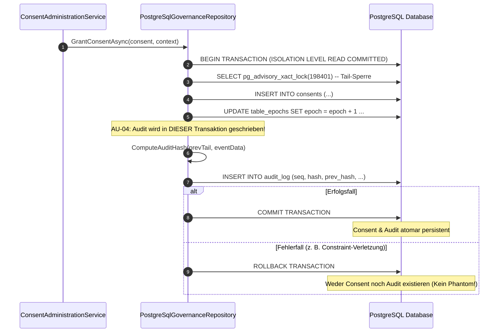

# Architektur- & Implementierungsplan: Lückenloses Zugriffs-Audit & Audit-Architektur-Härtung

**Thema:** Sanierung der Audit-Architektur, kryptografische Verankerung, Transaktionsintegrität und Behebung aller Befunde AU-01 bis AU-19.  
**Referenzen:** [Befunde zur Audit-Architektur](2026-10-09-audit-architektur-befunde.md), [Feature Lückenloses Zugriffs-Audit](2026-10-09-feature-lueckenloses-zugriffs-audit.md), [Umsetzungsplan Zugriffs-Audit](2026-10-09-umsetzungsplan-lueckenloses-zugriffs-audit.md)  
**Status:** Detaillierter Architekturplan / Bereit zur Umsetzung  

---

## 1. Übersicht & Zielsetzung

Die Audit-Architektur von Autheris bildet das regulatorische Fundament für Nachweisbarkeit (Art. 30/15 DSGVO, NIS-2, ISO 27001, SOC 2). Das Subsystem garantiert, dass jede Abfrage, Richtlinienänderung und Einwilligung manipulationssicher in einer kryptografisch verketteten Hash-Kette (HMAC-SHA256, WORM-Dateien, Anker) protokolliert wird.

In der Architektur-Review wurden 19 konkrete Befunde (7 Hoch, 6 Mittel, 6 Niedrig) identifiziert. Dieser Plan spezifiziert die systematische Behebung aller Schwachstellen, die Vereinheitlichung über alle drei Datenbank-Anbieter (SQLite, PostgreSQL, SQL Server) und die Härtung gegen Datenverlust und Manipulation.

---

## 2. Matrix aller Befunde (AU-01 bis AU-19)

| ID | Schwere | Status | Kernursache | Architektur-Lösung |
|---|---|---|---|---|
| **AU-01** | Hoch | CONFIRMED | Standard-Anker bei PG/MS nur im RAM (TOFU bei Neustart) | Startabbruch (Fail-Closed) außerhalb von Dev ohne persistenten Anker-Pfad oder KMS-Signer. |
| **AU-02** | Hoch | CONFIRMED | HMAC-Schlüssel und Anker-Signatur in derselben Vertrauensdomäne | Trennung: Asymmetrischer Signer (`IChainAnchorSigner`, RSA/ECDSA via KMS) mit getrenntem Auditor-Key. |
| **AU-03** | Hoch | CONFIRMED | Leerer Umgebungsname gilt als Dev; statische Fallback-Schlüssel | Leerer/null Env-Name wird strikt als `Production` gewertet; statische Schlüssel aus Code entfernt. |
| **AU-04** | Hoch | CONFIRMED | Audit vor Geschäfts-Commit auf separater DB-Verbindung (Phantome) | Transaktionale Kopplung: Audit-Insert läuft in derselben aktiven Transaktion (`existingTx`). |
| **AU-05** | Hoch | CONFIRMED | Tier-B-Stapel geht bei Fehler verloren; Flag nie zurückgesetzt | Dead-Letter-Queue (`AUDIT_DEAD_LETTER`), Exponential-Backoff & Self-Healing-Health-Probe. |
| **AU-06** | Hoch | CONFIRMED | Rohes SQL enthält Literale (PII) ohne Längenbegrenzung | AST-Anonymisierung von Literalen (`@p_redacted`), Hash des Originals, 4 KB Begrenzung. |
| **AU-07** | Hoch | CONFIRMED | SQL Server schneidet Parameter still ab (falscher Kettenbruch) | Validierung vor Hashing, Umstellung auf `NVARCHAR(MAX)` für SQL- und Detail-Spalten. |
| **AU-08** | Mittel | CONFIRMED | Tote Konfigurationsschlüssel (Retention, Elastic, WORM) | Bereinigung toter Optionen; explizite WORM-Export-Routine. |
| **AU-09** | Mittel | CONFIRMED | Health-Check erkennt Teilausfälle nicht (bis 24 h Latenz) | `IAuditHealth`-Schnittstelle; Fehlerzustand 3 & Timeout führen zu sofortigem Readiness 503. |
| **AU-10** | Mittel | CONFIRMED | Drei unterschiedliche Implementierungen (PG, MS, SL) | Gemeinsamer Audit-Kern (`AuditCanonicalizer`), einheitliche Vertragstests. |
| **AU-11** | Mittel | SUSPECTED | Mandantentrennung bei `null`, stille Kappung bei 5000 | `tenantId` nicht-nullable erzwingen; Truncation-Flag im API-Ergebnis. |
| **AU-12** | Mittel | CONFIRMED | Hintergrund-Task startet vor Schlüssel-Initialisierung | Startreihenfolge korrigiert: Start erst nach vollständiger DI-/Key-Initialisierung. |
| **AU-13** | Mittel | SUSPECTED | Kettenbruch-Fehlalarm nach Datenbank-Failover/Restore | Status-Differenzierung („DB hinter Anker“ vs. „Manipulation“); Admin-Verfahren. |
| **AU-14** | Niedrig | CONFIRMED | Anker-Aktualisierung nicht atomar; WORM-Dateien unbegrenzt | Atomares Update (CAS/Tx); Rotations- und Bereinigungsstrategie für WORM. |
| **AU-15** | Niedrig | CONFIRMED | `occurred_at` nicht monoton zu `seq`; Zeitzonen-Versatz | Sequenznummer als primäre Ordnung; deterministisches UTC (`DateTimeOffset.UtcNow`). |
| **AU-16** | Niedrig | CONFIRMED | SQLite verlässt sich auf `rowid`; `seq` nullable | SQLite-Schema mit `seq INTEGER NOT NULL UNIQUE`, kein Rechnen über rohe `rowid`. |
| **AU-17** | Niedrig | CONFIRMED | Optionaler Audit-Writer überspringt Audit stumm | Außerhalb von Development zwingender Audit-Writer; Fail-Closed bei Fehlen. |
| **AU-18** | Niedrig | CONFIRMED | Widersprüche in Doku (arc42, Runbook, Code) | Harmonisierung der Dokumentation (HMAC-SHA256, WORM, Trigger). |
| **AU-19** | Niedrig | CONFIRMED | Leere Catch-Blöcke in Dispose/Drain | Strukturiertes Logging und Metrics-Inkrement bei Ausnahmen im Audit-Drain. |

---

## 3. Technische Detailspezifikation

### 3.1 AU-01 & AU-03: Startup Fail-Closed & Umgebungsvalidierung

- **Komponente:** `src/Autheris.Api/Extensions/GatewayServiceCollectionExtensions.cs` und Repositories.
- **Logik:**
  ```csharp
  var envName = Environment.GetEnvironmentVariable("ASPNETCORE_ENVIRONMENT");
  var isDevOrTest = string.Equals(envName, "Development", StringComparison.OrdinalIgnoreCase) 
                 || string.Equals(envName, "Test", StringComparison.OrdinalIgnoreCase);

  if (!isDevOrTest)
  {
      // Produktion: Leerer Wert gilt zwingend als Produktion!
      if (string.IsNullOrWhiteSpace(options.Audit.ChainAnchorPath) && 
          string.IsNullOrWhiteSpace(options.Audit.ChainAnchorWormDirectory) &&
          options.Audit.ChainAnchorSignerKeyVaultRef == null)
      {
          throw new InvalidOperationException(
              "CRITICAL AUDIT MISCONFIGURATION (AU-01/AU-03): In production environments, " +
              "a persistent audit anchor store (ChainAnchorPath, ChainAnchorWormDirectory, or KMS Signer) " +
              "is mandatory. In-memory anchor stores are strictly prohibited outside Development/Test.");
      }

      if (options.Audit.HmacKeyIsFallback)
      {
          throw new InvalidOperationException(
              "CRITICAL SECURITY VIOLATION: Hardcoded or fallback HMAC audit keys are strictly prohibited in production.");
      }
  }
  ```

---

### 3.2 AU-02: Kryptografische Entkopplung & Asymmetrische KMS-Anker-Signatur

```mermaid
flowchart LR
    subgraph HotPath["Laufender Anwendungsbetrieb (High Throughput)"]
        Event["Audit Event<br/>(seq, payload)"] --> HMAC["HMAC-SHA256 Chaining<br/>K_audit (Symmetrisch)"]
        HMAC --> DB["AUDIT_LOG Tabelle<br/>(hash_chain, prev_hash)"]
    end

    subgraph AnchorService["Periodischer Anker-Dienst (Epoch Snapshot)"]
        DB --> ReadTail["Lese Tail-Eintrag<br/>(tail_seq, tail_hash)"]
        ReadTail --> Manifest["Erzeuge Anchor Manifest V2<br/>(epoch, tail_seq, hash, utc)"]
        Manifest --> KMS["IChainAnchorSigner<br/>(Asymmetrisches RSA/ECDSA via KeyVault/KMS)"]
        KMS --> SignedAnchor["anchor.json.signed<br/>WORM Store & S3"]
    end

    subgraph Auditor["Auditor & Regulator (Offline-Prüfung)"]
        SignedAnchor --> VerifySig["Prüfe Signatur mit Public Key"]
        VerifySig --> VerifyChain["Validiere HMAC-Kette der DB"]
    end
```



- **Schnittstellen-Definition:**
  ```csharp
  public interface IChainAnchorSigner
  {
      Task<SignedAnchorManifest> SignAnchorAsync(AnchorManifest manifest, CancellationToken ct);
  }

  public interface IChainAnchorVerifier
  {
      Task<bool> VerifyAnchorAsync(SignedAnchorManifest signedManifest, CancellationToken ct);
  }

  public sealed record AnchorManifest
  {
      public int Epoch { get; init; }
      public long TailSeq { get; init; }
      public required string TailHash { get; init; }
      public DateTimeOffset TimestampUtc { get; init; }
      public required string TenantId { get; init; }
  }

  public sealed record SignedAnchorManifest
  {
      public required AnchorManifest Manifest { get; init; }
      public required string SignatureAlgorithm { get; init; } // e.g., "RSASSA_PSS_SHA_256"
      public required string SignatureBase64 { get; init; }
      public required string KeyId { get; init; }
      public required string KeyFingerprint { get; init; }
  }
  ```

---

### 3.3 AU-04: Transaktionale Kopplung (Enrolled Transaction Pattern)

- **Problem:** Werden Geschäftsvorfall (`CONSENTS`, `POLICIES`) und Audit-Eintrag auf separaten Verbindungen geschrieben, führt ein Rollback des Geschäftsvorfalls zu Phantom-Audit-Einträgen.
- **Architektonische Lösung:** `RecordAuditEventAsync` nimmt die bestehende Transaktion (`DbTransaction`) entgegen:



---

### 3.4 AU-05: Resiliente Tier-B Pipeline & Self-Healing

```csharp
public sealed class ResilientAuditBuffer
{
    private readonly Channel<AuditEvent> _channel;
    private readonly IAuditDeadLetterRepository _deadLetterRepo;
    private readonly ILogger _logger;
    private volatile bool _isPipelineFaulted;
    private int _consecutiveFailures;

    public async Task ProcessBatchAsync(List<AuditEvent> batch, CancellationToken ct)
    {
        try
        {
            await PersistBatchToDatabaseAsync(batch, ct);
            _consecutiveFailures = 0;
            if (_isPipelineFaulted)
            {
                _isPipelineFaulted = false;
                _logger.LogInformation("AU-05: Audit pipeline recovered successfully. Fault flag cleared.");
            }
        }
        catch (Exception ex)
        {
            _consecutiveFailures++;
            _logger.LogError(ex, "AU-05: Failed to persist audit batch (attempt {Count}).", _consecutiveFailures);

            if (_consecutiveFailures >= 3)
            {
                _isPipelineFaulted = true;
                // Stapel in Dead-Letter-Tabelle schreiben statt zu verwerfen!
                await _deadLetterRepo.WriteToDeadLetterAsync(batch, ex.Message, ct);
                Metrics.Counter("autheris_audit_dead_letter_total").Increment(batch.Count);
            }
        }
    }
}
```

---

### 3.5 AU-06 & AU-07: SQL-Literal-Redaktion & Längen-Sicherheit

- **AU-06 (Datenschutz im Audit):**
  Vor dem Schreiben von SQL-Anfragen in `AUDIT_LOG.details_json` extrahiert der AST-Visitor alle Literale (Strings, Zahlen, E-Mails) und ersetzt sie durch Platzhalter:
  ```sql
  -- Original:
  SELECT * FROM md.customer WHERE email = 'max.mustermann@firma.de' AND balance > 50000;
  -- Im Audit-Log persistiert:
  SELECT * FROM md.customer WHERE email = @p_redacted AND balance > @p_redacted;
  ```
  Zusätzlich wird ein SHA-256 Hash des Original-SQL-Texts als Nachweisattribut gespeichert.
- **AU-07 (SQL Server Spaltengrößen):**
  - Alle Spalten für Details und SQL-Texte werden in SQL Server als `NVARCHAR(MAX)` typisiert.
  - Das Hashing erfolgt strikt über die unveränderten Eingabewerte, um falsche Kettenbrüche durch Treiberschnitte auszuschließen.

---

### 3.6 AU-10: Anbieterneutraler Audit-Kern (`AuditCanonicalizer`)

Die Formatierung und Kanonisierung von Feldern zur Hash-Berechnung wird in eine zentrale Klasse `Autheris.Domain.Audit.AuditCanonicalizer` ausgelagert:
```csharp
public static class AuditCanonicalizer
{
    public static string CanonicalizeField(string? value)
    {
        if (value is null) return "";
        // Einheitliches Escaping über SQLite, PostgreSQL und SQL Server:
        return value.Replace("\\", "\\\\")
                    .Replace("\n", "\\n")
                    .Replace("\r", "\\r")
                    .Replace("\t", "\\t")
                    .Replace("|", "\\p");
    }

    public static string ComputeEntryHash(byte[] hmacKey, long seq, string prevHash, AuditEvent evt)
    {
        var rawPayload = $"{seq}|{prevHash}|{evt.OccurredAt:O}|{CanonicalizeField(evt.TenantId)}|{CanonicalizeField(evt.EventType)}|{CanonicalizeField(evt.Actor)}|{CanonicalizeField(evt.TargetTable)}|{CanonicalizeField(evt.DetailsHash)}";
        using var hmac = new HMACSHA256(hmacKey);
        var hashBytes = hmac.ComputeHash(Encoding.UTF8.GetBytes(rawPayload));
        return Convert.ToHexString(hashBytes).ToLowerInvariant();
    }
}
```

---

## 4. Test- & Validierungsstrategie

1. **Startup-Tests (`AuditAnchorHardeningTests.cs`):**
   - Startup in `Production` ohne Anker bricht ab mit `InvalidOperationException`.
   - Startup in `Production` mit ungesetzter `ASPNETCORE_ENVIRONMENT` bricht ab.
2. **Transaktionstests (AU-04):**
   - Erstellung eines Consents mit provoziertem Fehler bei `IncrementTableEpoch`: Verifikation, dass weder `CONSENTS` noch `AUDIT_LOG` Einträge aufweisen.
3. **Resilienztests (AU-05):**
   - DB-Verbindungsabbruch: Batch wird nach 3 Versuchen in Dead-Letter-Tabelle geschrieben; `autheris_audit_dead_letter_total` erhöht sich.
   - DB-Wiederverfügbarkeit: Pipeline nimmt Betrieb auf, `_isAuditPipelineFaulted` setzt sich zurück.
4. **Kanonisierungs- und Hash-Portabilitätstests:**
   - Ein Datensatz mit Newlines, Reitern und Umlauten liefert unter SQLite, PostgreSQL und SQL Server den identischen Hashwert.

---

## 5. Sicherheitskritische Aspekte & Krypto-Integrität (Security Expert Review)

### 5.1 Bedrohungsmodellierung & Angriffsvektoren auf das Audit-System

| Vektor | Bedrohung (Threat) | Schutzmechanismus (Countermeasure) |
|---|---|---|
| **Ketten-Neuschreiben** | Ein Angreifer mit DBA-Rechten ändert historische Zeilen und berechnet die HMAC-Kette neu. | **Asymmetrische KMS-Anker (AU-02):** Periodische Anker werden in externem HSM/KMS signiert. Der DBA besitzt den privaten Signaturschlüssel nicht. |
| **Phantom-Audit-Angriff** | Ein Angreifer provoziert Rollbacks von Geschäftsaktionen, um falsche Freigaben im Audit vorzutäuschen. | **Transaktionale Kopplung (AU-04):** Audit-Insert und Geschäftsdaten laufen in derselben DB-Transaktion (atomarer Commit/Rollback). |
| **DSGVO Art. 17 Dilemma** | Personenbezogene Daten landen im unveränderlichen Audit-Log und können nicht DSGVO-konform gelöscht werden. | **AST-Literal-Redaktion (AU-06):** SQL wird vor Speicherung parametrisiert (`@p_redacted`). PII berührt die Hash-Kette nie im Klartext. |
| **Silent Log Drop** | Unter Last oder bei DB-Störung werden Audit-Ereignisse still verworfen (Verlust von Nachweisen). | **Resiliente Dead-Letter-Queue (AU-05):** Gesicherte Pufferung in `AUDIT_DEAD_LETTER` und Fail-Closed-Schutz bei Pufferüberlauf. |
| **False Flag Denial of Service** | Treiberschnitte kürzen Spalten und lösen falsche Kettenbruch-Alarme (503 Service Unavailable) aus. | **Pre-Hash Length Guards & NVARCHAR(MAX) (AU-07):** Hashing erfolgt über typengerechte, ungeschnittene Repräsentationen. |

---

### 5.2 Zwingende Vorgaben für die Implementierung

#### 1. Kryptografische Vertrauenszonen-Trennung (AU-01, AU-02, AU-03)
- Der HMAC-Kettenschlüssel (zur kontinuierlichen Verkettung im Millisekundenbereich) und der Anker-Signaturschlüssel (für WORM-Snapshots) müssen in **unterschiedlichen Vertrauensdomänen** liegen:
  - HMAC-Schlüssel: Im Speicher des Gateway-Containers (rotierbar via Vault).
  - Anker-Signaturschlüssel: Asymmetrischer Schlüssel (RSA-4096 oder ECDSA P-256/P-384), dessen privater Schlüssel **niemals** den Key Vault / das HSM (z. B. Azure Key Vault Managed HSM, AWS CloudHSM) verlässt.
- Im Code dürfen **keine festen Fallback-Schlüssel** existieren. Ist kein Schlüssel konfiguriert, schlägt der Start außerhalb von `Development` unweigerlich fehl (`InvalidOperationException`).

#### 2. Transaktionsintegrität (Enrolled Transaction Pattern, AU-04)
- **Problem:** Wenn `RecordAuditEventAsync` eine eigene Verbindung öffnet und sofort committed, entsteht bei einem anschließenden Scheitern des Geschäfts-Commits ein „Phantom-Ereignis“ (z. B. Consent als erteilt geloggt, obwohl die DB den Consent abgelehnt hat).
- **Invariante:** Alle sicherheitsrelevanten Zustandsänderungen (Consent, Profilzuweisung, Filteraktivierung) müssen die transaktionale Signatur nutzen:
  ```csharp
  public Task RecordAuditEventAsync(AuditEvent evt, DbTransaction existingTx, CancellationToken ct);
  ```
  Scheitert die Transaktion, rollt die Datenbank den Geschäftsdatensatz **und** den Audit-Eintrag atomar zurück.

#### 3. DSGVO-Konformität in WORM-Systemen (AU-06)
- Ein unveränderlicher Audit-Trail (Write Once Read Many) steht im inhärenten Konflikt zum Recht auf Vergessenwerden (Art. 17 DSGVO), wenn Abfragen PII enthalten (`WHERE ssn = '123-45-678'`).
- **Architektur-Vorgabe:**
  - Rohes SQL wird durch den `AstSecurityVisitor` geschleust.
  - Alle Literale (Zeichenketten, Zahlen, UUIDs) werden durch `@p_redacted` ersetzt.
  - Das Original-SQL wird gehasht: `DetailsHash = SHA256(OriginalSql + TenantSalt)`.
  - Bei Auskunftsanfragen (Art. 15) kann die Korrelation nachgewiesen werden, ohne dass sensible Klartextdaten dauerhaft im WORM-Log verbleiben.

#### 4. Resilienz & Fail-Closed Richtlinie (AU-05)
- Ein Ausfall des Audit-Speichers darf niemals zur unbemerkten Ausführung unprotokollierter Abfragen führen.
- **Eskalationsstufen:**
  1. *Stufe 1 (Transienter Fehler):* Retry bis zu 3-mal mit exponentiellem Backoff und Jitter.
  2. *Stufe 2 (Dauerfehler DB):* Ausweichspeicherung in lokaler, verschlüsselter Dead-Letter-Tabelle / Datei.
  3. *Stufe 3 (Pufferüberlauf):* Ist die Dead-Letter-Queue voll, schaltet das Gateway für autorisierte Datenabfragen in den Modus **Fail-Closed** (`503 Service Unavailable: Audit Pipeline Faulted`). Es werden keine sensiblen Daten ohne Audit-Garantie ausgeleitet!

