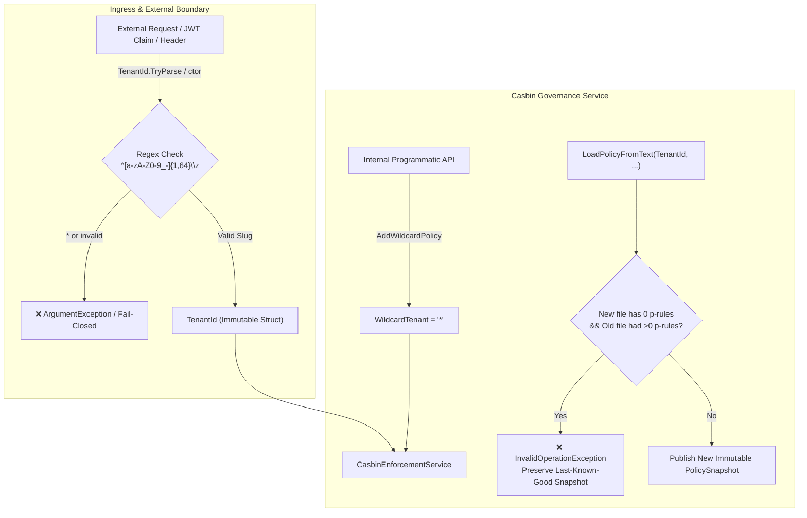

# Architektur- und Implementierungsplan: Mandanten-Sicherheit & Casbin-Härtung (F-1, F-2, F-3, F-5)

**Datum:** 2026-10-07  
**Rolle:** C# & .NET Solution Architect / Security Expert  
**Status:** In Umsetzung (TDD)  
**Referenz:** [docs/plans/status-und-umsetzungsplan-2026-10-07.md](file:///root/autheris/docs/plans/status-und-umsetzungsplan-2026-10-07.md)

---

## 1. Problemstellung & Bedrohungsanalyse

In der aktuellen Sicherheitsarchitektur wurden drei zusammenhängende Schwachstellen im Mandanten- und Policy-Lebenszyklus identifiziert:

1. **F-1 (Fail-Open bei Mandanten-Dateien ohne `p`-Regeln):**
   Wenn eine Mandanten-Policy-Datei nur `g`-Zeilen (Rollenbindungen) enthält (z. B. durch einen unvollständigen Sync oder abgeschnittene Datei), bewertete der Fail-Closed-Check `tenantRules.Length == 0 && tenantGrouping.Length == 0` fälschlicherweise als `false`. Folge: Die bisherigen `p`-Regeln (inklusive expliziter Deny- und RLS-Filter) für diesen Mandanten wurden stillschweigend gelöscht, wodurch unautorisierte Zugriffe fail-open freigegeben werden konnten.

2. **F-2 (Zu strenger globaler E-1 Check):**
   Beim globalen Reload prüfte `oldSources.HasAnyPolicies`, wodurch aktive Mandantenregeln fälschlicherweise dazu führten, dass ein globaler Reload von reinen Rollendefinitionen abgewiesen wurde.

3. **F-3 (External Wildcard Tenant `*` Leak):**
   Der Typ `TenantId` akzeptierte über seine Regex `^([a-zA-Z0-9_-]{1,64}|\*)\z` das Zeichen `*`. Dadurch konnten Clients, Claims oder Upstreams ein `*` als Mandanten einschleusen. Zudem existierte `public static readonly TenantId Wildcard = new("*");`.
   **Ziel:** Strikte Beschränkung des Wertes `*` rein auf den internen Casbin-Matcher; externe Mandanten müssen ausnahmslos der Whitelist `^[a-zA-Z0-9_-]{1,64}\z` entsprechen.

4. **F-5 (Heap-Allokation in Hot-Path `HasPolicies`):**
   `PolicySnapshot.HasPolicies(tenant)` rief pro Request `e.GetPolicy().Any()` auf, was in Casbin.NET eine vollständige Allokation/Kopie der Regelliste triggerte. Da `Rules` bereits alle kompilierten Regeln enthält, kann dies allokationsfrei über das Dictionary gelöst werden.

---

## 2. Architektonische Leitplanken & Ziel-Design



---

## 3. Detaillierte Umsetzungsschritte (TDD-Vorgehen)

### Phase 1: Test-First (Rote Tests etablieren)
1. **F-1 Test:**
   - In `CasbinSnapshotImmutabilityTests.cs`:
     `Test11_F1_TenantFileWithOnlyGroupingRulesWhenPoliciesActive_ThrowsInvalidOperationException_AndPreservesSnapshot`:
     Tenant `tenant-a` hat aktive `p`-Regeln. Ein Reload mit nur `g, alice, role:viewer` muss eine `InvalidOperationException` werfen und die bestehenden `p`-Regeln intakt lassen.
2. **F-3 Tests:**
   - In `ComprehensiveSecurityAttackVectorTests.cs`:
     `[InlineData("*")]` in die Theory der unzulässigen Mandanten-IDs aufnehmen.
   - In `DomainAndModelEdgeCasesTests.cs`:
     Testen, dass `new TenantId("*")` und `TenantId.TryParse("*", ...)` fehlschlagen.
   - In `CasbinModelContractTests.cs`:
     Probe `W6` verifizieren (Mandant `probe_a` mit Request-Mandant `*` muss `false` ergeben).
3. **F-2 Test:**
   - In `CasbinSnapshotImmutabilityTests.cs`:
     Globaler Reload mit reinen `g`-Zeilen ist zulässig, wenn die globale Vorgänger-Policy keine `p`-Regeln hatte, selbst wenn Mandanten eigene `p`-Regeln besitzen.

### Phase 2: Implementierung (Grüne Tests)
1. **`TenantId.cs`:**
   - Regex härten: `^[a-zA-Z0-9_-]{1,64}\z`.
   - `TenantId.Wildcard` entfernen.
   - Exception-Text anpassen.
2. **`CasbinEnforcementService.cs`:**
   - `internal const string WildcardTenant = "*";` (und als `public const string` für Governance-Tests freigeben).
   - `AddWildcardPolicy(...)` und `AddWildcardRoleForUser(...)` implementieren.
   - `LoadPolicyFromText(TenantId, ...)`: F-1 Guard prüfen:
     ```csharp
     bool hadRules = oldSources.TenantFiles.TryGetValue(tenant.Value, out var oldR) && oldR.Length > 0;
     if (tenantRules.Length == 0 && hadRules)
     {
         _logger?.LogWarning("Casbin tenant policy reload rejected: the new policy set has no 'p' rules while active policies exist for tenant {Tenant}. Preserving last-known-good.", tenant.Value);
         throw new InvalidOperationException($"Casbin policy reload rejected: the new policy set has no 'p' rules while active policies exist for tenant '{tenant.Value}'. The last-known-good policy set remains active.");
     }
     ```
   - `LoadPolicyFromText(string)`: F-2 Guard prüfen (nur alte globale `p`-Regeln vergleichen).
   - `PolicySnapshot.HasPolicies(string)`: F-5 Allokation eliminieren (`GetPolicy()` entfernen).
3. **`CasbinModelContract.cs`:**
   - Probe `W6` zu `WildcardSafetyProbes` hinzufügen.
4. **Bestehende Tests anpassen:**
   - `CasbinHotReloadTests.cs`: `t == tenant.Value` bei Event-Subskriptionen verwenden.
   - `CasbinSnapshotImmutabilityTests.cs:Test09`: `AddWildcardPolicy` aufrufen.

### Phase 3: Verifikation & Regressionstests
- Ausführen aller Unit-, Architektur- und Ende-zu-Ende-Tests.
- Verifizieren: 100% green.

### Phase 4: Code Review & Commit
- Diff-Prüfung gegen OWASP Top 10, Injection, Fail-Closed und Thread-Safety.
- Atomarer Git-Commit.
