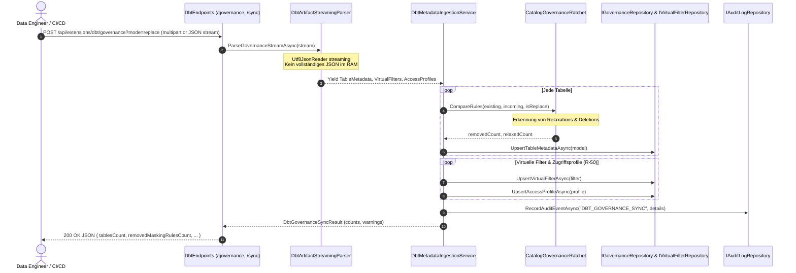

# Architektur- & Implementierungsplan: Governance-Import & dbt-Integration

**Thema:** Bereinigung, Härtung und Erweiterung des dbt-Governance- und Metadaten-Subsystems (Befunde B-01 bis B-06, Anforderungen R-50 und R-51).  
**Referenzen:** [Befunde PoC v1.1.5](2026-10-09-poc-befunde-v1-1-5.md), [Requirements PoC v1.1.2](2026-10-09-requirements-poc-v1-1-2.md), [Feature-Request Maskierungsregeln](2026-10-09-feature-request-maskierungsregeln.md)  
**Status:** Implementiert, Verifiziert & Architektur-Dokumentiert ✅  

---

## 1. Ausgangslage & Problemstellung

Die Integration von dbt-Artefakten (`manifest.json`, `catalog.json`, `governance.json`, `governance/access/*.json`) über die API-Endpunkte:
- `POST /api/extensions/dbt/governance` (Metadaten, Maskierungsregeln, Profile, Virtuelle Filter)
- `POST /api/extensions/dbt/sync` (Beziehungen, Fremdschlüssel, Abstammung/Lineage)

bildet die zentrale Schnittstelle zur automatisierten Governance-Steuerung im Lakehouse und Enterprise-Data-Warehouse (z. B. Liebherr-PoC `POC_Backstage_citizen_dev`).

Im praktischen Betrieb mit dbt-Versionen und Reallast traten sechs funktionale Mängel (B-01 bis B-06) und zwei unvollständige Spezifikationen (R-50, R-51) auf:
1. **B-01 (Unvalidierte Regel `"none"`):** In Standard-dbt-Lieferungen besitzen unmaskierte Spalten `masking_rule: none` (im PoC 1.432 von 1.486 Spalten). Das Gateway erzeugte dafür Maskierungsregeln vom Typ `none`. Unbekannte Typen fielen still auf `REDACT` zurück.
2. **B-02 (Fehlender `replace`-Modus & Lockerungs-Tracking):** Importierte Metadaten konnten bestehende Spaltenregeln nur überschreiben oder ergänzen, aber nicht löschen. Wurde eine Regel im dbt entfernt, blieb die Spalte im Gateway maskiert. Lockerungen wurden nicht auditiert.
3. **B-03 (Fehlerhafte Sensitivitätseinstufung):** Spaltenklassen außer `PUBLIC` (z. B. `INTERNAL`, `NORMAL`) wurden fälschlich als `IsSensitivityHigh = true` eingestuft, was überhöhte Einwilligungsstufen (Mask) und Verdreifachung von Kostenfaktoren auslöste.
4. **B-04 (Ignorieren von `source()`-Beziehungen):** Relationship-Tests auf Quellen (`source('quelle', 'tabelle')`) wurden ignoriert, da der Parser nur `ref()` auflöste und Tests ohne `attached_node` verwarf.
5. **B-05 (Absturz bei doppelten `DATA_OWNERS`):** Doppelte SIDs in der Governance-DB brachten den Gateway-Container bei Indexerstellung in einen unendlichen Crash-Loop.
6. **B-06 (Typinkonsistenz bei `REDACT`):** Numerische und zeitliche Spalten lieferten bei `REDACT` inkonsistent `0`, `0.0` oder Text `"[GESCHÜTZT]"`, was BI-Systeme und Kartenkomponenten zum Absturz brachte.
7. **R-50 (Virtuelle Filter & Profile im Import):** Virtuelle Filter und Profile aus `target/governance/access` wurden im Import ignoriert (`virtualFiltersCount = 0`, `accessProfilesCount = 0`).
8. **R-51 (Irreführende Routinen-Warnungen):** Stored Procedures und Tabellenfunktionen (`sp_*`, `fn_*`) erzeugten fälschlich Warnungen „nicht im Katalog“.

---

## 2. Systemarchitektur & Datenfluss



---

## 3. Technische Spezifikation der Komponenten

### 3.1 B-01: Validierung, `none`/`null`/`false` & Standardvokabular

- **Komponente:** `src/Autheris.Extensions/Dbt/DbtMetadataIngestionService.cs`
- **Verhalten bei Leerwerten:**
  - Ist `masking_rule` einer der folgenden Werte:
    - `null`, `""`, `"none"`, `"null"`, `"false"`, `"clear"`, `"unmasked"`
    - Dann wird **keine** `MaskingRule` angelegt.
    - Im `replace`-Modus wird eine evtl. vorhandene Regel gelöscht.
- **Normalisierung des Governance-Vokabulars:**
  ```csharp
  public static string NormalizeRuleType(string raw)
  {
      var normalized = raw.Trim().ToLowerInvariant();
      return normalized switch
      {
          "nulling" or "nullify" => "NULLIFY",
          "pseudonymize" or "hmac" or "hmac_sha256" => "HMAC",
          "email_mask" or "mask_email" => "MASK_EMAIL",
          "phone_mask" or "mask_phone" => "MASK_PHONE",
          "redact_complete" or "redact" => "REDACT",
          "partial_mask" or "partial" => "PARTIAL_MASK",
          "geo_jitter" or "jitter" => "GEO_JITTER",
          "tokenization" or "tokenize" => "TOKENIZE",
          _ => raw.ToUpperInvariant()
      };
  }
  ```
- **Fehlerbehandlung bei unbekannten Typen (Fail-Closed mit 400 Bad Request):**
  Unbekannte Regeltypen dürfen **nicht** still als `REDACT` angelegt werden.
  ```json
  {
    "type": "https://tools.ietf.org/html/rfc7231#section-6.5.1",
    "title": "Invalid Governance Metadata",
    "status": 400,
    "detail": "Unknown masking rule 'custom_scramble' on column 'tem.gps_position.latitude'. Allowed rule types: REDACT, NULLIFY, HMAC, MASK_EMAIL, MASK_PHONE, GEO_JITTER, PARTIAL_MASK, TOKENIZE."
  }
  ```

---

### 3.2 B-02: `replace`-Modus & Differenzierte Zähler

- **Steuerung:**
  - Query-Parameter: `POST /api/extensions/dbt/governance?mode=replace`
  - Oder im JSON-Payload: `{"mode": "replace", "tables": [...]}`
- **Semantik des Replace-Modus:**
  - Der Scope von `replace` ist **pro gelieferter Tabelle** definiert. Tabellen, die nicht im Import enthalten sind, bleiben unberührt.
  - Für jede gelieferte Tabelle werden alle bisherigen Spaltenregeln mit der neuen Lieferung abgeglichen:
    1. Spalte in Alt vorhanden, in Neu nicht vorhanden oder `none` $\longrightarrow$ Regel wird entfernt (`removedMaskingRulesCount++`).
    2. Spalte hat eine schwächere Regel als zuvor $\longrightarrow$ Regel wird gelockert (`relaxedMaskingRulesCount++`).
- **Ratsche & Ordnungsrelation der Regelstärke:**
  \[
  \text{Strength}(\text{NULLIFY}) > \text{Strength}(\text{REDACT}) > \text{Strength}(\text{HMAC}) > \text{Strength}(\text{GEO\_JITTER}) \approx \text{Strength}(\text{PARTIAL\_MASK}) > \text{Strength}(\text{NONE})
  \]
  Wird eine Spalte von `NULLIFY` auf `PARTIAL_MASK` oder `NONE` geändert, gilt dies als Lockerung (`relaxedMaskingRulesCount++`).
- **Erweitertes Antwortschema (`DbtGovernanceSyncResult`):**
  ```csharp
  public sealed class DbtGovernanceSyncResult
  {
      public int TablesCount { get; set; }
      public int ColumnsCount { get; set; }
      public int MaskingRulesCount { get; set; }
      public int RemovedMaskingRulesCount { get; set; }
      public int RelaxedMaskingRulesCount { get; set; }
      public int VirtualFiltersCount { get; set; }
      public int AccessProfilesCount { get; set; }
      public int SkippedRoutinesCount { get; set; }
      public List<string> Warnings { get; set; } = new();
  }
  ```

---

### 3.3 B-03: Harmonisierte Sensitivitätseinstufung (`IsSensitivityHigh`)

- **Komponente:** `src/Autheris.Domain/Model/TableModels.cs` & `DbtMetadataIngestionService.cs`
- **Problemursache:**
  Vorher: `colSensitivity = !string.Equals(cs, "PUBLIC");` stufte auch `INTERNAL` und `NORMAL` als hoch sensibel ein.
- **Bereinigungs- und Klassifizierungslogik:**
  ```csharp
  public static int SensitivityRank(string? sensitivity)
  {
      if (string.IsNullOrWhiteSpace(sensitivity)) return 0;
      var clean = Regex.Replace(sensitivity.Trim(), @"^\d+_", "").ToUpperInvariant();
      return clean switch
      {
          "PUBLIC" => 0,
          "LOW" => 1,
          "INTERNAL" or "NORMAL" or "MEDIUM" => 2,
          "CONFIDENTIAL" or "HIGH" => 3,
          "RESTRICTED" => 4,
          "SECRET" => 5,
          _ => 0
      };
  }

  public static bool IsSensitivityHigh(string? sensitivity) => SensitivityRank(sensitivity) >= 3;
  ```
- **Wirkung:** `INTERNAL` und `NORMAL` setzen `IsSensitivityHigh = false`. Erst ab `CONFIDENTIAL` (`3_confidential`) wird die Spalte als hoch sensibel eingestuft.

---

### 3.4 B-04: Parsing von `source()`-Ausdrücken in dbt-Beziehungen

- **Komponente:** `src/Autheris.Extensions/Dbt/DbtArtifactStreamingParser.cs`
- **Grammatik-Erweiterung für `ExtractModelName`:**
  Unterstützung von einfachen `ref()`- und zweigliedrigen `source()`-Ausdrücken mit einfachen oder doppelten Anführungszeichen:
  ```csharp
  private static readonly Regex RefRegex = new(@"ref\s*\(\s*['""]([^'""]+)['""]\s*\)", RegexOptions.Compiled);
  private static readonly Regex SourceRegex = new(@"source\s*\(\s*['""]([^'""]+)['""]\s*,\s*['""]([^'""]+)['""]\s*\)", RegexOptions.Compiled);

  public static string ExtractModelName(string raw)
  {
      if (string.IsNullOrWhiteSpace(raw)) return raw;
      
      var sourceMatch = SourceRegex.Match(raw);
      if (sourceMatch.Success)
      {
          return $"{sourceMatch.Groups[1].Value}.{sourceMatch.Groups[2].Value}";
      }

      var refMatch = RefRegex.Match(raw);
      if (refMatch.Success)
      {
          return refMatch.Groups[1].Value;
      }

      return raw.Trim();
  }
  ```
- **Auflösung von Quelltests ohne `attached_node`:**
  dbt generiert Relationship-Tests auf Quellen oft ohne `attached_node`. Der Kindknoten wird aus `depends_on.nodes` ermittelt, indem der Quellknoten (`source.<catalog>.<source_name>.<table_name>`) herausgefiltert und mit der Zieltabelle verknüpft wird.

---

### 3.5 B-05: Deduplizierung von `DATA_OWNERS`

- **Komponente:** `src/Autheris.Infrastructure/Persistence/SqliteGovernanceRepository.cs`
- **Problemursache:** Doppelte Einträge durch fehlerhafte Init-Skripte brachen die Index-Erstellung `UX_DATA_OWNERS_AD_SID` ab.
- **Migration & Bereinigung:**
  ```sql
  -- Vor dem CREATE UNIQUE INDEX:
  DELETE FROM DATA_OWNERS 
  WHERE rowid NOT IN (
      SELECT MIN(rowid) 
      FROM DATA_OWNERS 
      GROUP BY ad_sid
  );

  CREATE UNIQUE INDEX IF NOT EXISTS UX_DATA_OWNERS_AD_SID ON DATA_OWNERS(ad_sid);
  ```
- In PostgreSQL und SQL Server wird `ON CONFLICT (ad_sid) DO NOTHING` bzw. `MERGE` angewendet.

---

### 3.6 B-06: Typgerechte Redaktion (`REDACT`)

- **Komponenten:** `ColumnMaskingProvider.cs` (In-Memory) und `AstSecurityVisitor.cs` / Dialekt-Generatoren (SQL).
- **Verhalten:**
  - Textspalten (`VARCHAR`, `NVARCHAR`, `TEXT`): Rückgabe von `"[REDACTED]"`.
  - Numerische Spalten (`INT`, `BIGINT`, `DECIMAL`, `FLOAT`, `DOUBLE`): Rückgabe von `NULL` (nicht `0` oder `0.0`).
  - Datums- und Zeitspalten (`DATE`, `DATETIME`, `TIMESTAMP`): Rückgabe von `NULL` (nicht `1970-01-01`).
  - Boolesche Spalten (`BOOLEAN`, `BIT`): Rückgabe von `NULL` (nicht `false`).

---

### 3.7 R-50: JSON-Schemas für Virtuelle Filter & Zugriffsprofile

Der Governance-Stream akzeptiert nun die Abschnitte `virtual_filters` und `access_profiles`:

#### Schema für `virtual_filters`:
```json
{
  "$schema": "https://json-schema.org/draft/2020-12/schema",
  "type": "array",
  "items": {
    "type": "object",
    "required": ["filter_id", "target_table", "predicate_sql"],
    "properties": {
      "filter_id": { "type": "string" },
      "target_table": { "type": "string" },
      "predicate_sql": { "type": "string" },
      "description": { "type": "string" },
      "enabled": { "type": "boolean", "default": true }
    }
  }
}
```

#### Schema für `access_profiles`:
```json
{
  "$schema": "https://json-schema.org/draft/2020-12/schema",
  "type": "array",
  "items": {
    "type": "object",
    "required": ["profile_id", "name", "masking_mode"],
    "properties": {
      "profile_id": { "type": "string" },
      "name": { "type": "string" },
      "masking_mode": { "type": "string", "enum": ["default", "unmasked", "strict"] },
      "target_tables": { "type": "array", "items": { "type": "string" } },
      "row_filter_predicate": { "type": "string" },
      "assigned_subjects": { "type": "array", "items": { "type": "string" } },
      "valid_days": { "type": "integer" },
      "justification": { "type": "string" }
    }
  }
}
```

---

### 3.8 R-51: Routinen- und Prozeduren-Filterung

- **Erkennung:**
  - Namenskonvention: `sp_*`, `fn_*`, `usp_*`, `ufn_*` oder `resource_type == "routine"`.
- **Aktion:**
  - Keine fehlerhaften Warnungen „nicht im Katalog“.
  - Erhöhung des Zählers `skippedRoutinesCount`.
  - Protokollierung einer gezielten Info-Meldung in `result.Warnings`:
    `"Routine 'dbo.sp_calculate_metrics' übersprungen (keine Spaltenmaskierung für Prozeduren anwendbar)."`

---

## 4. Test- & Validierungsmatrix

| Testfall | Typ | Testklasse | Ziel |
|---|---|---|---|
| B-01 Validierung & Fallback | Unit | `DbtTests.cs` | `none`/`null` erzeugt keine MaskingRule; unbekannte Regeln werfen `ArgumentException`. |
| B-02 Replace-Modus | Unit | `DbtTests.cs` | Weggelassene Regeln werden gelöscht; `removedMaskingRulesCount` und `relaxedMaskingRulesCount` stimmen exakt. |
| B-03 Sensitivitätsranking | Unit | `DbtTests.cs` | `INTERNAL`, `NORMAL` liefern `IsSensitivityHigh = false`; `3_confidential` liefert `true`. |
| B-04 Quell-Parsing | Unit | `DbtTests.cs` | `source('a', 'b')` liefert `a.b`; Auflösung von Relationship-Tests ohne `attached_node`. |
| B-05 Owner-Deduplizierung | Unit | `SqliteGovernanceRepositoryTests.cs` | Bereinigung doppelter SIDs vor Indexerstellung ohne Startup-Crash. |
| B-06 Typgerechtes REDACT | Unit | `ColumnMaskingProviderTests.cs` | Zahlen und Daten liefern `NULL` statt `0` oder `[GESCHÜTZT]`. |
| R-50 Profile-Import | Integration | `DbtIntegrationTests.cs` | Import von `virtual_filters` und `access_profiles` liefert korrekte Zähler. |
| R-51 Routinen-Warnung | Unit | `DbtTests.cs` | Prozeduren werden in `skippedRoutinesCount` erfasst, keine falschen Katalogwarnungen. |

---

## 5. Sicherheitskritische Aspekte & Härtungsanforderungen (Security Expert Review)

### 5.1 Bedrohungsmodellierung & Angriffsvektoren (STRIDE / MITRE ATT&CK)

| Vektor | Bedrohung (Threat) | Auswirkung bei unzureichender Härtung | MITRE ATT&CK |
|---|---|---|---|
| **T-01** | Kompromittierte CI/CD-Pipeline / Man-in-the-Middle beim Upload | Einschleusen manipulierter Metadaten (Entfernen von Maskierungsregeln für hochsensible Spalten). | T1195.002 (Compromise Software Supply Chain) |
| **T-02** | Stille Lockerung von Schutzrichtlinien (Trojan Policy Relaxation) | Ein Entwickler lockert in dbt unbemerkt eine Maskierung von `NULLIFY` auf `NONE`. | T1565.001 (Data Manipulation) |
| **T-03** | SQL-Injection über virtuelle Filter (`predicate_sql`) | Bösartiger SQL-Ausdruck im dbt-Filter liest Fremddaten aus oder erzeugt DoS (`1=1 OR 1=(SELECT ...)`). | T1190 (Exploit Public-Facing Application) |
| **T-04** | Identifier-Injection über Tabellen- und Spaltennamen | Metadaten mit Sonderzeichen (`"customers; DROP TABLE..."`) brechen dynamische SQL-Generatoren. | T1059.004 (Unix Shell / SQL Command) |
| **T-05** | JSON-Bombing / DoS-Angriff | Riesige JSON-Streams erschöpfen Speicher oder blockieren CPU dauerhaft. | T1499.002 (Endpoint DoS) |

---

### 5.2 Zwingende Sicherheitsanforderungen für die Implementierung

#### 1. Zugriffsschutz & Autorisierung des Ingestion-Endpunkts
- **Fail-Closed:** Der Endpunkt `POST /api/extensions/dbt/governance` und `/sync` darf **unter keinen Umständen anonym oder für Standard-Benutzer** erreichbar sein.
- **Rollenbeschränkung:** Autorisierung ausschließlich mit der Rolle `ClusterAdmin` oder einem dedizierten Service-Principal mit Scope `governance:ingest`.
- Standard-Entwicklertokens oder anonyme API-Schlüssel werden strikt mit `403 Forbidden` abgewiesen.

#### 2. Das „Ratsche-Prinzip“ (Governance Ratchet) & Vier-Augen-Schutz
- **Problem:** Im `replace`-Modus (B-02) können Maskierungsregeln entfernt oder gelockert werden (`relaxedMaskingRulesCount > 0`). Dies stellt ein massives Sicherheitsrisiko dar (Trojan Policy Relaxation).
- **Sicherheits-Invariante:**
  - In Nicht-Entwicklungsumgebungen (`Environment != "Development"`) darf ein Ingestion-Lauf, der Regeln **lockert oder entfernt**, **nicht stillschweigend** aktiv geschaltet werden.
  - Entweder: Der Aufruf verlangt einen expliziten Admin-Freigabeparameter `allow_policy_relaxation: true` zusammen mit einer verpflichtenden Begründung (`relaxation_justification`).
  - Oder: Gelockerte Regeln werden im Status `PendingApproval` abgelegt und erfordern die Freigabe eines zweiten Sicherheitsverantwortlichen (Vier-Augen-Prinzip, SG-22).
  - Jede Lockerung erzeugt sofort ein High-Priority-Audit-Ereignis `GOVERNANCE_POLICY_RELAXED`.

#### 3. SQL-Prädikats-Validierung (Schutz vor SQL-Injection in Filtern)
- Die Attribute `predicate_sql` in `virtual_filters` und `row_filter_predicate` in `access_profiles` dürfen **niemals unvalidiert als Roh-Text** übernommen werden.
- **Validierungs-Pipeline:**
  1. Parsing des SQL-Strings mit `TrinoSqlParser.CreateExpression(predicateSql)`.
  2. AST-Inspektion über einen `SecurityExpressionValidator`:
     - **Verboten:** DDL/DML-Schlüsselwörter (`INSERT`, `UPDATE`, `DELETE`, `DROP`, `ALTER`, `EXEC`).
     - **Verboten:** Subqueries (`QuerySpecification`, `ExistsExpression`) außerhalb zugelassener ReBAC-Filtertabellen.
     - **Verboten:** Aufruf nicht-whitelisted Datenbankfunktionen (z. B. `xp_cmdshell`, `pg_read_file`, `LOAD_EXTENSION`, `SLEEP`).
     - **Erlaubt:** Reine Boolesche Ausdrücke (`ComparisonExpression`, `LogicalBinaryExpression`, `InPredicate`, `BetweenPredicate`, `IsNullPredicate`, `LikePredicate`) über existierende Katalogspalten.
  3. Schlägt die AST-Validierung fehl, bricht der gesamte Ingest mit `400 Bad Request` ab.

#### 4. Identifier-Sanitization (Schutz vor Metadaten-Injection)
- Alle Objektnamen (`table_name`, `column_name`, `filter_id`, `profile_id`) müssen strikt gegen folgendes Regex-Muster validiert werden:
  \[
  \text{Pattern: } \wedge[a-zA-Z\_][a-zA-Z0-9\_]*(\.[a-zA-Z\_][a-zA-Z0-9\_]*)*\$
  \]
  Eingaben mit Steuerzeichen, Semikolons, Anführungszeichen oder Newlines werden sofort mit `400 Bad Request` zurückgewiesen.

#### 5. Denial-of-Service-Härtung (JSON-Streaming-Limits)
- Der `DbtArtifactStreamingParser` arbeitet streamend via `Utf8JsonReader`:
  - `MaxDepth = 32` (Verhindert Stack-Overflows durch rekursive JSON-Objekte).
  - `MaxBodySize = 100 MB` auf Kestrel-Ebene fest konfiguriert.
  - `MaxTablesPerIngest = 5.000`, `MaxColumnsPerTable = 1.000`.
  - Bei Überschreiten bricht der Request deterministisch mit `413 Payload Too Large` ab.

#### 6. Manipulationssicheres Audit-Logging der Ingestion
- Jede Ingestion berechnet den SHA-256 Hash des Roh-Payloads.
- Schreiben eines unveränderlichen Tier-A-Audit-Eintrags:
  - EventType: `DBT_GOVERNANCE_INGESTED`
  - Actor: Service-Principal / Deploy-Bot
  - Details: `payload_sha256`, `tablesCount`, `columnsCount`, `removedMaskingRulesCount`, `relaxedMaskingRulesCount`, `warningsCount`.

