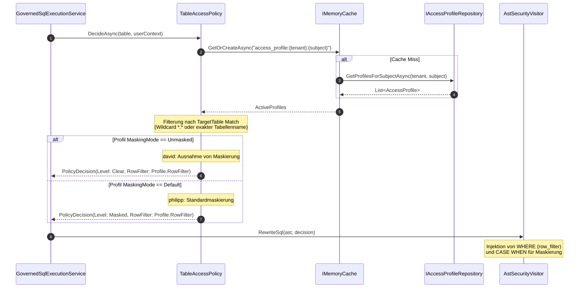

# Architektur- & Implementierungsplan: Klartext je Person & Deklarative Zugriffsprofile

**Thema:** Deklarative Zugriffsprofile, Klartext-Ausnahmen je Subjekt über die API und Audit-Verankerung (Feature-Requests R-52 und R-50).  
**Referenzen:** [Feature-Request Klartext je Person](2026-10-09-feature-request-klartext-je-person.md), [Befunde PoC v1.1.5](2026-10-09-poc-befunde-v1-1-5.md), [Feature-Request Maskierungsregeln](2026-10-09-feature-request-maskierungsregeln.md)  
**Status:** Detaillierter Architekturplan / Bereit zur Umsetzung  

---

## 1. Ausgangslage & Problemstellung

Im Enterprise-PoC (`POC_Backstage_citizen_dev`, Liebherr-Telemetriedaten) besteht die Kernanforderung zweier gegensätzlicher Benutzerrollen mit identischem Zeilenfilter:
- **`david` (Fachbereichsleiter Telemetrie):** Sieht für alle freigegebenen Objekte (z. B. ungelieferte Krane mit Zeilenfilter `status != 'DELIVERED'`) **alle Attribute im Klartext** (Ausnahme von der Maskierung).
- **`philipp` (Analyst):** Unterliegt derselben Zeilenfreigabe (`status != 'DELIVERED'`), muss jedoch zwingend den hinterlegten **Maskierungsregeln** unterliegen (`GEO_JITTER` auf GPS-Koordinaten, `PARTIAL_MASK` auf Kundennummern).

### Die bisherige Behelfslösung im PoC
Ein Python-Skript (`grant_row_scoped_user.py`) schreibt bei gestopptem Gateway-Container Zeilen direkt in die SQLite-Governance-DB:
- Je Tabelle ein Eintrag in `CONSENTS` mit dem Zeilenfilter.
- Je Spalte ein Eintrag in `CONSENT_COLUMN_RULES` mit Zugriffsstufe `Clear = 2` für `david` und `Mask = 1` für `philipp`.

### Gravierende Nachteile des bisherigen Vorgehens:
1. **Kein API-Weg:** Erfordert direkten Dateizugriff auf SQLite und Stoppen des Containers.
2. **Keine Audit-Einträge:** Das Anlegen von Klartext-Ausnahmen erzeugt kein `CONSENT_GRANTED` im WORM-/HMAC-Audit-Log.
3. **Mangelnde Skalierbarkeit & Wartbarkeit:** Bei jeder neuen Tabelle oder Spalte muss der Zugriff manuell für alle Spalten neu berechnet und injiziert werden.
4. **Fehlende dbt-GitOps-Integration:** Die deklarativen Zugriffsprofile in `dbt_sample/governance/access` können nicht automatisiert über die API synchronisiert werden (`accessProfilesCount = 0`).

---

## 2. Zielarchitektur: Deklarative Zugriffsprofile

```mermaid
flowchart TD
    subgraph Ingestion["Deklarative Definition & Verwaltung"]
        DbtAccess["dbt Artefakte<br/>governance/access/*.json"] -->|POST /api/extensions/dbt/governance| DbtIngest["DbtMetadataIngestionService"]
        AdminUI["Admin Portal / CLI<br/>POST /api/v1/consents/bulk"] --> ConsentAdmin["ConsentAdministrationService"]
    end

    subgraph Storage["Persistenz & Audit"]
        DbtIngest --> ProfileRepo["IAccessProfileRepository<br/>(PostgreSQL / SQL Server / SQLite)"]
        ConsentAdmin --> ProfileRepo
        ConsentAdmin --> AuditLog["IAuditLogRepository<br/>(Atomar: CONSENT_GRANTED)"]
    end

    subgraph PolicyEngine["Laufzeit-Richtlinienauswertung"]
        Query["Client-Abfrage<br/>(WebSQL / Trino / GraphQL)"] --> Execution["GovernedSqlExecutionService"]
        Execution --> TAP["TableAccessPolicy.DecideAsync"]
        ProfileRepo --> Cache["IMemoryCache<br/>(access_profile:{tenant}:{subject})"]
        Cache --> TAP
        
        TAP --> Decision{MaskingPolicyMode?}
        Decision -->|Unmasked (david)| ClearLevel["ColumnAccessLevel.Clear (2)<br/>Alle Spalten unmaskiert"]
        Decision -->|Default (philipp)| MaskLevel["ColumnAccessLevel.Masked (1)<br/>Spaltenmaskierungsregeln greifen"]
        Decision -->|Strict| StrictLevel["ColumnAccessLevel.Masked / Nullify<br/>Keine Ausnahmen erlaubt"]
        
        ClearLevel --> ASTRewriter["AstSecurityVisitor<br/>Zeilenfilter AND Injektion"]
        MaskLevel --> ASTRewriter
        StrictLevel --> ASTRewriter
    end
```

---

## 3. Datenmodell & Datenbank-Schema

### 3.1 C# Domänenmodell (`src/Autheris.Domain/Model/AccessProfile.cs`)

```csharp
namespace Autheris.Domain.Model;

using System;
using System.Collections.Generic;

public enum MaskingPolicyMode
{
    Default = 0,   // Standard: hinterlegte Spaltenmaskierungsregeln greifen
    Unmasked = 1,  // Ausnahme: alle Spalten im Klartext (Clear)
    Strict = 2     // Zwingend: alle sensiblen Spalten zwingend maskiert
}

public sealed class AccessProfile
{
    public required string ProfileId { get; init; }
    public required string Name { get; init; }
    public required TenantId TenantId { get; init; }
    public MaskingPolicyMode MaskingMode { get; init; } = MaskingPolicyMode.Default;
    public List<string> TargetTables { get; init; } = []; // z. B. ["*.*"] oder ["tem.gps_position", "md.*"]
    public string? RowFilterPredicate { get; init; }      // z. B. "status != 'DELIVERED'"
    public List<string> AssignedSubjects { get; init; } = []; // SIDs oder Benutzernamen (z. B. ["david"])
    public DateTimeOffset CreatedAt { get; init; } = DateTimeOffset.UtcNow;
    public DateTimeOffset? ValidTo { get; init; }
    public string? Justification { get; init; }
    public string? CreatedBy { get; init; }
}

public sealed class AccessProfileAssignment
{
    public required string ProfileId { get; init; }
    public required TenantId TenantId { get; init; }
    public required string Subject { get; init; }       // Benutzername oder Gruppen-SID
    public required string SubjectType { get; init; }   // "User" oder "Role"
    public DateTimeOffset AssignedAt { get; init; } = DateTimeOffset.UtcNow;
    public DateTimeOffset? ExpiresAt { get; init; }
}
```

---

### 3.2 Relationales Schema & DDL-Spezifikation

#### 3.2.1 PostgreSQL DDL
```sql
CREATE TABLE IF NOT EXISTS access_profiles (
    profile_id VARCHAR(128) NOT NULL,
    tenant_id VARCHAR(64) NOT NULL,
    name VARCHAR(256) NOT NULL,
    masking_mode VARCHAR(32) NOT NULL DEFAULT 'Default',
    target_tables TEXT NOT NULL DEFAULT '["*.*"]', -- JSON Array
    row_filter_predicate TEXT NULL,
    justification TEXT NULL,
    created_by VARCHAR(256) NOT NULL,
    created_at TIMESTAMPTZ NOT NULL DEFAULT CURRENT_TIMESTAMP,
    valid_to TIMESTAMPTZ NULL,
    CONSTRAINT pk_access_profiles PRIMARY KEY (tenant_id, profile_id)
);

CREATE TABLE IF NOT EXISTS access_profile_assignments (
    profile_id VARCHAR(128) NOT NULL,
    tenant_id VARCHAR(64) NOT NULL,
    subject VARCHAR(256) NOT NULL,
    subject_type VARCHAR(32) NOT NULL DEFAULT 'User',
    assigned_at TIMESTAMPTZ NOT NULL DEFAULT CURRENT_TIMESTAMP,
    expires_at TIMESTAMPTZ NULL,
    CONSTRAINT pk_access_profile_assignments PRIMARY KEY (tenant_id, profile_id, subject),
    CONSTRAINT fk_profile_assignments_profile FOREIGN KEY (tenant_id, profile_id) 
        REFERENCES access_profiles (tenant_id, profile_id) ON DELETE CASCADE
);

CREATE INDEX IF NOT EXISTS ix_access_profile_assignments_subject 
    ON access_profile_assignments(tenant_id, subject);
```

#### 3.2.2 SQL Server (T-SQL) DDL
```sql
IF NOT EXISTS (SELECT * FROM sys.tables WHERE name = 'ACCESS_PROFILES')
BEGIN
    CREATE TABLE ACCESS_PROFILES (
        profile_id NVARCHAR(128) NOT NULL,
        tenant_id NVARCHAR(64) NOT NULL,
        name NVARCHAR(256) NOT NULL,
        masking_mode NVARCHAR(32) NOT NULL CONSTRAINT DF_ACCESS_PROFILES_mode DEFAULT 'Default',
        target_tables NVARCHAR(MAX) NOT NULL CONSTRAINT DF_ACCESS_PROFILES_tables DEFAULT '["*.*"]',
        row_filter_predicate NVARCHAR(MAX) NULL,
        justification NVARCHAR(MAX) NULL,
        created_by NVARCHAR(256) NOT NULL,
        created_at DATETIMEOFFSET NOT NULL CONSTRAINT DF_ACCESS_PROFILES_created DEFAULT SYSDATETIMEOFFSET(),
        valid_to DATETIMEOFFSET NULL,
        CONSTRAINT PK_ACCESS_PROFILES PRIMARY KEY (tenant_id, profile_id)
    );
END;

IF NOT EXISTS (SELECT * FROM sys.tables WHERE name = 'ACCESS_PROFILE_ASSIGNMENTS')
BEGIN
    CREATE TABLE ACCESS_PROFILE_ASSIGNMENTS (
        profile_id NVARCHAR(128) NOT NULL,
        tenant_id NVARCHAR(64) NOT NULL,
        subject NVARCHAR(256) NOT NULL,
        subject_type NVARCHAR(32) NOT NULL CONSTRAINT DF_ACCESS_PROFILE_ASSIGNMENTS_type DEFAULT 'User',
        assigned_at DATETIMEOFFSET NOT NULL CONSTRAINT DF_ACCESS_PROFILE_ASSIGNMENTS_assigned DEFAULT SYSDATETIMEOFFSET(),
        expires_at DATETIMEOFFSET NULL,
        CONSTRAINT PK_ACCESS_PROFILE_ASSIGNMENTS PRIMARY KEY (tenant_id, profile_id, subject),
        CONSTRAINT FK_ACCESS_PROFILE_ASSIGNMENTS_PROFILE FOREIGN KEY (tenant_id, profile_id) 
            REFERENCES ACCESS_PROFILES (tenant_id, profile_id) ON DELETE CASCADE
    );

    CREATE NONCLUSTERED INDEX IX_ACCESS_PROFILE_ASSIGNMENTS_SUBJECT 
        ON ACCESS_PROFILE_ASSIGNMENTS(tenant_id, subject);
END;
```

#### 3.2.3 SQLite DDL
```sql
CREATE TABLE IF NOT EXISTS ACCESS_PROFILES (
    profile_id TEXT NOT NULL,
    tenant_id TEXT NOT NULL,
    name TEXT NOT NULL,
    masking_mode TEXT NOT NULL DEFAULT 'Default',
    target_tables TEXT NOT NULL DEFAULT '["*.*"]',
    row_filter_predicate TEXT,
    justification TEXT,
    created_by TEXT NOT NULL,
    created_at TEXT NOT NULL,
    valid_to TEXT,
    PRIMARY KEY (tenant_id, profile_id)
);

CREATE TABLE IF NOT EXISTS ACCESS_PROFILE_ASSIGNMENTS (
    profile_id TEXT NOT NULL,
    tenant_id TEXT NOT NULL,
    subject TEXT NOT NULL,
    subject_type TEXT NOT NULL DEFAULT 'User',
    assigned_at TEXT NOT NULL,
    expires_at TEXT,
    PRIMARY KEY (tenant_id, profile_id, subject),
    FOREIGN KEY (tenant_id, profile_id) REFERENCES ACCESS_PROFILES (tenant_id, profile_id) ON DELETE CASCADE
);

CREATE INDEX IF NOT EXISTS IX_ACCESS_PROFILE_ASSIGNMENTS_SUBJECT 
    ON ACCESS_PROFILE_ASSIGNMENTS(tenant_id, subject);
```

---

## 4. Laufzeit-Richtlinienauswertung (`TableAccessPolicy`)

### 4.1 Sequenzdiagramm der Anfrageauswertung



### 4.2 Verknüpfung von Zeilenfiltern
Wird einer Abfrage ein Zeilenfilter durch ein Profil zugewiesen, verknüpft der `AstSecurityVisitor` diesen Filter strikt mit existierenden Filtern (z. B. ReBAC-Mandantenfilter oder virtuellen Filtern) per **logischem AND**:
\[
\text{EffectivePredicate} = (\text{RebacFilter}) \land (\text{VirtualFilter}) \land (\text{ProfileRowFilter})
\]
Beispiel für `david` und `philipp`:
```sql
SELECT ... 
FROM tem.gps_position
WHERE (delivery_status != 'DELIVERED') AND (tenant_id = 'liebherr')
```

---

## 5. API-Spezifikation (OpenAPI 3.0)

### 5.1 Endpunkt `POST /api/v1/consents/bulk`
Ermöglicht Administratoren oder CI/CD-Pipelines die Vergabe von Einwilligungen und Profilen für mehrere Tabellen in einem einzigen transaktionalen Aufruf.

#### Request:
```http
POST /api/v1/consents/bulk HTTP/1.1
Host: autheris.gateway.internal
Authorization: Bearer <admin-token>
Content-Type: application/json

{
  "subject": "david",
  "subjectType": "User",
  "maskingMode": "Unmasked",
  "tables": ["tem.*", "conf.*", "md.*"],
  "rowFilter": "delivery_status != 'DELIVERED'",
  "validDays": 90,
  "justification": "Fachbereichsleitung Telemetrie (PoC-Ausnahmegenehmigung)"
}
```

#### Response (201 Created):
```json
{
  "profileId": "prof-david-unmasked-20261009",
  "subject": "david",
  "maskingMode": "Unmasked",
  "tablesMatched": 48,
  "rowFilter": "delivery_status != 'DELIVERED'",
  "validTo": "2027-01-07T12:00:00Z",
  "auditEventId": "aud-8934710-bc291",
  "message": "Bulk consent and unmasked access profile successfully created and activated."
}
```

#### Status-Codes & Fehlerbehandlung:
- `201 Created`: Profil und Zuweisung erfolgreich gespeichert, Audit-Eintrag verankert.
- `400 Bad Request`: Ungültiges `maskingMode`, fehlerhafter SQL-Filterausdruck im `rowFilter` (wird vom Parser validiert).
- `401 Unauthorized`: Fehlender oder abgelaufener Token.
- `403 Forbidden`: Aufrufer besitzt nicht die Rolle `SecurityAdmin` oder `ClusterAdmin`.
- `409 Conflict`: Überschneidendes aktives Profil mit widersprüchlichen Richtlinien ohne `overwrite=true`.

---

### 5.2 Endpunkte für Deklarative Profile

- `GET /api/v1/profiles` - Auflistung aller aktiven Zugriffsprofile des Mandanten.
- `GET /api/v1/profiles/{id}` - Details eines spezifischen Profils mit Zuweisungen.
- `DELETE /api/v1/profiles/{id}` - Widerruf des Profils; triggert atomar ein `CONSENT_REVOKED` Audit-Ereignis und leert den Cache.

---

## 6. Audit-Garantie & Compliance

1. **Atomare Audit-Persistenz:**
   Jede Erstellung, Modifikation oder Löschung eines Zugriffsprofils oder Bulk-Consents schreibt zwingend ein Tier-A-Audit-Ereignis:
   - Event-Typ: `CONSENT_GRANTED` oder `CONSENT_REVOKED`
   - Actor: Aufrufer-Identität (z. B. `admin@autheris.internal`)
   - Target: `david` (User)
   - Details: MaskingMode (`Unmasked`), Tabellen-Pattern, Gültigkeitsdauer, Begründung (`Justification`).
2. **Kompensationsgarantie:**
   Schlägt die Persistenz des Profils oder des Audit-Eintrags fehl, wird die gesamte Operation per DB-Rollback abgebrochen. Es existieren niemals Klartext-Ausnahmen ohne begleitendes Audit-Log.

---

## 7. Test- & Validierungsplan

1. **Unit-Tests (`Autheris.Tests.Unit/AccessProfiles/`):**
   - `AccessProfileResolution_David_ReceivesClearAccessLevel`: Verifiziert, dass ein Benutzer mit `Unmasked`-Profil auf allen Spalten `ColumnAccessLevel.Clear` erhält.
   - `AccessProfileResolution_Philipp_ReceivesMaskedAccessLevel`: Verifiziert, dass ein Benutzer mit `Default`-Profil auf sensiblen Spalten `ColumnAccessLevel.Masked` erhält.
   - `AccessProfileResolution_BothReceiveSameRowFilter`: Verifiziert, dass beide Benutzer dieselbe Zeilenfilter-Klausel injiziert bekommen.
2. **Integrationstests (`Autheris.Tests.Integration/AccessProfileIntegrationTests.cs`):**
   - Aufruf von `POST /api/v1/consents/bulk` gegen laufende Testcontainer (PostgreSQL, SQL Server, SQLite).
   - Verifikation: Kein manueller Dateizugriff auf SQLite nötig; kein Containerstopp erforderlich.
   - Verifikation des Audit-Logs: `CONSENT_GRANTED` mit Kettensignatur vorhanden.
3. **PoC-Verifikationsabnahme:**
   - Ausführung von `scripts/verify-autheris.sh` im PoC:
     - `david` sieht `tem.gps_position.latitude` als echten Gleitkommawert.
     - `philipp` sieht `tem.gps_position.latitude` gerundet via `GEO_JITTER`.
     - Beide sehen genau 7.226 Krane (nur ungelieferte).
