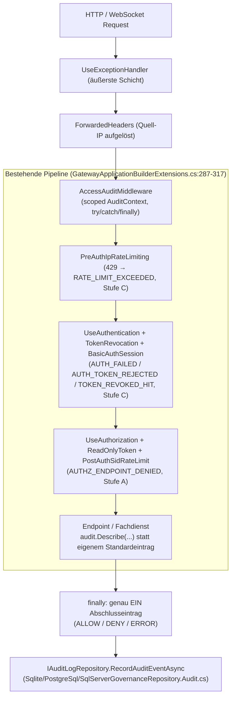

# Implementierungsplan: Lückenloses Zugriffs-Audit („Audit by Default“)

**Dokument-ID:** `PLAN-AUDIT-02-LUECKENLOSES-ZUGRIFFS-AUDIT`  
**Referenzen:** [Feature-Beschreibung](2026-10-09-feature-lueckenloses-zugriffs-audit.md) (Lücken L-1 … L-9, Abnahmekriterien 1–10). Der frühere separate Umsetzungsplan ist vollständig in dieses Dokument überführt und entfernt.  
**Rolle:** C# & .NET Solution Architect / Security Engineer  
**Status:** Bereit zur Umsetzung ⏳ (nach Klärung der Entscheidungen in Abschnitt 8)  
**Maßgeblich:** Dieses Dokument. Bei Widerspruch zur Feature-Beschreibung gilt die Feature-Beschreibung für das *Was*, dieses Dokument für das *Wie*.

---

## 1. Ausgangslage & Zielsetzung

Der kryptografische Kern ist gehärtet (AU-01 … AU-19 umgesetzt in Commit `a87fac0`/`0b7a14e`; der Befundbericht wurde in `60d82d8` entfernt). Die **Abdeckung** ist es nicht: Es gibt keine zentrale Audit-Stelle; 73 Aufrufe von `RecordAuditEventAsync` in 26 Dateien stehen rund 133 gemappten Minimal-API-Routen plus GraphQL, MCP und dynamisch geladenen SQL-Endpunkten gegenüber.

Stand der Lücken (verifiziert am Code, 09.10.2026):

| # | Lücke | Code-Beleg | Status |
|---|---|---|---|
| L-1 | Fehlgeschlagene AuthN (JWT, Basic, ForwardAuth, widerrufenes Token) nicht auditiert | `BasicAuthenticationHandler`, `ForwardAuthAuthenticationHandler`, `JwtBearerEvents` (`GatewayServiceCollectionExtensions.cs:881`), `TokenRevocationMiddleware.cs:28` schreiben nur 401 bzw. Log | offen |
| L-2 | Katalog-/Metadaten-Reads ohne Audit (Backstage, DevPortal, SchemaRegistry, dbt, OData-`$metadata`, Flight `info`/`tables`, Envoy-Exporte) | nur `IcebergRestCatalogFederationService` auditiert | offen |
| L-3 | WebSQL-Ablehnung vor Ausführung nur für DML (`WEBSQL_DML_REJECTED`, `GovernedSqlExecutionService.cs:907`); SELECT-Ablehnungen (Parser, Guardrail, Policy) ohne Eintrag | `WEBSQL_QUERY` nur bei ALLOW (`:929`) | offen |
| L-4 | Arrow Flight | `ArrowFlightSqlServer.cs:94/197` läuft über `IGovernedSqlExecutionService` ⇒ Basiseintrag vorhanden; **offen** bleiben Stream-Abbruch, Zeilen-/Byte-Zähler | teilweise behoben |
| L-5 | `IAuditLogRepository?` optional ⇒ stilles Fail-open | 9 Stellen, u. a. `GovernedSqlExecutionService.cs:62`, `GovernedProcedureExecutionService.cs:44`, `AiDataGuardrailService.cs:31`, `CdcSubscriptionGovernor.cs:69`, `IcebergRestCatalogFederationService.cs:38`, `MutationTypes.cs:683`, `ConsentRecertificationWorkflowService.cs:26`, `LineageImpactAnalyzerService.cs:21`, `EuAiActAuditExporter.cs:30` | offen |
| L-6 | 403 (Endpunkt-Policy), 429 (`PreAuthIpRateLimiting`, `PostAuthSidRateLimiting`), Widerrufs-Treffer, Read-only-Sperre nicht auditiert | `RateLimitingMiddleware.cs:86/166` liefert nur Problem-JSON | offen |
| L-7 | `TierAEnabled`/`TierBAggregationWindowSeconds` wirkungslos | nur Deklaration `GatewayOptions.cs:827-828`, keine Leser | offen |
| L-8 | Tier-B-Puffer (Kanal, 2 s Timeout, fail-closed) verliert Einträge bei hartem Absturz | `SqliteGovernanceRepository.Audit.cs:46-56`; Option `SynchronousQueryAudit` existiert (`GatewayOptions.cs:872`) | teilweise behoben (Option vorhanden, Standard asynchron) |
| L-9 | Kein Nachweis, dass neue Endpunkte auditiert werden | kein Abdeckungstest | offen |

**Ziel:** Jeder Zugriff – erlaubt, verweigert oder fehlerhaft – erzeugt genau einen manipulationssicheren Abschlusseintrag **oder** ist ausdrücklich und begründet ausgenommen. Fachliche Sondereinträge (Consent, Break-Glass, DML, Maskierungsänderung) bleiben eigene Events mit derselben Trace-ID.

---

## 2. Architektur & Pipeline-Integration



**Platzierung (verbindlich):** direkt nach `UseForwardedHeaders()` (Zeile 49) und **vor** `PreAuthIpRateLimitingMiddleware` (Zeile 294). Nur so sind 429 vor Authentifizierung und 401 aus Auth-Handlern sichtbar. Liegt die Middleware innerhalb von `UseExceptionHandler`, ist im `finally` der Antwortstatus bei Ausnahmen noch 200 ⇒ Ergebnis muss aus der **abgefangenen Ausnahme** (`catch` → `ERROR`, Ausnahme erneut werfen) abgeleitet werden, nicht aus `Response.StatusCode`.

---

## 3. Technische Spezifikation

### 3.1 Zentrale `AccessAuditMiddleware` & Scoped `AuditContext`
- Felder: Trace-ID, Kanal (REST, GraphQL, WebSQL, OData, MCP, Flight, Arrow-Export, Parquet, DuckDB, Iceberg, CDC, Prozedur, Envoy, Webhook), Quell-IP **aus `ForwardedHeaders` mit KnownProxies** (nie rohes `X-Forwarded-For`), Principal (nach Auth ergänzt), Mandant (nach `SecurityContextResolutionMiddleware`), Beginn, Ergebnis, Grundcode, Zeilen/Bytes.
- `AuditContext.MarkHandled()`: Ein Kanal, der (noch) selbst schreibt, markiert den Kontext ⇒ Middleware schreibt keinen Zweiteintrag (kanalweise Migration, Doppel-Eintrags-Test).
- Ergebnisableitung: Ausnahme ⇒ `ERROR`; 401/403/429 oder `audit.Deny(reason)` ⇒ `DENY`; sonst `ALLOW`. `OperationCanceledException` durch `RequestAborted` ⇒ `ERROR` mit Grundcode `CLIENT_ABORTED`.
- **Fail-closed-Grenze:** Der Abschlusseintrag im `finally` kommt bei erfolgreichen Lesezugriffen erst **nach** dem Senden der Antwort – fail-closed ist dort nicht mehr möglich. Deshalb wird der Eintrag **vor dem ersten Byte** (`Response.OnStarting` bzw. im Fachdienst) erzeugt, abgestuft nach Kosten:
  - **Änderungen & Admin (Stufe A, niedrige Frequenz):** synchron und dauerhaft; DML in derselben Transaktion über die bestehende Überladung `RecordAuditEventAsync(entry, DbTransaction, ...)`.
  - **Datenlesezugriffe (Hot-Path):** Standard ist **Annahme in den Tier-B-Kanal vor dem ersten Byte** (Fast-Path `TryWrite`, kein I/O, O(1); nur bei vollem Kanal die bestehende begrenzte Wartezeit von 2 s, `SqliteGovernanceRepository.Audit.cs:46-56`, vorgelagert durch die Tier-B-Quote je Principal aus §3.6). Scheitert die Annahme (Timeout, Kanal geschlossen, Writer gestört), wird die Antwort mit `503` abgebrochen → fail-closed ohne Latenzaufschlag im Normalfall. Dauerhaftes Schreiben vor der Antwort nur mit `Audit:SynchronousQueryAudit = true` (Entscheidung 8.2).
  - **Streaming-Kanäle:** Start-Eintrag (gleiche Regel wie Datenlesezugriffe) und Abschluss-Eintrag mit Zählern (siehe 3.5).

### 3.2 Deklarative Endpunkt-Richtlinien & Architektur-Test
- Richtlinie als **Endpunkt-Metadaten** (Minimal-APIs bestehen überwiegend aus Lambdas; Methoden-Attribute greifen dort nicht zuverlässig):
  ```csharp
  public enum AuditLevel { Full, Summarized, Delegated }

  public sealed record AuditPolicy(AuditLevel Level, string EventType);      // via .WithAudit(...)
  public sealed record AuditExemption(string Justification);               // via .WithAuditExemption(...)

  public static class AuditEndpointConventions
  {
      public static TBuilder WithAudit<TBuilder>(this TBuilder b, AuditLevel level, string eventType)
          where TBuilder : IEndpointConventionBuilder => b.WithMetadata(new AuditPolicy(level, eventType));
      public static TBuilder WithAuditExemption<TBuilder>(this TBuilder b, string justification)
          where TBuilder : IEndpointConventionBuilder => b.WithMetadata(new AuditExemption(justification));
  }
  ```
  `Delegated` = Fachdienst schreibt nachweislich selbst (z. B. GraphQL-Resolver, CDC-Subscription); die Middleware prüft dann nur „mindestens ein Eintrag mit dieser Trace-ID“.
- Gruppen-Konvention: `MapGroup(...).WithAudit(...)` zulässig; Einzelrouten dürfen überschreiben.
- **Architektur-Test `AuditEndpointCoverageTests`** (in `tests/Autheris.Tests.Integration`, Muster aus `IntegrationGapAEndpointMetadataTests.cs:36-41`): startet den Host per `WebApplicationFactory<Program>`, liest **alle** `RouteEndpoint` aus `EndpointDataSource` (inkl. `MapGraphQL`, `MapMcpEndpoints`, `MapMetrics`, Nitro `/ui/bcp`, `/api/v1/envoy/check/{**originalPath}`) und schlägt fehl, wenn ein Endpunkt weder `AuditPolicy` noch `AuditExemption` trägt. Zweiter Test: die Menge der `AuditExemption`-Routen ist exakt gleich einer festen Allowlist (Health/Liveness/Readiness, `/metrics`, statische Doku).
- Der Test läuft in drei Konfigurationen (Produktionsprofil, alle Feature-Flags an, Development), weil Routen konfigurationsabhängig gemappt werden (z. B. `MapDevEndpoints`, `EnableBananaCakePop`, `SqlEndpoints.Enabled`).
- **Dynamische Endpunkte:** `SqlEndpointLoader` (Hot-Reload) und `PluginManager` registrieren zur Laufzeit. Sie erhalten die Richtlinie **zwangsweise im Loader** (`Full`, `TABLE_QUERY`); ein Unit-Test belegt, dass jeder geladene Endpunkt `AuditPolicy` trägt. Zusätzlich Laufzeit-Schutz: Middleware behandelt Endpunkte ohne Metadaten wie `Full` und erhöht `autheris_audit_unclassified_endpoint_total`.

### 3.3 Ereigniskatalog (`AuditEventTypes`) & PII-Redaction
- Konstanten mit Metadaten (Beschreibung, Pflichtfelder, Stufe A/B/C, Datenklasse); bestehende Freitext-Typen (`TABLE_QUERY`, `WEBSQL_QUERY`, `WEBSQL_DML_*`, `STREAM_SUBSCRIBE`, `CONSENT_*` …) migrieren.
- Neu: `AUTH_FAILED`, `AUTH_TOKEN_REJECTED`, `AUTH_SUCCEEDED` (je Sitzung/Token-ID und Fenster, nicht je Anfrage), `AUTH_BRUTE_FORCE_DETECTED`, `AUTHZ_ENDPOINT_DENIED`, `RATE_LIMIT_EXCEEDED`, `TOKEN_REVOKED_HIT`, `CATALOG_READ`, `METADATA_EXPORT`, `WEBSQL_QUERY_DENIED`, `QUERY_EXECUTION_ERROR`, `EGRESS_SHADOW_COPY`, `AUDIT_READ`, `AUDIT_EXPORT`, `AUDIT_CONFIG_CHANGED`, `AUDIT_PIPELINE_FAULT`, `AUDIT_RETENTION_PURGE`, `SERVICE_STARTED`, `SERVICE_STOPPED`.
- Streng typisierter `AuditDetailsBuilder` statt Freitext-JSON: nur katalogisierte Felder, Längenbegrenzung, Neutralisierung von CR/LF/Steuerzeichen, Abschneide-Kennzeichen.
- Architekturtest: keine String-Literale als `EventType` an `AuditLogEntry` außerhalb von `AuditEventTypes`.
- Katalog wird als Markdown in `docs/` erzeugt; CI prüft Aktualität.

### 3.4 Authentifizierung, Autorisierung, Flut-Schutz (Stufe C)
- Quellen: `BasicAuthenticationHandler`, `ForwardAuthAuthenticationHandler`, `JwtBearerEvents.OnAuthenticationFailed`/`OnChallenge` (je Schema, auch `JwtBearerAdfs`), `TokenRevocationMiddleware`, `BasicAuthSessionMiddleware`, `ReadOnlyTokenMiddleware`, beide Rate-Limiter.
- Inhalt: Schema, Grundcode (abgelaufen, Signatur, Aussteller, Zielgruppe, widerrufen, Credentials), Quell-IP; behaupteter Principal nur **ungeprüft gelesen, gekürzt/gehasht**. Nie Token, Passwort, `Authorization`-Header.
- **Nicht über den synchronen Tier-A-Pfad:** Der Writer stuft heute jedes `DENY` als Tier A ein (`SqliteGovernanceRepository.Audit.cs:20-28`, synchron unter Sperre). Auth-Fehlschläge und 429 laufen deshalb ausschließlich über den `AuthFailureAggregator`, sonst wird jede Fehlanmeldung zu einem serialisierten DB-Schreibvorgang (DoS-Verstärker).
- Fehlschlag des Audit-Schreibens bei Auth-Fehlern: Anfrage bleibt 401 (nicht 500), Notfallpfad = strukturiertes Log + `autheris_audit_fallback_total` + Alarm.

### 3.5 Datenkanäle & Egress-Pfade (vollständige Liste)
| Kanal / Route | Heute | Maßnahme |
|---|---|---|
| WebSQL/SQL (`MapWebSqlEndpoints`, `MapSqlEndpoints`) | ALLOW + DML-Deny | `WEBSQL_QUERY_DENIED` vor Ausführung (Parser/Policy/Guardrail), `QUERY_EXECUTION_ERROR` nach Erlaubnis |
| GraphQL (`MapGraphQL`, `/graphql/{domain}`) + Subscriptions/WebSocket | Resolver-/CDC-Audit | `Delegated`; Abschlusseintrag mit Operation-Hash; Subscriptions: Start-/Ende-Eintrag statt eines Eintrags nach Stunden |
| Arrow Flight (`/api/v1/flight/sql/stream`, `info`, `tables`) | über Governed-SQL | Abbruch während Stream ⇒ `ERROR` mit übertragenen Zeilen; `info`/`tables` ⇒ `CATALOG_READ` |
| Arrow-Export, Parquet-GraphQL-Antwort (`ParquetGraphQLResponseMiddleware`), DuckDB-OLAP, Iceberg-REST, Prozeduren, SQL-Endpunkte (Loader) | teils | Zeilen-/Byteanzahl im Abschlusseintrag (Massenabzug erkennbar) |
| OData (`MapODataEndpoints`) inkl. `$metadata` | über Fachdienst | `Full` bzw. `CATALOG_READ` |
| MCP HTTP (`MapMcpEndpoints`) **und MCP stdio (`McpStdioRunner`)** | Guardrail-Audit | stdio läuft **außerhalb** der HTTP-Pipeline ⇒ eigener `AuditContext`-Scope je JSON-RPC-Aufruf; Test dafür |
| Envoy ExtAuthz (`/api/v1/envoy/check/{**originalPath}`) | kein Audit | jede Entscheidung für Drittsysteme ist ein Autorisierungsereignis ⇒ Stufe B, Deny Stufe A |
| Webhooks (`/api/webhooks/*`, anonym mit Signatur) | kein Audit | Signaturfehler ⇒ `AUTH_FAILED` (Stufe C); Erfolg ⇒ Änderungsereignis |
| **Traffic Shadowing** (`TrafficShadowingMiddleware` → `TrafficShadowingService`, `HttpClient` an `TargetBaseUrl`) | kein Audit | Kopie von Request-Bodies an ein Fremdsystem ist **Egress** ⇒ `EGRESS_SHADOW_COPY` (verdichtet je Fenster, Ziel-Host, Anzahl) + Start-Eintrag `AUDIT_CONFIG_CHANGED` |
| Admin/Governance, ReBAC, VirtualFilter, FinOps, HitL, TokenRevocation, Dev | teils | `Full` (Stufe A) |
| Backstage, DevPortal, SchemaRegistry, dbt, Envoy-Exporte, OpenAPI | kein Audit | `Summarized`, `CATALOG_READ`/`METADATA_EXPORT` |
| `/metrics`, Health, statische Doku | – | `AuditExemption` |

### 3.6 Fail-closed & Konfiguration
- `IAuditLogRepository` überall nicht-nullable (9 Stellen aus L-5); Startfehler, wenn nicht registriert. Architekturtest: kein Konstruktor-/Methodenparameter vom Typ `IAuditLogRepository?`.
- Die Default-Interface-Implementierung `RecordAuditEventAsync(entry, DbTransaction, ...)` (`IGovernanceRepository.cs:40-41`) ignoriert die Transaktion still ⇒ abstrakt machen, damit Decorators/Test-Doubles die Kopplung nicht verlieren.
- `TierAEnabled` entfernen; `TierBAggregationWindowSeconds` an die Verdichtung B/C binden; alte Schlüssel beim Start mit Warnung ignorieren (eine Version Übergang).
- Tier-B-Sättigung: Der Kanal schlägt heute nach 2 s für **alle** Mandanten fail-closed fehl. Ein Angreifer mit gültigem Konto kann durch Katalog-Flut die Datenabfragen aller anderen blockieren ⇒ Verdichtung B **vor** dem Kanal und Quote je Principal; Kennzahl für Sättigung.

---

## 4. Phasenplan (Phasen 0 bis 7)

| Phase | Fokus | Hauptaktivitäten | Löst | Abnahme (TDD, zuerst rot) |
|---|---|---|---|---|
| **0** | Messlatte | Endpunkte aus `EndpointDataSource` listen; Tests „eine Anfrage ⇒ genau ein Abschlusseintrag“ je Kanal als `Skip` mit Phasenverweis; p95/Durchsatz-Basis | L-9 (Messung) | Abdeckungsbericht in `docs/`; Befundtabelle 1 bestätigt |
| **1** | Katalog & Builder | `AuditEventTypes`, `AuditDetailsBuilder`, Statement-Hash | 3.3 | Tests: Log-Injection, Länge, Geheimnis-Ausschluss, kein freier `EventType` |
| **2** | Zentrale Middleware | `AccessAuditMiddleware`, `AuditContext`, `WithAudit`/`WithAuditExemption`, `AuditEndpointCoverageTests` | L-9 | Abdeckungstest grün; Doppel-Eintrags-Test; Ausnahme ⇒ `ERROR` |
| **3** | AuthN & AuthZ | Handler-Hooks, `AuthFailureAggregator`, 403/429/Read-only | L-1, L-6 | je Fehlerart ein Eintrag; 10 000 Fehlanmeldungen/min ⇒ ≤ N Einträge, Zähler korrekt; kein Token im Eintrag |
| **4** | Datenkanäle & Egress | WebSQL-Deny, Flight-Abbruch, Zähler, MCP stdio, Envoy, Shadowing | L-3, L-4 | Skip-Tests aus Phase 0 grün; Client-Abbruch ⇒ `ERROR` |
| **5** | Metadaten | `CATALOG_READ` verdichtet (Default), `Audit:CatalogReadMode` (`Summarized`/`Full`), `Audit:CatalogSummaryWindowSeconds` | L-2 | Abdeckungstest für Katalogrouten |
| **6** | Resilienz & Config | Nullable entfernen, Notfallpfad, tote Schalter, Lasttest | L-5, L-7, L-8 | App startet nicht ohne Writer; gestörtes Audit ⇒ Datenzugriff aller Kanäle scheitert; Lastbericht |
| **7** | Retention & Betrieb | Archivierungsjob, Alarme, `AUDIT_READ`/`AUDIT_EXPORT`, Doku | Rest | alle 10 Kriterien der Feature-Beschreibung nachgewiesen |

Reihenfolge: 0 → 1 → 2; Phase 3 kann parallel zu 2 beginnen (eigene Hooks), muss danach den `AuditContext` nutzen. Jede Phase endet mit grünen Tests auf SQLite, PostgreSQL und SQL Server.

---

## 5. Abnahmekriterien

- [ ] `AuditEndpointCoverageTests` grün in allen drei Konfigurationsprofilen; Ausnahmeliste = feste Allowlist (Health, `/metrics`, Doku).
- [ ] Jeder Endpunkt aus `SqlEndpointLoader`/`PluginManager` trägt `AuditPolicy` (Unit-Test).
- [ ] Integrationstest je Kanal aus 3.5 (inkl. MCP stdio, Envoy, Shadowing): genau ein Abschlusseintrag je Anfrage, Ergebnis korrekt.
- [ ] Ungültiges/abgelaufenes/widerrufenes Token, falsche Basic-/ForwardAuth-Daten, ungültige Webhook-Signatur erzeugen je einen (verdichteten) Eintrag ohne Geheimnis; Antwort bleibt 401 auch bei gestörtem Audit.
- [ ] 403, 429 (pre- und post-auth) und Read-only-Sperre erzeugen `AUTHZ_ENDPOINT_DENIED` bzw. `RATE_LIMIT_EXCEEDED`.
- [ ] WebSQL-Ablehnung vor Ausführung (SELECT und DML) ⇒ `DENY` mit Grundcode.
- [ ] Gestörtes Audit ⇒ Daten- und Änderungszugriffe aller Kanäle scheitern **vor dem ersten Antwortbyte**; App startet nicht ohne Writer.
- [ ] Flut: 10 000 Fehlanmeldungen/min ⇒ begrenzte Eintragszahl, Speicher des Aggregators begrenzt, `AUTH_BRUTE_FORCE_DETECTED` genau einmal je Fenster.
- [ ] Hash-Kette über alle neuen Typen prüfbar (alle drei Anbieter).
- [ ] p95-Zusatzlatenz gegenüber Phase-0-Basis: Lesepfad ≤ 3 % und ≤ 0,5 ms, Schreibpfad ≤ 10 %, Durchsatz ≤ 3 % (Entscheidung 8.5, Default-Konfiguration).
- [ ] Tier-B-Kanal voll/gestört ⇒ Datenlesezugriff endet mit `503`, kein Byte Nutzdaten gesendet (Entscheidung 8.2).
- [ ] Start-Validierung lehnt `Audit:Retention:Security < 365` ab.

---

## 6. Security Architecture Review & Ergänzungen (Security Expert)

> [!IMPORTANT]
> **Sicherheits-Invariante 1: Schutz vor Audit-Flooding DoS**  
> `AuthFailureAggregator` nutzt einen bounded LRU-Puffer (max. 5.000 Buckets je (IP/Präfix, Grundcode)); bei Überlauf Verdichtung auf /24 bzw. /64-Präfix statt Verwerfen. Erstes Ereignis sofort, danach Zähler je Fenster. Überschreitung der Obergrenze ⇒ einmalig `AUTH_BRUTE_FORCE_DETECTED` je Fenster und Kennzahl. Kein Auth-Fehlschlag läuft über den synchronen Tier-A-Pfad (3.4). Gleiches gilt für 429 und Katalog-Flut (Quote je Principal vor dem Tier-B-Kanal, 3.6).

> [!CAUTION]
> **Sicherheits-Invariante 2: Datenminimierung & PII-Scrubbing**  
> Niemals Klartext-Passwörter, Tokens, Schlüssel, Parameter- oder Zeilenwerte. Der `AuditDetailsBuilder` arbeitet mit **Allowlist** katalogisierter Felder; die Key-Denylist (`password`, `token`, `secret`, `authorization`, `bearer`, `cookie`, `key`) ist nur zweite Verteidigungslinie. SQL wird über den AST-Normalisierer anonymisiert (Literale ⇒ `@p_redacted`); Klartext nur mit `Audit:StoreStatementText=true` (Standard aus). Der Hash des **normalisierten** Statements wird gespeichert; ein Hash des Originals nur als HMAC mit Schlüssel, sonst sind Literale niedriger Entropie per Wörterbuch rückrechenbar. IP: Option zur Kürzung, Zweck/Aufbewahrung im Verzeichnis nach Art. 30.

> [!TIP]
> **Sicherheits-Invariante 3: WORM-Archivierung vor Löschung**  
> Der Retention-Job (`AuditLogRetentionDays`, heute nur deklariert, `GatewayOptions.cs:829`) löscht erst, wenn (1) der Batch in ein WORM-/Parquet-Archiv exportiert ist, (2) das Manifest über `IChainAnchorSigner` signiert und der Anker bestätigt ist, (3) `AUDIT_RETENTION_PURGE` mit Kettenintervall geschrieben wurde. Löschrecht nur für die Datenbankrolle des Jobs.

> [!IMPORTANT]
> **Sicherheits-Invariante 4: Kein Audit-Bypass über Pipeline-Kurzschlüsse**  
> Jede Middleware, die vor dem Endpunkt antwortet (Rate-Limit, Revocation, CSRF, Read-only, FinOps-Budget, SchemaContract), liegt **innerhalb** der `AccessAuditMiddleware`. Ein Integrationstest je Kurzschluss belegt den Eintrag.

---

## 7. Querschnitt

- **Schema:** neue Typen ohne Schemaänderung (Typ ist Text). Neue Spalten (Kanal, IP, Grundcode) nur mit Migration in allen drei Repositories, idempotent, Hash-Version erhöhen.
- **Rückwärtskompatibilität:** Hash-Format unverändert; neue Felder über `DetailsJson`, solange kein Versionssprung nötig.
- **Testmatrix:** Unit (Builder, Aggregator, Katalog), Architektur (Endpunkt-Abdeckung, kein freier Typ, kein nullable Writer), Integration (je Kanal, drei Datenbanken), Last, Sicherheit (Injection, Flut, Geheimnis-Ausschluss).
- **Nachvollziehbarkeit:** Jede Phase endet mit einem kurzen Bericht in `docs/plans/`.

## 8. Entscheidungen (getroffen 09.10.2026)

Leitlinie: Die Laufzeit-Performance des Standardbetriebs darf nicht sinken. Was nur mit Latenzkosten möglich ist, wird per Option zuschaltbar und ist standardmäßig aus.

1. **Katalog-Lesezugriffe:** Standard **verdichtet** (`Audit:CatalogReadMode = Summarized`; ein Eintrag je Principal, Route und Zeitfenster `Audit:CatalogSummaryWindowSeconds`, Default 60, mit Zähler). `Full` (je Zugriff) als Option für Umgebungen mit entsprechender Pflicht. Begründung: Katalogrouten sind hochfrequent (UI, BI-Tools); je-Zugriff-Einträge erhöhen Schreiblast ohne Erkenntnisgewinn.
2. **`SynchronousQueryAudit`:** Bleibt **Option, Standard `false`**. Der Standard schließt L-8 *teilweise*: fail-closed bei der Annahme (§3.1), Verlust nur bei hartem Prozessabsturz innerhalb des Flush-Intervalls. Zusätzlich (ohne Latenzkosten): Flush beim geordneten Shutdown (`IHostApplicationLifetime.ApplicationStopping`, mit Timeout) und Metrik `audit_tierb_queue_depth`/`audit_tierb_lost_on_crash_window_ms`. `true` schließt L-8 vollständig und wird in der Betriebsdoku für BAIT/DORA-regulierte Produktivumgebungen empfohlen. Feinere Option: `Audit:SynchronousQueryAuditForSensitivity = High` (Default leer) – synchron nur für Tabellen mit hoher Sensitivität.
3. **Aufbewahrung je Ereignisklasse:** konfigurierbar über `Audit:Retention:{Klasse}` (Tage); Löschung als gebatchter Hintergrundjob außerhalb des Request-Pfads (`AUDIT_RETENTION_PURGED` mit Anzahl/Zeitraum, Hash-Kette bleibt über Anker prüfbar). Defaults:
   | Klasse | Default |
   |---|---|
   | Sicherheits- und Admin-Ereignisse (Policy-/Profil-/ReBAC-/Konfigurationsänderungen, Break-Glass, `AUDIT_*`) | 3650 Tage (10 Jahre, BAIT/HGB-konservativ) |
   | Datenzugriffe (`*_QUERY`, Export, Egress) inkl. `DENY` | 400 Tage |
   | Verdichtete Ereignisse (`CATALOG_READ`, `AUTH_FAILED`-Aggregate, 429) | 90 Tage |
   | Betriebsereignisse (Health, Canary) | 30 Tage |
   Mindestwert pro Klasse ist durch Start-Validierung erzwungen (Sicherheit/Admin ≥ 365 Tage), damit Fehlkonfiguration nicht fail-open löscht.
4. **Regulatorische Pflichtereignisse:** immer aktiv, nicht abschaltbar (alle niederfrequent, daher ohne Performance-Relevanz): Änderungen an Policies, Profilen, ReBAC-Tupeln, Masking-/Consent-Regeln und Audit-Konfiguration; Rollen-/Rechtevergabe; Break-Glass/HitL-Freigaben; Schlüssel-/Secret-Rotation; Retention-Löschungen; Auth-Fehlschläge (verdichtet); erstmalige Token-Nutzung je Session (`AUTH_SUCCEEDED`, verdichtet, nicht je Request); Zugriffe auf als personenbezogen klassifizierte Spalten mit Principal, Zweck (`Consent`) und Spaltenliste (DSGVO Art. 30/32, Auskunft nach Art. 15 über Principal-/Betroffenen-Suche). Abfrage-Endpunkt für DSGVO-Auskunft nutzt bestehende Indizes, keine Volltextsuche im Hot-Path.
5. **p95-Zusatzlatenz (Default-Konfiguration, gegen Phase-0-Basis):** Lesepfad **≤ 3 % und ≤ 0,5 ms absolut**, Schreib-/Admin-Pfad ≤ 10 %; Durchsatz-Regression ≤ 3 %. Als BenchmarkDotNet-/Last-Gate in CI (`benchmarks/`, `AuditMiddlewareBenchmark`), Messung mit `SynchronousQueryAudit = false`. Optionale Modi (`Full`, synchron) werden gemessen und dokumentiert, aber nicht gegated.
