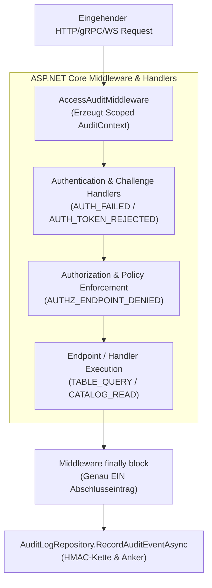

# Implementierungsplan: Lückenloses Zugriffs-Audit („Audit by Default“)

**Dokument-ID:** `PLAN-AUDIT-02-LUECKENLOSES-ZUGRIFFS-AUDIT`  
**Referenzen:** [Feature-Beschreibung](2026-10-09-feature-lueckenloses-zugriffs-audit.md), [Umsetzungsplan](2026-10-09-umsetzungsplan-lueckenloses-zugriffs-audit.md)  
**Rolle:** C# & .NET Solution Architect / Security Engineer  
**Status:** Bereit zur Umsetzung ⏳  

---

## 1. Ausgangslage & Zielsetzung

Die Vorprüfung der Audit-Abdeckung zeigte, dass zwar der kryptografische Kern gehärtet ist (AU-01 bis AU-19 abgeschlossen), aber **nicht alle Datenkanäle und Endpunkte ein lückenloses Audit erzwingen**:
- Fehlgeschlagene Authentifizierungen (ungültige Tokens, falsche Basic-Auth-Credentials) werden nicht auditiert (L-1).
- Katalog- und Metadatenlesezugriffe (Backstage, dbt, Schema-Registry) bleiben ohne Audit (L-2).
- Abgelehnte WebSQL-Abfragen vor der Ausführung werden nicht einheitlich erfasst (L-3).
- Arrow Flight und Streaming-Pipelines haben Lücken bei partiellen Leseabbrüchen (L-4).
- Fehlende deklarative Endpunkt-Audit-Richtlinien (`AuditAttribute`) ermöglichen unbemerktes Hinzufügen ungeprüfter Endpunkte (L-9).

**Ziel:** Jeder Zugriff – ob erlaubt, verweigert oder fehlerhaft – erzeugt genau einen manipulationssicheren Audit-Eintrag („Audit by Default“).

---

## 2. Architektur & Pipeline-Integration



---

## 3. Technische Spezifikation

### 3.1 Zentrale `AccessAuditMiddleware` & Scoped `AuditContext`
- Erfassung von Trace-ID, Kanal (REST, GraphQL, WebSQL, OData, MCP, Flight), Quell-IP (hinter Reverse-Proxy via `X-Forwarded-For`), Principal und Zeitstempel.
- Einheitlicher Abschluss-Eintrag im `finally`-Block der Middleware mit Status `ALLOW`, `DENY` oder `ERROR`.

### 3.2 Deklarative Endpunkt-Richtlinien & Architektur-Test
- Attribute für Minimal-APIs:
  ```csharp
  [AttributeUsage(AttributeTargets.Method)]
  public sealed class AuditAttribute(AuditLevel level, string eventType) : Attribute
  {
      public AuditLevel Level { get; } = level;
      public string EventType { get; } = eventType;
  }

  [AttributeUsage(AttributeTargets.Method)]
  public sealed class AuditExemptAttribute(string justification) : Attribute
  {
      public string Justification { get; } = justification;
  }
  ```
- **Architektur-Test (`AuditEndpointCoverageTests.cs`):** Durchläuft alle registrierten API-Endpunkte. Fehlt an einem Endpunkt sowohl `AuditAttribute` als auch `AuditExemptAttribute`, schlägt der CI-Build fehl (schließt Lücke L-9 dauerhaft).

### 3.3 Ereigniskatalog (`AuditEventTypes`) & PII-Redaction
- Standardisierte Konstanten:
  - `AUTH_FAILED`, `AUTH_TOKEN_REJECTED`, `AUTHZ_ENDPOINT_DENIED`
  - `RATE_LIMIT_EXCEEDED`, `TOKEN_REVOKED_HIT`
  - `CATALOG_READ`, `METADATA_EXPORT`, `WEBSQL_QUERY_DENIED`
- Streng typisierter `AuditDetailsBuilder` zur Vermeidung von Freitext-JSONs und Unterbindung von Log-Injection.

---

## 4. Phasenplan (Phasen 0 bis 7)

| Phase | Fokus | Hauptaktivitäten |
|---|---|---|
| **Phase 0** | Messlatte & Baseline | Endpunkt-Scan, p95-Latenzmessung, Basismessung |
| **Phase 1** | Katalog & Builder | `AuditEventTypes`, `AuditDetailsBuilder`, Anonymisierung |
| **Phase 2** | Zentrale Middleware | `AccessAuditMiddleware`, `AuditContext`, Endpoint-Attribute |
| **Phase 3** | AuthN & AuthZ | Fehlschlag-Audit (`AUTH_FAILED`), Flut-Verdichtung (Stufe C) |
| **Phase 4** | Datenkanäle | WebSQL Deny-Events, Arrow Flight & Streaming-Events |
| **Phase 5** | Metadaten | Katalog-Reads verdichtet (Stufe B), Schema-Exporte |
| **Phase 6** | Resilienz & Config | Bereinigung toter Schalter (`TierAEnabled`), Lasttests |
| **Phase 7** | Retention & WORM | Archivierungsjob vor Purge, Alarme, Runbook-Harmonisierung |

---

## 5. Abnahmekriterien

- [ ] 100% aller API-Endpunkte sind entweder deklarativ auditiert oder begründet ausgenommen (`AuditExempt`).
- [ ] Fehlgeschlagene Authentifizierungsversuche erzeugen einen strukturierten Audit-Eintrag ohne Passwörter/Tokens.
- [ ] WebSQL-Ablehnungen vor der Ausführung werden als `DENY` mit Grundcode auditiert.
- [ ] Die zusätzliche Latenz durch das synchrone Audit liegt im p95 unter 5%.

---

## 6. Security Architecture Review & Ergänzungen (Security Expert)

> [!IMPORTANT]
> **Sicherheits-Invariante 1: Schutz vor Audit-Flooding DoS bei Brute-Force-Angriffen**  
> Ein Angreifer könnte durch Millionen ungültiger Anmeldeversuche versuchen, die Audit-Pipeline zu saturieren oder den Speicher des `AuthFailureAggregator`s zu erschöpfen.  
> **Vorgabe:** Der `AuthFailureAggregator` nutzt einen bounded LRU-Ringpuffer (maximal 5.000 Buckets für IP/Reason-Paare). Bei extremer Flut schaltet das Gateway auf eine logarithmische Drosselung um und emittiert sofort ein hochprioritäres Sicherheits-Alarmevent `AUTH_BRUTE_FORCE_DETECTED`, ohne den Server durch OOM zu gefährden.

> [!CAUTION]
> **Sicherheits-Invariante 2: Strikte Datenminimierung & PII-Scrubbing im Audit-Trail**  
> Im unveränderlichen WORM- und HMAC-Audit-Log dürfen niemals Klartext-Passwörter, Session-Tokens oder personenbezogene Abfrage-Literale persistiert werden (DSGVO Art. 17 Recht auf Vergessenwerden vs. Revisionssicherheit).  
> **Architektur-Schranke:** Der `AuditDetailsBuilder` filtert über eine strikte Key-Denylist (`password`, `token`, `secret`, `authorization`, `bearer`, `cookie`, `key`) alle sensiblen Fragmente heraus. SQL-Statements werden vor dem Logging über den AST-Normalisierer anonymisiert (`@p_redacted`), während der kryptografische SHA-256-Hash des Original-Statements zur Integritätsprüfung erhalten bleibt.

> [!TIP]
> **Sicherheits-Invariante 3: WORM-Archivierung vor Löschung (Zero-Data-Loss Retention)**  
> Der Retention-Job (`AuditLogRetentionDays`) darf abgelaufene Zeilen erst dann per `DELETE` aus der relationalen Datenbank entfernen, wenn:  
> 1. Der gesamte Batch in ein manipulationssicheres WORM-/Parquet-Archiv exportiert wurde.  
> 2. Das erzeugte Archiv-Manifest von `IChainAnchorSigner` asymmetrisch signiert und der Anker im Key Vault bestätigt wurde.  
> 3. Ein abschließendes Revisions-Event `AUDIT_RETENTION_PURGED` mit Hash-Ketten-Intervall geschrieben wurde.

