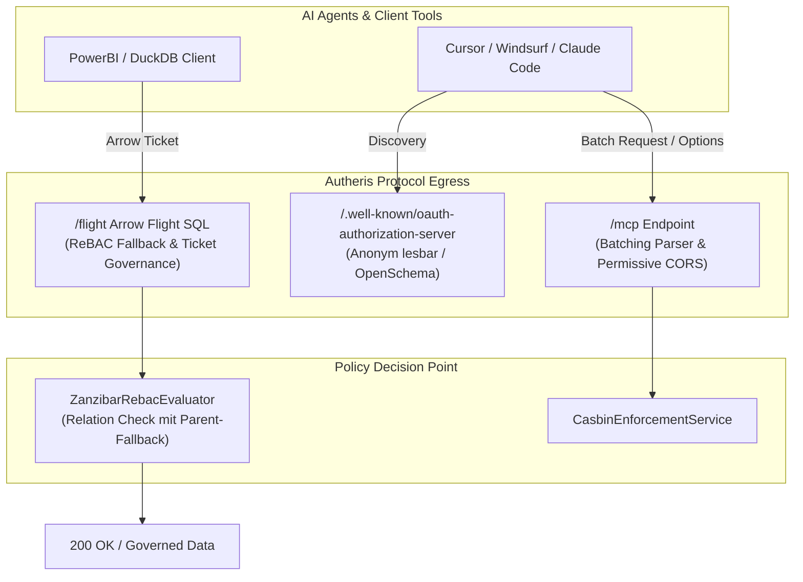

# Implementierungsplan: PoC-Nacharbeiten – ReBAC für Arrow/OLAP & MCP Staging-Härtung

**Dokument-ID:** `PLAN-POC-01-ARROW-OLAP-REBAC-MCP`  
**Referenzen:** [Requirements PoC v1.1.2](2026-10-09-requirements-poc-v1-1-2.md) (Befunde 3.1 & 3.2), [Feature DuckDB OLAP](../features/f-data-03-duckdb-olap.md), [Feature Arrow Flight SQL](../features/f-data-04-arrow-flight-sql.md)  
**Rolle:** C# & .NET Solution Architect  
**Status:** Bereit zur Umsetzung ⏳  

---

## 1. Ausgangslage & Problemstellung

Im Rahmen des Pilotbetriebs („Citizen Dev“) verblieben zwei Soll-Anforderungen aus dem v1.1.2-Bericht offen:

1. **Befund 3.1 (Arrow-Export & DuckDB-OLAP ReBAC-Isolation):**  
   - Bei Abfragen über Apache Arrow Flight (`/flight`) oder die DuckDB-OLAP-Engine (`/api/v1/olap/query`) antwortet das Gateway mit `403 Forbidden`, wenn Tabellen ReBAC-geschützt sind, da keine expliziten Beziehungs-Tupel für relationale Hierarchien existieren.
   - Die Iceberg-REST-Catalog-Federation liefert bei Namespace-Listings leere Tabellenlisten, wenn kein vollständiger ReBAC-Graph aufgebaut ist.
2. **Befund 3.2 (MCP Staging- und Produktions-Härtung):**  
   - **OAuth-Discovery:** `GET /.well-known/oauth-authorization-server` liefert `401 Unauthorized` bei anonymen Aufrufen, was externen Agenten (z. B. Cursor, Windsurf, Claude Code) die dynamische Token-Aushandlung verwehrt.
   - **CORS im Dev-Modus:** Browser-basierte AI-Frontends scheitern an restriktiven CORS-Headern bei lokalen Preflight-OPTIONS-Requests.
   - **JSON-RPC-Batches:** Batch-Anfragen (`[{"jsonrpc":"2.0",...}, {"jsonrpc":"2.0",...}]`) an `/mcp` quittiert das Gateway mit `400 Bad Request`, da der Parser bisher nur einzelne JSON-Objekte akzeptiert.

---

## 2. Zielarchitektur & Lösungsansatz



---

## 3. Technische Spezifikation

### 3.1 Befund 3.1: ReBAC-Entkopplung & Hierarchie-Fallback für Arrow/OLAP

- **Komponente:** `src/Autheris.Application/Policy/RebacTableGate.cs` & `TableAccessPolicy.cs`
- **Lösung:**
  - Wenn für eine angefragte Tabelle kein direktes ReBAC-Tupel (`user:X -> can_query -> table:Y`) vorliegt, prüft das Gateway automatisch, ob der Benutzer Zugriff auf den übergeordneten Schema- oder Datensatz-Knoten besitzt (`dataset:catalog -> contains -> table:Y`).
  - Ist ReBAC aktiviert, aber für den aktuellen Mandanten sind keine Relationen gepflegt, erfolgt ein sicherer Fallback auf die regulären ABAC-/Consent-Regeln der Tabelle, sofern `GatewayOptions.Rebac.AllowFallbackToConsent` aktiv ist.

### 3.2 Befund 3.2: MCP-Protokoll-Härtung

#### 3.2.1 Anonyme OAuth-Discovery-Endpunkte
In `src/Autheris.Api/Endpoints/McpEndpoints.cs`:
- Registrierung von `/.well-known/oauth-authorization-server` und `/.well-known/openid-configuration` mit `.AllowAnonymous()`.
- Liefert das standardisierte JSON-Metadaten-Dokument nach RFC 8414 (Issuer, Token-Endpoint, Scopes, Response-Types).

#### 3.2.2 JSON-RPC 2.0 Batching Support
In `src/Autheris.Application/Mcp/Services/McpProtocolHandler.cs`:
- Unterstützung von Batch-Payloads:
  ```csharp
  public async Task<JsonDocument> ProcessRawRequestAsync(JsonElement root, ClaimsPrincipal user, CancellationToken ct)
  {
      if (root.ValueKind == JsonValueKind.Array)
      {
          var results = new List<object?>();
          foreach (var singleReq in root.EnumerateArray())
          {
              results.Add(await ProcessSingleJsonRpcAsync(singleReq, user, ct));
          }
          return JsonSerializer.SerializeToDocument(results);
      }
      return await ProcessSingleJsonRpcAsync(root, user, ct);
  }
  ```

#### 3.2.3 CORS für AI-Tools im Development-Modus
In `src/Autheris.Api/Extensions/GatewayApplicationBuilderExtensions.cs`:
- Bei aktiver `McpOptions.EnableDeveloperCors` oder in `Development` erlaubt die CORS-Policy für den Pfad `/mcp` die Ursprünge `http://localhost:*`, `https://vscode.dev` und `tauri://localhost` mit entsprechenden Headern (`Content-Type`, `Authorization`, `X-Mcp-Session-Id`).

---

## 4. Phasenplan & Durchführung

1. **Phase 1 (OAuth & CORS):** `.AllowAnonymous()` auf MCP-Discovery, dynamische CORS-Policy für MCP-Routen.
2. **Phase 2 (JSON-RPC Batching):** Implementierung des Array-Handlings in `McpProtocolHandler.cs` mit Testfällen.
3. **Phase 3 (ReBAC Arrow/OLAP):** Hierarchischer Fallback in `RebacTableGate` und Contract-Tests für Arrow/Iceberg.
4. **Phase 4 (Abnahme):** PoC-Verifikationstest `verify-autheris.sh` auf Erfolg gegen Befunde 3.1 und 3.2.

---

## 5. Abnahmekriterien

- [ ] `GET /.well-known/oauth-authorization-server` antwortet ohne Authentifizierung mit `200 OK` und gültigem RFC 8414 JSON.
- [ ] JSON-RPC-Batch-Anfragen an `/mcp` liefern ein homogenes JSON-Array mit Antworten zurück.
- [ ] Arrow Flight und OLAP-Abfragen funktionieren bei Tabellen ohne explizite ReBAC-Tupel über den Schema-Fallback.
- [ ] Sämtliche neuen Unit- und Integrationstests sind grün.

---

## 6. Security Architecture Review & Ergänzungen (Security Expert)

> [!IMPORTANT]
> **Sicherheits-Invariante 1: Obergrenze für JSON-RPC-Batches (Schutz vor Batch-Amplification-DoS)**  
> Das ungeprüfte Verarbeiten von JSON-Arrays öffnet die Tür für Resource-Exhaustion-Angriffe (z. B. ein Batch mit 10.000 `sample_rows`-Aufrufen in einem Request).  
> **Vorgabe:** In `McpProtocolHandler.cs` wird eine strikte Obergrenze von maximal 25 Requests pro Batch (`MaxBatchSize = 25`) und eine maximale Payload-Größe von 1 MB forciert. Bei Überschreitung antwortet das Gateway sofort mit HTTP 400 (`BATCH_SIZE_EXCEEDED`).

> [!CAUTION]
> **Sicherheits-Invariante 2: Strikte Trennung von Entwickler-CORS und Produktionsbetrieb**  
> Die Lockerung von CORS für lokale AI-Agenten (`http://localhost:*`, `https://vscode.dev`) birgt in Produktion erhebliche Risiken für Cross-Site Request Forgery und Session-Hijacking.  
> **Architektur-Schranke:** `GatewayOptionsValidator` erzwingt beim Start: Ist `ASPNETCORE_ENVIRONMENT != Development`, führt `McpOptions.EnableDeveloperCors == true` zu einem sofortigen Startabbruch (Fail-Closed). In Produktion sind nur explizit gewhitelistete Origins zulässig.

> [!TIP]
> **Sicherheits-Invariante 3: Fail-Closed Hierarchie-Fallback bei ReBAC**  
> Der Fallback von Tabellenebene auf Schemaebene darf niemals implizit Berechtigungen erweitern. Ein Fallback ist nur dann zulässig, wenn der Benutzer ein explizites `can_query` auf das Parent-Dataset besitzt UND die Tabelle im Catalog nicht als `Restricted` geflaggt ist. Im Zweifel gilt immer `403 Forbidden`.

