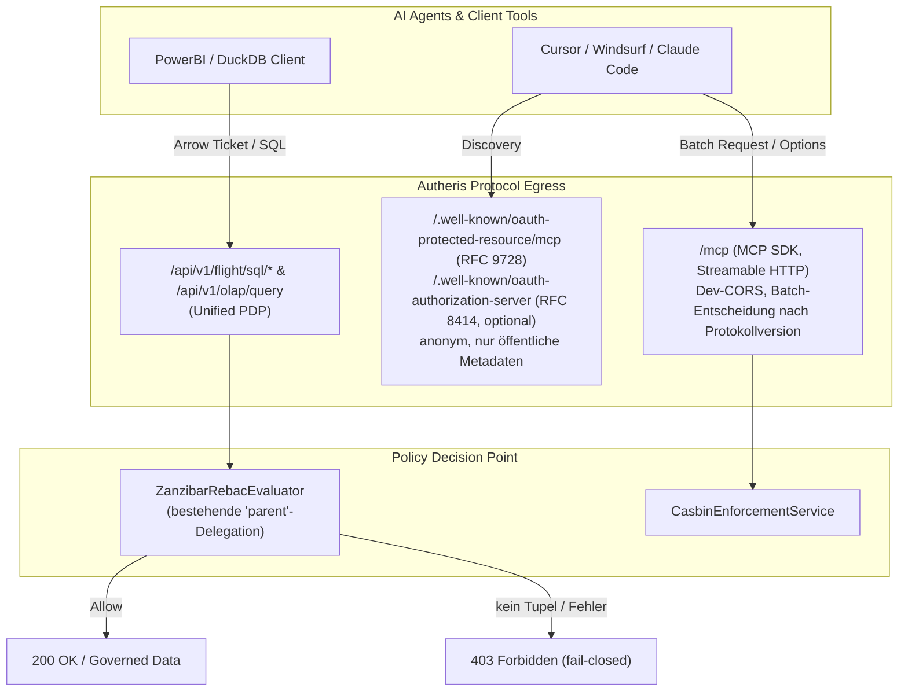

# Implementierungsplan: PoC-Nacharbeiten – ReBAC für Arrow/OLAP & MCP Staging-Härtung

**Dokument-ID:** `PLAN-POC-01-ARROW-OLAP-REBAC-MCP`  
**Referenzen:** [Requirements PoC v1.1.2](2026-10-09-requirements-poc-v1-1-2.md) (Befunde 3.1 & 3.2), [Feature DuckDB OLAP](../features/f-data-03-duckdb-olap.md), [Feature Arrow Flight SQL](../features/f-data-04-arrow-flight-sql.md)  
**Rolle:** C# & .NET Solution Architect  
**Status:** Überarbeitet nach Review (09.10.2026) – bereit zur Umsetzung ⏳  

---

## 1. Ausgangslage & Problemstellung

Im Rahmen des Pilotbetriebs („Citizen Dev“) verblieben zwei Soll-Anforderungen aus dem v1.1.2-Bericht offen:

1. **Befund 3.1 (Arrow-Export & DuckDB-OLAP ReBAC-Isolation):**  
   - Bei Abfragen über Arrow Flight SQL (`POST /api/v1/flight/sql/stream`, `GET /api/v1/flight/sql/tables`) oder die DuckDB-OLAP-Engine (`POST /api/v1/olap/query`) antwortet das Gateway mit `403 Forbidden`, wenn ReBAC aktiv ist (`Rebac.Enabled = true`, Default) und für die Tabelle keine Tupel existieren. Ursache: der Unified PDP prüft ReBAC mit `RebacEnforcement.WhenEnabled` (`UnifiedPolicyDecisionPoint.cs:81`, `TableAccessPolicy.cs:402-409`) unabhängig von `EnforceOnQueryPaths`; der Evaluator verweigert Tabellen ohne Tupel (fail-closed, gewollt).
   - Die Iceberg-REST-Catalog-Federation liefert bei Namespace-Listings leere Tabellenlisten. **Achtung:** `ListTablesAsync` nutzt **kein** ReBAC, sondern `CatalogVisibility` (Consent) und filtert nur `LakehouseIceberg`/`LakehouseDelta`-Tabellen der Domain = Tenant (`IcebergRestCatalogFederationService.cs:81-115`). ReBAC greift erst bei `LoadTableAsync` und nur mit `EnforceOnQueryPaths` (`:296`). Die Ursache des leeren Listings ist daher in Phase 0 zu reproduzieren, nicht als ReBAC-Problem vorauszusetzen.
2. **Befund 3.2 (MCP Staging- und Produktions-Härtung):**  
   - **OAuth-Discovery:** Bereits weitgehend umgesetzt (`McpEndpoints.cs:97-143`, Tests `McpSdkTransportTests.cs:128-215`). Anonym ist die Discovery heute nur in `Development` oder mit `Mcp.AllowAnonymousDiscovery = true`; sonst `401`. Die RFC-9728-Protected-Resource-Metadata unter `/.well-known/oauth-protected-resource/mcp` liefert das MCP-SDK (`GatewayMcpOAuth.cs:39-57`).
   - **CORS im Dev-Modus:** Browser-basierte AI-Frontends scheitern an der Default-Policy (`GatewayServiceCollectionExtensions.cs:677-700`: Dev nur `http://localhost:5000`/`https://localhost:5001`).
   - **JSON-RPC-Batches:** `/mcp` läuft auf dem offiziellen MCP-SDK (`ModelContextProtocol.AspNetCore` 2.2.0, `app.MapMcp`, Streamable HTTP, stateless; `GatewayMcpServer.cs:35-54`). Batch-Arrays werden dort mit `400` abgelehnt. `McpProtocolHandler` bedient **nur** den stdio-Transport (`McpStdioRunner`), nicht HTTP.

---

## 2. Zielarchitektur & Lösungsansatz

---

## 3. Technische Spezifikation

### 3.1 Befund 3.1: ReBAC-Hierarchie für Arrow/OLAP (fail-closed)

- **Komponenten:** `src/Autheris.Application/Security/Rebac/Services/ZanzibarRebacEvaluator.cs` (Hierarchie), `src/Autheris.Application/Policy/RebacTableGate.cs` (Objekt-IDs), Tupel-Pflege (Seed/Import), **keine** neue Bypass-Logik in `TableAccessPolicy.cs`.
- **Lösung:**
  - Der Evaluator unterstützt bereits hierarchische Delegation über Tupel `(parentObj, "parent", table:…)` (`ZanzibarRebacEvaluator.cs:325-340`, POL-7: leerer Parent wird nie als Wildcard gewertet). Es wird **keine** neue Relation `contains` eingeführt.
  - Neu: kanonische Parent-Objekt-IDs analog `RebacTableGate.ObjectId`: `schema:{Domain}.{Schema}` und `domain:{Domain}`, als statische Helfer `RebacTableGate.SchemaObjectId(...)` / `DomainObjectId(...)`. Damit kollidieren gleichnamige Schemata verschiedener Domains nicht.
  - Neu: automatische Pflege der Struktur-Tupel `schema:… parent table:…` und `domain:… parent schema:…` beim Katalog-Sync bzw. dbt-Governance-Import (nur Struktur, **keine** Benutzer-Grants). Benutzer-Grants (`user:X can_query schema:…`) bleiben explizite Admin-Entscheidung.
  - Ein Zugriff über die Hierarchie setzt immer ein explizites `can_query` (bzw. über `InheritCanQueryFromViewer` geerbtes) Tupel des Subjekts auf einem Parent voraus. Ohne Tupel: `403`.
  - **Gestrichen:** der Fallback „keine Relationen im Mandanten → ABAC/Consent“ (`AllowFallbackToConsent`). Er wäre fail-open (Löschen aller Tupel oder Fehlkonfiguration öffnet alle Tabellen). Wer ReBAC für Arrow/OLAP nicht nutzen will, setzt bewusst `Rebac.Enabled = false` bzw. pflegt Tupel.
  - Evaluator-Fehler (Store nicht erreichbar, Tiefe > `MaxTraversalDepth`, Zyklus) ergeben `Allowed = false`.
  - Ein Tabellen-Flag „Restricted“ existiert im Katalog nicht (nur die Klassifikation `Restricted` im Masking-Mapping, `GatewayOptions.cs:1109`). Optional (eigene Story): Tabellen mit Klassifikation `Restricted` erben nicht über `parent`, sondern brauchen ein direktes Tabellen-Tupel.
  - Iceberg: Nach Ursachenanalyse (Phase 0) wird das Listing ggf. an dieselbe Sichtbarkeitsregel wie `LoadTableAsync` angeglichen (Consent + ReBAC, wenn erzwungen), damit Listing und Laden konsistent sind; kein Listing von Tabellen, die danach `403` liefern.

### 3.2 Befund 3.2: MCP-Protokoll-Härtung

#### 3.2.1 Anonyme OAuth-Discovery-Endpunkte (nur öffentliche Metadaten)
In `src/Autheris.Api/Endpoints/McpEndpoints.cs` und `src/Autheris.Api/Mcp/GatewayMcpOAuth.cs`:
- **RFC 9728 (Pflicht laut MCP-Autorisierungsspezifikation):** `/.well-known/oauth-protected-resource` und `/.well-known/oauth-protected-resource/mcp` sind **immer** anonym erreichbar, sobald MCP-OAuth aktiv ist (auch in Produktion, unabhängig von `AllowAnonymousDiscovery`). Der `WWW-Authenticate`-Header der 401-Antwort verweist bereits darauf; ein geschütztes Metadaten-Dokument macht die Discovery unbrauchbar.
- **RFC 8414:** Autheris ist **nicht** Authorization Server. `/.well-known/oauth-authorization-server` am Gateway ist nicht spezifikationskonform, wenn `issuer` (Entra/AD FS) nicht der abrufenden Origin entspricht (RFC 8414 §3.3). Variante A (empfohlen): Endpunkt entfernen bzw. auf `404` belassen – Clients holen AS-Metadaten beim Issuer (`authorization_servers` aus RFC 9728). Variante B (Kompatibilität für Clients, die den Pfad direkt anfragen): bleibt hinter `AllowAnonymousDiscovery`, liefert nur die **echten** Issuer-Endpunkte (keine aus String-Konkatenation erfundenen `/oauth2/v2.0/...`-Pfade für AD FS), `response_types_supported = ["code"]` (kein Implicit `token`), kein nicht-standardisiertes Feld `authorization_servers`.
- `/.well-known/openid-configuration` wird **nicht** am Gateway registriert (gehört zum IdP).
- Inhalt ausschließlich öffentlich: Issuer-URLs, Scopes, Bearer-Methoden, Ressourcenname. Keine Tenant-IDs anderer Mandanten, keine Client-IDs/Secrets, keine internen Hosts, keine Konfigurationsdetails. Antwort mit `Cache-Control: public, max-age=3600`, Rate-Limiting über die bestehende Anonymous-Policy.

#### 3.2.2 JSON-RPC Batching – Ausrichtung an der MCP-Spezifikation
- Die MCP-Revision **2025-06-18** hat JSON-RPC-Batching **entfernt** (nur 2025-03-26 erlaubte es). Das eingesetzte SDK (`ModelContextProtocol.AspNetCore` 2.2.0) verhandelt aktuelle Revisionen und unterstützt keine Batches.
- **Entscheidung:** Kein eigener Batch-Parser vor dem SDK. Stattdessen:
  1. Batch-Arrays an `/mcp` werden mit einer spezifikationskonformen JSON-RPC-Fehlerantwort abgelehnt (`-32600 Invalid Request`, Meldung „JSON-RPC batching is not supported (MCP ≥ 2025-06-18)“), HTTP `400`, ohne einen einzelnen Eintrag auszuführen. Umsetzung als Endpoint-Filter in `McpEndpoints.cs` neben dem bestehenden Größenlimit (`MaxMcpMessageBytes`, `:23-77`), falls das SDK keine solche Antwort liefert.
  2. Der PoC-Client (`verify-autheris.sh`) sendet Einzelanfragen.
- **Nur falls** ein Pflicht-Client nachweislich ausschließlich 2025-03-26 mit Batches spricht (eigene Story, eigenes Review): Batching nur bei ausgehandelter Protokollversion `2025-03-26`, Durchreichen **jedes** Elements einzeln durch die SDK-Pipeline (eigene Autorisierung, Guardrails, Token-Budget und Audit-Eintrag je Element), Fehlerisolation je Element (Fehler eines Elements ist eine Error-Response im Array, kein Abbruch), Notifications ohne Response, leeres Array → `-32600`, `MaxBatchSize = 25` (Konfiguration `Mcp.MaxBatchSize`), sequentielle Ausführung, Gesamtlimit 1 MB (bestehend), Gesamt-Timeout. `initialize` im Batch ist unzulässig.
- `McpProtocolHandler.cs` (stdio) bleibt unverändert.

#### 3.2.3 CORS für AI-Tools im Development-Modus
In `src/Autheris.Api/Extensions/GatewayServiceCollectionExtensions.cs` (Policy-Registrierung, `:677`) und `GatewayApplicationBuilderExtensions.cs` (Endpoint-Zuordnung):
- Neue benannte Policy `McpDeveloperCors`, nur am MCP-Endpoint (`endpoint.RequireCors("McpDeveloperCors")`), nicht global.
- Aktiv nur, wenn `Mcp.EnableDeveloperCors = true` (neue Option in `McpOptions`, `GatewayOptions.cs:1126`) **und** Umgebung `Development`.
- Origins: `http://localhost:<port>` / `http://127.0.0.1:<port>` per `SetIsOriginAllowed` mit exakter Prüfung (Schema, Host, numerischer Port; kein `StartsWith`, damit `http://localhost.evil.com` scheitert), plus explizite Liste `Mcp.DeveloperCorsOrigins` (z. B. `https://vscode.dev`, `tauri://localhost`).
- Header: `Content-Type`, `Authorization`, `Mcp-Session-Id`, `MCP-Protocol-Version`, `Last-Event-ID`; `WithExposedHeaders("Mcp-Session-Id", "WWW-Authenticate")`; Methoden `GET, POST, DELETE, OPTIONS`; **kein** `AllowCredentials` (Bearer-Token statt Cookies).
- Der bestehende `IsAllCorsAllowed`-Kurzschluss (`GatewayApplicationBuilderExtensions.cs:145-158`) bleibt unberührt.

---

## 4. Phasenplan & Durchführung (TDD: Test rot → Implementierung → grün)

0. **Phase 0 (Analyse):** Reproduktion von Befund 3.1 (Flight/OLAP-403 mit `Rebac.Enabled` und ohne Tupel) und Ursache des leeren Iceberg-Listings als fehlschlagende Integrationstests festhalten. Prüfen, wie das SDK 2.2.0 Batch-Arrays heute beantwortet.
1. **Phase 1 (Discovery & CORS):** RFC-9728-Endpunkte immer anonym; Entscheidung A/B für RFC 8414; `McpDeveloperCors` inkl. Start-Validierung.
2. **Phase 2 (Batch-Ablehnung):** Spezifikationskonforme `-32600`-Antwort für Arrays.
3. **Phase 3 (ReBAC-Hierarchie):** Parent-Objekt-IDs, Struktur-Tupel-Pflege, Tests für Flight/OLAP/Iceberg.
4. **Phase 4 (Abnahme):** `verify-autheris.sh` des PoC (Repo `POC_Backstage_citizen_dev`) um Fälle zu 3.1/3.2 erweitern und gegen das Image laufen lassen.

---

## 5. Abnahmekriterien

**Discovery (Integration, `McpSdkTransportTests.cs`):**
- [ ] `GET /.well-known/oauth-protected-resource/mcp` ohne Auth in `Production` (mit `AllowAnonymousDiscovery = false`) → `200`, `resource` endet auf `/mcp`, `authorization_servers` enthält den konfigurierten Issuer.
- [ ] Antwort enthält nur die Felder `resource`, `authorization_servers`, `scopes_supported`, `bearer_methods_supported`, `resource_name` (Allowlist-Assertion; keine Secrets/Client-IDs).
- [ ] `401` von `POST /mcp` enthält `WWW-Authenticate` mit `resource_metadata=` (bestehender Test bleibt grün).
- [ ] Variante A: `GET /.well-known/oauth-authorization-server` → `404`. Variante B: `issuer` ist gesetzt, `response_types_supported == ["code"]`, kein Feld `authorization_servers`.
- [ ] `GET /.well-known/openid-configuration` am Gateway → `404`.

**Batching (Integration):**
- [ ] `POST /mcp` mit `[{tools/list},{tools/call sample_rows}]` → `400`, Body ist ein JSON-RPC-Error `-32600`; Audit-Log enthält **keinen** `sample_rows`-Eintrag (kein Element ausgeführt).
- [ ] `POST /mcp` mit `[]` → `400`, `-32600`.
- [ ] Einzelanfrage `tools/list` → `200` (Regression).

**CORS (Integration):**
- [ ] Development + `EnableDeveloperCors`: Preflight `OPTIONS /mcp` mit `Origin: http://localhost:6274` → `204`, `Access-Control-Allow-Origin` = Origin, erlaubte Header enthalten `Mcp-Session-Id`, `MCP-Protocol-Version`, kein `Access-Control-Allow-Credentials`.
- [ ] Gleicher Preflight mit `Origin: http://localhost.evil.com` bzw. `https://evil.example` → kein `Access-Control-Allow-Origin`.
- [ ] Preflight auf `/api/v1/olap/query` mit `http://localhost:6274` → kein `Access-Control-Allow-Origin` (Policy nur an `/mcp`).
- [ ] Start in `Production` mit `Mcp.EnableDeveloperCors = true` → `ValidationException` beim Start (Unit-Test der Start-Validierung).

**ReBAC (Unit `ZanzibarRebacEvaluator`/`RebacTableGate`, Integration Flight/OLAP):**
- [ ] `user:X can_query schema:d.s` + `schema:d.s parent table:d.s.t` → Flight-Stream und OLAP-Query auf `d.s.t` → `200`.
- [ ] Ohne jedes Tupel → `403` (auch wenn der Mandant gar keine Tupel hat).
- [ ] `user:X can_query schema:d1.s` gewährt **keinen** Zugriff auf `d2.s.t` (Domain-Isolation).
- [ ] Parent-Tupel mit leerem `User` → `403` (POL-7-Regression).
- [ ] Evaluator-Store wirft Exception → `403`, kein `500`, Audit-Eintrag `DENY`.
- [ ] Zyklus `schema parent table parent schema` / Tiefe > `MaxTraversalDepth` → `403`, terminiert.
- [ ] Iceberg: Listing und `LoadTableAsync` liefern für denselben Nutzer konsistente Ergebnisse (gelistete Tabelle lädt mit `200`, nicht gelistete mit `403`).
- [ ] Alle bestehenden Tests grün; `verify-autheris.sh` grün.

---

## 6. Security Architecture Review & Ergänzungen (Security Expert)

> [!IMPORTANT]
> **Sicherheits-Invariante 1: Keine Batch-Ausführung ohne Einzelprüfung**  
> Das ungeprüfte Verarbeiten von JSON-Arrays öffnet die Tür für Resource-Exhaustion-Angriffe und umgeht Guardrails/Audit je Aufruf.  
> **Vorgabe:** Standard ist die Ablehnung von Batches (`-32600`, MCP ≥ 2025-06-18). Wird Batching je nachgeholt, gilt pro Element: eigene Autorisierung, eigener Audit-Eintrag, eigenes Token-Budget, Fehlerisolation; global `MaxBatchSize = 25`, 1 MB Payload (bestehend, `McpEndpoints.MaxMcpMessageBytes`), sequentielle Ausführung.

> [!CAUTION]
> **Sicherheits-Invariante 2: Strikte Trennung von Entwickler-CORS und Produktionsbetrieb**  
> Die Lockerung von CORS für lokale AI-Agenten birgt in Produktion Risiken (Cross-Origin-Zugriff mit vom Browser eingesetzten Credentials).  
> **Architektur-Schranke:** Die Start-Validierung in `GatewayServiceCollectionExtensions.cs` (neben API-16, `:1466-1471`; eine Klasse `GatewayOptionsValidator` existiert nicht) erzwingt: Ist die Umgebung nicht `Development`, führt `Mcp.EnableDeveloperCors == true` zum Startabbruch (Fail-Closed), ohne Opt-out über `AllowInsecureWarnFlagsInProduction`. Die Dev-Policy setzt nie `AllowCredentials` und gilt nur am MCP-Endpoint.

> [!WARNING]
> **Sicherheits-Invariante 3: Fail-Closed Hierarchie bei ReBAC**  
> Die Hierarchie darf niemals implizit Berechtigungen erweitern. Zugriff nur bei explizitem `can_query` (oder Vererbung nach `InheritCanQueryFromViewer`) des Subjekts auf Tabelle, Schema oder Domain des **gleichen** Domain-Präfixes. Struktur-Tupel (`parent`) werden nur vom Katalog-Sync geschrieben, nie aus Request-Daten. Es gibt keinen Fallback auf Consent/ABAC bei fehlenden Tupeln. Fehler, Zyklen und Tiefenüberschreitung → `403`.

> [!IMPORTANT]
> **Sicherheits-Invariante 4: Anonyme Discovery nur mit öffentlichen Metadaten**  
> Anonyme Endpunkte unter `/.well-known` liefern ausschließlich die in RFC 9728 / RFC 8414 definierten öffentlichen Felder, keine mandantenspezifischen oder internen Daten, und sind rate-limitiert. Der MCP-Endpoint selbst bleibt authentifiziert (`IsMcpAuthBypassed` unverändert produktionsgesperrt).
