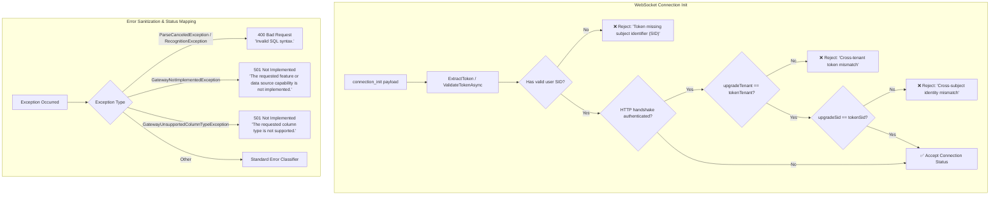

# Architektur- und Implementierungsplan: WebSocket-Identitätssicherheit & Fehler-Härtung (R-GQL-8 & S-2)

**Datum:** 2026-10-07  
**Rolle:** C# & .NET Solution Architect / Security Expert  
**Status:** In Umsetzung (TDD)  
**Referenz:** [docs/plans/status-und-umsetzungsplan-2026-10-07.md](file:///root/autheris/docs/plans/status-und-umsetzungsplan-2026-10-07.md)

---

## 1. Problemstellung & Bedrohungsanalyse

### Befund 1: R-GQL-8 (WebSocket-Subjektprüfung wirkungslos & Token ohne SID)
- **Schweregrad:** Mittel–Hoch (Broken Object Level Authorization / Identity Spoofing)
- **Fundstelle:** [`src/Autheris.GraphQL/Subscriptions/WebSocketAuthInterceptor.cs:131-139`](file:///root/autheris/src/Autheris.GraphQL/Subscriptions/WebSocketAuthInterceptor.cs#L131-L139)
- **Ursachen:**
  1. Die bisherige Prüfung lautete:
     ```csharp
     if (isHttpAuthenticated && upgradeSid != null && tokenSid != null && upgradeSid.Value != tokenSid.Value && upgradeTenant != tokenTenant)
     ```
     Durch die Bedingung `&& upgradeTenant != tokenTenant` griff die Subjektprüfung **nur dann**, wenn gleichzeitig ein Mandantenwechsel stattfand. Innerhalb desselben Mandanten konnte ein Aufrufer (z. B. Alice) im WebSocket-`connection_init` ein Token für Bob präsentieren – die Prüfung wurde umgangen!
  2. Wenn ein Token überhaupt keinen SID-Claim besaß (`tokenSid == null`), war die Bedingung `tokenSid != null` false, wodurch das SID-lose Token akzeptiert und unzureichend identifiziert wurde.
- **Sicherheitsinvariante:**
  - Jedes WebSocket-Token muss zwingend eine gültige Benutzer-SID besitzen (Fail-Closed).
  - Wenn der HTTP-Upgrade-Handshake authentifiziert war, muss das Subjekt des `connection_init`-Tokens exakt dem HTTP-Subjekt entsprechen. Abweichungen müssen ausnahmslos mit `Cross-subject identity mismatch` abgewiesen werden, unabhängig davon, ob der Mandant identisch ist oder nicht.

---

### Befund 2: S-2 (Information Disclosure bei 501 & Parser-Fehler auf 500)
- **Schweregrad:** Mittel (CWE-209: Generation of Error Message Containing Sensitive Information, RFC 9110)
- **Fundstellen:**
  - [`src/Autheris.Api/Middleware/GatewayExceptionHandler.cs:78-80`](file:///root/autheris/src/Autheris.Api/Middleware/GatewayExceptionHandler.cs#L78-L80)
  - [`src/Autheris.Api/Endpoints/WebSqlEndpoints.cs:346-356`](file:///root/autheris/src/Autheris.Api/Endpoints/WebSqlEndpoints.cs#L346-L356)
- **Ursachen:**
  1. `GatewayNotImplementedException` und `GatewayUnsupportedColumnTypeException` reichten `e.Message` direkt als Antworttext an den Client durch. Dadurch wurden interne Konfigurationen (z. B. Name unverbundener Datenquellen, Fallback-Konfigurationen, interne Typen) nach außen exponiert.
  2. Syntaktisch ungültige SQL-Abfragen warfen im Parser `ParseCanceledException` (Antlr4). Da dieser Ausnahmetyp in den Endpunkten nicht explizit abgefangen wurde, fiel er auf `default:` durch und antwortete mit `500 Internal Server Error` (Server-Fehler), obwohl es sich um einen fehlerhaften Client-Request (`400 Bad Request`) handelte.
- **Sicherheitsinvariante:**
  - Keine internen Exception-Meldungen von `GatewayNotImplementedException` oder `GatewayUnsupportedColumnTypeException` an den Client ausgeben; stattdessen generische, RFC-konforme Standardtexte verwenden.
  - SQL-Syntaxfehler müssen als `400 Bad Request` mit generischem Hinweis (`"Invalid SQL syntax."`) beantwortet werden.

---

## 2. Architektonisches Design



---

## 3. Umsetzungsschritte (TDD)

### Phase 1: Test-First (Rote Tests schreiben)
1. **`WebSocketAuthInterceptorTests.cs`:**
   - Test: `OnConnectAsync_TokenWithoutSid_RejectsWithMissingSidMessage`
   - Test: `OnConnectAsync_HttpAuthenticated_SameTenant_DifferentSid_RejectsWithCrossSubjectMismatch`
   - Test: `OnConnectAsync_HttpAuthenticated_SameTenant_SameSid_Succeeds`
   - Test: `OnConnectAsync_HttpAuthenticated_DifferentTenant_RejectsWithCrossTenantMismatch`
2. **`GatewayExceptionHandlerTests.cs` (oder `WebSqlErrorHandlingTests.cs`):**
   - Test: `GatewayExceptionHandler_GatewayNotImplementedException_ReturnsGenericTitle`
   - Test: `GatewayExceptionHandler_ParseCanceledException_Returns400BadRequest`
   - Test: `WebSqlEndpoints_ParseCanceledException_Returns400BadRequest`
   - Test: `WebSqlEndpoints_GatewayNotImplementedException_ReturnsGenericMessage`

### Phase 2: Implementierung (Grüne Tests)
1. **`WebSocketAuthInterceptor.cs`:**
   - Pflichtprüfung auf `tokenSid != null && !string.IsNullOrWhiteSpace(tokenSid.Value)`.
   - Entfernen von `&& upgradeTenant != tokenTenant` bei der `upgradeSid != tokenSid`-Prüfung.
2. **`GatewayExceptionHandler.cs`:**
   - `GatewayNotImplementedException => (StatusCodes.Status501NotImplemented, "The requested feature or data source capability is not implemented.", null)`
   - `GatewayUnsupportedColumnTypeException => (StatusCodes.Status501NotImplemented, "The requested column type is not supported.", null)`
   - `Antlr4.Runtime.Misc.ParseCanceledException` und `Antlr4.Runtime.RecognitionException` auf `(StatusCodes.Status400BadRequest, "Invalid SQL syntax.", null)`.
3. **`WebSqlEndpoints.cs`:**
   - In `WriteWebSqlErrorAsync`:
     - `case GatewayNotImplementedException`: Generische Meldung `"The requested feature or data source capability is not implemented."`
     - `case ParseCanceledException`: Status `400 BadRequest` mit `"Invalid SQL syntax."`
     - `case Exception ex when ex.InnerException is ParseCanceledException`: Status `400 BadRequest`.

### Phase 3: Verifikation
- Ausführen aller Unit-Tests (`Autheris.Tests.Unit`).
- Ausführen aller Architektur-Tests (`Autheris.Tests.Architecture`).
- Ausführen der Integrationstests (`Autheris.Tests.Integration`).

### Phase 4: Code Review & Commit
- Code Review der Änderungen.
- Aktualisierung von `docs/plans/status-und-umsetzungsplan-2026-10-07.md`.
- Atomarer Commit.
