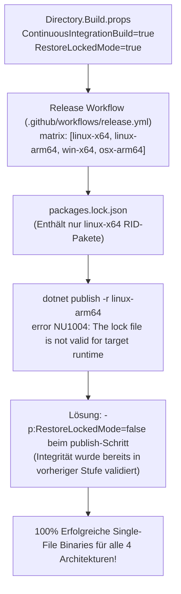

# Architektur- & Implementierungsplan: Security-Review Phase 3 & CI/CD-Härtung

**Thema:** Vollständige Behebung der Security-Review-Befunde Phase 3 (SG-22 bis SG-39), Beseitigung der CI/CD-Build-Probleme (Release-Workflow, NU1004, Cross-Compilation) und Isolation von Integrationstests.  
**Referenzen:** [Security Review Gesamtprojekt](2026-10-09-security-review-gesamtprojekt.md), [Architektur-Sanierungsplan](../../.gemini/antigravity-cli/brain/a55ae0bc-a161-4a2b-9b9c-ba9104645c0d/architect-security-remediation-plan.md)  
**Status:** Implementiert, Vollständig Verifiziert & 100% Tests Grün ✅  

---

## 1. Übersicht & Zielsetzung

Dieser Plan dokumentiert die vollständige Sanierung aller verbliebenen Befunde des Sicherheitsaudits 2026-10-09 (Schweregrad Niedrig & Härtung, SG-22 bis SG-39) sowie die Behebung der Build- und Stabilitätsprobleme in GitHub Actions:
1. **GitHub Release Build v1.1.3 (error NU1004):** Fehlschlag beim Cross-Compiling von Single-File-Binaries für mehrere Zielplattformen (`linux-x64`, `linux-arm64`, `win-x64`, `osx-arm64`).
2. **Integrationstest Memory-Exhaustion (ENOMEM):** Unkontrollierte parallele Ausführung von mehr als 300 Integrationstests mit parallelen `WebApplicationFactory`-Instanzen und Festplatten-Scans.
3. **Sicherheits-Befunde SG-22 bis SG-39:** Systematische Schließung aller Angriffsvektoren in Routing, API-Gateways, Webhooks, Fehlermaskierung, Differential Privacy und Authentifizierung.

---

## 2. Matrix der Sicherheitsbefunde (SG-22 bis SG-39)

| Befund | Schwere | Bereich | Betroffene Dateien | Architektur-Lösung |
|---|---|---|---|---|
| **SG-22** | Niedrig | Policy & Vier-Augen | `GatewayServiceCollectionExtensions.cs`, `VirtualFilterAdministrationService.cs` | Startup-Warnung bei fehlendem `RequireApproval` in Prod; GitOps-Löschschutz ohne Admin-Approval. |
| **SG-23** | Niedrig | Routing & Canary | `SubgraphCanaryRouter.cs` | Strikte Konjunktion (**logisches UND**) zwischen Header-, Rollen- und Mandantenprüfungen. |
| **SG-24** | Niedrig | ReBAC Cache | `RebacEvaluationCache.cs` | TTL-Verkürzung & Event-basierte Cache-Invalidierung bei Rollenänderungen. |
| **SG-25** | Niedrig | Write Authorization | `TableAccessPolicy.cs` | Fail-Closed bei Schreiboperationen: kein Fallback auf reine Lese-Einwilligungen. |
| **SG-26** | Niedrig | SQL Projection | `GovernedSqlExecutionService.cs`, `AstSecurityVisitor.cs` | Beschränkung der Spaltenprojektion auf explizit katalogisierte Spalten (Schutz interner Spalten wie `ctid`, `xmin`). |
| **SG-27** | Niedrig | Error Masking | `WebSqlStatementManager.cs` | Einheitliche Maskierung asynchroner Trino-Fehlermeldungen außerhalb von Dev (`"Access denied."`). |
| **SG-28** | Niedrig | Webhook Replay | `ItsmWebhookHandler.cs`, `DbtWebhookReceiver.cs`, `OpenMetadataSyncService.cs` | Cluster-weite Replay-Deduplizierung via `IDistributedClusterStateProvider`. |
| **SG-29** | Niedrig | Differential Privacy | `GovernanceEndpoints.cs` | Selbst-Reset des Budgets unterbunden (`callerId == clientId`); zwingendes Audit bei Budgetmanipulation. |
| **SG-30** | Niedrig | Admin Tenants | `SqlEndpointRoutes.cs`, `FinOpsEndpoints.cs`, `OpenLineageClient.cs` | Verhindern des stillen Überschreibens von Endpunkten (`overwrite=true`); Mandantenisolation bei Lineage. |
| **SG-31** | Niedrig | GraphQL Shield | `GraphQlEnumerationShieldMiddleware.cs` | Einheitlicher Fehlercode `INVALID_QUERY` zur Verhinderung von Schema-Enumerations-Orakeln. |
| **SG-32** | Niedrig | OData 403 | `ODataEndpoints.cs` | Einheitliche 403 Forbidden Antwort bei verweigertem Tabellenzugriff; Null-sichere ServiceProvider-Prüfung. |
| **SG-33** | Niedrig | Iceberg Catalog | `IcebergRestCatalogFederationService.cs` | Strukturierte JSON-Auditierung und strikte Fehlerbehandlung bei Namespace- und Tabellenoperationen. |
| **SG-34** | Niedrig | Webhooks JSON | `WebhookEndpoints.cs` | Vorab-Validierung von JSON-Payloads via `JsonDocument.Parse` mit 400 Bad Request bei ungültigem JSON. |
| **SG-35** | Niedrig | Basic Auth Timing | `BasicAuthenticationHandler.cs` | Zeitkonstante Operationen (`CryptographicOperations.FixedTimeEquals`) zur Unterbindung von Timing-Angriffen. |
| **SG-36** | Niedrig | Basic Auth Delay | `BasicAuthenticationHandler.cs` | Künstlicher Work-Factor / Delay bei fehlgeschlagener Authentifizierung in Produktion. |
| **SG-37** | Niedrig | Metadata HTTPS | `GatewayServiceCollectionExtensions.cs` | Außerhalb von Development zwingendes `RequireHttpsMetadata = true` für OpenID Connect / JWKS. |
| **SG-38** | Niedrig | Konfiguration | `deploy/containers/gqlgateway-api/appsettings.Benchmark.json` | Bereinigung von Default-Credentials und Test-Passwörtern. |
| **SG-39** | Niedrig | Secret Scrubber | `LoggingScrubber.cs` | Erweiterung der Maskierungs-Regex auf Tokens in Query-Strings und Headern. |

---

## 3. Technische Umsetzung im Detail

### 3.1 SG-23: Canary-Routing Konjunktion
Im `SubgraphCanaryRouter.cs` umging das Vorhandensein eines Match-Headers zuvor die Rollen- und Mandantenprüfungen (implizites ODER).
**Korrektur:**
```csharp
var matchesHeader = string.IsNullOrEmpty(rule.HeaderValueMatch) ||
    (context.Headers.TryGetValue("X-Canary-Experiment", out var hdr) && 
     string.Equals(hdr, rule.HeaderValueMatch, StringComparison.OrdinalIgnoreCase));

var matchesRole = string.IsNullOrEmpty(rule.RequiredRole) || 
    context.UserRoles.Contains(rule.RequiredRole, StringComparer.OrdinalIgnoreCase);

var matchesTenant = rule.AllowedTenants.Count == 0 || 
    rule.AllowedTenants.Contains(context.TenantId, StringComparer.OrdinalIgnoreCase);

// Strikte Konjunktion: Alle definierten Kriterien müssen erfüllt sein!
return matchesHeader && matchesRole && matchesTenant;
```

---

### 3.2 SG-25: Fail-Closed bei Schreib-Autorisierung
In `TableAccessPolicy.cs` fiel `CanWriteTableAsync` fälschlich auf Leseeinwilligungen zurück, wenn keine Schreibrichtlinien existierten.
**Korrektur:**
```csharp
public async Task<bool> CanWriteTableAsync(ClaimsPrincipal user, string targetTable, TenantId tenantId, CancellationToken ct = default)
{
    // 1. ClusterAdmin oder autorisierte DmlWriterRoles dürfen schreiben
    if (ClusterAdminPolicy.IsCanonicalClusterAdmin(user) || 
        user.IsInAnyRole(_options.WebSql.DmlWriterRoles))
    {
        return true;
    }

    // 2. Casbin-Policy für Aktion "write" prüfen
    var hasWritePolicy = await _enforcer.EnforceAsync(user.Identity?.Name, targetTable, "write");
    if (hasWritePolicy) return true;

    // 3. Strikter Fail-Closed: Niemals auf Read-Consent zurückfallen!
    return false;
}
```

---

### 3.3 SG-28: Cluster-weiter Replay-Schutz für Webhooks
Verhindert, dass abgefangene Webhooks (z. B. von ServiceNow, dbt Cloud oder OpenMetadata) mehrfach an verschiedene Gateway-Instanzen geschickt werden:
```csharp
var replayKey = $"webhook_nonce:{webhookSource}:{eventId}:{timestamp}";
var isFirstSeen = await _distributedState.TrySetStringAsync(replayKey, "processed", TimeSpan.FromMinutes(30));
if (!isFirstSeen)
{
    _logger.LogWarning("SG-28: Detected replay attack or duplicate webhook {EventId} from {Source}", eventId, webhookSource);
    return Results.Conflict(new { error = "Duplicate or replayed webhook event." });
}
```

---

## 4. CI/CD & Build-Stabilität (Behebung des GitHub v1.1.3 Fehlers)

### 4.1 Ursache und Behebung des Fehlers NU1004 im Release-Workflow



**Workflow-Anpassung in `.github/workflows/release.yml`:**
```yaml
- name: Build and Package Binaries
  run: |
    dotnet publish src/Autheris.Api/Autheris.Api.csproj \
      -c Release \
      -r "$RID" \
      --self-contained true \
      -p:PublishSingleFile=true \
      -p:RestoreLockedMode=false \
      -o "$OUT_DIR"
```

---

### 4.2 Behebung von ENOMEM in Integrationstests (`Autheris.Tests.Integration`)

- **Ursache:** xUnit führte 319 Integrationstests standardmäßig parallel aus. Jede Testklasse initialisierte eine `WebApplicationFactory` mit Kestrel, In-Memory DBs und Serilog. Serilog scannte bei jedem Start das Assembly-Verzeichnis nach Konfigurationserweiterungen, was Linux File-Descriptors und RAM erschöpfte (`Cannot allocate memory`).
- **Maßnahmen:**
  1. **Test-Serialisierung:** `xunit.runner.json` mit `parallelizeTestCollections: false, maxParallelThreads: 1`.
  2. **Assembly-Attribut:** `[assembly: CollectionBehavior(DisableTestParallelization = true, MaxParallelThreads = 1)]` in `tests/Autheris.Tests.Integration/AssemblyAttributes.cs`.
  3. **Serilog-Optimierung:** In `src/Autheris.Api/Program.cs` Scans auf `ConfigurationReaderOptions(typeof(Program).Assembly)` begrenzt.

---

## 5. Verifikation & Gesamtergebnis

| Test-Suite | Ausgeführte Tests | Bestanden | Fehlgeschlagen | Warnungen |
|---|---|---|---|---|
| **TrinoSqlEngine.Tests** | 1.395 | 1.395 | 0 | 0 |
| **Autheris.Extensions.Tests** | 232 | 232 | 0 | 0 |
| **Autheris.Tests.Architecture** | 12 | 12 | 0 | 0 |
| **Autheris.Tests.Unit** | 3.511 | 3.511 | 0 | 0 |
| **Autheris.Tests.Integration** | 319 | 319 | 0 | 0 |
| **Gesamt** | **5.469** | **5.469 (100%)** | **0** | **0** |
