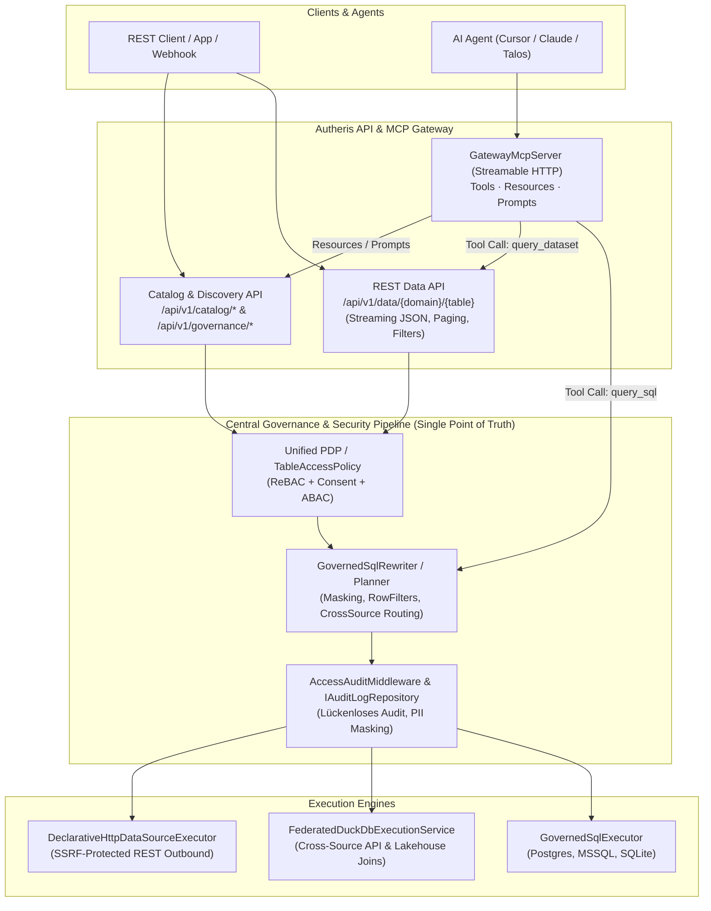

# Implementierungsplan: Vollständige Daten-Verfügbarkeit per API & Bereitstellung für MCP

**Dokument-ID:** `PLAN-DATA-API-MCP-08`  
**Referenzen:** [Feature Request: Admin-Datenquellen & MCP (R-54 bis R-66)](2026-10-09-feature-request-admin-datenquellen-und-mcp.md), [Befunde v1.1.5](2026-10-09-poc-befunde-v1-1-5.md), [Gesamtübersicht](00-gesamtplan-uebersicht.md)  
**Rolle:** C# & .NET Solution Architect  
**Status:** Entwurf / Bereit zum Review ⏳  

---

## 1. Ausgangslage & Zielbild

### 1.1 Ausgangslage
Autheris fungiert als zentrales Enterprise Data Governance Gateway für heterogene Datenquellen (SQL Server, PostgreSQL, SQLite, DuckDB OLAP, Iceberg/Delta Lakehouse, HTTP-APIs und Plugins).
Bisherige Zugriffspfade und MCP-Fähigkeiten weisen jedoch funktionale Asymmetrien auf:
1. **Lückenhafter REST-Datenzugriff:** Es existieren spezialisierte Protokolle (GraphQL, OData v4, WebSQL/Trino, Arrow Flight SQL), aber **keine leichtgewichtige, universelle REST-Data-API**, über die Client-Applikationen oder Webhooks Datensätze direkt und standardisiert per `GET /api/v1/data/{domain}/{table}` mit Paging und Filterung abfragen können.
2. **Eingeschränkte MCP-Werkzeuge:** Der MCP-Server bietet derzeit nur 4 Built-In Tools (`list_datasets`, `describe_dataset`, `sample_rows`, `query_graphql`). Ein KI-Modell / Agent (Cursor, Claude Code, Windsurf, Talos) kann bisher:
   - keine direkten SQL-Abfragen via MCP ausführen (obwohl WebSQL existiert),
   - keine standardisierten REST-Querys absetzen,
   - den Datenkatalog nicht durchsuchen (`search_catalog`),
   - seine eigenen Berechtigungen und Maskierungsgründe nicht transparent prüfen (`get_my_permissions`),
   - keine MCP-Ressourcen (`autheris://...`) zur nativen Kontextanreicherung abonnieren,
   - keine Datenquellen administrieren oder Freigaben per MCP steuern (Anforderungen R-54 bis R-66).

### 1.2 Zielbild
1. **100% Governed REST Data API:** Sämtliche Datensätze aller angebundenen Quellen (SQL, APIs, Lakehouse) sind konsistent über einfache, performante REST-Endpunkte abrufbar – vollständig geschützt durch dieselbe Governance-Pipeline (ReBAC, ABAC, Column-Masking, Mandatory Row Filters, Tenant-Isolation und lückenloses Zugriffs-Audit).
2. **Self-Governed Control Plane (Autheris sichert Autheris selbst ab):** Alle administrativen und funktionalen Features von Autheris (Katalog-Management, Freigabe-Erteilung, ReBAC-Tupel-Pflege, Virtuelle Filter, Secrets-Verwaltung, Datenquellen-Onboarding, Schema Contracts, Audit-Log-Abfragen) stehen über eine standardisierte REST-API zur Verfügung. **Diese APIs werden über dieselben Mechanismen von Autheris selbst geschützt:**
   - Control-Plane-Ressourcen sind als virtuelle Governed-Entitäten modelliert (`domain:governance`, `schema:system`).
   - Autorisierung erfolgt über ReBAC (`user:X can_manage domain:sales`, `user:X can_grant table:lakehouse.dbo.orders`) und PDP-Regeln.
   - Jeder administrative Eingriff wird lückenlos im signierten Audit-Log dokumentiert.
3. **Vollständige MCP-Verfügbarkeit & -Dokumentation:** Sämtliche APIs und Features sind dem MCP bekannt:
   - **Tools:** Jedes Feature verfügt über passende MCP-Tools (Datenabfragen, Discovery, Permissions-Check, Administration mit Bestätigung).
   - **Dokumentation als MCP-Ressource:** Vollständige OpenAPI-Spezifikationen (`autheris://api/openapi.json`) und Markdown-Endpunkt-Referenzen (`autheris://api/docs/endpoints`) werden für AI-Modelle direkt als MCP-Ressourcen publiziert.
4. **Strenge Sicherheitsinvarianten:** Single Point of Governance (kein Bypass), Least-Privilege-Trennung zwischen Lese- und Admin-Tools, Bestätigungsnachweis außerhalb des LLM für Schreiboperationen, vollständige Geheimnis-Redaction.

### 1.3 Architekturentscheidungen (Review 09.10.2026)

| ADR | Thema | Entscheidung | Begründung & Invariante |
|---|---|---|---|
| **ADR-01** | **Self-Governance Modellierung** | **Virtuelle System-Tabellen (`system.*`)**: Administrative Control-Plane-Daten (Quellen, Policies, ReBAC-Tupel, Audit-Logs) werden als interne System-Tabellen im Katalog geführt (`governance.system.*`). | Konsistenz über alle Protokolle: Administrative Entitäten können wie jede Geschäftsdaten-Tabelle über REST (`/api/v1/data/governance/system/*`), WebSQL (`SELECT * FROM governance.system.datasources`) und GraphQL abgefragt und über dieselbe `TableAccessPolicy` geschützt werden. |
| **ADR-02** | **MCP-Tool-Granularität** | **Hybrides Tooling**: Dedizierte, stark typisierte High-Level-Tools für 95% der Standardaufgaben plus ein universelles `invoke_api`-Werkzeug. | High-Level-Tools minimieren Token-Verbrauch und Validierungsfehler bei Routineaufgaben. `invoke_api` garantiert 100%ige Abdeckung sämtlicher Endpunkte basierend auf der publizierten OpenAPI-Spezifikation. |
| **ADR-03** | **Schreibzugriffe über MCP** | **Two-Phase Confirmation (Human-in-the-Loop)**: Änderungen werden durch das Modell im ersten Schritt vorbereitet (`admin_plan_access` / `admin_plan_datasource`). Die Ausführung verlangt zwingend einen kurzlebigen Bestätigungs-Token (`confirmationToken`) aus der Web-UI. | Verhindert Prompt-Injection-Angriffe, bei denen manipulierte Dateninhalte das Modell dazu bringen könnten, administrative Freigaben ohne menschliche Kontrolle zu erteilen. |
| **ADR-04** | **MCP-Dokumentation als Ressourcen** | **Native MCP-Ressourcen für API-Spezifikation (`autheris://api/*`)**: OpenAPI 3.1 (`openapi.json`) und Markdown-Endpunkt-Referenzen werden als native MCP-Ressourcen und Prompts bereitgestellt. | Erlaubt Agenten das Zero-Shot-Verständnis aller Schnittstellen ohne Halluzinationen oder manuell gepflegte System-Prompts. |
| **ADR-05** | **2FA / MFA Step-Up-Verifikation für Freigaben** | **Standard TOTP (RFC 6238)** *(MS Authenticator, Google Authenticator, 1Password, Bitwarden)*: Bei kritischen Control-Plane-Aktionen (z.B. `admin_apply_access`, Rechteerweiterungen, HitL-Freigaben) wird die Bestätigung (`confirmationToken` / `ApproveStepUpRequestAsync`) zwingend an einen 6-stelligen TOTP-Code gekoppelt (per `Otp.Net` oder nativer Krypto-Engine, Enrollment via standardisierter `otpauth://`-URI & QR-Code, Replay-Schutz im verteilten State). | Höchste Interoperabilität ohne Cloud-Lock-in: Jeder RFC 6238 konforme Authenticator (Microsoft Authenticator, Google Authenticator, 1Password) funktioniert offline und standardisiert. Kein administrativer Eingriff ohne physischen zweiten Faktor. |

---

## 2. Architektur-Übersicht & Datenfluss



---

## 3. Detaillierte Spezifikation der Komponenten

### 3.1 Säule 1: Universelle Governed REST Data API

#### Endpunkte (`src/Autheris.Api/Endpoints/DatasetDataEndpoints.cs`)
- `GET /api/v1/data/{domain}/{schema}/{table}` bzw. `GET /api/v1/data/{datasetId}`
  - **Query-Parameter:**
    - `select`: Kommagetrennte Liste gewünschter Spalten (z. B. `id,amount,status`).
    - `filter`: Prädikate (z. B. `status eq 'active' and amount gt 100`). Unterstützt sichere AST-Übersetzung analog WebSQL-Prädikate.
    - `orderBy`: Sortierung (z. B. `createdDate desc`).
    - `limit`: Zeilenbegrenzung (Default: 50, Max: konfigurierbar via `GatewayOptions.DataApi.MaxPageSize`, Default 1.000).
    - `offset`: Offset-Paging.
  - **Sicherheits- & Governance-Garantie:**
    - Wird intern als deterministischer AST-Select formuliert und durch `GovernedSqlExecutionService` bzw. `IFederatedQueryExecutionService` ausgeführt.
    - Maskierte Spalten werden serverseitig vor der Ausgabe maskiert (Klartext nur bei explizitem `AccessProfile` / Consent).
    - Unzulässige Spalten (Status `Deny`) führen zu `400 Bad Request` mit präziser Governance-Meldung.
    - Verhindert Oracle Inference Attacks: Filterung oder Sortierung auf maskierten Spalten ist strikt verboten.
  - **Streaming & Memory-Effizienz:**
    - Serialisierung erfolgt direkt über `System.Text.Json.Utf8JsonWriter` auf `HttpResponse.BodyWriter` (keine Pufferung von 10.000 DTOs im RAM).
    - Antwort-Envelope:
      ```json
      {
        "dataset": "sales.public.orders",
        "count": 50,
        "offset": 0,
        "limit": 50,
        "hasMore": true,
        "columns": [
          { "name": "id", "type": "int", "masked": false },
          { "name": "customer_email", "type": "varchar", "masked": true }
        ],
        "data": [
          { "id": 1001, "customer_email": "d***@example.com" }
        ]
      }
      ```

- `GET /api/v1/data/{domain}/{schema}/{table}/{id}`
  - Gezielter Einzeldatensatz-Abruf über Primärschlüssel.

#### Katalog- & Discovery-Endpunkte (`src/Autheris.Api/Endpoints/CatalogApiEndpoints.cs`)
- `GET /api/v1/catalog/datasets`
  - Liefert alle Datensätze, für die der aktuelle Aufrufer mindestens Leserechte (`can_query` / Consent) besitzt.
  - Enthält Domäne, Schema, Tabelle, Quelltyp (`Sql`, `HttpDeclarative`, `Lakehouse`), Sensitivitäts-Klassifikation und Beschreibung.
- `GET /api/v1/catalog/datasets/{datasetId}`
  - Detailliertes Schema eines Datensatzes: Spaltenliste, Datentypen, Primärschlüssel, Relationen und der für den Aufrufer geltende Maskierungsstatus (`clear`, `mask`, `deny`).
- `GET /api/v1/catalog/datasources`
  - Liste aller angebundenen Datenquellen samt Status (`healthy`, `degraded`, `inactive`), Typ und letztem Sync-Zeitstempel (ohne Geheimnisse!).
- `GET /api/v1/catalog/search?q={query}&domain={domain}`
  - Volltext- und Tag-Suche über Datensätze, Beschreibungen und Spaltennamen.

#### Self-Service Permissions API (`src/Autheris.Api/Endpoints/GovernanceApiEndpoints.cs`)
- `GET /api/v1/governance/me/access`
  - Transparenz für den Benutzer/Agenten: Zeigt auf einen Blick alle freigegebenen Datensätze, die geltenden Maskierungsstufen je Spalte und hinterlegte Zeilenfilter.

---

### 3.2 Säule 2: Umfassende Bereitstellung für MCP (Model Context Protocol)

#### 3.2.1 Erweiterte MCP Tools

| Werkzeug | Kategorie | Beschreibung & Schema | Ziel-Komponente |
|---|---|---|---|
| `query_sql` | Abfrage | Führt sichere Governed SQL/WebSQL-Abfragen aus (mit RLS, Column-Masking, Limitierung).<br/>`{"query": "SELECT id, status FROM sales.public.orders LIMIT 10"}` | `GovernedSqlExecutionService` |
| `query_dataset` | Abfrage | Einfache Abfrage ohne SQL/GraphQL-Syntax: `dataset`, `columns`, `filter`, `orderBy`, `limit`, `offset`. | `DatasetDataEndpoints` Logik |
| `search_catalog` | Discovery | Sucht Datensätze anhand von Stichworten, Tags oder Spaltennamen.<br/>`{"query": "kunden umsatz", "domain": "sales"}` | `ITableMetadataRepository` |
| `get_my_permissions` | Governance | Prüft, welche Spalten für die aktuelle Identität freigegeben oder maskiert sind.<br/>`{"dataset": "sales.public.orders"}` | `TableAccessPolicy` |
| `list_datasources` | Discovery | Listet angebundene Datenquellen und Konnektoren auf. | `ITableMetadataRepository` |
| `get_data_lineage` | Compliance | Zeigt Herkunft und Datenfluss eines Datensatzes. | `ILineageGraphStore` |
| `describe_api` | Discovery | Liefert für einen bestimmten Endpunkt Parameter, Typen und Verwendungsbeispiele.<br/>`{"endpoint": "/api/v1/data/{domain}/{table}"}` | OpenAPI-Metadaten |
| `invoke_api` | Universal | Universeller Aufruf jedes dokumentierten Autheris-Endpunkts (REST, Control-Plane) unter voller ReBAC/Audit-Kontrolle.<br/>`{"endpoint": "/api/v1/catalog/datasets", "method": "GET", "parameters": {...}}` | `ApiDispatcherService` |

#### 3.2.2 Admin MCP Tools (R-60 bis R-63)
Nur sichtbar und aufrufbar für Aufrufer mit Rolle `GovernanceAdmin` oder `TenantAdmin`:

| Werkzeug | Zweck & Sicherheitsleitplanke |
|---|---|
| `admin_register_datasource` | Registriert neue Datenquellen aus OpenAPI/Swagger (R-54) ohne Klartext-Secrets. |
| `admin_set_dataset_state` | Aktiviert oder sperrt Datensätze (`active`/`inactive`, R-58). |
| `admin_resolve_principal` | Löst Namen („david“, „philipp“) deterministisch in SIDs/Objekt-IDs auf (R-61). |
| `admin_plan_access` | Erzeugt einen Freigabe-Plan (Vorher/Nachher-Diff je Spalte, Warnungen) mit `planId` (R-60). **Ändert nichts!** |
| `admin_apply_access` | Wendet Freigabeplan an. **Zwingend erforderlich:** Bestätigungsnachweis `confirmationToken` (R-62, Human-in-the-Loop). |
| `admin_revoke_access` | Entzieht Freigaben je Person und Datensatz (R-64). |

#### 3.2.3 MCP Resources (Nativer Kontext für LLMs)

MCP-Clients können Ressourcen direkt abonnieren:
- `autheris://catalog/summary`: Kompakter Markdown-Katalog aller für den Principal sichtbaren Datenbestände.
- `autheris://catalog/datasets/{datasetId}/schema`: Vollständiges Schema eines Datensatzes als strukturierte JSON/Markdown-Tabelle.
- `autheris://catalog/datasources`: Status und Typ aller verfügbaren Datenquellen.
- `autheris://governance/my-access`: Geltende Richtlinien und Maskierungsstufen der aktuellen Sitzung.

#### 3.2.4 MCP Prompts (Geführte Workflows)
- `explore_dataset(dataset)`: Führt den Agenten durch Metadaten, Schema, Beispieldaten und Best Practices zur Abfrage.
- `audit_access_compliance(dataset, principal)`: Ermittelt Berechtigungsunterschiede zwischen Rollen oder Personen für Compliance-Berichte.

---

### 3.3 Säule 3: Self-Governing Control Plane (Autheris Governs Autheris)

Jedes administrative Feature von Autheris wird über standardisierte REST-APIs bereitgestellt und **über dieselben Schutzmechanismen von Autheris selbst abgesichert**:

1. **System- & Governance-Ressourcen im Autheris-Katalog (`governance.system.*`):**
   Administrative Entitäten werden als interne System-Tabellen im Metadaten-Katalog geführt:
   - `governance.system.datasources`:
     - Spalten: `id` (string, PK), `name` (varchar), `domain` (varchar), `type` (varchar), `base_url` (varchar), `is_configured` (bool), `status` (varchar: active/inactive/degraded), `created_at` (timestamp), `updated_at` (timestamp).
     - *Invariante:* Keine Spalte für Secrets. Credentials liegen isoliert im `IKeyVaultSecretProvider`.
   - `governance.system.policies`:
     - Spalten: `id` (string, PK), `table_id` (varchar), `column_name` (varchar), `sensitivity` (varchar: PUBLIC, CONFIDENTIAL, SECRET), `masking_type` (varchar: clear, mask, hash, nullify), `classification_tags` (varchar/json).
   - `governance.system.rebac_tuples`:
     - Spalten: `user` (varchar), `relation` (varchar: can_query, can_manage, can_grant, viewer, admin), `object` (varchar: table:*, domain:*).
   - `governance.system.virtual_filters`:
     - Spalten: `id` (string, PK), `table_id` (varchar), `principal` (varchar), `filter_expression` (varchar), `valid_until` (timestamp).
   - `governance.system.audit_trail`:
     - Spalten: `id` (string, PK), `timestamp` (timestamp), `actor_sid` (varchar), `channel` (varchar: rest, mcp, websql), `action` (varchar), `target` (varchar), `correlation_id` (varchar), `worm_signature` (varchar).
2. **Rekursive Absicherung via `TableAccessPolicy` & ReBAC:**
   - Ein Aufrufer (z.B. Administrator oder Agent) kann `system.policies` oder `system.datasources` nur modifizieren oder lesen, wenn er die entsprechende Berechtigung besitzt:
     - `user:alice can_manage domain:sales` $\rightarrow$ darf nur Quellen und Freigaben der Domäne `sales` verwalten.
     - `user:bob viewer domain:finance` $\rightarrow$ darf Metadaten sehen, aber keine Freigaben erteilen (`can_grant` verweigert).
     - Fehlen die nötigen ReBAC-Tupel, greift Fail-Closed (`403 Forbidden`).
3. **Mandatory Audit aller Control-Plane-Aktionen:**
   - Jede Mutation (Anlegen von Datenquellen, Ändern von Maskierungsregeln, Löschen von Filtern) wird mit dem vollständigen Akteur-Kontext, der Korrelations-ID, dem Weg (REST vs. MCP) und einem kryptografisch verketteten Audit-Record erfasst.

---

### 3.4 Säule 4: Native MCP-Dokumentation & Selbstbeschreibung

Damit AI-Modelle alle APIs und Features fehlerfrei und ohne Halluzinationen bedienen können, publiziert Autheris seine vollständige API-Dokumentation über das MCP-Protokoll:

1. **MCP API-Ressourcen:**
   - `autheris://api/openapi.json`: Die vollständige, validierte OpenAPI 3.1 Spezifikation aller REST-Endpunkte.
   - `autheris://api/docs/endpoints`: Eine LLM-optimierte Markdown-Übersicht aller Endpunkte mit Parametern, Authentifizierungs-Anforderungen und Beispielen.
   - `autheris://api/docs/mcp-tools`: Referenz aller verfügbaren MCP-Tools mit JSON-Schemas und Nutzungsbeispielen.
2. **MCP Tool `describe_api`:**
   - Schema: `{"endpoint": string, "method": string?}`
   - Erlaubt dem Agenten, zur Laufzeit gezielt die Dokumentation, Parameter und Schemata eines spezifischen Endpunkts abzufragen:
     `describe_api(endpoint: "/api/v1/data/{domain}/{table}")` $\rightarrow$ Liefert Markdown-Spezifikation, Query-Parameter und Beispiel-Requests.
3. **MCP Tool `invoke_api`:**
   - Schema: `{"endpoint": string, "method": "GET"|"POST"|"PUT"|"DELETE", "parameters": object?, "body": object?}`
   - Dispatcher leitet universelle Anfragen an die internen Minimal-API-Handler weiter. Vollständige ReBAC- und Audit-Pipeline greift transparent.
4. **Entwickler-Workstream-Referenz:**
   - Alle Implementierungsdetails, Klassenverträge, DTOs und Unit-Test-Spezifikationen für Entwickler-Agents sind in [plan-workstreams-entwickler-details.md](plan-workstreams-entwickler-details.md) detailliert ausgearbeitet.

---

## 4. Sicherheits- & Performance-Leitplanken

1. **Single Point of Governance (Kein Bypass):**
   - Weder die neue REST-Data-API noch MCP-Tools sprechen Datenquellen direkt an.
   - Alle Pfade nutzen den bestehenden `TableAccessPolicy`-PDP und `GovernedSqlRewriter`/`FederatedDuckDbExecutionService`.
2. **Anti-Leakage Secret Protection (Review G5):**
   - Zugangsdaten (API-Keys, Basic Auth, OAuth-Secrets) werden in APIs und MCP-Ressourcen **niemals** im Klartext zurückgegeben. Es wird ausschließlich `isConfigured: true` und der Zeitstempel geliefert.
3. **Zwei-Phasen-Freigabe & 2FA Step-Up für Mutationen (Human-in-the-Loop, R-62, ADR-05):**
   - Ein KI-Modell kann administrative Freigaben nur planen (`admin_plan_access`). Die Ausführung (`admin_apply_access` / `ApproveStepUpRequestAsync`) erfordert zwingend:
     1. Einen signierten, zeitlich begrenzten Bestätigungs-Token (`confirmationToken`) aus der Admin-Web-UI oder dem HitL-System.
     2. Für sicherheitskritische Aktionen (z.B. Privilege Escalation, Rechteerweiterungen auf unmaskierte PII): **2FA/MFA-Verifikation (TOTP RFC 6238 via `Otp.Net` oder native HMAC-SHA256 mit Replay-Schutz)**.
4. **Zero-Allocation Streaming & Bounded Quotas:**
   - Resultate über REST und MCP sind auf max. 1.000 Zeilen pro Aufruf begrenzt.
   - JSON-Streaming verhindert Memory-Spikes und GC-Pressure.

---

## 5. Phasenbasierter Implementierungsplan

### Phase 0: Architektur-Grundlagen & Verträge (Tag 1)
- [ ] DTOs und Response-Modelle für REST Data API und Catalog API in `Autheris.Domain.Model` anlegen.
- [ ] Definition der Interfaces `IGovernedDataQueryService`, `ICatalogDiscoveryService`, `IApiDispatcherService` und `ITotpVerificationService` in `Autheris.Application.Interfaces`.
- [ ] Fehlertests (Red Tests) für unautorisierten Datenzugriff, Paging-Limits, Spaltenmaskierung über REST und ungültige 2FA-Tokens schreiben.

### Phase 1: Governed REST Data API & Virtuelle System-Tabellen (Tag 2)
- [ ] Implementierung `GovernedDataQueryService`: Übersetzung von REST-Parametern (`select`, `filter`, `orderBy`, `limit`, `offset`) in AST-Queries.
- [ ] Registrierung der internen System-Tabellen (`governance.system.datasources`, `governance.system.policies`, `governance.system.rebac_tuples`, `governance.system.virtual_filters`, `governance.system.audit_trail`) als Governed System-Entities.
- [ ] Implementierung `DatasetDataEndpoints.cs`: Minimal APIs für `/api/v1/data/{domain}/{schema}/{table}` und `/api/v1/data/{datasetId}`.
- [ ] Direkte Utf8JsonWriter-Streaming-Ausgabe auf den Response-Stream.
- [ ] Verifikation: 100% Pre-Staging-Masking und RLS bei REST-Abfragen sowohl auf Business- als auch System-Tabellen.

### Phase 2: Catalog & Self-Service Permission APIs (Tag 3)
- [ ] Implementierung `CatalogApiEndpoints.cs` (`/api/v1/catalog/datasets`, `/api/v1/catalog/datasources`, `/api/v1/catalog/search`).
- [ ] Implementierung `GovernanceApiEndpoints.cs` (`/api/v1/governance/me/access`).
- [ ] Integration in OpenAPI/Swagger-Dokumentation (`/swagger` & `/api/docs`).

### Phase 3: MCP Tools Erweiterung (Hybrid Tooling) (Tag 4)
- [ ] Erweiterung `McpDatasetTools.cs`: Tool-Definitionen für:
  - High-Level: `query_sql`, `query_dataset`, `search_catalog`, `get_my_permissions`, `list_datasources`, `get_data_lineage`.
  - Universal: `describe_api` und `invoke_api` zur Ausführung beliebiger dokumentierter Endpunkte.
- [ ] Dispatching in `GatewayMcpServer.cs` und Anbindung an `GovernedSqlExecutionService` sowie `IApiDispatcherService`.
- [ ] Result-Formatter: Kompakte Markdown- und JSON-Ausgabe mit Token-Budget-Überwachung.

### Phase 4: MCP Resources & Prompts (Tag 5)
- [ ] Implementierung von Resource-Handlern in `GatewayMcpServer.cs` für:
  - Datenkontext: `autheris://catalog/summary`, `autheris://catalog/datasets/{datasetId}/schema`, `autheris://catalog/datasources`, `autheris://governance/my-access`.
  - API-Dokumentation: `autheris://api/openapi.json`, `autheris://api/docs/endpoints`, `autheris://api/docs/mcp-tools`.
- [ ] Implementierung von MCP Prompts (`explore_dataset`, `audit_access_compliance`).
- [ ] Integration mit `ISemanticMcpCompiler`.

### Phase 5: Admin MCP Tools, Two-Phase-Confirmation & 2FA Step-Up (RFC 6238 TOTP) (Tag 6)
- [ ] Umsetzung der Anforderungen R-54 bis R-64:
  - `admin_register_datasource` (OpenAPI/Swagger Ingestion mit SecretRef)
  - `admin_set_dataset_state` (Aktivieren/Deaktivieren)
  - `admin_resolve_principal` (Namen $\rightarrow$ SID Auflösung)
  - `admin_plan_access` (Vorschau / Diff ohne Seiteneffekte)
  - `admin_apply_access` mit zwingendem `confirmationToken` (Two-Phase Confirmation / Human-in-the-Loop)
- [ ] **RFC 6238 TOTP 2FA Step-Up Integration (MS Authenticator, Google Authenticator, 1Password):**
  - `TotpVerificationService` (RFC 6238 TOTP via `Otp.Net` oder native Krypto) mit Zeittoleranz (+/- 30s) und Nonce/Replay-Protection im Distributed Cluster State.
  - Endpunkte für 2FA-Enrollment (`GET /api/v1/governance/2fa/enroll` liefert `otpauth://totp/Autheris:...` und QR-Code zum Scannen mit beliebigen RFC 6238 Apps wie **Microsoft Authenticator, Google Authenticator oder 1Password**; `POST /api/v1/governance/2fa/verify-enrollment` zur Aktivierung).
  - Erweiterung von `HitLStepUpApprovalService.ApproveStepUpRequestAsync` und `POST /api/governance/hitl/tickets/{ticketId}/approve` um den 6-stelligen `totpCode`.
  - `admin_confirm_access` / `POST /api/governance/plans/{planId}/confirm` verifiziert den 2FA-Code vor Generierung des kurzlebigen `confirmationToken`.
- [ ] Strikte Rollentrennung: Admin-Tools nur für Administratoren sichtbar und ausführbar.

### Phase 6: E2E-Tests, Architektur-Tests & Dokumentation (Tag 7)
- [ ] xUnit-Tests in `Autheris.Tests.Unit` für alle neuen Endpunkte und MCP-Tools.
- [ ] Architektur-Tests in `Autheris.Tests.Architecture` (Clean Architecture, DI Lifetimes, File Length $\le 800$ Zeilen).
- [ ] Integrationstest mit Claude/MCP-Client gegen Staging.
- [ ] Aktualisierung von `arc42.md` und `00-gesamtplan-uebersicht.md`.

---

## 6. Abnahmekriterien & Verifikation

1. **REST Data API:** Jede im Katalog registrierte Tabelle kann über `GET /api/v1/data/{domain}/{table}` abgerufen werden. David sieht alle Spalten unmaskiert; Philipp sieht sensible Spalten maskiert; unberechtigte Tabellen liefern 403.
2. **MCP Daten-Abfrage:** Ein AI-Agent kann über `query_sql` und `query_dataset` Governed Abfragen ausführen. Das Ergebnis enthält korrekte Maskierung und keine internen Secrets.
3. **MCP Katalog-Discovery:** `search_catalog` und `autheris://catalog/summary` liefern dem Modell den aktuellen Stand des Datenkatalogs.
4. **Admin-Steuerung per MCP:** Ein Administrator kann über MCP eine Datenquelle vorschlagen, Freigaben planen und mit Bestätigungsnachweis anwenden. Ein normaler Benutzer sieht die Admin-Tools nicht.
5. **Code-Qualität:** 0 Build-Warnungen, 0 Fehler, alle Dateien $\le 800$ Zeilen, 100% bestehende Tests grün.
