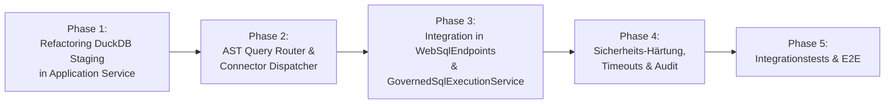

# Implementierungsplan: WebSQL-Unterstützung für heterogene Joins auf Web-APIs (Query Federation)

**Dokument-ID:** `PLAN-FEAT-WEBSQL-API-FEDERATION`  
**Referenzen:** [Feature DuckDB OLAP](../features/f-data-03-duckdb-olap.md), [Befund 1.1 / 1.2 WebSQL Parquet & Engine](../plans/2026-10-09-architecture-review.md), `GovernedSqlExecutionService.cs`, `DuckDbOlapEndpoints.cs`, `GovernedConnectorReader.cs`  
**Rolle:** C# & .NET Solution Architect & Security Expert  
**Status:** Bereit zur Umsetzung ⏳  

---

## 1. Ausgangslage & Problemstellung

Aktuell verhalten sich SQL-Abfragen über den WebSQL-/Trino-Endpunkt (`POST /v1/statement` sowie `POST /api/v1/sql`) wie folgt:
1. **Reiner Pushdown:** Der Trino-SQL-AST wird analysiert, mit RLS-Prädikaten und Maskierungsfunktionen angereichert und vollständig in den Ziel-SQL-Dialekt (PostgreSQL, T-SQL / SQL Server, SQLite) der Ziel-Datenbank kompiliert.
2. **Einschränkung auf homogene relationale Datenquellen:** Alle Tabellen einer WebSQL-Abfrage müssen aus derselben relationalen Datenbank stammen (`dsName = rewrite.DataSourceName`).
3. **Fehlverhalten bei Web-APIs:** Befindet sich im Query eine Tabelle vom Typ `DataSourceType.HttpDeclarative` oder stammen Tabellen aus unterschiedlichen Datenquellen (z. B. SQL Server `orders` und REST-API `shipments`), schlägt die Ausführung fehl (`GatewayInvalidQueryException` oder Verbindungsfehler), da relationale Datenbanken keine externen HTTP-Endpunkte abfragen können.

**Zielsetzung:**
Ein Anwender oder ein BI-Tool (DBeaver, PowerBI, Trino CLI, Superset) soll über den existierenden WebSQL-/Trino-Endpunkt nahtlos Abfragen ausführen können, die relationale Tabellen mit Web-APIs verknüpfen:
```sql
SELECT 
    o.order_id,
    o.customer_id,
    o.total_amount,
    s.carrier,
    s.tracking_status,
    s.estimated_delivery
FROM sql_crm.orders o
JOIN api_logistics.shipments s ON o.tracking_code = s.id
WHERE s.tracking_status = 'IN_TRANSIT'
  AND o.order_date >= '2026-01-01'
```

---

## 2. Zielarchitektur: Transparentes Query Federation Routing

Statt ein separates Drittanbieter-Framework einzuführen oder eine eigene Join-Engine in C# zu schreiben (Anti-Overengineering / YAGNI), nutzt Autheris seine bereits vorhandene, hochperformante In-Process Virtual Engine (**DuckDB & GovernedConnectorReader**).

```mermaid
flowchart TD
    Client["Client / BI-Tool (Trino CLI / PowerBI / WebSQL)"] -->|POST /v1/statement| Endpoint["WebSqlEndpoints"]
    
    subgraph WebSqlRouter["WebSQL Execution Router"]
        AST["Trino AST Parser & Table Identifier Extraction"]
        MetaLookup["Catalog Metadata Lookup<br/>(DataSourceType, Connectors)"]
        Decision{"Alle Tabellen aus<br/>derselben SQL-DB?"}
    end

    Endpoint --> AST
    AST --> MetaLookup
    MetaLookup --> Decision

    subgraph DirectPath["Homogener SQL Pushdown Pfad (Fast-Path)"]
        AstRewrite["AstSecurityVisitor<br/>(RLS & Dialect-Rewrite)"]
        DbConn["ISqlConnectionFactory<br/>(PostgreSQL / T-SQL / SQLite)"]
        AstRewrite --> DbConn
    end

    subgraph FederatedPath["Virtueller Federation Pfad (Cross-Source / API)"]
        subgraph Reader["Governed Extraction Pipeline"]
            SecPDP["Unified PDP<br/>(ReBAC, ABAC, Consent)"]
            SqlConn["SqlDataSourceConnector"]
            ApiConn["DeclarativeHttpDataSourceConnector"]
            GovReader["GovernedConnectorReader<br/>(RLS & Pre-Staging Masking)"]
        end
        
        subgraph MemoryEngine["In-Process Staging Engine"]
            DuckEngine["Transient DuckDB Session (:memory:)"]
            StageTbl["In-Memory Arrow/DuckDB Tables"]
        end
        
        FederationExec["IFederatedQueryExecutionService"]
    end

    Decision -->|Ja (100% SQL)| DirectPath
    Decision -->|Nein (API / Cross-Source)| FederatedPath
    
    FederatedPath --> SecPDP
    SecPDP --> SqlConn & ApiConn
    SqlConn & ApiConn --> GovReader
    GovReader --> StageTbl
    StageTbl --> DuckEngine
    DuckEngine --> FederationExec

    DirectPath --> Response["Standard WebSQL Response Stream (JSON / Parquet)"]
    FederationExec --> Response
```

---

## 3. Kernkomponenten & Entwurf

### 3.1 `FederationQueryRouter` (Erkennung heterogener Queries)
In `src/Autheris.Application/Sql/Services/GovernedSqlExecutionService.cs` bzw. als dedizierte Komponente:
- Extrahiert alle `TableIdentifier` aus dem AST (`statement.Accept(visitor)`).
- Lädt die Metadaten aller Tabellen über `ITableMetadataRepository`.
- **Klassifikationsregel:**
  - `IsHomogeneousSql`: Alle Tabellen besitzen `DataSourceType.Sql` **und** referenzieren denselben logischen `DataSourceName`.
  - `IsFederated`: Mindestens eine Tabelle besitzt `DataSourceType.HttpDeclarative` (oder `Plugin`), **oder** die Tabellen verteilen sich auf mehr als eine relationale Datenquelle.

### 3.2 Extraktion des Staging-Services (`IFederatedQueryExecutionService`)
Die Staging- und Abfrage-Logik aus `DuckDbOlapEndpoints.cs` wird in einen wiederverwendbaren Service im Application-Layer überführt:
```csharp
public interface IFederatedQueryExecutionService
{
    Task<DbDataReader> ExecuteFederatedQueryAsync(
        string trinoSql,
        IReadOnlyDictionary<string, object?>? parameters,
        IReadOnlyList<TableIdentifier> targetTables,
        ClaimsPrincipal user,
        TenantId tenantId,
        CancellationToken ct);
}
```

### 3.3 Datenfluss im Federation-Pfad
1. **Access Resolution & Pre-Filter Pushdown:**
   - Für jede beteiligte Tabelle wird `IUnifiedPolicyDecisionPoint.ResolveAccessAsync` aufgerufen (ReBAC, ABAC, Consents). Verweigerung -> sofortiger Abbruch (`403 Forbidden`).
   - Filterprädikate der SQL-Query, die sich eindeutig auf eine einzelne Quelltabelle beziehen (z. B. `o.order_date >= '2026-01-01'`), werden als `PushdownFilterSql` bzw. HTTP-Query-Parameter an den jeweiligen Connector übergeben.
2. **Governed Data Extraction (`GovernedConnectorReader`):**
   - Jede Tabelle wird über ihren zuständigen `IDataSourceConnector` gelesen.
   - **Kritische Sicherheitsinvariante:** Zeilenfilter und **Spaltenmaskierung** (Hashing, Redacting) werden bereits im `GovernedConnectorReader` angewandt, **bevor** die Daten in die DuckDB-Instanz geladen werden.
3. **Transient In-Memory Session in DuckDB:**
   - Erzeugen einer isolierten In-Memory-DuckDB-Instanz (`DuckDBConnection("Data Source=:memory:")`).
   - Registrierung der maskierten Datensätze als relationale Tabellen unter ihrem Schema-/Tabellennamen (bzw. Aliasen).
4. **Ausführung der Trino-/ANSI-SQL-Query:**
   - Die Originalabfrage (oder dialekt-angepasste Abfrage für DuckDB) wird in DuckDB ausgeführt.
   - DuckDB unterstützt native Standard-ANSI-SQL-Syntax: `INNER JOIN`, `LEFT JOIN`, Aggregationen, Window Functions, CTEs (`WITH ...`).
5. **Streaming Adapter zu WebSQL:**
   - Die Ergebnisse werden als standardisierter `DbDataReader` an `WebSqlEndpoints` zurückgegeben und transparent wie jedes normale SQL-Ergebnis gestreamt (JSON Array/Object oder Apache Parquet).

---

## 4. Sicherheitsarchitektur & AppSec-Invarianten

### 4.1 Keine Datenleckage über Join-Prädikate (Pre-Staging Masking)
> [!CAUTION]
> **Schwachstellenrisiko:** Würden Rohdaten unmaskiert in die DuckDB-Instanz geladen und erst das Endergebnis maskiert, könnte ein Angreifer über Conditional Joins oder Boolean Inference sensible Werte extrahieren (z. B. `JOIN ... ON secret_token LIKE 'a%'`).
* **Invariante:** Staging erfolgt **strikt nach der Maskierung**. In DuckDB existieren zu keinem Zeitpunkt unmaskierte Werte aus geschützten Feldern.

### 4.2 DoS-Schutz & Ressourcenbegrenzung
* **Max Staged Rows per Table:** Begrenzung auf maximal 50.000 Zeilen pro Tabelle (`WebSql.Federation.MaxStagedRowsPerTable`, konfigurierbar).
* **Max Total Staging Memory:** Begrenzung des DuckDB-Memory-Pools (`SET max_memory = '256MB'`).
* **Table Count Limit:** Maximal 10 Tabellen pro Query.
* **Timeout-Enforcement:** Strikte Kopplung an den HTTP Request `CancellationToken` (Standard: 30 Sekunden).

### 4.3 Tenant-Isolation & In-Process Lifecycle
* DuckDB-Sessions laufen transient (`:memory:`) im Kontext des aktuellen Requests.
* Keine Persistenz auf der Festplatte; sofortige Freigabe (`Dispose()`) nach Abschluss des Streamings.
* Verbindungen werden niemals zwischen Mandanten geteilt.

### 4.4 Lückenloses Zugriffs-Audit
* Für föderierte Queries wird im Audit-Log der Typ `WEBSQL_FEDERATED_QUERY` mit einer Aufzählung aller berührten Tabellen und Connectoren (`sql_crm.orders [Sql]`, `api_logistics.shipments [HttpDeclarative]`) protokolliert.

---

## 5. Implementierungsschritte (Phasenplan)



### Phase 1: Service-Extraktion (`IFederatedQueryExecutionService`)
- [ ] Interface `IFederatedQueryExecutionService` in `Autheris.Application.Sql.Interfaces` definieren.
- [ ] Implementierung `FederatedDuckDbExecutionService` in `Autheris.Application.Sql.Services` anlegen (Wiederverwendung der erprobten Staging-Pipeline aus `DuckDbOlapEndpoints.cs`).
- [ ] `DuckDbOlapEndpoints` auf den neuen Service umstellen, um Codeduplikation zu vermeiden.

### Phase 2: AST Analysis & Query Routing
- [ ] Erweiterung von `TrinoSqlEngine` / `GovernedSqlExecutionService`:
  - `AnalyzeQuerySources(Statement statement, TenantId tenantId)`: Identifiziert alle Datenquellen und `DataSourceType`-Klassen.
  - Verzweigung: `if (sources.RequiresFederation) -> ExecuteFederatedAsync() else -> ExecuteNativePushdownAsync()`.

### Phase 3: WebSQL Adapter & Result Streaming
- [ ] Integration in `WebSqlEndpoints.HandleWebSqlRequest`: Föderierte Ergebnisse unterstützen sowohl standardmäßige JSON-Formate als auch Parquet-Streaming.
- [ ] Trino Protocol V1 Kompatibilität (`/v1/statement`): Async Query Execution und Polling unterstützen auch föderierte Staging-Queries.

### Phase 4: AppSec Guardrails & Konfiguration
- [ ] Konfigurationsoptionen in `GatewayOptions.cs` unter `WebSqlOptions.Federation`:
  - `Enabled` (bool, Standard: `true`)
  - `MaxStagedRowsPerTable` (int, Standard: `50000`)
  - `MaxTotalStagedRows` (int, Standard: `200000`)
  - `MaxMemoryMb` (int, Standard: `256`)
- [ ] Audit-Logging für heterogene Queries mit Quell-Attribution.

### Phase 5: Testabdeckung & Verifikation
- [ ] **Unit Tests:**
  - `QueryRoutingTests`: Erkennung von homogenem SQL vs. heterogenem API-Join.
  - `PreStagingMaskingTests`: Verifikation, dass maskierte Spalten maskiert in DuckDB gestaged werden.
- [ ] **Integration Tests:**
  - Mock-API (WireMock / Test-HTTP-Handler) + SQLite/Testcontainers-DB.
  - WebSQL-Query mit `JOIN` zwischen SQLite-Tabelle und HTTP-Declarative-API ausführen und Ergebnis validieren.
  - Verifikation von Limits (Abbruch bei Überschreitung von `MaxStagedRowsPerTable`).

---

## 6. Fazit

Mit diesem Implementierungsplan wird WebSQL zu einer echten, mandantenfähigen **Data Federation Engine**. Anwender und BI-Tools können Standard-SQL nutzen, ohne zu wissen, welche Tabellen in relationalen Datenbanken liegen und welche über REST-APIs bezogen werden. Durch das strikte Pre-Staging-Masking und die isolierte In-Memory-Ausführung bleiben sämtliche Enterprise-Sicherheitsgarantien von Autheris uneingeschränkt erhalten.
