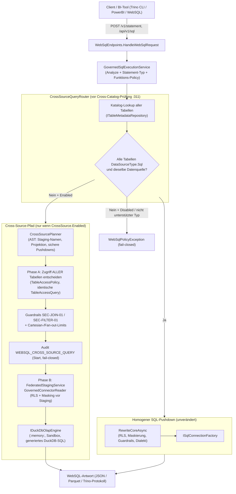
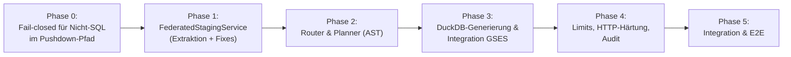

# Implementierungsplan: WebSQL-Unterstützung für heterogene Joins auf Web-APIs (Query Federation)

**Dokument-ID:** `PLAN-FEAT-WEBSQL-API-FEDERATION`  
**Referenzen:** [Feature DuckDB OLAP](../features/f-data-03-duckdb-olap.md), [F-GOV-06 Cross-Domain Joins (nicht umgesetzt, Prototyp entfernt)](../features/f-gov-06-cross-domain-joins.md), [Audit-by-default-Plan](plan-lueckenloses-zugriffs-audit-by-default.md), `GovernedSqlExecutionService.cs`, `DuckDbOlapEndpoints.cs`, `DuckDbOlapEngine.cs`, `GovernedConnectorReader.cs`, `DeclarativeHttpDataSourceExecutor.cs`  
**Rolle:** C# & .NET Solution Architect & Security Expert  
**Status:** Überarbeitet nach Review (2026-10-09), Entscheidungen getroffen (Abschnitt 8) – bereit zur Umsetzung ab Phase 0 ⏳  

---

## 0. Review-Korrekturen gegenüber der Erstfassung

| # | Erstfassung | Ist-Stand im Code | Korrektur im Plan |
|---|---|---|---|
| K-1 | HTTP-Tabellen in WebSQL „schlagen fehl (`GatewayInvalidQueryException` oder Verbindungsfehler)“ | Es gibt **keine** Prüfung auf `DataSourceType` in `GovernedSqlExecutionService` (kein Treffer). Nicht-SQL-Tabellen haben den neutralen Dialekt PostgreSQL (`TableModels.cs:67-73`, Test `DialectAlignmentTests.cs:66-76`) und passieren daher `IsWebSqlSupportedDialect` (`GovernedSqlExecutionService.cs:477-481, 1518-1519`). Ohne `SourceName` wird die HTTP-Tabelle in SQL für die relationale DB kompiliert – ggf. gegen eine gleichnamige physische Tabelle mit den Policies der HTTP-Tabelle. | Neue **Phase 0**: explizite fail-closed-Ablehnung von `DataSourceType != Sql` im Pushdown-Pfad. |
| K-2 | Cross-Source wird über `dsName = rewrite.DataSourceName` erkannt | Mehrere Kataloge werden bereits in der Analyse mit `WebSqlPolicyException("Cross-catalog queries …")` abgewiesen (`GovernedSqlExecutionService.cs:305-314`), zusätzlich `SourceName`-/Katalog-Abgleich (`:511-531`). `dsName` (`:911`) ist erst nach dem Rewrite bekannt. | Router setzt **vor** `:311` an (Analyse-Metadaten + Katalog-Lookup), nicht nach dem Rewrite. |
| K-3 | `IUnifiedPolicyDecisionPoint.ResolveAccessAsync` | `IUnifiedPolicyDecisionPoint` hat nur `EvaluateAccessAsync` (`IUnifiedPolicyDecisionPoint.cs:17`). `ResolveAccessAsync` gehört zu `ICrossDomainAccessResolver` (`DefaultCrossDomainAccessResolver.cs:52`) und nutzt `RebacEnforcement.WhenEnabled` ohne `action`/Client-IP-Attribute; WebSQL nutzt `AccessPolicy().DecideAsync(new TableAccessQuery(…, RebacEnforcement.QueryPaths, clientIp, actionAttribute))` (`GovernedSqlExecutionService.cs:557-561`). | Föderation nutzt **dieselbe** `TableAccessQuery` wie der WebSQL-Pushdown-Pfad (Entscheidungsparität, Abschnitt 4.1). |
| K-4 | `IDataSourceConnector`, `SqlDataSourceConnector`, `DeclarativeHttpDataSourceConnector` | Existieren nicht. Es gibt `IAutherisConnector` + `IAutherisConnectorRegistry`, `SqlConnector` (Infrastructure), `LegacyDataSourceExecutorAdapter` und `DeclarativeHttpDataSourceExecutor : IDataSourceExecutor`. Registriert ist **nur** `default-sql`/`sql` (`GatewayServiceCollectionExtensions.cs:476-497`); `TryGetConnectorForTable` fällt für **jede** Tabelle auf `default-sql` zurück (`InMemoryConnectorRegistry.cs:49-70`). | Quellauflösung nach `DataSourceType` mit fail-closed-Regel (Abschnitt 3.3); kein `default-sql`-Fallback für Nicht-SQL-Tabellen. |
| K-5 | „Erprobte Staging-Pipeline“ aus `DuckDbOlapEndpoints` | Der OLAP-Endpunkt prüft den Fallback **nicht** (`DuckDbOlapEndpoints.cs:206`) – eine HTTP-Tabelle würde über den SQL-Connector gelesen. `GatewayExecutionService` schützt sich dagegen (`GatewayExecutionService.cs:310-315`). | Bug wird in Phase 1 mitbehoben (Test zuerst). |
| K-6 | DuckDB-Engine muss in den Application-Layer extrahiert werden | `IDuckDbOlapEngine`/`DuckDbOlapEngine` liegen bereits in `Autheris.Application.Olap` (`IDuckDbOlapEngine.cs:26`). Nur die **Orchestrierung** (Katalog, Zugriff, Lesen, Audit) steckt im Endpunkt (`DuckDbOlapEndpoints.cs:148-273`). | Phase 1 extrahiert nur die Orchestrierung (`FederatedStagingService`). |
| K-7 | Rückgabe als `DbDataReader` | Engine materialisiert vollständig (`OlapQueryResult` mit `List`, `DuckDbOlapEngine.cs:116-188`). Trino-Pfad läuft gepuffert über `WebSqlStatementManager` → `ExecuteQueryBufferedAsync` (`WebSqlStatementManager.cs:160`). | Ergebnis als `GovernedSqlResult` bzw. Callback-Reader; siehe 3.5. |
| K-8 | Originalabfrage direkt in DuckDB ausführen | DuckDB staged nur unter `TableName` bzw. View `{Domain}_{TableName}` (`DuckDbOlapEngine.cs:212, 232-240`). `sql_crm.orders` ist in DuckDB nicht auflösbar; zwei gleichnamige Tabellen aus verschiedenen Quellen kollidieren beim `CREATE TABLE`. | AST-basierte Umbenennung auf deterministische Staging-Namen + Generierung über den vorhandenen `DuckDbDialectGenerator` (`AnalyticalDialectGenerators.cs:56`). |
| K-9 | Optionen `WebSqlOptions.Federation`, `Enabled = true` | Existieren nicht (`GatewayOptions.cs:1345-1401`). Vorhanden: `DuckDbOlapOptions` (`:1638-1663`). `GatewayOptions.Federation` ist bereits mit GraphQL-Subgraph-Föderation belegt (`FederationTests.cs`). | Neuer Block `WebSqlOptions.CrossSource` (Namenskollision vermeiden), **Standard `Enabled = false`** (fail-closed, Opt-in). |
| K-10 | `DuckDBConnection("Data Source=:memory:")`, „keine Persistenz auf Festplatte“ | Engine nutzt `"DataSource=:memory:"` und **spillt** in ein Session-Temp-Verzeichnis (`DuckDbOlapEngine.cs:86-104`, `max_temp_directory_size`). | Spill-Verhalten als bewusste Entscheidung (8, E-4); Standard für Föderation: kein Spill. |
| K-11 | Audit-Typ `WEBSQL_FEDERATED_QUERY` | Neu; WebSQL schreibt heute `WEBSQL_QUERY` mit `TargetTable = dsName` und **überspringt** das Audit, wenn kein Repository vorhanden ist (`GovernedSqlExecutionService.cs:921-943`) – nicht fail-closed. OLAP ist fail-closed (`DuckDbOlapEndpoints.cs:107-146`). | Ereignisse über `AuditEventTypes` (Audit-Plan 3.3), fail-closed, je Quelle ein Eintrag (4.6). |
| K-12 | „Befund 1.1 / 1.2 WebSQL Parquet & Engine“ im Architecture Review | `2026-10-09-architecture-review.md` enthält keine Befunde 1.1/1.2 (AR-xx-Nummerierung). | Referenz entfernt. |
| K-13 | Timeout = HTTP-Request-`CancellationToken` | Für `/v1/statement` läuft die Ausführung asynchron mit eigenem Session-CTS (`WebSqlStatementManager.cs:152-160`); der Request kehrt nach `wait_timeout` zurück, Abbruch via `DELETE /v1/statement/{id}` (`WebSqlEndpoints.cs:83`). | Ein Gesamt-Deadline-Budget, gekoppelt an Session-CTS (4.4). |

---

## 1. Ausgangslage & Problemstellung

Aktuell verhalten sich SQL-Abfragen über den WebSQL-/Trino-Endpunkt (`POST /v1/statement`, `POST /api/v1/sql`, `POST /api/sql`, `WebSqlEndpoints.cs:58-73`) wie folgt:
1. **Reiner Pushdown:** Die Trino-SQL wird analysiert (`_sqlEngine.Analyze`, `GovernedSqlExecutionService.cs:178`), mit RLS-Prädikaten und Maskierungsausdrücken angereichert und in den Ziel-Dialekt (PostgreSQL, SQL Server, SQLite) kompiliert (`:697-776`).
2. **Einschränkung auf eine Datenquelle:** Mehrere Kataloge werden abgewiesen (`:311-314`); jede Tabelle muss zur aktiven Datenquelle passen (`:511-531`).
3. **Lücke bei Web-APIs (K-1):** Tabellen vom Typ `DataSourceType.HttpDeclarative`/`HttpPlugin`/`Lakehouse*` werden **nicht explizit** abgewiesen, sondern als SQL an die relationale DB gesendet. Das ist heute ein fail-open-Risiko und muss vor jeder Föderation geschlossen werden.

**Zielsetzung:**
Ein Anwender oder ein BI-Tool (DBeaver, PowerBI, Trino CLI, Superset) soll über den bestehenden WebSQL-/Trino-Endpunkt **lesende** Abfragen ausführen können, die relationale Tabellen mit Web-API-Tabellen verknüpfen:
```sql
SELECT
    o.order_id,
    o.customer_id,
    o.total_amount,
    s.carrier,
    s.tracking_status,
    s.estimated_delivery
FROM sql_crm.public.orders o
JOIN api_logistics.v1.shipments s ON o.tracking_code = s.id
WHERE s.tracking_status = 'IN_TRANSIT'
  AND o.order_date >= DATE '2026-01-01'
ORDER BY o.order_id
```

**Nicht-Ziele (v1):** DML über föderierte Quellen; Bind-/Dependent-Joins (Schlüssel einer Quelle als Parameter an eine API senden) – siehe E-2; Pagination von REST-Quellen über mehrere Seiten – siehe E-3; Streaming großer Ergebnisse (Ergebnisse bleiben gepuffert und gedeckelt).

---

## 2. Zielarchitektur: Transparentes Query Federation Routing

Join-Ausführung **in-process in DuckDB** über den vorhandenen `IDuckDbOlapEngine` (Sandbox: `enable_external_access = false`, `lock_configuration = true`, `max_memory`, Threads, Concurrency-Semaphore, Timeout + `duckdb_interrupt`; `DuckDbOlapEngine.cs:72-126`). Keine eigene Join-Engine in C#, kein Drittanbieter-Framework.



---

## 3. Kernkomponenten & Entwurf

### 3.1 `CrossSourceQueryRouter` (Klassifikation)
Ort: `src/Autheris.Application/Sql/Services/CrossSourceQueryRouter.cs`, aufgerufen in `RewriteCoreAsync` **nach** Statement-Typ-/Funktions-Prüfung (`GovernedSqlExecutionService.cs:200-281`) und **vor** der Cross-Catalog-Ablehnung (`:305-314`).
- Eingabe: `SqlQueryMetadata.ReferencedTables` (`ISqlQueryAnalyzer.cs:28-41`), Katalog-Metadaten je Tabelle (gleiche Auflösung wie `ResolveTableIdentifier` + Default-Domain-/Backend-Schema-Regeln `:425-468`).
- **Lazy-Routing (E-8, INV-18):** Bei `Enabled = false` wird der Router nicht aufgerufen. Bei `true` wird nur umgeleitet, wenn die vorhandene Cross-Catalog-Bedingung (`distinctCatalogs.Count > 1`) oder die `DataSourceType`-Prüfung in der bestehenden Tabellenschleife anschlagen – vor jeder Zugriffsentscheidung und jedem Datenzugriff; homogene Abfragen verursachen keinen zusätzlichen Katalog-Lookup.
- **Klassifikation (`QuerySourceClass`):**
  - `HomogeneousSql`: alle Tabellen `DataSourceType.Sql` **und** derselbe effektive Datenquellenname → bestehender Pfad, unverändert.
  - `CrossSource`: mindestens eine Tabelle mit `DataSourceType.HttpDeclarative` **oder** Tabellen aus mehr als einer SQL-Datenquelle.
  - `Unsupported`: `HttpPlugin`, `LakehouseIceberg`, `LakehouseDelta` (v1) → `WebSqlPolicyException`.
- **Fail-closed-Regeln:** Unbekannte/inaktive Tabelle → `TableDenied` (gleiche Meldung wie heute, kein Existenz-Orakel); `DML` + `CrossSource` → Ablehnung; `CrossSource` + `CrossSource.Enabled == false` → Ablehnung mit der heutigen Cross-Catalog-Meldung (Verhalten bleibt für Bestandskunden identisch); explizites `dataSource` im Body bzw. `X-Trino-Catalog` (`WebSqlEndpoints.cs:196-201`) schränkt die erlaubten Kataloge ein, eine Tabelle außerhalb → Ablehnung.
- **Tenant-Allowlist:** Jede beteiligte Datenquelle muss `ResolveAllowedDataSource` (`TenantDataSourceAllowlist`, `GatewayOptions.cs:1376`) einzeln bestehen.

### 3.2 `CrossSourcePlanner` (AST-Umschreibung, keine String-Manipulation)
- Weist jeder referenzierten Tabelle einen deterministischen Staging-Namen zu (`s0`, `s1`, … in Reihenfolge des ersten Auftretens) und ersetzt die Tabellenreferenzen **im AST**; Aliase bleiben erhalten. Generierung des DuckDB-SQL ausschließlich über `SqlDialectGeneratorFactory` → `DuckDbDialectGenerator` (Identifier immer gequotet, `AnalyticalDialectGenerators.cs:77-83`).
- Ermittelt je Quelle die **minimale Projektion** (nur referenzierte Spalten; `SELECT *` → alle nicht verweigerten Spalten).
- Ermittelt **sichere Pushdown-Kandidaten**: Konjunktionsglieder der `WHERE`-Klausel, die genau eine Quelltabelle referenzieren, nur Vergleichs-/`IN`-/`BETWEEN`-/`IS NULL`-Operatoren mit Literalen/Parametern, und **nur auf Spalten mit effektivem Zugriff `Clear`** (gleiche Regel wie `ValidateFilter`, `GatewayExecutionService.cs:416-426`). Bei `LEFT/RIGHT/FULL JOIN` werden Prädikate auf der nullbaren Seite **nicht** gepusht (Semantik). Das Prädikat bleibt zusätzlich in der DuckDB-Abfrage (Doppelprüfung, korrekt auch bei unvollständigem Pushdown).
- `LIMIT` wird **nicht** an Quellen gepusht, solange Join/Aggregation/`ORDER BY` existiert (sonst falsche Ergebnisse); nur bei Ein-Tabellen-Projektion ohne Join.
- Funktionspolitik: Funktionen werden gegen die WebSQL-Policy (`SqlFunctionPolicy`, `:271-281`) **und** gegen eine DuckDB-spezifische Allowlist geprüft. Hinweis: `SqlFunctionAllowlists.GetDefault(TargetSqlDialect.DuckDb)` fällt heute auf `Ansi` zurück (`SqlFunctionAllowlists.cs:85-92`) – eine explizite DuckDB-Liste ist Teil von Phase 3.

### 3.3 Quellauflösung & Lesen (`FederatedStagingService`)
Extraktion der Orchestrierung aus `DuckDbOlapEndpoints.cs:148-273` nach `src/Autheris.Application/Olap/FederatedStagingService.cs` (gemeinsam für OLAP-Endpunkt und WebSQL):
```csharp
public sealed record StagingTableRequest(
    TableAccessTarget Reference, TableMetadata Metadata, TableAccessDecision Decision,
    string StagingName, IReadOnlyList<string> Projection, TableFilterClause? PushdownFilter);

public interface IFederatedStagingService
{
    // Liest ALLE Quellen governed (RLS + Masking), prüft Limits, schreibt je Quelle ein Audit (fail-closed).
    Task<IReadOnlyList<OlapTableSource>> StageAsync(
        IReadOnlyList<StagingTableRequest> tables, ClaimsPrincipal user, TenantId tenantId,
        FederationBudget budget, CancellationToken ct);
}
```
- **Connector-Auflösung nach `DataSourceType` (fail-closed):** `Sql` → registrierter SQL-Connector der Datenquelle; `HttpDeclarative` → `LegacyDataSourceExecutorAdapter(DeclarativeHttpDataSourceExecutor)` bzw. registrierter HTTP-Connector. Ein `default-sql`-Fallback für Nicht-SQL-Tabellen ist verboten (K-4/K-5). Keine Auflösung → `TableDenied`.
- Gelesen wird immer über `GovernedConnectorReader.ReadAsync` mit `GovernedRowPolicy(MaxRows, MaxBytes)` (`GovernedConnectorReader.cs:19-24, 60-73`). Pushdown-Prädikate gehen **nicht** in `PushdownFilterSql` (dort steht ausschließlich der RLS-Filter, `ConnectorSessionContext`), sondern als `TableFilterClause` in `Items[TableQueryItems.Filter]` (`IGatewayExecutionService.cs:59-97`) – nur für SQL-Quellen. HTTP-Quellen erhalten in v1 **keine** aus Client-SQL abgeleiteten Argumente (nur `limit`, Tenant-Pushdown durch den Executor).
- Masked-Spalten werden in DuckDB als `VARCHAR` angelegt (heute mappt `MapDuckDbType` nach Katalogtyp, `DuckDbOlapEngine.cs:313-323`; ein maskierter Wert in einer `BIGINT`-Spalte bricht das `INSERT`).

### 3.4 Ausführung in DuckDB
- Neue Engine-Methode `ExecuteGeneratedAsync(GeneratedOlapQuery, …)`, die **nur** AST-generiertes SQL annimmt (Typ-Kapselung, kein `string`-Overload für Client-SQL). Die Deny-Liste `ValidateUserSql` (`DuckDbOlapEngine.cs:325-411`) bleibt als Defense-in-Depth aktiv; Parameter werden vom Generator als typisierte Literale emittiert; die `$`-Regel bleibt unverändert (E-9).
- Gleicher Semaphore/Timeout/Interrupt wie OLAP; `MaxResultRows`/`MaxResultBytes` der Engine **und** `SqlRowLimit` des Transports (`SqlRowLimit.For(...)`) – es gilt das Minimum.

### 3.5 Rückgabe an die Transporte
- Ergebnis wird in `GovernedSqlResult` (`IGovernedSqlExecutionService.cs:17-25`) überführt; `ExecuteGovernedQueryAsync` übergibt dem `rowWriter` einen `DbDataReader` über das gepufferte Ergebnis (z. B. `DataTableReader`), damit JSON, Parquet (`WebSqlEndpoints.cs:366-422`) und Trino (`WebSqlStatementManager.cs:160`) unverändert bleiben.
- **Transport-Gate:** Weitere Aufrufer von `IGovernedSqlExecutionService` (Arrow Export `ArrowExportEndpoints.cs:181`, Flight SQL `ArrowFlightSqlServer.cs:199`, SQL-Endpunkte `SqlEndpointExecutionService.cs:89`, MCP) erhalten Cross-Source nur, wenn `CrossSource.AllowedTransports` sie enthält (Standard: nur `WebSql` und `Trino`).
- `Truncated = true` wird gesetzt, wenn das Ergebnislimit greift (wie im Direktpfad).

---

## 4. Sicherheitsarchitektur & AppSec-Invarianten

### 4.1 Autorisierung vollständig **vor** jedem Fetch (INV-1, INV-2)
- **INV-1:** Für **alle** Tabellen wird die Zugriffsentscheidung getroffen, bevor die erste Quelle gelesen wird (Phase A/B-Trennung). Der OLAP-Endpunkt verschränkt heute Entscheidung und Lesen je Tabelle (`DuckDbOlapEndpoints.cs:169-272`) – bei Verweigerung der zweiten Tabelle wurde die erste bereits gelesen; das ist im föderierten Pfad verboten.
- **INV-2 (Entscheidungsparität):** Föderation verwendet exakt die `TableAccessQuery` des Direktpfads (`QueryPaths`-ReBAC, `clientIp`, `action=read`, Consent-Bypass-Regeln, `GovernedSqlExecutionService.cs:551-567`) – keine abweichende Entscheidung über `DefaultCrossDomainAccessResolver` (`WhenEnabled`). Ablehnungen liefern dieselbe generische Meldung (`TableDenied`), keine Policy-Details.

### 4.2 Keine Datenleckage über Join-/Filter-Prädikate (INV-3 … INV-6)
> [!CAUTION]
> Würden Rohdaten unmaskiert in DuckDB geladen oder Prädikate auf maskierten Spalten an die Quelle gepusht, entstünde ein Orakel (z. B. `JOIN … ON secret LIKE 'a%'` oder `WHERE secret = 'x'` an der Quelle auf dem Klartext ausgewertet).
- **INV-3:** Staging erfolgt strikt **nach** RLS-Filter und Maskierung (`GovernedConnectorReader.Apply`, `:108-145`); verweigerte Spalten existieren in DuckDB nicht (sie werden in `ProjectRow` entfernt, `:165-169`).
- **INV-4:** Die Guardrails des Direktpfads gelten unverändert: SEC-JOIN-01 (statisch redigierte/verweigerte Spalten nicht in Join-Prädikaten, nur HMAC erlaubt, `:638-655`) und SEC-FILTER-01 (maskierte/verweigerte Spalten nicht in `WHERE/HAVING/ORDER BY`, `:657-672`). Umsetzung: Extraktion in eine gemeinsame Methode `EnforceMaskedColumnGuardrails(...)`, die beide Pfade aufrufen.
- **INV-5:** Pushdown nur für Prädikate auf `Clear`-Spalten (3.2). Kein Client-Literal erreicht eine HTTP-URL (v1).
- **INV-6 (HMAC-Konsistenz):** Joins auf HMAC-pseudonymisierten Schlüsseln über Quellen hinweg funktionieren nur, wenn alle Quellen denselben tenant-gebundenen Schlüssel und denselben Algorithmus verwenden (`ScopeRuleForTenant`, `GovernedConnectorReader.cs:189`). Da alle föderierten Quellen über `GovernedConnectorReader` (In-Memory-Masking) laufen, ist das gegeben; ein Test belegt es. Die damit verbundene **Verknüpfbarkeit** pseudonymisierter Datensätze über Quellen ist eine Policy-Entscheidung (E-5).

### 4.3 Ausgehende APIs: SSRF, Credentials, Tenant (INV-7 … INV-9)
- **INV-7 (SSRF):** HTTP-Quellen laufen ausschließlich über den benannten Client `DeclarativeHttp` mit `SecureOutboundHttp`-ConnectCallback und `SsrfProtectionHandler` (`GatewayServiceCollectionExtensions.cs:375-378`), `EgressUrlPolicy.ValidateResolvedAsync` (`DeclarativeHttpDataSourceExecutor.cs:424-436`) und Same-Origin-Redirects (`:185-243`). `BaseUrl`/`PathTemplate` stammen nur aus dem Katalog; Client-SQL kann keine URL-Bestandteile setzen (INV-5).
- **INV-8 (Credentials):** `StaticApiKey`/`ClientCredentials` über `SecretReferenceResolver` (`:536-540`), nie in Logs/Audit/Fehlermeldungen. `ForwardBearerToken` benötigt `RequestHeaders`; diese fehlen im asynchronen Trino-Pfad (`ExecuteQueryBufferedAsync` hat keinen Header-Parameter) und im OLAP-Pfad (Session ohne `RequestHeaders`, `DuckDbOlapEndpoints.cs:214-222`). Regel v1: Quellen mit `ForwardBearerToken` werden im föderierten Pfad **abgewiesen** (fail-closed, E-6). Ein Token wird niemals in der Statement-Session persistiert.
- **INV-9 (Tenant):** Tenant-Pushdown des Executors (`TenantIdQueryParam`/`TenantIdHeaderName`, fail-closed ohne Claim, `:346-352, 473-481`) bleibt aktiv; zusätzlich wird RLS auf die Tenant-Spalte im Gateway erzwungen (`RequireTenantColumnOrThrow`, `GovernedSqlExecutionService.cs:582-597`), unabhängig davon, ob die API selbst filtert.

### 4.4 DoS-Schutz, Ressourcen, Zeit (INV-10 … INV-13)
- **INV-10 (Zeilen/Bytes je Quelle):** `MaxStagedRowsPerTable` wird **beim Lesen** erzwungen (`GovernedConnectorReader.cs:93-96`) – Überschreitung ⇒ Abbruch, **niemals** stilles Abschneiden (ein abgeschnittener Join-Input liefert falsche Ergebnisse). `MaxStagedBytesPerTable` über `GovernedRowPolicy.MaxBytes`. Hinweis: das Zeilenlimit greift erst nach Empfang eines ganzen Batches; für HTTP muss die Antwortgröße vorher begrenzt werden (INV-11).
- **INV-11 (HTTP-Antwortgröße):** `ExecuteSingleRequestAsync` parst die gesamte Antwort mit `JsonDocument.ParseAsync` ohne Größenlimit (`DeclarativeHttpDataSourceExecutor.cs:146-149`). Neu: `MaxResponseBytes` je Descriptor/global, Abbruch über begrenzten Stream (Phase 4).
- **INV-12 (Gesamtbudget):** `MaxTableCount` (Standard 5), `MaxTotalStagedRows`, `MaxTotalStagedBytes`, DuckDB `max_memory`, `MaxConcurrentQueries` (gemeinsamer Semaphore mit OLAP, `DuckDbOlapEngine.cs:78-83` → `429`/Trino-Fehler `INSUFFICIENT_RESOURCES`), `MaxConcurrentSessionsPerUser` des Statement-Managers bleibt bestehen. Kartesische Produkte: `CROSS JOIN` und Joins ohne Gleichheitsprädikat werden abgewiesen, sofern nicht `AllowNonEquiJoins` gesetzt ist; DuckDB-Ergebnislimit begrenzt die Ausgabe zusätzlich.
- **INV-13 (Zeit):** Ein einziges Deadline-Budget (`CrossSource.TimeoutSeconds`, Standard = `WebSql.ExecutionTimeoutSeconds` 30 s) umfasst Lesen **und** DuckDB; HTTP-Descriptor-Timeouts (`HttpEndpointDescriptor.Timeout`, Standard 10 s) sind darin enthalten. Gekoppelt an den Session-CTS des Statement-Managers (Trino: `DELETE` bricht ab) bzw. an `RequestAborted` (synchroner Pfad). Quellen werden parallel gelesen (begrenzt durch `MaxParallelSourceReads`, Standard 4).

### 4.5 Teilausfälle & Determinismus (INV-14, INV-15)
- **INV-14 (Alles-oder-nichts):** Schlägt eine Quelle fehl (HTTP-Fehler, Timeout, Limit, Policy), wird die gesamte Abfrage abgebrochen; es gibt **keine** Teilergebnisse und keine `NULL`-Auffüllung. Keine automatischen Retries in v1. Fehler an den Client generisch (keine URL, kein Upstream-Body); Details nur im Server-Log mit TraceId.
- **INV-15 (Determinismus):** Reihenfolge ist nur mit `ORDER BY` garantiert (wie Trino). `ParallelSingleRequests` sammelt in einer `ConcurrentBag` (`:265-289`) – nicht deterministisch; daher stabile Staging-Reihenfolge (Sortierung nach Primärschlüssel, falls bekannt) und Dokumentation. Typkoerzion: einheitliche Mapping-Tabelle Katalogtyp → DuckDB-Typ; JSON-Zahlen/Strings aus HTTP werden gemäß Katalog geparst, nicht konvertierbare Werte ⇒ Fehler (kein stilles `NULL`). Datumswerte als `TIMESTAMP` (UTC) ohne Zeitzonen-Interpretation.

### 4.6 Tenant-Isolation & Lebenszyklus (INV-16)
- DuckDB-Sessions sind transient (`:memory:`), je Abfrage neu, nie zwischen Mandanten oder Anfragen geteilt, `Dispose` im `finally`. Spill-Verzeichnis je Session (`DuckDbOlapEngine.cs:86-87, 193-203`); für Föderation Standard `MaxTempDirectorySize = "0B"` (kein Spill, E-4).
- Kein Plan-Cache für föderierte Abfragen (Policy-abhängige Staging-Projektion).

### 4.8 Keine Laufzeitkosten für bestehende Pfade (INV-18)
- **INV-18:** Der nicht föderierte WebSQL-Pfad (`RewriteCoreAsync` → `ExecuteGovernedQueryAsync`/`ExecuteQueryBufferedAsync`) erhält **keine** zusätzlichen Katalog-Lookups, Allokationen, `await`s oder Locks. Alles, was im Hot Path Latenz kostet, liegt hinter `CrossSource.Enabled` (Standard `false`, E-8).
- Einzige unbedingte Ergänzung ist die Sicherheitsprüfung aus Phase 0 (`DataSourceType`-Enum-Vergleich auf bereits geladenen Metadaten): allokationsfrei, O(1) je Tabelle.
- `FederatedStagingService`, Router, Planner und `CrossSourceOptions` werden nur bei `Enabled = true` aufgelöst (keine Konstruktor-Injektion schwerer Abhängigkeiten in `GovernedSqlExecutionService`; Auflösung über `IServiceProvider`/`Lazy<T>` erst im Föderationszweig).
- Der OLAP-Endpunkt behält nach der Extraktion (Phase 1) sein Laufzeitprofil; die Phase-A/B-Trennung ändert nur die Reihenfolge, nicht die Anzahl der Aufrufe.

### 4.7 Lückenloses Zugriffs-Audit (INV-17)
- Typen über den Katalog `AuditEventTypes` (Audit-Plan 3.3), keine freien Strings:
  - `WEBSQL_CROSS_SOURCE_QUERY` (Start, **vor** dem ersten Fetch, fail-closed): Tabellen, `DataSourceType`, Datenquelle je Tabelle, anonymisierte SQL + Hash (`AstSecurityVisitor.AnonymizeSqlForAudit`), Transport.
  - `WEBSQL_CROSS_SOURCE_SOURCE_READ` je Quelle (nach Lesen, vor Rückgabe, fail-closed): Tabelle, Zeilenzahl, ob RLS gepusht, gepushte Prädikat-Spalten (keine Literale), HTTP-Host (ohne Query-String).
  - `WEBSQL_QUERY_DENIED` bei jeder Ablehnung (Router, Policy, Guardrail, Limit) – angeglichen an den Audit-Plan.
- Fehlt das Audit-Repository oder schlägt das Schreiben fehl ⇒ Abbruch (`503`), wie im OLAP-Pfad (`DuckDbOlapEndpoints.cs:113-146`). Kein Klartext-Wert und kein Secret im `DetailsJson`.

---

## 5. Implementierungsschritte (Phasenplan, TDD)



Jeder Schritt: zuerst roter Test, dann minimale Implementierung, dann Refactoring. Tests in `tests/Autheris.Tests.Unit` (Namen mit Präfix `WebSqlCrossSource*`, um Kollision mit `FederationTests.cs` = GraphQL zu vermeiden) und `tests/Autheris.Tests.Integration`.

### Phase 0: Fail-closed-Lücke schließen (unabhängig von der Föderation, sofort lieferbar)
- [ ] **Rot:** `WebSqlCrossSourceGuardTests.HttpDeclarativeTable_InWebSqlPushdown_IsRejected` (und `HttpPlugin`, `LakehouseIceberg`, `LakehouseDelta` als Theory): `WebSqlPolicyException`, keine DB-Verbindung geöffnet (Mock `ISqlConnectionFactory` erhält keinen Aufruf).
- [ ] **Rot:** `DuckDbOlap_HttpTable_DoesNotFallBackToDefaultSqlConnector` (K-5): OLAP-Endpunkt liefert `403`, `SqlConnector` wird nicht aufgerufen.
- [ ] **Grün:** Prüfung `tableMeta.Table.DataSourceType != DataSourceType.Sql ⇒ throw` in `RewriteCoreAsync` direkt nach `:470-474`; Fallback-Guard analog `GatewayExecutionService.cs:310-315` in `DuckDbOlapEndpoints.cs:206`.
- [ ] **Baseline:** `WebSqlRewriteBenchmarks` (BenchmarkDotNet, `[MemoryDiagnoser]`) **vor** der Phase-0-Änderung anlegen und Baseline sichern; nach Phase 0 und nach jeder weiteren Phase gegen AC-12/AC-13 prüfen.

### Phase 1: `FederatedStagingService` (Orchestrierung extrahieren)
- [ ] **Rot:** `StageAsync_DecidesAllTablesBeforeFirstRead` – zweite Tabelle verweigert ⇒ keine Quelle gelesen, kein `SOURCE_READ`-Audit (INV-1).
- [ ] **Rot:** `StageAsync_MaskedColumn_IsMaskedBeforeStaging` und `…_DeniedColumn_IsAbsent` (INV-3).
- [ ] **Rot:** `StageAsync_RowLimitExceeded_Throws_NeverTruncates` (INV-10).
- [ ] **Rot:** `StageAsync_AuditFailure_FailsClosed` (INV-17).
- [ ] **Rot:** `StageAsync_ResolvesConnectorByDataSourceType_NoDefaultSqlFallback` (K-4).
- [ ] **Grün:** Service in `Autheris.Application.Olap`, `DuckDbOlapEndpoints` darauf umstellen (bestehende Tests in `Security/DuckDbOlap*Tests.cs` bleiben grün).
- [ ] **Rot/Grün:** Masked-Spalten als `VARCHAR` stagen (`MaskedIntegerColumn_StagesAsVarchar`).

### Phase 2: `CrossSourceQueryRouter` & `CrossSourcePlanner`
- [ ] **Rot:** Klassifikation (Theory): eine SQL-Quelle ⇒ `HomogeneousSql`; zwei SQL-Quellen ⇒ `CrossSource`; SQL + HTTP ⇒ `CrossSource`; `HttpPlugin`/Lakehouse ⇒ `Unsupported`; DML + CrossSource ⇒ Ablehnung; `Enabled=false` ⇒ bisherige Cross-Catalog-Meldung (Regressionstest `WebSqlCaseCollisionSql2Tests.cs:141` bleibt grün).
- [ ] **Rot:** `dataSource`/`X-Trino-Catalog` gesetzt und Tabelle aus anderem Katalog ⇒ Ablehnung.
- [ ] **Rot:** Planner vergibt `s0..sn` deterministisch, gleichnamige Tabellen aus zwei Quellen kollidieren nicht; Projektion minimal.
- [ ] **Rot:** Pushdown nur auf `Clear`-Spalten; Prädikat auf maskierter Spalte ⇒ SEC-FILTER-01-Ablehnung (INV-4/5); Prädikat auf nullbarer Seite eines `LEFT JOIN` wird nicht gepusht; `LIMIT` mit Join nicht gepusht.
- [ ] **Rot:** Join auf statisch redigierter Spalte über Quellgrenze ⇒ SEC-JOIN-01-Ablehnung; HMAC-Spalte ⇒ erlaubt.
- [ ] **Grün:** Guardrails in `EnforceMaskedColumnGuardrails` extrahieren und in beiden Pfaden nutzen.

### Phase 3: DuckDB-Generierung & Integration in `GovernedSqlExecutionService`
- [ ] **Rot:** Generiertes DuckDB-SQL referenziert nur `s0..sn`, enthält keine Katalog-/Schema-Präfixe; Client-Identifier mit Quotes/Sonderzeichen werden korrekt escaped (Injection-Test).
- [ ] **Rot:** DuckDB-Funktions-Allowlist: `read_csv`, `getenv`, `current_setting`, `glob`, `range` usw. ⇒ Ablehnung vor Ausführung.
- [ ] **Rot:** `ExecuteGeneratedAsync` akzeptiert keinen rohen String (Compile-Time-Kapselung, Architekturtest).
- [ ] **Rot:** Entscheidungsparität: dieselbe Tabelle, derselbe Nutzer ⇒ identische `TableAccessDecision` im Direkt- und Föderationspfad (INV-2).
- [ ] **Grün:** Verzweigung in `RewriteCoreAsync`/`ExecuteGovernedQueryAsync`/`ExecuteQueryBufferedAsync`; Rückgabe als `GovernedSqlResult` bzw. Reader (3.5); Transport-Gate.
- [ ] **Rot/Grün:** Trino-Pfad: Statement-Manager liefert föderiertes Ergebnis, `DELETE` bricht laufende Quell-Fetches und DuckDB ab (INV-13).

### Phase 4: Limits, HTTP-Härtung, Konfiguration & Audit
- [ ] Optionen in `GatewayOptions.cs` unter `WebSqlOptions.CrossSource` (`CrossSourceOptions`):
  - `Enabled` (bool, **Standard `false`**)
  - `AllowedTransports` (Liste, Standard `["WebSql", "Trino"]`)
  - `MaxTableCount` (Standard `5`), `MaxStagedRowsPerTable` (Standard `50000`), `MaxTotalStagedRows` (Standard `200000`)
  - `MaxStagedBytesPerTable` (Standard 32 MB), `MaxTotalStagedBytes` (Standard 128 MB)
  - `MaxMemory` (Standard `"256MB"`), `MaxTempDirectorySize` (Standard `"0B"`)
  - `TimeoutSeconds` (Standard `30`), `MaxParallelSourceReads` (Standard `4`)
  - `AllowNonEquiJoins` (Standard `false`), `AllowedHttpAuthModes` (Standard `None, StaticApiKey, ClientCredentials`)
  - Validierung beim Start (`ValidateOnStart`): Werte > 0, `CrossSource`-Limits ≤ `DuckDbOlap`-Limits.
- [ ] Neues Feld `HttpEndpointDescriptor.CompleteResponse` (bool, Standard `false`); **Rot/Grün:** `HttpSourceWithoutCompleteResponse_IsRejected` (E-3).
- [ ] **Rot/Grün:** `HttpResponseExceedsMaxBytes_IsAborted` (INV-11), `ForwardBearerTokenSource_InCrossSource_IsRejected` (INV-8), `CrossJoin_IsRejected` (INV-12), `DeadlineCoversFetchAndExecution` (INV-13), `OneSourceFails_NoPartialResult_GenericError` (INV-14).
- [ ] **Rot/Grün:** Audit-Tests: Start-Eintrag vor erstem Fetch, je Quelle ein Eintrag, Ablehnung ⇒ `WEBSQL_QUERY_DENIED`, kein Literal/Secret im `DetailsJson`, Audit-Ausfall ⇒ `503`.

### Phase 5: Integrationstests & E2E
- [ ] Testcontainers-PostgreSQL bzw. SQLite + Test-HTTP-Handler/WireMock für `HttpDeclarative` (Muster: `HttpDataSourceIntegrationTests.cs`).
- [ ] Positivfall: Beispiel-Query aus Abschnitt 1 über `/api/v1/sql` (JSON, Parquet) und `/v1/statement` (Trino-Polling) liefert erwartete, sortierte Zeilen.
- [ ] Negativfälle: verweigerte API-Tabelle ⇒ `403` ohne Upstream-Aufruf (Handler-Zähler = 0); maskierte Spalte erscheint maskiert; Limit-Überschreitung ⇒ `400`; Upstream-`500` ⇒ generischer Fehler ohne Upstream-Body; Redirect auf fremden Host ⇒ Abbruch; Tenant-Header wird gesetzt und kann nicht überschrieben werden.
- [ ] Last-/Robustheit: parallele Abfragen > `MaxConcurrentQueries` ⇒ `429`; Speichergrenze ⇒ kontrollierter Fehler, kein Prozess-OOM.

---

## 6. Akzeptanzkriterien (Definition of Done)

| ID | Kriterium | Nachweis |
|---|---|---|
| AC-1 | Nicht-SQL-Tabellen werden im Pushdown-Pfad abgewiesen; keine DB-Verbindung wird geöffnet. | Phase-0-Tests |
| AC-2 | Mit `CrossSource.Enabled=false` ist das Verhalten für Bestandsabfragen identisch (alle bestehenden `*WebSql*`-Tests grün). | Regression |
| AC-3 | Keine Quelle wird gelesen, bevor alle Zugriffsentscheidungen positiv sind. | Handler-/Connector-Zähler = 0 bei Deny |
| AC-4 | In DuckDB existieren keine unmaskierten Werte maskierter Spalten und keine verweigerten Spalten. | Test mit Inspektion der gestagten Tabelle |
| AC-5 | SEC-JOIN-01 und SEC-FILTER-01 greifen im föderierten Pfad mit derselben Meldung wie im Direktpfad. | Parametrisierte Paritätstests |
| AC-6 | Kein Client-Literal erreicht eine ausgehende HTTP-URL oder einen Header. | Test mit aufzeichnendem Handler |
| AC-7 | Jede Limit-Überschreitung führt zum Abbruch, nie zu stillem Abschneiden des Join-Inputs. | Limit-Tests |
| AC-8 | Ein Quellfehler ⇒ keine Teilergebnisse, generische Fehlermeldung, `WEBSQL_QUERY_DENIED`/`QUERY_EXECUTION_ERROR` im Audit. | Fehlerinjektion |
| AC-9 | Start-Audit vor erstem Fetch und je Quelle ein Audit; Audit-Ausfall ⇒ `503`. | Audit-Tests |
| AC-10 | Trino-`DELETE` bricht laufende Fetches und DuckDB innerhalb von 2 s ab. | Integrationstest |
| AC-11 | Gleiche Eingabe + `ORDER BY` ⇒ byte-identisches Ergebnis über 10 Läufe. | Determinismus-Test |
| AC-12 | **Benchmark:** Bestehende WebSQL-Single-Source-Abfragen verschlechtern sich um **≤ +3 % p95** (sowohl mit `CrossSource.Enabled=false` als auch `true`), gemessen gegen den Stand vor Phase 0. | BenchmarkDotNet-Suite `WebSqlRewriteBenchmarks` (Rewrite + Ausführung gegen SQLite, je 3 repräsentative Abfragen: Einzeltabelle, Join, Aggregation); Vergleich im CI-Job mit gespeicherter Baseline |
| AC-13 | **Keine neuen Allokationen** auf dem nicht föderierten Pfad (`Allocated`-Spalte von `[MemoryDiagnoser]` identisch zur Baseline, Toleranz 0 Byte für den Router-/Klassifikationsanteil). | `[MemoryDiagnoser]` im selben Benchmark + Unit-Test, dass bei `Enabled=false` weder Router noch `IFederatedStagingService` aufgelöst werden |

---

## 7. Risiken

- **Speicher außerhalb von DuckDB:** Gestagte Zeilen liegen vor dem Insert als `List<Dictionary<…>>` im .NET-Heap; `max_memory` deckt das nicht ab. Abgesichert über Byte-Budgets (INV-10/12), nicht über DuckDB.
- **Lexikalischer Validator:** `ValidateUserSql` ist eine Deny-Liste; Sicherheit des Föderationspfads beruht primär auf AST-Generierung + Allowlist, die Deny-Liste ist nur Zusatz.
- **HTTP-Quellen ohne Pagination:** Eine API liefert ggf. nur die erste Seite – Ergebnis wäre unvollständig, ohne dass es auffällt. v1 akzeptiert nur Descriptors, die als „vollständige Antwort“ markiert sind (E-3).

---

## 8. Offene Entscheidungen

Alle Entscheidungen sind getroffen; der Plan ist damit umsetzbar. Eine Änderung erfordert eine Aktualisierung dieses Abschnitts.

| ID | Frage | Entscheidung (09.10.2026) | Begründung |
|---|---|---|---|
| E-1 | Lesen von SQL-Quellen über `GovernedConnectorReader` (In-Memory-Masking) oder über den WebSQL-Rewrite je Quelle (In-DB-Masking)? | **`GovernedConnectorReader` für alle Quellen** (SQL und HTTP); Pushdown für SQL-Quellen nur über `TableFilterClause` auf `Clear`-Spalten. | Ein Masking-Pfad ⇒ identische HMAC-Werte über alle Quellen (INV-6); Wiederverwendung des bereits gehärteten OLAP-Lesepfads; kein zweiter Rewrite pro Quelle. |
| E-2 | Bind-/Dependent-Joins (Join-Schlüssel der SQL-Seite als Batch-Parameter an die API)? | **Nicht in v1.** HTTP-Quellen werden vollständig (bis Limit) gelesen. | Würde Werte an Drittsysteme exfiltrieren und Fan-out erzeugen; Nutzen erst mit Pagination und Fan-out-Limits belastbar. Eigenes Folgefeature mit Opt-in je Descriptor. |
| E-3 | REST-Pagination im `HttpEndpointDescriptor`? | **Nicht in v1.** Neues Descriptor-Feld `CompleteResponse` (bool, Standard `false`); nur Quellen mit `true` sind föderierbar, sonst `WebSqlPolicyException`. | Verhindert stillschweigend unvollständige Joins (nur erste Seite). Fail-closed statt falscher Ergebnisse. |
| E-4 | Spill auf Disk erlauben? | **Kein Spill:** `CrossSource.MaxTempDirectorySize = "0B"`; Speicherüberschreitung ⇒ kontrollierter `400`-Fehler. | RLS-gefilterte Klartextdaten gehören nicht auf die Platte; Limits halten Datenmengen ohnehin klein. |
| E-5 | Quellübergreifende Verknüpfung über HMAC-Pseudonyme (Linkability)? | **Erlaubt**, weil dieselbe Verknüpfung im Direktpfad (SEC-JOIN-01 erlaubt HMAC-Joins) bereits zulässig ist; HMAC bleibt tenant-gebunden. Jede quellübergreifende HMAC-Join-Nutzung wird im Audit (`SOURCE_READ`: `hmacJoinColumns`) ausgewiesen. | Konsistente Semantik zwischen Direkt- und Föderationspfad; Nachvollziehbarkeit für den DPO ohne neue Schlüsselverwaltung. |
| E-6 | `ForwardBearerToken`-Quellen im asynchronen Trino-Pfad? | **Abweisen** (fail-closed) in v1, auch im synchronen Pfad. | Token müsste über die Request-Lebensdauer in der Statement-Session gehalten werden; ein Token-Exchange (OBO) ist ein eigenes Sicherheitsfeature. |
| E-7 | Cross-Source auch für Arrow Flight SQL, Arrow Export, SQL-Endpunkte, MCP? | **Nur WebSQL (`/api/v1/sql`, `/api/sql`) und Trino (`/v1/statement`)**; andere Transporte erhalten die bisherige Cross-Catalog-Ablehnung. | Kleinste Angriffsfläche; weitere Transporte haben eigene Egress-/Limit-Modelle und werden einzeln freigeschaltet. |
| E-8 | Wie wird die Klassifikation ohne Mehrkosten im bestehenden Pfad umgesetzt? | **Lazy-Routing:** Bei `CrossSource.Enabled = false` läuft kein Router-Code. Bei `true` wird nur dann umgeleitet, wenn die vorhandene Cross-Catalog-Prüfung (`:311`) oder die neue `DataSourceType`-Prüfung in der bestehenden Tabellenschleife anschlagen – ohne zusätzlichen Katalog-Lookup für homogene Abfragen. | Erfüllt INV-18 (keine Laufzeitkosten auf dem Hot Path). |
| E-9 | Parameter im generierten DuckDB-SQL (`ValidateUserSql` verbietet `$`)? | **Literale durch den Generator** (`FormatStringLiteral`, typisierte Zahl-/Datumsliterale); `ValidateUserSql` bleibt unverändert aktiv. | Kein Aufweichen der bestehenden Deny-Liste; Escaping erfolgt zentral im AST-Generator. |

---

## 9. Fazit

WebSQL kann heterogene Joins auf Basis der vorhandenen DuckDB-Sandbox und des governed Connector-Lesepfads umsetzen, ohne neue Join-Engine. Voraussetzung ist zuerst das Schließen der bestehenden fail-open-Lücke für Nicht-SQL-Tabellen (Phase 0). Sicherheitsgarantien bleiben nur erhalten, wenn Autorisierung aller Quellen vor dem ersten Fetch, Maskierung vor dem Staging, die bestehenden Join-/Filter-Guardrails, AST-basierte SQL-Generierung, Alles-oder-nichts-Semantik und ein fail-closed-Audit je Quelle verbindlich umgesetzt und durch die Akzeptanzkriterien belegt werden.
