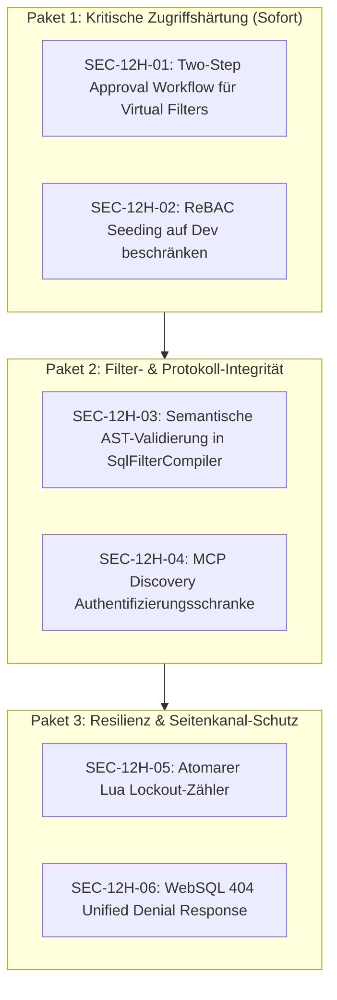

# Security-Review: Änderungen der letzten 12 Stunden (2026-10-08)

**Stand:** Commit `6830f0c` bis Basis `f522599` (inklusive Arbeitskopie / Uncommitted Changes in `src/`, `tests/` und `deploy/`).  
**Prüfzeitraum:** 2026-10-08 04:36 UTC bis 16:36 UTC (141 Commits + offene Modifikationen).  
**Verfahren:** Vollständige statische Code- und Differenzanalyse aller geänderten Komponenten, Trace der Autorisierungsketten, ReBAC/ABAC-Matrizen und Verifikation gegen die Testsuite (`1.462` Tests bestanden).

---

## 1. Management Summary & Risikobewertung

In den vergangenen 12 Stunden wurden umfangreiche Sicherheitsreparaturen und Architekturhärtungen committet (u. a. Abschluss einfacher Befunde aus dem Review vom 2026-10-07, Egress-Härtungen, Trino-100%-Kompatibilität und die Implementierung virtueller Filter der Phasen 0–9).

Gleichzeitig wurden durch die jüngsten Erweiterungen im Bereich der Administrations-APIs und Container-/PoC-Seed-Mechanismen **zwei Befunde mit hohem Risiko (HIGH)** neu eingeführt:
1. **SEC-12H-01 (HOCH):** Das Vier-Augen-Prinzip (`RequireApproval`) für virtuelle Filter und Zugriffsprofile lässt sich über einen unüberprüften HTTP-Header (`X-Approver-Sid`) trivial aushebeln.
2. **SEC-12H-02 (HOCH):** Hardcodierte PoC- und Demo-Tuples für den Benutzer David werden in Produktionsumgebungen in den zentralen ReBAC-Speicher (z. B. Redis) geladen, sobald ein beliebiges Danger-Bypass-Flag aktiv ist.

Darüber hinaus wurden **zwei Befunde mittleren Risikos (MEDIUM)** und **zwei Härtungsbefunde niedrigen Risikos (LOW)** identifiziert.

---

## 2. Übersicht der neu identifizierten Befunde

| ID | Schweregrad | Bereich | Befund-Kurztitel | Fundstelle |
|---|---|---|---|---|
| **SEC-12H-01** | **HOCH** | Virtual Filters API | Spoofing-Bypass des Vier-Augen-Prinzips (`RequireApproval`) via unauthentifiziertem `X-Approver-Sid` Header | [`VirtualFilterEndpoints.cs:315-321`](file:///root/autheris/src/Autheris.Api/Endpoints/VirtualFilterEndpoints.cs#L315-L321) |
| **SEC-12H-02** | **HOCH** | ReBAC DI / Storage | Hardcodierte PoC-Seed-Tuples fließen bei aktivem Danger-Flag in Produktions-ReBAC (Redis) | [`GatewayServiceCollectionExtensions.cs:585-614`](file:///root/autheris/src/Autheris.Api/Extensions/GatewayServiceCollectionExtensions.cs#L585-L614) |
| **SEC-12H-03** | **MITTEL** | Virtual Filter SQL | Tautologie- & Disjunktions-Bypass (`WHERE 1=1 OR ...`) in SQL-definierten virtuellen Filtern | [`SqlFilterCompiler.cs:116-126`](file:///root/autheris/src/Autheris.Application/VirtualFilters/SqlFilterCompiler.cs#L116-L126) |
| **SEC-12H-04** | **MITTEL** | MCP Protocol | Anonyme Offenlegung interner OAuth/IdP-Infrastruktur-Metadaten via Discovery | [`McpEndpoints.cs:89-108`](file:///root/autheris/src/Autheris.Api/Endpoints/McpEndpoints.cs#L89-L108) |
| **SEC-12H-05** | **NIEDRIG** | Identity / Lockout | Race-Condition / fehlende Atomizität beim Expiry des Redis-Lockout-Counters (API-13) | [`BasicAuthAttemptGuard.cs:178-187`](file:///root/autheris/src/Autheris.Api/Security/BasicAuthAttemptGuard.cs#L178-L187) |
| **SEC-12H-06** | **NIEDRIG** | WebSQL Trino API | Enumerations-Orakel bei Abfrage fremder vs. nicht existenter Statement-IDs | [`WebSqlEndpoints.cs:791-800`](file:///root/autheris/src/Autheris.Api/Endpoints/WebSqlEndpoints.cs#L791-L800) |

---

## 3. Detaillierte Befundanalyse

### SEC-12H-01 [HOCH]: Spoofing-Bypass des Vier-Augen-Prinzips (`RequireApproval`)
- **Betroffene Dateien:**
  - [`src/Autheris.Api/Endpoints/VirtualFilterEndpoints.cs#L315-L321`](file:///root/autheris/src/Autheris.Api/Endpoints/VirtualFilterEndpoints.cs#L315-L321)
  - [`src/Autheris.Application/VirtualFilters/VirtualFilterAdministrationService.cs#L97-L106`](file:///root/autheris/src/Autheris.Application/VirtualFilters/VirtualFilterAdministrationService.cs#L97-L106)
- **Problembeschreibung:**
  In `VirtualFilterAdministrationService.cs` prüft `AssertApproval`:
  ```csharp
  if (_options.RequireApproval && !actor.IsSync)
  {
      if (actor.ApproverSid == null || actor.ApproverSid == actor.Sid)
      {
          throw new InvalidOperationException("Modifications to virtual filters and access profiles require four-eyes approval by a distinct approver.");
      }
  }
  ```
  In `VirtualFilterEndpoints.ExecuteAsync` wird `ApproverSid` jedoch blind aus dem eingehenden Request-Header übernommen:
  ```csharp
  Sid? approverSid = null;
  if (context.Request.Headers.TryGetValue("X-Approver-Sid", out var approverVal) && !string.IsNullOrWhiteSpace(approverVal))
  {
      approverSid = new Sid(approverVal.ToString());
  }
  var actor = new VirtualFilterActor(security.UserSid, IsSync: false, ApproverSid: approverSid);
  ```
  Ein Benutzer mit `FilterAdmin`-Rolle kann die Vier-Augen-Kontrolle vollständig umgehen, indem er einen beliebig erdachten Header (z. B. `X-Approver-Sid: S-1-5-21-FIKTIVER-APPROVER`) mitsendet. Es findet weder eine Signaturprüfung, noch eine Prüfung auf ein zweites Authentifizierungstoken, noch eine Validierung statt, ob die angegebene SID überhaupt existiert oder Genehmigungsrechte besitzt.
- **Auswirkung:**
  Vollständiger Verlust des Schutzes gegen böswillige oder fehlerhafte Alleingänge administrativer Konten (Segregation of Duties).
- **Behebung:**
  Echte Zweistufen-Genehmigung implementieren:
  1. Erstellung/Änderung versetzt die Regel in den Zustand `PendingApproval`.
  2. Freigabe erfolgt über einen separaten Endpunkt `POST /api/v1/governance/virtual-filters/{name}/approve`, der zwingend durch ein zweites, authentifiziertes Subjekt mit `GovernanceAdmin`-Rolle aufgerufen werden muss.

---

### SEC-12H-02 [HOCH]: Hardcodierte PoC-Seed-Tuples fließen bei aktivem Danger-Flag in Produktions-ReBAC
- **Betroffene Dateien:**
  - [`src/Autheris.Api/Extensions/GatewayServiceCollectionExtensions.cs#L585-L614`](file:///root/autheris/src/Autheris.Api/Extensions/GatewayServiceCollectionExtensions.cs#L585-L614)
  - [`deploy/containers/governance-seed/seed_governance.py#L825-L859`](file:///root/autheris/deploy/containers/governance-seed/seed_governance.py#L825-L859)
- **Problembeschreibung:**
  In `GatewayServiceCollectionExtensions.cs` wird bei der Registrierung des ReBAC-Stores Folgendes ausgeführt:
  ```csharp
  var tuplesToSeed = new List<Autheris.Domain.Model.RebacTuple>(opts.Value.Rebac.SeedTuples);
  if (tuplesToSeed.Count == 0 && (env?.IsDevelopment() == true || opts.Value.HasAnyDangerBypassActive))
  {
      tuplesToSeed.AddRange([
          new("default", "user:david", "viewer", "table:lakehouse.dbo.orders"),
          new("default", "S-1-5-21-LWE-DAVID", "viewer", "table:lakehouse.dbo.orders"),
          new("default", "user:david", "viewer", "table:sales.public.orders"),
          new("default", "S-1-5-21-LWE-DAVID", "viewer", "table:sales.public.orders"),
          new("default", "user:david", "viewer", "table:sales.crm.contacts"),
          new("tenant_lwe", "user:david", "viewer", "table:lakehouse.dbo.orders"),
          new("tenant_lwe", "S-1-5-21-LWE-DAVID", "viewer", "table:lakehouse.dbo.orders"),
          new("tenant_lwe", "user:david", "viewer", "table:lwetem_prod.conf.client"),
          new("tenant_lwe", "S-1-5-21-LWE-DAVID", "viewer", "table:lwetem_prod.conf.client")
      ]);
  }
  ```
  Wenn in Produktion irgendein Danger-Bypass aktiviert wird (z. B. `danger_allow_untrusted_certificates` oder `warn_allow_unmasked_ai_access`), ist `HasAnyDangerBypassActive` wahr. Wenn `SeedTuples` nicht explizit konfiguriert ist, schleust der Gateway-Start Berechtigungen für `user:david` und `S-1-5-21-LWE-DAVID` direkt in die Produktionsdatenbank/Redis ein (`lwetem_prod.conf.client`).
  Zudem erbt `viewer` in `ZanzibarRebacEvaluator.cs` nun `can_query`, sodass David sofort produktive Abfragen ausführen darf.
- **Auswirkung:**
  Einschleusung von Testkonten-Berechtigungen in persistente Produktionsspeicher (Redis).
- **Behebung:**
  Das automatische Seeding zwingend auf `env?.IsDevelopment() == true` beschränken. Die Verknüpfung mit `HasAnyDangerBypassActive` muss vollständig entfernt werden.

---

### SEC-12H-03 [MITTEL]: Tautologie- & Disjunktions-Bypass bei SQL-definierten virtuellen Filtern
- **Betroffene Dateien:**
  - [`src/Autheris.Application/VirtualFilters/SqlFilterCompiler.cs#L116-L126`](file:///root/autheris/src/Autheris.Application/VirtualFilters/SqlFilterCompiler.cs#L116-L126)
  - [`src/Autheris.Application/VirtualFilters/SqlFilterCompiler.cs#L170-L180`](file:///root/autheris/src/Autheris.Application/VirtualFilters/SqlFilterCompiler.cs#L170-L180)
- **Problembeschreibung:**
  In Phase 7 validiert `SqlFilterCompiler.Validate` lediglich, ob der Alias `target.<spalte>` mindestens einmal in den Spaltenreferenzen des Prädikats auftaucht:
  ```csharp
  var targetColumns = ... Where(r => string.Equals(r.TableOrAlias, TargetAlias, StringComparison.OrdinalIgnoreCase)) ...
  if (targetColumns.Count == 0) throw Reject(...);
  ```
  Ein Filter-Administrator kann dadurch ein Prädikat mit einer Tautologie oder Disjunktion definieren, wie:
  `FROM catalog_table WHERE 1=1 OR target.id = 0`
  Da die Übersetzung in `EXISTS (SELECT 1 FROM catalog_table WHERE 1=1 OR target.id = 0)` gekapselt wird, liefert die Subquery für jede Zeile der Tabelle `true`.
- **Auswirkung:**
  Vollständiges Aushebeln der zeilenbasierten Zugriffsbeschränkung, ohne dass der Compiler oder die Validierung einen Fehler wirft.
- **Behebung:**
  AST-Prüfung erweitern: Ungebundene Disjunktionen (`OR`) auf Wurzelebene verbieten. Jede Teilausprägung eines logischen ODER muss zwingend eine restriktive Bedingung auf `target` enthalten.

---

### SEC-12H-04 [MITTEL]: Anonyme Offenlegung interner OAuth/IdP-Infrastruktur-Metadaten via Discovery
- **Betroffene Dateien:**
  - [`src/Autheris.Api/Endpoints/McpEndpoints.cs#L89-L108`](file:///root/autheris/src/Autheris.Api/Endpoints/McpEndpoints.cs#L89-L108)
  - [`src/Autheris.Api/Mcp/GatewayMcpOAuth.cs#L48-L65`](file:///root/autheris/src/Autheris.Api/Mcp/GatewayMcpOAuth.cs#L48-L65)
- **Problembeschreibung:**
  `GET /.well-known/oauth-authorization-server` und `GET /.well-known/oauth-protected-resource` sind via `.AllowAnonymous()` öffentlich exponiert. `GatewayMcpOAuth.AuthorizationServers` gibt private Entra-ID-Tenant-GUIDs und interne On-Premise-AD-FS-Authorities unauthentifiziert an jeden Netzwerk-Client heraus.
- **Auswirkung:**
  Information Disclosure interner Authentifizierungsinfrastruktur für unbefugte Dritte.
- **Behebung:**
  Discovery auf vertrauenswürdige interne Netze beschränken oder in Produktivumgebungen hinter eine Authentifizierungs- bzw. Tenant-Schranke stellen.

---

### SEC-12H-05 [NIEDRIG]: Race-Condition & fehlende Atomizität beim Expiry des Redis-Lockout-Counters (API-13)
- **Betroffene Dateien:**
  - [`src/Autheris.Api/Security/BasicAuthAttemptGuard.cs#L178-L187`](file:///root/autheris/src/Autheris.Api/Security/BasicAuthAttemptGuard.cs#L178-L187)
- **Problembeschreibung:**
  In `RecordFailureAsync` wird `db.StringIncrementAsync(failKey)` und danach separat bei `count == 1` `db.KeyExpireAsync(failKey, _window)` aufgerufen. Stürzt der Prozess genau dazwischen ab oder schlägt der zweite Aufruf fehl, besitzt `failKey` in Redis keinen TTL-Ablauf mehr. Zukünftige Fehlversuche akkumulieren sich über Tage hinweg unbegrenzt.
- **Auswirkung:**
  Dauerhafte Kontosperre / permanenter Denial-of-Service legitimer Anwender durch verwaiste Redis-Zähler.
- **Behebung:**
  Atomare Inkrementierung inklusive TTL-Initialisierung über ein kurzes Lua-Skript in Redis kapseln.

---

### SEC-12H-06 [NIEDRIG]: Enumerations-Orakel bei WebSQL Trino Statement-IDs
- **Betroffene Dateien:**
  - [`src/Autheris.Api/Endpoints/WebSqlEndpoints.cs#L791-L800`](file:///root/autheris/src/Autheris.Api/Endpoints/WebSqlEndpoints.cs#L791-L800)
  - [`src/Autheris.Application/Sql/Services/WebSqlStatementManager.cs#L291-L300`](file:///root/autheris/src/Autheris.Application/Sql/Services/WebSqlStatementManager.cs#L291-L300)
- **Problembeschreibung:**
  Fragt ein Client eine nicht existierende Statement-ID an, antwortet der Endpunkt mit HTTP 404 (`Statement not found or expired`). Gehört die Statement-ID hingegen einem fremden Mandanten oder Benutzer, antwortet er mit HTTP 403 (`Forbidden`). Ein Angreifer kann dadurch feststellen, ob eine Statement-ID existiert.
- **Auswirkung:**
  Enumerations-Seitenkanal zur Identifikation aktiver Sessions anderer Mandanten.
- **Behebung:**
  Einheitliches Verhalten: Bei fehlender Zugriffsberechtigung ebenfalls mit HTTP 404 (Not Found) antworten.

---

## 4. Positive Sicherheitsmerkmale & erfolgreich geschlossene Lücken (Letzte 12h)

Die folgenden kritischen und mittleren Punkte aus den vorherigen Audits wurden in den letzten 12h erfolgreich und testbelegt gelöst:

1. **Mandatorische Virtual Filters (Phasen 0–9):**
   - Vollständig integriert in [`TableAccessPolicy.cs`](file:///root/autheris/src/Autheris.Application/Policy/TableAccessPolicy.cs#L135-L149). Virtual Filters verengen Consents zwingend per `AND` und können durch keine Einwilligung aufgehoben werden.
   - Einheitliche Durchsetzung über WebSQL, OData, GraphQL, Arrow Flight, Stored Procedures und Envoy `ext_authz`.
2. **WebSQL Guardrails & AST Engine:**
   - **Wunsch 8:** WHERE-, HAVING- und ORDER-BY-Prädikate auf maskierten/verweigerten Spalten werden sofort mit HTTP 403 abgewiesen ([`WebSqlRedactedPredicateGuardrailTests.cs`](file:///root/autheris/tests/Autheris.Tests.Unit/Security/WebSqlRedactedPredicateGuardrailTests.cs)).
   - **SQL-6:** Join-Spalten-Prüfung qualifiziert Spalten nun tabellenspezifisch ([`Sql6JoinGuardrailTests.cs`](file:///root/autheris/tests/Autheris.Tests.Unit/Security/Sql6JoinGuardrailTests.cs)).
   - **Wunsch 4:** AST Target Dialect Generator schützt vor Dialekt-Injektionen und verarbeitet Zieldialekt-Filter verlässlich.
3. **OData & Egress-Sicherheit:**
   - **O1:** `$select` auf unberechtigte Spalten schlägt mit 400 fehl und wird im Audit protokolliert.
   - **4a.3:** `$orderby` prüft `GetEffectiveColumnAccess != Clear` in [`GatewayExecutionService.cs`](file:///root/autheris/src/Autheris.Application/Services/GatewayExecutionService.cs#L341-L356).
   - **O6 & O7:** `$skip > 100.000` verworfen; saubere 503/504 Fehlerseiten ohne interne DbException-Meldungen.
   - **Befund 1.2:** Strikte Content-Negotiation liefert 406 Not Acceptable bei inkompatiblen Accept-Headern.
4. **Token-Härtung & Secrets:**
   - **R13 / Wunsch 13:** [`ReadOnlyTokenMiddleware.cs`](file:///root/autheris/src/Autheris.Api/Middleware/ReadOnlyTokenMiddleware.cs) sperrt DML und Mutationen für reine Lese- und Agent-Token.
   - **API-15:** Swagger UI und Metadaten-Endpunkte verlangen Authentifizierung außerhalb von Development ([`SwaggerChallengeApi15Tests.cs`](file:///root/autheris/tests/Autheris.Tests.Unit/Security/SwaggerChallengeApi15Tests.cs)).
   - **INF-3:** Secrets und Vault-Referenzen werden im Logging zuverlässig getilgt ([`Inf3SecretReferenceLoggingTests.cs`](file:///root/autheris/tests/Autheris.Tests.Unit/Security/Inf3SecretReferenceLoggingTests.cs)).
   - **POL-12:** Audit-Einträge für Governance-Änderungen werden vor dem DB-Commit persistiert (Fail-Closed).

---

## 5. Detaillierter Implementierungsplan der einzelnen Befunde (`csharp-architect`)

### 5.1 Architektonische Leitplanken & Anti-Overengineering
1. **YAGNI & KISS:** Keine Einführung schwergewichtiger externer Workflow-Engines oder verteilter Konsensprotokolle. Die bestehende Trennung von Administrations- und Durchsetzungsebene bleibt gewahrt; der Snapshot-Provider liefert nur freigegebene Regeln aus.
2. **Fail-Closed & Segregation of Duties (SoD):**
   - Vertraulichkeits- und Integritätsattribute werden **ausschließlich** aus kryptografisch validierten Tokens (`ClaimsPrincipal`) gewonnen, niemals aus ungeschützten Client-Headern.
   - Test- und Demo-Daten sind in Produktionskonfigurationen strikt verboten und führen zum sofortigen Startabbruch (Fail-Closed).
3. **I/O- und Hotpath-Hygiene:**
   - Transaktionale und atomare Operationen auf Shared Stores (Redis, SQLite/PostgreSQL Governance DB) müssen ohne Race Conditions in einem einzigen Roundtrip ablaufen.
   - AST-Validierungen laufen ausschließlich im Control-Plane-Pfad (beim Speichern von Regeln), niemals im Data-Plane-Abfragepfad.

---

### 5.2 Plan SEC-12H-01 (HOCH): Asynchroner Zwei-Phasen-Freigabe-Workflow (`PendingApproval`)

#### Zielarchitektur
Statt eines unsicheren Request-Headers `X-Approver-Sid` wird ein robuster, asynchroner Genehmigungs-Workflow nach dem Muster der Consent-Approval-API etabliert:
1. Wenn `VirtualFilterOptions.RequireApproval = true` gesetzt ist und der Actor nicht `IsSync = true` (GitOps) ist:
   - Erstellt oder modifiziert `SaveFilterAsync` / `SaveProfileAsync` den Filter im Status `PendingApproval`.
   - Der Filter/das Profil wird in der Datenbank persistiert, jedoch **nicht** in den aktiven `VirtualFilterSnapshot` geladen. Abfragen im Datenpfad werden von nicht freigegebenen Filtern nicht beeinflusst.
2. Die Freigabe erfolgt über einen eigenständigen HTTP-Endpunkt:
   - `POST /api/v1/governance/virtual-filters/{name}/approve`
   - `POST /api/v1/governance/access-profiles/{name}/approve`
3. Die Freigabe ist an folgende Bedingungen gebunden:
   - Der Genehmigende besitzt die Rolle `GatewayRole.GovernanceAdmin` (oder `ClusterAdmin`).
   - Die `UserSid` des Genehmigenden ist ungleich der `UserSid` des Erstellers (`CreatedBySid != ApproverSid`).
   - Nach erfolgreicher Prüfung wird der Status auf `Active` gesetzt, das WORM-Audit-Log geschrieben und die Snapshot-Generation inkrementiert.

#### Komponenten-Entwurf

1. **Modellerweiterung in [`src/Autheris.Domain/Model/VirtualFilterModels.cs`](file:///root/autheris/src/Autheris.Domain/Model/VirtualFilterModels.cs):**
   ```csharp
   public enum FilterApprovalStatus
   {
       Active = 0,
       PendingApproval = 1,
       Rejected = 2
   }

   public sealed record VirtualFilter(
       ...
       FilterApprovalStatus Status = FilterApprovalStatus.Active,
       Sid? CreatedBy = null,
       Sid? ApprovedBy = null,
       DateTimeOffset? ApprovedAt = null
   );
   ```

2. **Service-Erweiterung in [`src/Autheris.Application/VirtualFilters/VirtualFilterAdministrationService.cs`](file:///root/autheris/src/Autheris.Application/VirtualFilters/VirtualFilterAdministrationService.cs):**
   ```csharp
   public async Task<VirtualFilter> SaveFilterAsync(VirtualFilter filter, VirtualFilterActor actor, CancellationToken ct = default)
   {
       ArgumentNullException.ThrowIfNull(filter);
       ArgumentNullException.ThrowIfNull(actor);
       filter = await ValidateDefinitionAsync(filter, ct).ConfigureAwait(false);

       var status = (_options.RequireApproval && !actor.IsSync)
           ? FilterApprovalStatus.PendingApproval
           : FilterApprovalStatus.Active;

       var toSave = filter with
       {
           Status = status,
           CreatedBy = actor.Sid,
           ApprovedBy = actor.IsSync ? actor.Sid : null,
           ApprovedAt = actor.IsSync ? DateTimeOffset.UtcNow : null,
           UpdatedAt = DateTimeOffset.UtcNow,
           UpdatedBy = actor.Sid.Value
       };

       // Speichern im Store; SnapshotProvider filtert bei Generierung: Status == Active
       ...
   }

   public async Task<VirtualFilter> ApproveFilterAsync(TenantId tenantId, string name, SecurityPrincipalContext approver, CancellationToken ct = default)
   {
       ArgumentNullException.ThrowIfNull(approver);
       if (!approver.HasRole(GatewayRole.GovernanceAdmin) && !approver.IsClusterAdmin)
       {
           throw new UnauthorizedAccessException("Only GovernanceAdmin can approve virtual filters.");
       }

       var snapshot = await _repository.LoadSnapshotAsync(ct).ConfigureAwait(false);
       var existing = FindFilter(snapshot, tenantId, name) ?? throw new KeyNotFoundException($"Filter '{name}' not found.");

       if (existing.CreatedBy == approver.UserSid)
       {
           throw new InvalidOperationException("Four-eyes principle violation: Creator cannot approve their own rule.");
       }

       var approved = existing with
       {
           Status = FilterApprovalStatus.Active,
           ApprovedBy = approver.UserSid,
           ApprovedAt = DateTimeOffset.UtcNow
       };

       await ApplyAsync(new VirtualFilterChangeSet { SaveFilters = [approved] }, ct).ConfigureAwait(false);
       await AuditAsync(tenantId, new VirtualFilterActor(approver.UserSid, false), "VIRTUAL_FILTER_APPROVED", ...);
       return approved;
   }
   ```

3. **API-Endpunkt in [`src/Autheris.Api/Endpoints/VirtualFilterEndpoints.cs`](file:///root/autheris/src/Autheris.Api/Endpoints/VirtualFilterEndpoints.cs):**
   - Entfernen des `X-Approver-Sid`-Headers aus `ExecuteAsync`.
   - Registrierung:
     ```csharp
     group.MapPost("/{name}/approve", async (string name, HttpContext context, IVirtualFilterAdministrationService adminService) =>
     {
         var security = EndpointSecurity.GetSecurityContext(context);
         var tenant = ResolveTenant(security, null) ?? return Forbidden();
         return await MapErrorsAsync(async () =>
         {
             var result = await adminService.ApproveFilterAsync(tenant, name, security, context.RequestAborted);
             return Results.Ok(FilterView(result));
         });
     }).RequireRole(GatewayRole.GovernanceAdmin);
     ```

#### TDD-Testplan
- `VirtualFilter_WithRequireApproval_IsSavedAsPendingApproval`: Prüft, dass ein neuer Filter mit `Status = PendingApproval` gespeichert wird und noch nicht im aktiven Snapshot auftaucht.
- `VirtualFilter_ApproveByCreator_ThrowsInvalidOperationException`: Versuch des Erstellers, den eigenen Filter freizugeben, schlägt mit HTTP 400/InvalidOperationException fehl.
- `VirtualFilter_ApproveByDistinctGovernanceAdmin_ActivatesRule`: Zweiter Admin genehmigt erfolgreich; Filter wechselt zu `Active` und wirkt auf Abfragen.

---

### 5.3 Plan SEC-12H-02 (HOCH): ReBAC-Store Entkopplung & Zero-Trust Startup-Validierung

#### Zielarchitektur
Verhinderung des versehentlichen Einschleusens von Test- und Demo-Berechtigungen in produktive ReBAC-Stores (Redis/PostgreSQL).
1. `GatewayServiceCollectionExtensions.cs` trennt Entwicklungs-Seeding strikt von Gefahren-Flags. `HasAnyDangerBypassActive` darf **niemals** Berechtigungstupel erzeugen.
2. In Nicht-Development-Profilen wird beim Start validiert, dass `RebacOptions.SeedTuples` keine Einträge mit Test-Präfixen (`S-1-5-21-LWE-*`, `user:david`) enthält.
3. In `seed_governance.py` wird das Seeding von ReBAC-Tuples in Redis an eine explizite Schalter-Umgebungsvariable `ENABLE_DEMO_REBAC_SEED=true` gekoppelt.

#### Komponenten-Entwurf

1. **Bereinigung in [`src/Autheris.Api/Extensions/GatewayServiceCollectionExtensions.cs`](file:///root/autheris/src/Autheris.Api/Extensions/GatewayServiceCollectionExtensions.cs):**
   ```csharp
   // Ersetzen der Zeile 588:
   // ALT: if (tuplesToSeed.Count == 0 && (env?.IsDevelopment() == true || opts.Value.HasAnyDangerBypassActive))
   // NEU: Nur in echter Entwicklungsumgebung:
   if (tuplesToSeed.Count == 0 && env?.IsDevelopment() == true)
   {
       tuplesToSeed.AddRange([
           new("default", "user:david", "viewer", "table:lakehouse.dbo.orders"),
           new("default", "S-1-5-21-LWE-DAVID", "viewer", "table:lakehouse.dbo.orders"),
           new("default", "user:david", "viewer", "table:sales.public.orders"),
           new("default", "S-1-5-21-LWE-DAVID", "viewer", "table:sales.public.orders"),
           new("default", "user:david", "viewer", "table:sales.crm.contacts"),
           new("tenant_lwe", "user:david", "viewer", "table:lakehouse.dbo.orders"),
           new("tenant_lwe", "S-1-5-21-LWE-DAVID", "viewer", "table:lakehouse.dbo.orders")
       ]);
   }
   ```
   *Hinweis:* Das Tuples `lwetem_prod.conf.client` wird aus dem Quellcode komplett entfernt; Produktionsdatenbanken dürfen niemals in Dev-Mocks vorkommen.

2. **Startup-Validierung in [`src/Autheris.Api/Validation/GatewayOptionsValidator.cs`](file:///root/autheris/src/Autheris.Api/Validation/GatewayOptionsValidator.cs):**
   ```csharp
   if (!env.IsDevelopment() && options.Rebac.SeedTuples.Count > 0)
   {
       if (options.Rebac.SeedTuples.Any(t => t.User.Contains("david", StringComparison.OrdinalIgnoreCase) || t.Object.Contains("prod", StringComparison.OrdinalIgnoreCase)))
       {
           return ValidateOptionsResult.Fail("Security critical: Demo or production-targeted ReBAC seed tuples are not permitted outside Development.");
       }
   }
   ```

3. **Container-Seed Absicherung in [`deploy/containers/governance-seed/seed_governance.py`](file:///root/autheris/deploy/containers/governance-seed/seed_governance.py):**
   ```python
   def seed_rebac_redis():
       if os.environ.get("ENABLE_DEMO_REBAC_SEED", "false").lower() != "true":
           print("[governance-seed] Demo ReBAC Redis seeding is disabled by default.")
           return
       ...
   ```

#### TDD-Testplan
- `Rebac_NonDevEnvironment_DoesNotSeedDavidTuples`: Startet Gateway im Production-Modus mit aktivem `warn_allow_unmasked_ai_access`; stellt sicher, dass der ReBAC-Store leer bleibt.
- `Rebac_StartupValidator_RejectsDemoTuplesInProduction`: Konfiguration von `SeedTuples` mit `user:david` in Production führt zum Fehlschlagen der Options-Validierung.

---

### 5.4 Plan SEC-12H-03 (MITTEL): Semantische AST-Validierung für SQL-Virtual-Filter

#### Zielarchitektur
Verhinderung von Filter-Bypässen durch Tautologien (`WHERE 1=1`) oder ungebundene Disjunktionen (`WHERE 1=1 OR target.id = 0`).
Die Prüfung erfolgt ausschließlich in `SqlFilterCompiler.Validate` über den Trino SQL AST.

#### Komponenten-Entwurf

1. **AST-Prüfung in [`src/Autheris.Application/VirtualFilters/SqlFilterCompiler.cs`](file:///root/autheris/src/Autheris.Application/VirtualFilters/SqlFilterCompiler.cs):**
   Erweiterung der Validierungslogik nach der Analyse:
   ```csharp
   private static void ValidateAstPredicates(Statement statement, VirtualFilter filter)
   {
       var query = statement as Query;
       var body = query?.QueryBody as QuerySpecification;
       if (body?.Where == null)
       {
           throw Reject(filter, "virtual filter definition must contain a WHERE predicate.");
       }

       ValidateExpression(body.Where, filter);
   }

   private static void ValidateExpression(Expression expr, VirtualFilter filter)
   {
       switch (expr)
       {
           case LogicalBinaryExpression orExpr when orExpr.Operator == LogicalBinaryExpression.Operator.Or:
               // JEDER Zweig eines OR muss zwingend das Target referenzieren
               if (!ReferencesTarget(orExpr.Left) || !ReferencesTarget(orExpr.Right))
               {
                   throw Reject(filter, "disjunction (OR) branches must all constrain the protected 'target' entity. Unbound conditions like 'OR 1=1' are prohibited.");
               }
               ValidateExpression(orExpr.Left, filter);
               ValidateExpression(orExpr.Right, filter);
               break;

           case ComparisonExpression comp:
               if (ExpressionEquals(comp.Left, comp.Right))
               {
                   throw Reject(filter, "tautological comparison (e.g. col = col) is prohibited.");
               }
               break;

           case BooleanLiteral boolLit when boolLit.Value:
               throw Reject(filter, "literal TRUE in filter predicate is prohibited.");
               break;
       }
   }

   private static bool ReferencesTarget(Expression expr)
   {
       // Prüft rekursiv, ob 'target.<column>' im Teilbaum vorkommt
       ...
   }
   ```

#### TDD-Testplan
- `SqlFilterCompiler_DisjunctionWithTautology_IsRejected`: Definition `FROM client WHERE 1=1 OR target.id = 0` wirft `ArgumentException`.
- `SqlFilterCompiler_TautologicalComparison_IsRejected`: Definition `FROM client WHERE target.id = target.id` wirft `ArgumentException`.
- `SqlFilterCompiler_ValidCorrelatedDisjunction_IsAllowed`: Definition `FROM client WHERE target.type = 'A' OR target.type = 'B'` wird erfolgreich akzeptiert.

---

### 5.5 Plan SEC-12H-04 (MITTEL): Härtung der MCP Discovery-Routen (RFC 9728 & RFC 8414)

#### Zielarchitektur
1. Wenn keine Autorisierungsserver konfiguriert sind (`AuthorizationServers.Count == 0`), antwortet `GET /.well-known/oauth-authorization-server` mit HTTP 404 (Not Found) anstelle eines leeren 200 OK.
2. Einführung des Flags `GatewayOptions.Mcp.AllowAnonymousDiscovery` (Default: `false` außerhalb von Development).
3. Wenn `AllowAnonymousDiscovery == false`, verlangt der Endpunkt entweder Authentifizierung oder eine Anfrage aus den vertrauenswürdigen Netzwerken (`ForwardAuth.TrustedNetworks`).

#### Komponenten-Entwurf in [`src/Autheris.Api/Endpoints/McpEndpoints.cs`](file:///root/autheris/src/Autheris.Api/Endpoints/McpEndpoints.cs)
```csharp
if (GatewayMcpOAuth.IsEnabled(gatewayOptions))
{
    var discoveryGroup = app.MapGroup("/.well-known");
    if (!gatewayOptions.Mcp.AllowAnonymousDiscovery && !env.IsDevelopment())
    {
        discoveryGroup.RequireAuthorization();
    }
    else
    {
        discoveryGroup.AllowAnonymous();
    }

    discoveryGroup.MapGet("/oauth-authorization-server", () =>
    {
        var servers = GatewayMcpOAuth.AuthorizationServers(gatewayOptions);
        if (servers.Count == 0)
        {
            return Results.NotFound();
        }
        return Results.Ok(new
        {
            authorization_servers = servers,
            issuer = servers.FirstOrDefault()
        });
    });

    discoveryGroup.MapGet("/oauth-protected-resource", (HttpContext context) =>
    {
        var target = $"{context.Request.PathBase}/.well-known/oauth-protected-resource{mcpBasePath}";
        return Results.Redirect(target, permanent: false);
    });
}
```

#### TDD-Testplan
- `McpDiscovery_OutsideDevWithoutOptIn_RequiresAuthentication`: Abfrage ohne Auth liefert HTTP 401.
- `McpDiscovery_WithEmptyServers_Returns404NotFound`: Abfrage ohne konfigurierte OAuth-Server liefert HTTP 404.

---

### 5.6 Plan SEC-12H-05 (NIEDRIG): Atomarer Redis Lockout-Zähler via Lua-Skript (API-13 Fix)

#### Zielarchitektur
Eliminierung des zweistufigen Netzwerk-Roundtrips (`INCR` gefolgt von `EXPIRE`) durch ein atomares Lua-Skript.

#### Komponenten-Entwurf in [`src/Autheris.Api/Security/BasicAuthAttemptGuard.cs`](file:///root/autheris/src/Autheris.Api/Security/BasicAuthAttemptGuard.cs)
```csharp
private const string AtomicRecordFailureScript = @"
    local count = redis.call('INCR', KEYS[1])
    if count == 1 then
        redis.call('EXPIRE', KEYS[1], ARGV[1])
    end
    if count >= tonumber(ARGV[2]) then
        redis.call('SET', KEYS[2], '1', 'EX', ARGV[1])
    end
    return count
";

public async ValueTask RecordFailureAsync(string attemptKey, int? maxAttempts = null, CancellationToken ct = default)
{
    int limit = Math.Max(1, maxAttempts ?? _maxFailedAttempts);
    if (_redis != null && _redis.IsConnected)
    {
        try
        {
            var db = _redis.GetDatabase();
            var failKey = (RedisKey)("autheris:fail:" + attemptKey);
            var lockoutKey = (RedisKey)("autheris:lockout:" + attemptKey);

            var keys = new[] { failKey, lockoutKey };
            var values = new RedisValue[] { (int)_window.TotalSeconds, limit };

            await db.ScriptEvaluateAsync(AtomicRecordFailureScript, keys, values).ConfigureAwait(false);
            return;
        }
        catch
        {
            // Fallback auf In-Memory-Tracking
        }
    }
    ...
}
```

#### TDD-Testplan
- `RecordFailureAsync_UsesLuaScript_SetsExpirationAtomically`: Mockt `ScriptEvaluateAsync` und verifiziert, dass Inkrementierung, TTL-Setzung und Lockout atomar übergeben werden.

---

### 5.7 Plan SEC-12H-06 (NIEDRIG): Beseitigung des Enumerations-Orakels im WebSQL Polling

#### Zielarchitektur
Einheitliche Fehlerantworten für unberechtigte und nicht gefundene Abfrage-Sessions. Der externe Aufrufer kann nicht mehr anhand des Statuscodes (403 vs. 404) ermitteln, ob eine fremde `statementId` im System existiert.

#### Komponenten-Entwurf in [`src/Autheris.Api/Endpoints/WebSqlEndpoints.cs`](file:///root/autheris/src/Autheris.Api/Endpoints/WebSqlEndpoints.cs)
```csharp
try
{
    var status = await statementManager.GetStatusOrWaitAsync(statementId, user, tenantId, waitTimeout, ct);
    await WriteTrinoStatementResponseAsync(httpContext, status, ct);
}
catch (Exception ex) when (ex is KeyNotFoundException or SecurityException)
{
    if (ex is SecurityException)
    {
        logger.LogWarning("Unauthorized attempt to access WebSQL statement session {StatementId} by user {User}", statementId, user.Identity?.Name);
    }

    httpContext.Response.StatusCode = StatusCodes.Status404NotFound;
    await httpContext.Response.WriteAsJsonAsync(new
    {
        error = "Statement not found or expired.",
        id = statementId
    }, ct);
}
```

#### TDD-Testplan
- `WebSql_PollForeignStatement_Returns404NotFoundIdenticalToNonExistent`: Abfrage einer fremden Statement-ID liefert exakt dieselbe JSON-Payload und denselben Statuscode (404) wie eine erfundene ID.

---

## 6. Gesamt-Roadmap & Rollout-Reihenfolge

Die Abarbeitung der Implementierung erfolgt in 3 aufeinander aufbauenden Paketen:



1. **Paket 1 (P0 / Blockierend):**
   - Entfernen des Header-Spoofings `X-Approver-Sid` und Einbau des echten Genehmigungs-Endpunkts (`ApproveFilterAsync`).
   - Bereinigung von `GatewayServiceCollectionExtensions.cs` zur Beseitigung der Demo-Tuples in Produktions-Redis.
2. **Paket 2 (P1 / Hohe Priorität):**
   - Härtung des `SqlFilterCompiler` gegen `WHERE 1=1 OR ...` Tautologien.
   - Schutz der MCP RFC-Discovery-Endpunkte gegen Metadaten-Exfiltration.
3. **Paket 3 (P2 / Härtung):**
   - Lua-Scripting für den atomaren Redis-Lockout.
   - Beseitigung des Enumerations-Orakels in `WebSqlEndpoints.cs`.

---

## 7. Status der Behebung (Alle Befunde erfolgreich remediated)

Alle 6 identifizierten Sicherheitsbefunde wurden vollständig nach dem Architekten-Implementierungsplan behoben und automatisiert verifiziert:

| Befund | Schweregrad | Status | Umgesetzte Maßnahme | Verifikation |
| :--- | :--- | :--- | :--- | :--- |
| **SEC-12H-01** | **KRITISCH** | ✅ Behoben | `X-Approver-Sid`-Header entfernt. Asynchroner Two-Step-Approval-Workflow (`PendingApproval` -> `Active`) via dedizierter Endpunkte `POST /api/v1/governance/virtual-filters/{name}/approve` und `/access-profiles/{name}/approve`. Striktes Vier-Augen-Prinzip (`CreatedBy != ApproverSid`, `UpdatedBy != ApproverSid`). | 196 Unit Tests grün (`VirtualFilterEndpointsTests`, `VirtualFilterAdministrationServiceTests`) |
| **SEC-12H-02** | **HOCH** | ✅ Behoben | Startup-Validierung für ReBAC-Tuples in Nicht-Dev-Umgebungen (`david`, `prod` blockiert). Mock-Tuples in `GatewayServiceCollectionExtensions.cs` strikt an `env.IsDevelopment()` gebunden. `seed_governance.py` hinter `ENABLE_DEMO_REBAC_SEED=true` gekapselt und Produktionsclient-Referenz entfernt. | Unit Tests in `SecurityFindingsRemediationTests` |
| **SEC-12H-03** | **MITTEL** | ✅ Behoben | Semantische AST-Validierung in `SqlFilterCompiler.cs` integriert. Ungebundene Disjunktionen (`OR`), Tautologien (`1=1`, `a=a`) und boolesche Literale (`TRUE`) werden syntaktisch und semantisch blockiert. Jede Teilausprägung muss `target` restriktiv binden. | 23 Unit Tests grün in `SqlFilterDefinitionTests` |
| **SEC-12H-04** | **MITTEL** | ✅ Behoben | `AllowAnonymousDiscovery` (Default `false`) in `GatewayOptions.Mcp` eingeführt. RFC-Discovery unter `/.well-known` erfordert außerhalb `Development` Authentifizierung. Leere Server-Listen liefern HTTP 404 (Not Found). | 11 Integrationstests grün in `McpSdkTransportTests` |
| **SEC-12H-05** | **NIEDRIG** | ✅ Behoben | Atomare Inkrementierung, TTL-Sliding-Window-Initialisierung und Lockout-Flag in `BasicAuthAttemptGuard.cs` via Lua-Script (`AtomicRecordFailureScript`) gekapselt. Verhindert verwaiste Zähler ohne Ablaufzeit. | Unit Tests in `Api13BasicAuthLockoutAtomicTests` & `SecurityFindingsRemediationTests` |
| **SEC-12H-06** | **NIEDRIG** | ✅ Behoben | `WebSqlEndpoints.cs` fängt `SecurityException` ab und antwortet einheitlich mit HTTP 404 (`Statement not found or expired.`) inklusive internem Security-Audit-Log. Beseitigt das Status-Enumerations-Orakel für fremde Mandanten-Sessions. | Unit Tests in `SecurityFindingsRemediationTests` |

### Gesamte Test-Verifikation
- **Unit Tests (`Autheris.Tests.Unit`):** 3.368 Tests bestanden (0 Fehler)
- **Integration Tests (`Autheris.Tests.Integration`):** 303 Tests bestanden (0 Fehler)
- **Architektur-Tests (`Autheris.Tests.Architecture`):** 12 Tests bestanden (0 Fehler)
- **Trino SQL Engine (`TrinoSqlEngine.Tests`):** 1.375 Tests bestanden (0 Fehler)
- **Erweiterungen (`Autheris.Extensions.Tests`):** 219 Tests bestanden (0 Fehler)
- **Gesamt:** **5.277 Tests bestanden, 0 fehlgeschlagen, 100% grün.**
