# Architektonischer TDD-Umsetzungsplan: Einfache niedrige Befunde

**Dokument-ID:** `PLAN-LOW-FINDINGS-TDD-2026-10-08`  
**Referenz:** [`docs/plans/status-und-umsetzungsplan-2026-10-07.md`](status-und-umsetzungsplan-2026-10-07.md) (Abschnitt 4: Niedrige Befunde)  
**Rolle:** C# & .NET Solution Architect  
**Status:** Planungsphase abgeschlossen / Bereit für schrittweise TDD-Ausführung  
**Architektur-Leitlinien:** Anti-Overengineering (KISS, YAGNI, keine unnötigen Abstraktionen oder Mapping-Schichten), striktes Test-Driven Development (jeder Sicherheitstest muss ohne Fix fehlschlagen/rot sein), ein Thema pro Git-Commit.

---

## 1. Executive Summary & Architektonische Leitplanken

Aus Abschnitt 4 des Statusplans wurden alle 20 Befunde selektiert, die als **einfach / isoliert mit deterministischer Lösung** eingestuft sind. Diese Befunde berühren keine weitreichenden Schema- oder Engine-Umbauten (wie Phase 5: `ITableAccessResolver` oder `GovernedConnectorReader`), sondern stellen essenzielle **Sicherheits-Härtungen, Fail-Closed-Absicherungen und Konfigurations-Schranken** dar.

### Architektonische Prinzipien nach `csharp-architect`
1. **Pragmatismus vor Dogmatismus (KISS & YAGNI):**  
   Keine Einführung generischer Interfaces oder redundanter DTO-Schichten für einfache Validierungslogiken. Wo ein `HashSet<string>` oder eine Guard-Clause in `ValidateGatewayOptions` genügt, wird kein neues Framework hinzugefügt.
2. **Fail-Closed by Design:**  
   Bei fehlenden Abhängigkeiten, Parsing-Fehlern oder unklaren Zuständen verweigert das Gateway den Zugriff bzw. bricht den Start ab (Zero Trust).
3. **Strikte I/O- und DI-Konsistenz:**  
   Keine Scoped-Leaks in Singletons. Alle asynchronen Pfade reichen `CancellationToken` durch.
4. **TDD-Verifikation (Red-Green-Refactor):**  
   Jeder Befund wird durch einen dedizierten Unit-Test eingeleitet, der die Sicherheitslücke vor der Codeänderung nachweist (`RED`). Erst danach erfolgt die minimale, saubere Behebung (`GREEN`), gefolgt von der Verifikation der gesamten Testsuite (`dotnet test Autheris.sln`).

---

## 2. Übersicht der 20 einfachen Befunde nach Blöcken

```mermaid
flowchart TD
    subgraph BlockA["Block A: Authentifizierung & API-Härtung"]
        API9["API-9: DataProtectionOfficer in Header-Denylist"]
        API8["API-8: TrustedNetworks CIDR /0 Validierung"]
        API16["API-16: warn_allow_all_cors_origins Blockade"]
        API17["API-17: WASM-Plugin Tag Pinnen (:latest Verbot)"]
        API11["API-11: Exception-Text Sanitization"]
        DEP14["DEP-14: Klartext-BasicAuth Startup-Validierung"]
        DEP16["DEP-16: CORS-localhost Fallback-Entfernung"]
    end

    subgraph BlockB["Block B: MCP & AI-Guardrails"]
        MCP7["MCP-7: Fail-Closed Argument-Parsing"]
        MCP4["MCP-4: Entfernen synthetischer Rollen (Fast-Path)"]
    end

    subgraph BlockC["Block C: SQL, OLAP & Prozeduren"]
        SQL214["SQL2-14: DuckDB-Validator mit SQL-Kommentaren"]
        SQL215["SQL2-15: Dialekt-Masking mit N-Präfix & Escaping"]
        SQL216["SQL2-16: Prozeduren ohne Audit Fail-Closed"]
        SQL219["SQL2-19: Qualifizierung in RLS-Subqueries"]
    end

    subgraph BlockD["Block D: Policies & Governance-Erweiterungen"]
        POL10["POL-10: RequestedColumns im Casbin-Cache-Key"]
        POL11["POL-11: Schema in ReBAC-Objekt-ID"]
        POL13["POL-13: IGatewayRoleEvaluator für Federation"]
        INF3["INF-3: Redaktion von Secret-Referenzen im Log"]
        EXT6["EXT-6: Rollen-Mapping im OpenMetadata-User-Pfad"]
        EXT7["EXT-7: DataCatalog neue Tabellen inaktiv"]
        WF1["WF-1: Validierung in ExtendConsentExpiryAsync"]
    end

    BlockA --> BlockB --> BlockC --> BlockD
```



---

## 3. Detaillierter TDD-Spezifikationsplan je Befund

---

### Block A: Authentifizierung & API-Härtung

#### 1. API-9: `DataProtectionOfficer` in Header-Rollen-Denylist
* **Befund:** In `ForwardAuthAuthenticationHandler.cs` werden administrative Rollen (`ClusterAdmin`, `GovernanceAdmin`, `PrivacyAdmin`, `BreakGlassOperator`) verworfen, wenn sie über Reverse-Proxy-Header (`X-Forwarded-Roles`) eintreffen. Die Rolle `DataProtectionOfficer` (DPO mit DSGVO-Sonderrechten) fehlt in `HeaderForbiddenRoles`.
* **Betroffene Komponenten:**
  - `src/Autheris.Api/Security/ForwardAuthAuthenticationHandler.cs` (Klasse `ForwardAuthAuthenticationHandler`)
  - `tests/Autheris.Tests.Unit/AuthenticationSecurityTests.cs`
* **Architektonische Lösung:**  
  `"DataProtectionOfficer"` in das statische `HashSet<string> HeaderForbiddenRoles` aufnehmen.
* **TDD-Ablauf:**
  1. **RED:** In `AuthenticationSecurityTests.cs` Test `API_09_ForwardAuth_DataProtectionOfficer_IsForbiddenFromHeaders` hinzufügen:
     ```csharp
     ForwardAuthAuthenticationHandler.IsHeaderForbiddenRole("DataProtectionOfficer").ShouldBeTrue();
     ```
     *Erwarteter Fehler:* `ShouldAssertException: expected True, was False`.
  2. **GREEN:** Ergänzung von `"DataProtectionOfficer"` in `HeaderForbiddenRoles`.
  3. **Regression:** Testaufruf via ForwardAuth-Header verifiziert, dass die Rolle nicht in `ClaimsPrincipal` übernommen wird.
* **Commit-Message:** `fix(auth): forbid DataProtectionOfficer from proxy headers (API-9)`

---

#### 2. API-8: Validierung von `ForwardAuth.TrustedNetworks` und `TrustedProxies`
* **Befund:** In `GatewayServiceCollectionExtensions.ValidateGatewayOptions` wird `ReverseProxy.KnownNetworks` gegen `/0` und Parse-Fehler geprüft, `Authentication.ForwardAuth.TrustedNetworks` und `TrustedProxies` jedoch nicht. Ein Angreifer oder Fehlkonfiguration mit `0.0.0.0/0` hebelt die IP-Schranke für Proxy-Header aus.
* **Betroffene Komponenten:**
  - `src/Autheris.Api/Extensions/GatewayServiceCollectionExtensions.cs`
  - `tests/Autheris.Tests.Unit/ForwardAuthTests.cs` oder `AuthenticationSecurityTests.cs`
* **Architektonische Lösung:**  
  In `ValidateGatewayOptions`: Wenn `options.Authentication.ForwardAuth.Enabled` aktiv ist:
  - Iteration über `TrustedNetworks`: Prüfung mit `IPNetwork.TryParse`. Bei Misserfolg oder wenn `PrefixLength == 0` (`0.0.0.0/0` oder `::/0`) -> `ValidationException`.
  - Iteration über `TrustedProxies`: Prüfung mit `IPAddress.TryParse`.
* **TDD-Ablauf:**
  1. **RED:** Test `API_08_ForwardAuth_TrustedNetworks_WildcardOrInvalid_ThrowsValidationException`:
     Konfiguration mit `TrustedNetworks = ["0.0.0.0/0"]` bzw. `["invalid-ip"]` an `ValidateGatewayOptions` übergeben.
     *Erwarteter Fehler:* Keine Exception geworfen.
  2. **GREEN:** Validierungsschleife in `ValidateGatewayOptions` implementieren.
  3. **Regression:** Gültige CIDR-Subnetze (`10.0.0.0/8`, `192.168.1.0/24`) validieren erfolgreich.
* **Commit-Message:** `fix(config): validate ForwardAuth trusted networks and reject wildcard CIDRs (API-8)`

---

#### 3. API-16: `warn_allow_all_cors_origins` in Production sperren
* **Befund:** Das Flag `Insecure.warn_allow_all_cors_origins` hebelt Preflight-Prüfungen aus und erlaubt Wildcard-Origins. Außerhalb von Development ist dies ohne explizites Opt-in (`AllowInsecureWarnFlagsInProduction`) ein eklatantes Sicherheitsrisiko.
* **Betroffene Komponenten:**
  - `src/Autheris.Api/Extensions/GatewayServiceCollectionExtensions.cs`
  - `tests/Autheris.Tests.Unit/ConfigurationValidationTests.cs`
* **Architektonische Lösung:**  
  Analog zu `warn_enable_introspection` (RR-L3-05) in `ValidateGatewayOptions` einfügen:
  ```csharp
  if (!environment.IsDevelopment() && options.IsAllCorsAllowed && !options.AllowInsecureWarnFlagsInProduction)
  {
      throw new ValidationException(
          "Sicherheitsverletzung (API-16): warn_allow_all_cors_origins darf außerhalb von Development nur mit explizitem " +
          "Opt-in über Insecure.AllowInsecureWarnFlagsInProduction aktiviert werden!");
  }
  ```
* **TDD-Ablauf:**
  1. **RED:** Test mit Mock-Environment (`Production`) und `warn_allow_all_cors_origins = true`.
     *Erwarteter Fehler:* Start gelingt ohne Exception.
  2. **GREEN:** Guard-Bedingung in `ValidateGatewayOptions` aktivieren.
  3. **Regression:** In `Development` oder mit `AllowInsecureWarnFlagsInProduction = true` gelingt die Validierung.
* **Commit-Message:** `fix(cors): reject warn_allow_all_cors_origins outside development without opt-in (API-16)`

---

#### 4. API-17: WASM-Plugin-Tag pinnen (`:latest` ungepinnt)
* **Befund:** `EnvoyExtAuthzService.GenerateIstioWasmPluginYaml` schreibt statisch `url: oci://ghcr.io/autheris/envoy-pdp-wasm:latest` in das Istio-Manifest. Dies verletzt Supply-Chain-Sicherheitsanforderungen.
* **Betroffene Komponenten:**
  - `src/Autheris.Application/Mesh/Services/EnvoyExtAuthzService.cs`
  - `src/Autheris.Domain/Model/EnvoyAuthModels.cs` (`EnvoyFilterExportOptions`)
  - `tests/Autheris.Tests.Unit/EnvoyExtAuthzServiceTests.cs`
* **Architektonische Lösung:**  
  In `EnvoyFilterExportOptions` Eigenschaft `WasmPluginTag` (Standard: `"v1.0.0"`) bzw. `WasmPluginUrl` einführen. In `ValidateExportOptions` prüfen, dass der Tag nicht leer ist und außerhalb von Development nicht `:latest` verwendet. In `GenerateIstioWasmPluginYaml` den konfigurierten Tag interpolieren.
* **TDD-Ablauf:**
  1. **RED:** Test `API_17_GenerateIstioWasmPluginYaml_UsesPinnedVersionTag`, assertiert, dass der generierte YAML-String eine semantische Version enthält und `:latest` abgewiesen wird.
  2. **GREEN:** Modell-Erweiterung und Template-Anpassung.
  3. **Regression:** Istio-WasmPlugin-Manifeste bleiben syntaktisch valide.
* **Commit-Message:** `fix(mesh): pin default wasm plugin image tag in envoy export (API-17)`

---

#### 5. API-11: Exception-Text-Sanitization in WebSQL, Arrow-Flight und Iceberg
* **Befund:** In `ArrowFlightSqlEndpoints.cs`, `IcebergRestCatalogEndpoints.cs` und `WebSqlEndpoints.cs` wird bei Fehlern (403, 404, 500) direkt `ex.Message` an den Client zurückgegeben. Dies leakt interne Schema- und Tabelleninformationen.
* **Betroffene Komponenten:**
  - `src/Autheris.Api/Endpoints/ArrowFlightSqlEndpoints.cs`
  - `src/Autheris.Api/Endpoints/IcebergRestCatalogEndpoints.cs`
  - `src/Autheris.Api/Endpoints/WebSqlEndpoints.cs`
  - `tests/Autheris.Tests.Unit/ApiSecurityTests.cs`
* **Architektonische Lösung:**  
  Prüfung von `IHostEnvironment.IsDevelopment()`: Außerhalb von Development werden generische Fehlermeldungen zurückgegeben (`"Access denied."` für 403, `"Resource not found."` für 404, `"An error occurred processing the request."` für 500), während detaillierte Meldungen nur geloggt werden.
* **TDD-Ablauf:**
  1. **RED:** Endpoint-Aufruf mit simulierter interner Exception in Production-Konfiguration.
     *Erwarteter Fehler:* Response-Detail enthält den rohen Exception-Text.
  2. **GREEN:** Sanitization über Standard-ProblemDetails einbauen.
  3. **Regression:** In `Development` bleibt die detaillierte Fehlerausgabe für Entwickler erhalten.
* **Commit-Message:** `fix(api): sanitize error messages in Arrow Flight, Iceberg and WebSql endpoints (API-11)`

---

#### 6. DEP-14: Klartext-BasicAuth-Passwörter beim Start ablehnen
* **Befund:** `BasicAuthSession.ValidateUsers` prüft nur, ob Passwörter nicht leer sind. Klartext-Passwörter werden erst bei `PasswordHasher.VerifyPassword` während eines fehlschlagenden Login-Versuchs beanstandet.
* **Betroffene Komponenten:**
  - `src/Autheris.Api/Security/BasicAuthSession.cs`
  - `src/Autheris.Api/Extensions/GatewayServiceCollectionExtensions.cs`
  - `tests/Autheris.Tests.Unit/BasicAuthSessionTests.cs`
* **Architektonische Lösung:**  
  In der Startup-Validierung prüfen: Ist `BasicAuth.Enabled == true`, muss jedes konfigurierte Benutzerpasswort (außerhalb von Development) ein gültiger Hash sein (beginnend mit `$argon2id$` oder `$pbkdf2$`). Klartextpasswörter lösen sofort eine `ValidationException` aus.
* **TDD-Ablauf:**
  1. **RED:** Test `DEP_14_StartupValidation_RejectsPlaintextBasicAuthPassword`:
     Konfiguration eines Benutzers mit Passwort `"SuperSecret123!"` außerhalb von Development.
     *Erwarteter Fehler:* Validierung passiert ohne Fehler.
  2. **GREEN:** Hash-Präfix-Prüfung in die Startup-Validierung integrieren.
  3. **Regression:** Konfigurationen mit gültigen Argon2id- und PBKDF2-Hashes starten sauber.
* **Commit-Message:** `fix(auth): reject plaintext basic auth passwords during startup validation (DEP-14)`

---

#### 7. DEP-16: CORS-localhost-Fallback in Production entfernen
* **Befund:** In `GatewayServiceCollectionExtensions.cs` (Zeilen 598–603) fällt die CORS-Policy bei leerem `TrustedOrigins` bedingungslos auf `http://localhost:5000` und `https://localhost:5001` zurück – auch in Production.
* **Betroffene Komponenten:**
  - `src/Autheris.Api/Extensions/GatewayServiceCollectionExtensions.cs`
  - `tests/Autheris.Tests.Unit/CorsSecurityTests.cs`
* **Architektonische Lösung:**  
  Der Fallback auf localhost-Origins wird strikt an `if (environment.IsDevelopment())` gekoppelt. In Produktion führt ein leeres `TrustedOrigins` zu einer restriktiven Policy ohne erlaubte Cross-Origins.
* **TDD-Ablauf:**
  1. **RED:** Test der CORS-Policy-Registrierung mit `EnvironmentName = "Production"` und leerem `TrustedOrigins`.
     *Erwarteter Fehler:* Policy enthält `localhost:5000`.
  2. **GREEN:** Koppelung des `else`-Blocks an `environment.IsDevelopment()`.
  3. **Regression:** In `Development` funktioniert das lokale UI-Testing auf Port 5000/5001 weiterhin reibungslos.
* **Commit-Message:** `fix(cors): remove localhost fallback in production cors policy (DEP-16)`

---

### Block B: MCP & AI-Guardrails

#### 8. MCP-7: Fail-Closed Argument-Parsing im Query-Executor
* **Befund:** In `GatewayMcpQueryExecutor.cs` (Zeilen 136–139) fängt `catch (Exception ex)` generische Fehler beim JSON-Parsen von Tool-Argumenten ab, loggt sie nur als Warning und fährt mit leeren Variablen fort (Fail-Open).
* **Betroffene Komponenten:**
  - `src/Autheris.GraphQL/Mcp/GatewayMcpQueryExecutor.cs`
  - `tests/Autheris.Tests.Unit/McpToolExecutionTests.cs`
* **Architektonische Lösung:**  
  Im `catch (Exception ex)`-Zweig strukturiertes Fehlerergebnis zurückgeben:
  ```csharp
  return CreateErrorResult(sessionContext.TenantId, tool.Name, McpErrorCodes.InvalidParams, "Invalid arguments JSON payload.");
  ```
* **TDD-Ablauf:**
  1. **RED:** Tool-Aufruf mit fehlerhaftem Argument-Payload, der im generischen Catch landet; Test prüft, dass `result.IsError == true` und der Aufruf nicht ausgeführt wird.
     *Erwarteter Fehler:* Tool wird trotz fehlerhafter Argumente ausgeführt.
  2. **GREEN:** `return CreateErrorResult(...)` in den catch-Block einfügen.
  3. **Regression:** Valide JSON-Argumente parsen weiterhin fehlerfrei.
* **Commit-Message:** `fix(mcp): fail closed on argument parsing errors in query executor (MCP-7)`

---

#### 9. MCP-4: Entfernen synthetischer Rollen im Fast-Path
* **Befund:** In `GatewayMcpQueryExecutor.cs` werden in Zeile 78 (`"AiAgent"`), Zeile 95 (`"Reader"`) und Zeile 303 (`new[] { "AiAgent", "Reader" }`) Rollen synthetisiert und im `CallerSecurityContext` hartkodiert.
* **Betroffene Komponenten:**
  - `src/Autheris.GraphQL/Mcp/GatewayMcpQueryExecutor.cs`
  - `tests/Autheris.Tests.Unit/McpSecurityTests.cs`
* **Architektonische Lösung:**  
  Keine Erfindung von Standard-Rollen. Der `CallerSecurityContext` und die Claims erhalten ausschließlich die über die MCP-Session authentifizierten Rollen (`sessionContext.Roles ?? []`).
* **TDD-Ablauf:**
  1. **RED:** MCP-Ausführung mit einer Session ohne Rollen; prüfen, dass `CallerSecurityContext.Roles` leer ist und kein `"Reader"` enthält.
     *Erwarteter Fehler:* `"Reader"` ist in den Rollen enthalten.
  2. **GREEN:** Hartkodierte Rollenarrays durch `sessionContext.Roles.ToArray()` ersetzen.
  3. **Regression:** Sessions mit echten Rollen behalten ihre Rollen unverändert.
* **Commit-Message:** `fix(mcp): do not synthesize reader roles in fast path (MCP-4)`

---

### Block C: SQL, OLAP & Prozeduren

#### 10. SQL2-14: DuckDB-Validator mit Kommentar-Unterstützung
* **Befund:** In `DuckDbOlapEngine.ValidateUserSql` führen SQL-Kommentare (`--` oder `/* ... */`) zu Fehlalarmen: Kommentare mit Semikolon brechen den Single-Statement-Check; führende Kommentare führen zur Ablehnung von `SELECT`/`WITH`; Keywords in Kommentaren lösen `SecurityException` aus.
* **Betroffene Komponenten:**
  - `src/Autheris.Application/Olap/DuckDbOlapEngine.cs`
  - `tests/Autheris.Tests.Unit/DuckDbOlapEngineTests.cs`
* **Architektonische Lösung:**  
  Lexikalisches Ausblenden/Strippen von Kommentaren (`-- ...\n` und `/* ... */`) vor der Tokenisierung und Semikolon-Analyse. Kommentare innerhalb von String-Literalen werden nicht verändert.
* **TDD-Ablauf:**
  1. **RED:** Test mit Abfragen:
     - `-- Initial comment\nSELECT * FROM invoices`
     - `/* Comment with ; */ SELECT count(*) FROM users`
     - `-- do not drop table;\nSELECT 1`
     *Erwarteter Fehler:* `SecurityException: statement type '--' is prohibited`.
  2. **GREEN:** Kommentar-Stripper in `ValidateUserSql` einbinden.
  3. **Regression:** Echte Semicolons und verbotene Keywords außerhalb von Kommentaren werden weiterhin zuverlässig geblockt.
* **Commit-Message:** `fix(olap): support comments in DuckDB query validator (SQL2-14)`

---

#### 11. SQL2-15: Dialekt-sicheres Masking-Literal (`EscapeSqlLiteral`, `N'`-Präfix)
* **Befund:** In `SqlDataSourceExecutor.cs:492` und `GovernedSqlExecutionService.cs:1527` wird Masking-Text über primitives `.Replace("'", "''")` formatiert, ohne SQL Server `N'`-Präfix und ohne Dialekt-Escaping (Backslashes in Spark/Databricks).
* **Betroffene Komponenten:**
  - `src/Autheris.Application/Services/SqlDataSourceExecutor.cs`
  - `src/Autheris.Application/Sql/Services/GovernedSqlExecutionService.cs`
  - `tests/Autheris.Tests.Unit/SqlMaskingLiteralTests.cs`
* **Architektonische Lösung:**  
  Angleichung an `TreeSqlCompiler.MaskLiteral`:
  ```csharp
  var text = !string.IsNullOrWhiteSpace(rule.Replacement) ? rule.Replacement : "***";
  var prefix = dialect == DatabaseDialect.SqlServer ? "N" : string.Empty;
  return $"{prefix}'{dialect.EscapeSqlLiteral(text)}'";
  ```
* **TDD-Ablauf:**
  1. **RED:** Unit-Test für Maskengenerierung unter SQL Server mit Unicode (`N'...'`) und unter Databricks mit Backslash (`\\`).
     *Erwarteter Fehler:* Fehlendes `N`-Präfix bei SQL Server.
  2. **GREEN:** Ersetzen der naiven String-Formatierung durch `dialect.EscapeSqlLiteral`.
  3. **Regression:** Bestehende Maskierungsregeln auf SQLite und PostgreSQL bleiben unverändert grün.
* **Commit-Message:** `fix(sql): use dialect-escaped masking literals and N-prefix for sql server (SQL2-15)`

---

#### 12. SQL2-16: Fail-Closed für Prozeduren ohne Audit-Repository
* **Befund:** `GovernedProcedureExecutionService.AuditAsync` loggt bei `_audit == null` lediglich eine Warnung und liefert Prozedurergebnisse un-auditiert aus.
* **Betroffene Komponenten:**
  - `src/Autheris.Application/Procedures/Services/GovernedProcedureExecutionService.cs`
  - `tests/Autheris.Tests.Unit/GovernedProcedureExecutionServiceTests.cs`
* **Architektonische Lösung:**  
  Wenn `_audit == null` (außerhalb von Development bzw. bei aktiver Governance), Abbruch mit `SecurityException("Audit repository is unavailable; procedure execution aborted (fail-closed).")`.
* **TDD-Ablauf:**
  1. **RED:** Test zur Ausführung einer Prozedur mit injiziertem `_audit = null`.
     *Erwarteter Fehler:* Prozedur liefert Daten trotz fehlendem Audit.
  2. **GREEN:** Fail-Closed-Wurf im Null-Zweig.
  3. **Regression:** Bei vorhandenem Audit-Repository werden Prozeduren normal ausgeführt und auditiert.
* **Commit-Message:** `fix(procedures): fail closed when audit repository is unavailable (SQL2-16)`

---

#### 13. SQL2-19: Qualifizierung unqualifizierter Spalten in RLS-Subqueries
* **Befund:** In `AdvancedRlsFilterGenerator.ParseSubqueryPredicates` werden Spalten ohne Punkt-Präfix unqualifiziert übernommen. In Subqueries können sie versehentlich an Spalten der äußeren Tabelle binden.
* **Betroffene Komponenten:**
  - `src/Autheris.Application/Services/AdvancedRlsFilterGenerator.cs`
  - `tests/Autheris.Tests.Unit/AdvancedRlsFilterGeneratorTests.cs`
* **Architektonische Lösung:**  
  Spalten ohne Tabellenqualifier werden standardmäßig mit dem abhängigen Tabellenalias (`depAlias`) qualifiziert, bevor sie in die WHERE-Bedingung der Subquery eingefügt werden.
* **TDD-Ablauf:**
  1. **RED:** Test eines Subquery-Filters mit `{"status": "ACTIVE"}`. Prüfen, dass `[dep].[status]` bzw. `"dep"."status"` generiert wird und nicht `status`.
     *Erwarteter Fehler:* Unqualifizierter Spaltenname im SQL-String.
  2. **GREEN:** Qualifizierungs-Fallback auf `depAlias` in `ParseSubqueryPredicates`.
  3. **Regression:** Bereits qualifizierte Spalten (`hop1.status`) werden nicht doppelt qualifiziert.
* **Commit-Message:** `fix(rls): qualify unqualified column names in subquery filter predicates (SQL2-19)`

---

### Block D: Policies & Governance-Erweiterungen

#### 14. POL-10: `RequestedColumns` im Casbin-Cache-Key
* **Befund:** In `CasbinEnforcementService.cs` (Zeile 519) enthält der Decision-Cache-Key nicht `context.RequestedColumns`. Unterschiedliche Spaltenanfragen desselben Nutzers auf dieselbe Tabelle teilen sich fälschlicherweise denselben Cache-Eintrag.
* **Betroffene Komponenten:**
  - `src/Autheris.Application/Governance/CasbinEnforcementService.cs`
  - `tests/Autheris.Tests.Unit/CasbinEnforcementServiceTests.cs`
* **Architektonische Lösung:**  
  Sortierte, kommaseparierte Liste der `RequestedColumns` in den Cache-Key aufnehmen:
  ```csharp
  var colsStr = context.RequestedColumns != null && context.RequestedColumns.Count > 0
      ? string.Join(",", context.RequestedColumns.OrderBy(c => c, StringComparer.OrdinalIgnoreCase))
      : string.Empty;
  // Anfügen von :C[{colsStr}] an cacheKey
  ```
* **TDD-Ablauf:**
  1. **RED:** Zwei aufeinanderfolgende Aufrufe für denselben User auf dieselbe Tabelle mit unterschiedlichen Spaltenmengen (`["colA"]` vs `["colB"]`). Cache-Prüfung muss zwei verschiedene Cache-Keys ergeben.
     *Erwarteter Fehler:* Beide Anfragen teilen sich denselben Cache-Key.
  2. **GREEN:** Erweiterung der Cache-Key-Generierung um Spalten.
  3. **Regression:** Anfragen mit identischen Spalten in unterschiedlicher Reihenfolge treffen denselben Cache-Eintrag (dank `OrderBy`).
* **Commit-Message:** `fix(policy): include requested columns in Casbin cache key (POL-10)`

---

#### 15. POL-11: Schema in ReBAC-Objekt-ID
* **Befund:** `RebacTableGate.ObjectId(TableIdentifier table)` bildet die ID als `$"table:{table.Domain}.{table.TableName}"` ohne `table.Schema`. Tabellen mit gleichem Namen in unterschiedlichen Schemas kollidieren.
* **Betroffene Komponenten:**
  - `src/Autheris.Application/Policy/RebacTableGate.cs`
  - `tests/Autheris.Tests.Unit/RebacTableGateTests.cs`
* **Architektonische Lösung:**  
  ID auf `$"table:{table.Domain}.{table.Schema}.{table.TableName}"` bzw. `$"table:{table}"` aktualisieren.
* **TDD-Ablauf:**
  1. **RED:** Test mit zwei Tabellen identischen Namens in unterschiedlichen Schemas (`crm.dbo.customers` vs `crm.archive.customers`).
     *Erwarteter Fehler:* Beide Tabellen liefern denselben ReBAC-ObjectId-String.
  2. **GREEN:** Aufnahme von `table.Schema` in `RebacTableGate.ObjectId`.
  3. **Regression:** ReBAC-Checks evaluieren nun schema-spezifisch.
* **Commit-Message:** `fix(rebac): include schema in rebac table object identifier (POL-11)`

---

#### 16. POL-13: `IGatewayRoleEvaluator` für Federation-Masking-Bypass
* **Befund:** `SubgraphResultMasker.cs` prüft Admin-Rollen zur Umgehung der Maskierung über rohe Claims: `principal.GetUserRoles().Contains("GovernanceAdmin")`. Hierdurch werden Rollen-Mappings und Hierarchien umgangen.
* **Betroffene Komponenten:**
  - `src/Autheris.Application/Federation/Services/SubgraphResultMasker.cs`
  - `tests/Autheris.Tests.Unit/SubgraphResultMaskerTests.cs`
* **Architektonische Lösung:**  
  `IGatewayRoleEvaluator` injizieren und die Prüfung durchführen:
  ```csharp
  _roleEvaluator.HasRole(principal, GatewayRole.GovernanceAdmin) || _roleEvaluator.HasRole(principal, GatewayRole.ClusterAdmin)
  ```
* **TDD-Ablauf:**
  1. **RED:** Test mit gemappter Rolle oder unnormalisiertem Claim; Masking-Bypass greift nicht oder greift fehlerhaft.
  2. **GREEN:** Umstellung auf `IGatewayRoleEvaluator`.
  3. **Regression:** Echte GovernanceAdmins behalten ihren berechtigten Cleartext-Zugriff.
* **Commit-Message:** `fix(federation): evaluate admin roles via role evaluator before bypassing mask (POL-13)`

---

#### 17. INF-3: Redaktion von Secret-Referenzen in Log-Ausgaben
* **Befund:** In `DefaultEnvironmentSecretProvider.cs` (Zeilen 65, 106, 115, 124) wird `secretRef` im Klartext geloggt. Da Fehlkonfigurationen rohe API-Tokens als Referenz eintragen können, landen Secrets im Log.
* **Betroffene Komponenten:**
  - `src/Autheris.Infrastructure/Security/DefaultEnvironmentSecretProvider.cs`
  - `tests/Autheris.Tests.Unit/DefaultEnvironmentSecretProviderTests.cs`
* **Architektonische Lösung:**  
  Ersetzen von `secretRef` in allen Log-Aufrufen durch die bereits vorhandene Hilfsfunktion `DescribeReference(secretRef)` (die Länge und SHA-256-Präfix ausgibt).
* **TDD-Ablauf:**
  1. **RED:** Test-Logger zeichnet Secret-Resolution auf; Test prüft, dass der übergebene String `"my-super-secret-api-token-value"` nicht in den Log-Messages erscheint.
     *Erwarteter Fehler:* Klartext-String befindet sich in den Log-Messages.
  2. **GREEN:** `DescribeReference` in den Logging-Statements aufrufen.
  3. **Regression:** Betreiber können Referenzen weiterhin über Länge und SHA-256 korrelieren.
* **Commit-Message:** `fix(secrets): redact secret references in log statements (INF-3)`

---

#### 18. EXT-6: Rollen-Mapping im OpenMetadata-User-Pfad
* **Befund:** In `OpenMetadataSyncService.cs` (Zeilen 314–325) werden User-Policies aus Rollen übernommen, ohne `omOptions.RoleToGatewayRoleMap` zu prüfen. Nicht freigegebene OM-Rollen erzeugen dadurch unberechtigte User-Consents.
* **Betroffene Komponenten:**
  - `src/Autheris.Extensions/OpenMetadata/OpenMetadataSyncService.cs`
  - `tests/Autheris.Tests.Unit/OpenMetadataSyncServiceTests.cs`
* **Architektonische Lösung:**  
  Im User-Loop prüfen: Ist die Rolle des Benutzers nicht in `RoleToGatewayRoleMap` enthalten, wird sie übersprungen (analog zu Block 2a).
* **TDD-Ablauf:**
  1. **RED:** Sync-Lauf mit einem Benutzer, der eine nicht gemappte OM-Rolle zugewiesen hat.
     *Erwarteter Fehler:* Consent für den Benutzer wird fälschlicherweise generiert.
  2. **GREEN:** Check `RoleToGatewayRoleMap.TryGetValue` in der User-Schleife ergänzen.
  3. **Regression:** Gemappte Rollen synchronisieren die User-Consents weiterhin korrekt.
* **Commit-Message:** `fix(catalog): enforce role mapping for user policies in OpenMetadata sync (EXT-6)`

---

#### 19. EXT-7: `ActivateNewTables` für DataCatalog konfigurierbar (Default false)
* **Befund:** In `DataCatalogSyncService.cs` (Zeile 59) ist `activateNewTables` für alle Provider außer OpenMetadata fest auf `true` verdrahtet. Neu entdeckte Tabellen (z. B. aus Purview oder Collibra) sind sofort aktiv ohne Freigabe.
* **Betroffene Komponenten:**
  - `src/Autheris.Extensions/DataCatalog/DataCatalogSyncService.cs`
  - `src/Autheris.Domain/Options/DataCatalogOptions.cs`
  - `tests/Autheris.Tests.Unit/DataCatalogSyncServiceTests.cs`
* **Architektonische Lösung:**  
  `ActivateNewTables` in `DataCatalogOptions` einführen (Standard: `false`). Bei der Synchronisation neuer Tabellen wird dieser Wert berücksichtigt.
* **TDD-Ablauf:**
  1. **RED:** Test der Synchronisation einer neuen Tabelle über Purview; assertieren, dass `IsActive == false`.
     *Erwarteter Fehler:* `IsActive` ist `true`.
  2. **GREEN:** `options.ActivateNewTables` verwenden.
  3. **Regression:** Bestehende Tabellen behalten ihren Aktivierungsstatus.
* **Commit-Message:** `fix(catalog): do not activate newly discovered tables by default in data catalog (EXT-7)`

---

#### 20. WF-1: Validierung in `ExtendConsentExpiryAsync`
* **Befund:** `ConsentRecertificationWorkflowService.ExtendConsentExpiryAsync` führt keine Eingabe- und Statusprüfungen durch (negative Dauer, leere Begründung, leere Approver-SID oder widerrufener Status werden nicht abgefangen).
* **Betroffene Komponenten:**
  - `src/Autheris.Application/Workflows/ConsentRecertificationWorkflowService.cs`
  - `tests/Autheris.Tests.Unit/ConsentRecertificationWorkflowServiceTests.cs`
* **Architektonische Lösung:**  
  Guard-Clauses einbauen:
  - `extensionDuration <= TimeSpan.Zero || extensionDuration > TimeSpan.FromDays(365)` -> `return false;`
  - `string.IsNullOrWhiteSpace(justification)` -> `return false;`
  - `string.IsNullOrWhiteSpace(approverSid.Value)` -> `return false;`
  - `consent.Status == ConsentStatus.Revoked` -> `return false;`
* **TDD-Ablauf:**
  1. **RED:** Unit-Tests für ungültige Parameter (negative Dauer, revokierter Consent, leere Justification) aufrufen.
     *Erwarteter Fehler:* Methode gibt `true` zurück und verlängert den Consent.
  2. **GREEN:** Validierungsprüfungen am Methodenanfang implementieren.
  3. **Regression:** Gültige Verlängerungen mit valider Dauer und aktivem Consent laufen fehlerfrei durch.
* **Commit-Message:** `fix(workflow): validate parameters and status in ExtendConsentExpiryAsync (WF-1)`

---

## 4. Umsetzungsreihenfolge & Commit-Leitfaden

Die Abarbeitung erfolgt streng sequenziell in 20 Einzelschritten. Vor jedem Commit gilt:
1. `dotnet test Autheris.sln` muss ohne Fehler durchlaufen.
2. Der neu geschriebene Test muss vor der Code-Änderung nachweislich rot gewesen sein.
3. Exakt ein Befund pro Commit.

| Schritt | Befund | Scope | Commit-Titel |
|---|---|---|---|
| 1 | API-9 | Auth | `fix(auth): forbid DataProtectionOfficer from proxy headers (API-9)` |
| 2 | API-8 | Config | `fix(config): validate ForwardAuth trusted networks and reject wildcard CIDRs (API-8)` |
| 3 | API-16 | CORS | `fix(cors): reject warn_allow_all_cors_origins outside development without opt-in (API-16)` |
| 4 | API-17 | Mesh | `fix(mesh): pin default wasm plugin image tag in envoy export (API-17)` |
| 5 | API-11 | API | `fix(api): sanitize error messages in Arrow Flight, Iceberg and WebSql endpoints (API-11)` |
| 6 | DEP-14 | Auth | `fix(auth): reject plaintext basic auth passwords during startup validation (DEP-14)` |
| 7 | DEP-16 | CORS | `fix(cors): remove localhost fallback in production cors policy (DEP-16)` |
| 8 | MCP-7 | MCP | `fix(mcp): fail closed on argument parsing errors in query executor (MCP-7)` |
| 9 | MCP-4 | MCP | `fix(mcp): do not synthesize reader roles in fast path (MCP-4)` |
| 10 | SQL2-14 | OLAP | `fix(olap): support comments in DuckDB query validator (SQL2-14)` |
| 11 | SQL2-15 | SQL | `fix(sql): use dialect-escaped masking literals and N-prefix for sql server (SQL2-15)` |
| 12 | SQL2-16 | Audit | `fix(procedures): fail closed when audit repository is unavailable (SQL2-16)` |
| 13 | SQL2-19 | RLS | `fix(rls): qualify unqualified column names in subquery filter predicates (SQL2-19)` |
| 14 | POL-10 | Policy | `fix(policy): include requested columns in Casbin cache key (POL-10)` |
| 15 | POL-11 | ReBAC | `fix(rebac): include schema in rebac table object identifier (POL-11)` |
| 16 | POL-13 | ABAC | `fix(federation): evaluate admin roles via role evaluator before bypassing mask (POL-13)` |
| 17 | INF-3 | Secrets | `fix(secrets): redact secret references in log statements (INF-3)` |
| 18 | EXT-6 | Catalog | `fix(catalog): enforce role mapping for user policies in OpenMetadata sync (EXT-6)` |
| 19 | EXT-7 | Catalog | `fix(catalog): do not activate newly discovered tables by default in data catalog (EXT-7)` |
| 20 | WF-1 | Workflow | `fix(workflow): validate parameters and status in ExtendConsentExpiryAsync (WF-1)` |
