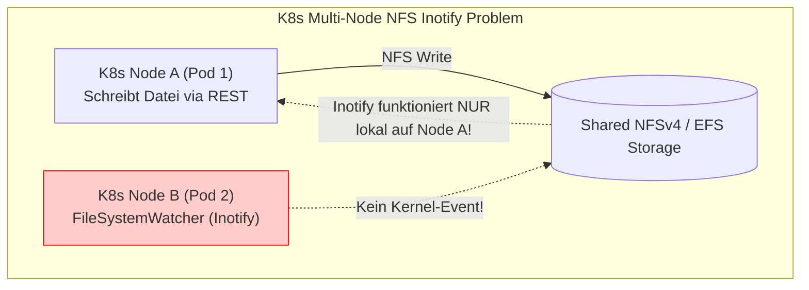
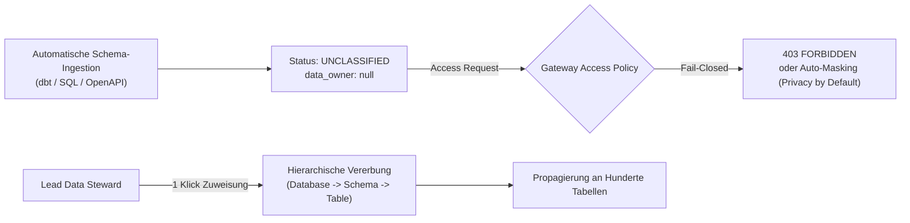
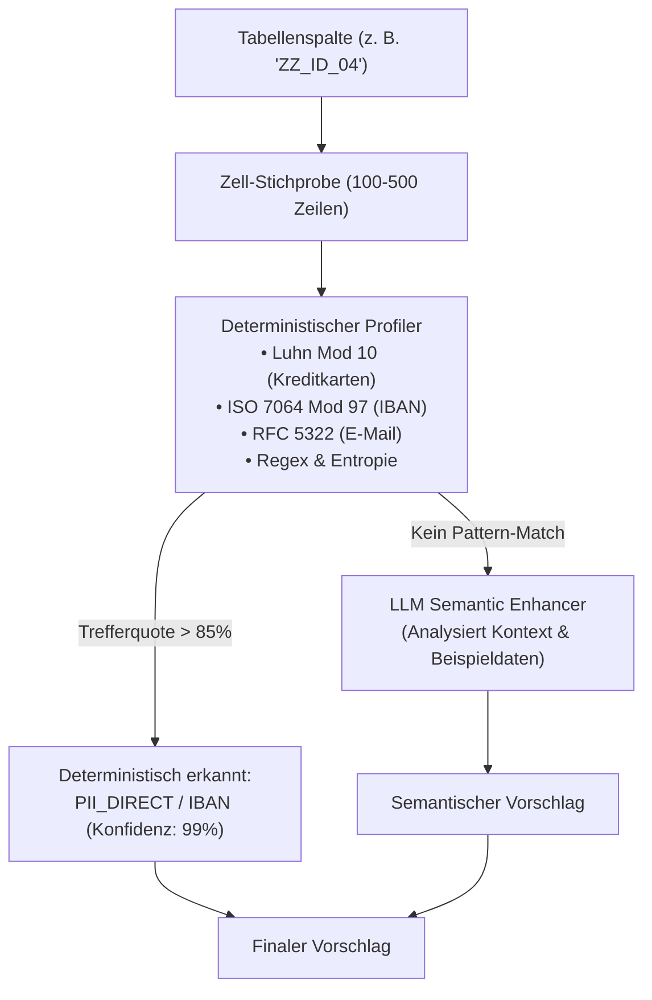
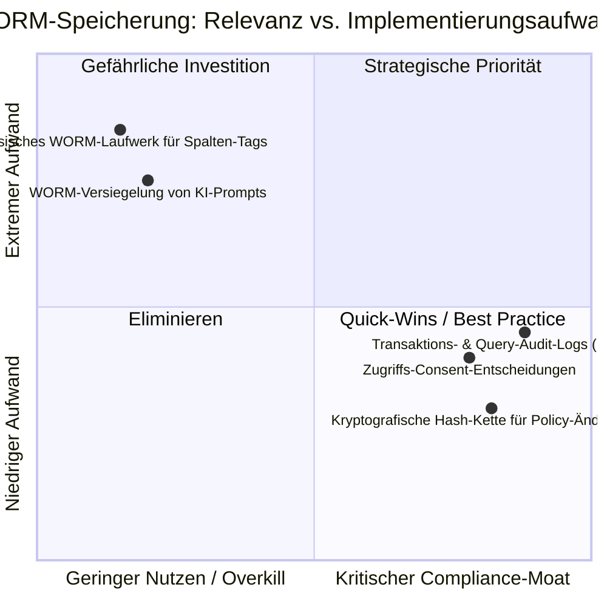
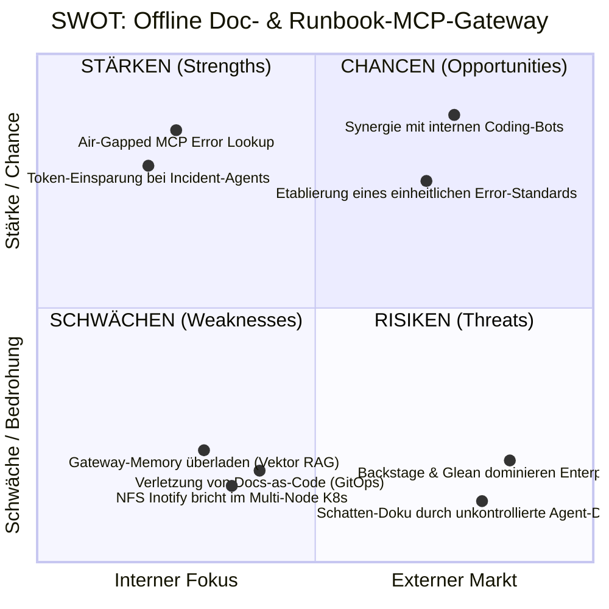
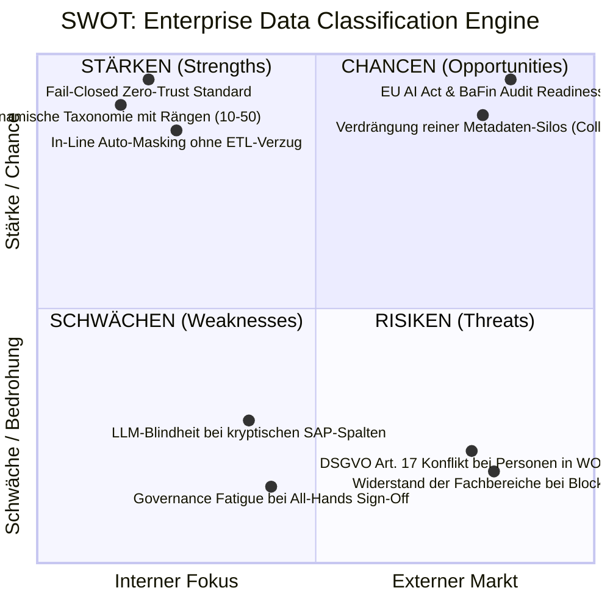
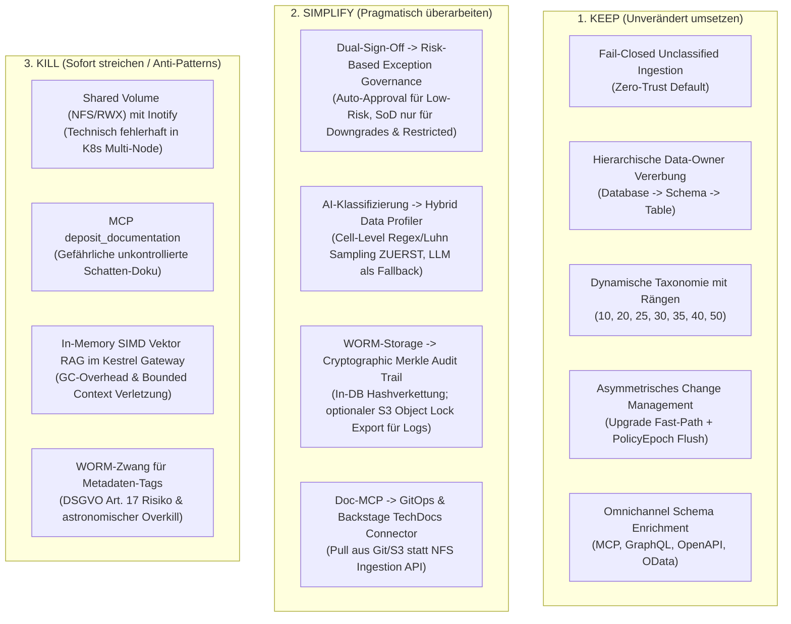

# Strategische Produkt- & Marktanalyse: Doc-MCP-Gateway & Enterprise Data Classification

**Dokument-ID:** `PRD-STRAT-GOV-DOCS-2026`  
**Autor:** Principal Enterprise Product Manager & Platform Strategist  
**Status:** In Review / Executive Board Submission  
**Datum:** 10. Oktober 2026  
**Zielgruppe:** CPO, CTO, Head of Architecture, Lead Data Stewards, Enterprise Sales  

---

## 1. Executive Summary & Strategisches Management-Urteil

Autheris hat sich als Hochleistungs-Gateway an der Schnittstelle zwischen API-Föderation, Zero-Trust-Sicherheit und autonomem KI-Kontext positioniert. Die beiden vorliegenden Initiativen – **Säule 1: Offline Doc- & Runbook-MCP-Gateway** und **Säule 2: Enterprise Data Classification & Sensitivity Engine (F-GOV-13)** – zielen auf hochaktuelle Schmerzpunkte regulierter Großkonzerne (Banken, Versicherungen, Pharma).

Eine unbarmherzig ehrliche, marktorientierte Analyse zeigt jedoch: **Während Säule 2 im Kern einen gigantischen strategischen Burggraben (*Moat*) darstellt, droht Säule 1 in Teilen in extremes Over-Engineering und operative Anti-Patterns abzugleiten.**

```
+--------------------------------------------------------------------------------------------------+
|                                    STRATEGISCHES GESAMTFAZIT                                     |
+--------------------------------------------------------------------------------------------------+
| Säule 1: Offline Doc-MCP Gateway                                                                 |
| Urteil: 40% KERNWERT / 60% OVER-ENGINEERING & ARCHITEKTUR-ANTIPATTERN                            |
| • Shared Volume (NFS/RWX) mit Inotify ist ein cloud-natives Anti-Pattern (NFS inotify broken).    |
| • "Agent-as-a-Documenter" via MCP-Deposit hebelt Enterprise-GitOps und Review-Prozesse aus.     |
| • Kestrel In-Memory Vektor-RAG überlädt das API Gateway mit fremden Bounded Contexts.            |
| -> EMPFEHLUNG: RADIKAL VEREINFACHEN. GitOps/Backstage-Sync statt NFS-Drop; Scoped MCP-Lookup.   |
+--------------------------------------------------------------------------------------------------+
| Säule 2: Data Classification & Sensitivity Engine (F-GOV-13)                                     |
| Urteil: 85% STRATEGISCHER VOLKTREFFER / 15% GOVERNANCE-FATIGUE & COMPLIANCE-MISSVERSTÄNDNIS     |
| • Fail-Closed Unclassified Ingestion & Hierarchical Owner sind Weltklasse-Features.              |
| • LLM-only Vorklassifizierung versagt bei Enterprise-Spalten (z. B. SAP 'KUNNR') ohne Profiling. |
| • All-Hands Dual-Sign-Off je Einzelfeld erzeugt lähmende "Governance Fatigue" im Konzern.       |
| • WORM-Drive für Tabellen-Tags ist regulatorischer Overkill (Kollision mit DSGVO Art. 17).       |
| -> EMPFEHLUNG: ZELL-PROFILER ERGÄNZEN, EXCEPTION-BASED APPROVAL, WORM AUF AUDIT-TRAIL REDUZIEREN.|
+--------------------------------------------------------------------------------------------------+
```

---

## 2. Deep-Dive Säule 1: 'Offline Doc- & Runbook-MCP-Gateway'

### 2.1 Reality Check: Shared Volume (NFS/RWX) vs. GitOps & Backstage TechDocs

Die Architektur schlägt ein physisches oder virtuelles ReadWriteMany (RWX) Volume (`/mnt/shared-docs/` via CephFS, NFSv4 oder AWS EFS) vor, in das CI/CD-Pipelines, Sysadmins und KI-Agenten Dokumente per REST, File-Drop oder MCP-Tool ablegen.

#### Marktrealität & De-facto-Standards:
1. **Der De-facto-Standard heißt "Docs-as-Code" in Git:**
   Kein moderner Enterprise-Kunde (DAX40, Fortune 500) pflegt produktionskritische Runbooks und Architekturdokumente in einem losen Netzlaufwerk. Dokumentation liegt versioniert im Git-Repository der Anwendung (`/docs`), durchläuft Merge Requests, Code Reviews, Linters (`markdownlint`) und Branch-Protection-Rules.
2. **Backstage TechDocs & Glean dominieren den Markt:**
   Spotify Backstage (in über 500 Großkonzernen als Developer Portal gesetzt) kompiliert Markdown via MkDocs zur Build-Zeit in statischen Cloud-Storage (S3/GCS). Glean und Claude Code indizieren Git-Repositories direkt über deren Webhooks und APIs.
3. **Over-Engineering-Warnung:**
   Ein eigenes HTTP-Multipart-REST-Bundle-API zur Entpackung von ZIP-Archiven in K8s-Volumes neu zu erfinden, repliziert bestehende CI/CD-Artifact-Registries (Nexus, Artifactory, S3, OCI-Registries) in schlechterer Qualität.

### 2.2 Der "Agent-as-a-Documenter" Trugschluss (`deposit_documentation`)

Das Feature sieht vor, dass ein autonomer KI-Agent (z. B. Incident-Bot oder Coding-Agent) über das Tool `deposit_documentation` eigenständig Runbooks im Shared Volume ablegt.

#### Das Compliance- und Sicherheitsrisiko:
* **"Phantom Runbooks":** Wenn ein Agent nach einem Serverausfall eigenmächtig ein Runbook mit dem Inhalt `systemctl restart prod-db --force` hinterlegt, existiert kein Vier-Augen-Review, kein Git-Blame und keine Freigabe durch den zuständigen Lead SRE.
* **Haftungs- und Audit-Falle (ISO 27001 / BaFin MaRisk):** Betriebshandbücher unterliegen im Bankensektor strengen Freigabeprozessen. Unkontrolliertes Schreiben in Produktions-Volumes bricht SOC-2 Type II Control *CC8.1 (Change Management)*.
* **Strategische Korrektur:** Ein Agent darf niemals direkt in die authoritative Doku-Ablage schreiben. Er darf lediglich einen **Pull Request (Git PR)** oder einen **Entwurf (Draft Resource)** mit Verweis auf den Incident vorschlagen, der menschlich gezeichnet werden muss.

### 2.3 Technische Fallstricke: Das K8s-NFS-Inotify-Dilemma

Das Konzept stützt sich auf einen Linux-Inotify-gestützten `FileSystemWatcher`, der Änderungen in `< 100 ms` erfassen soll.



> [!CAUTION]
> **Technisches K.-o.-Kriterium für den Architekturentwurf:**
> Der Linux-Kernel-Mechanismus `inotify` arbeitet rein **knotenlokal**. Wenn Pod 1 auf Node A eine Datei auf einen NFSv4- oder AWS EFS-Mount schreibt, erhält der Linux-Kernel auf Node B (Pod 2 und Pod 3) **kein Inotify-Ereignis**. Pod 2 und 3 bemerken die Änderung erst nach Minuten über NFS-Directory-Attribute-Caches (`actimeo`) oder durch aktives Polling! Die im Konzept versprochene Reaktionszeit von `< 100 ms` bricht im K8s-Cluster technisch zusammen, es sei denn, man führt einen separaten Redis-PubSub-Eventbus ein – was das NFS-Konzept vollends ad absurdum führt.

### 2.4 In-Memory RAG & SIMD im API Gateway: Bounded Context Verletzung

Autheris ist im Kern ein hocheffizientes API- & Daten-Föderations-Gateway mit Trino-SQL-Pushdown, Hot Chocolate GraphQL, Dynamic Security Policies und Casbin ABAC.
* **Speicher- und GC-Druck:** Das Vorhalten von Zehntausenden Markdown-Chunks, Vektor-Tensoren (`System.Numerics.Tensors`) und Okapi-BM25-Invertierten-Indizes im Kestrel-Prozessheap gefährdet die P99-Latenzgarantien der API-Pipeline (`< 15 ms`).
* **Cluster-Skalierung:** Wenn 10 Kestrel-Pods laufen, repliziert jeder Pod denselben 2-GB-Vektorindex im RAM. Das ist Ressourcenverschwendung (FinOps-Anti-Pattern).
* **Marktvergleich:** Weder Apollo Router, Hasura DDN noch Envoy betreiben eigene Vektordatenbanken im Gateway-Host. Sie delegieren semantische Suchen an spezialisierte Services (Qdrant, pgvector, Meilisearch, OpenSearch).

---

## 3. Deep-Dive Säule 2: 'Enterprise Data Classification & Sensitivity Engine' (F-GOV-13)

### 3.1 Unconditional Fail-Closed Ingestion & Hierarchische Ownership: Der Volltreffer

Im Gegensatz zu Säule 1 ist dieser Architekturbaustein von **herausragender strategischer Exzellenz**:



#### Warum das marktführend ist:
1. **Lösung des Onboarding-Deadlocks:** Traditionelle Kataloge (Collibra, Alation) verlangen oft Pflichtfelder beim Import. Das führt dazu, dass Teams Schemata gar nicht erst registrieren (Schatten-IT). Autheris erlaubt den unterbrechungsfreien Import.
2. **Zero-Trust & DSGVO Art. 25 ("Privacy by Default"):** Neue Daten sind sofort geschützt (*Fail-Closed*), noch bevor ein Mensch oder eine KI sie begutachtet hat.
3. **Hierarchische Vererbung spart 95% manuellen Aufwand:** Ein Data Steward weist `finance_dw.*` dem Finance-Team zu. Nur Ausnahmen müssen auf Tabellenebene übersteuert werden. Das entspricht exakt den Best Practices von Databricks Unity Catalog und Microsoft Purview.

### 3.2 AI-Vorklassifizierung: LLM-Metadaten-Analyse vs. Cell-Level Data Profiling

Das Konzept sieht vor, dass ein LLM anhand von Spaltennamen, Datentyp und Kommentaren mit einem 200ms-Timeout Vorklassifizierungen generiert.

#### Die harte Realität in Enterprise-Datenbanken:
* **Das "SAP-/Legacy-Problem":** In echten Enterprise-Systemen heißen Spalten nicht `customer_email_address` oder `iban`. Sie heißen `KUNNR`, `VBDAT`, `ZZ_IDENT_01`, `CUST_TXT_3` oder `FIELD_108`.
* Ein LLM, das rein auf Spaltennamen schaut, scheitert hier kläglich (Halluzination oder `is_disputed = true` für 90% aller Spalten).
* **Stand der Technik im Markt (Immuta, Privacera, BigID, Microsoft Purview, AWS Macie):**
  Marktführer stützen sich primär auf **deterministisches Zell-Profiling auf Daten-Stichproben (Samples von 100 bis 1.000 Zeilen)**:
  - **IBAN:** Regex + ISO 7064 Modulo 97 Prüfziffern-Validierung (100% deterministisch).
  - **Kreditkarten (PAN):** Regex + Luhn-Algorithmus (Mod 10).
  - **E-Mail / IP-Adresse:** RFC-Prüfungen.
  - **Telefonnummern:** Google libphonenumber Parser.
  - **Namen / Adressen:** Wörterbuch- und NER-Gleichheitsprüfungen.



> [!IMPORTANT]
> **Strategische Empfehlung für Autheris:**
> F-GOV-13 hat im bestehenden Entwurf bereits den `SmartDataClassifier` mit Regex/Luhn/IBAN-Prüfungen skizziert. Die Architektur darf diesen deterministischen Profiler nicht zu einem "Second-Class Citizen" degradieren! Die KI (LLM) darf nur die zweite Verteidigungslinie für semantische Texte bilden. Die PII-Erkennung muss zwingend auf Stichproben-Profiling basieren.

### 3.3 Dual-Sign-Off: Das Risiko der "Governance Fatigue"

Das Konzept fordert: Jede Tabelle muss zwingend vom Data Owner (Stufe 1) mit Feldkommentaren geprüft und anschließend vom Data Governance Expert (Stufe 2) freigegeben werden (SoD Anti-Self-Approval).

#### Was passiert in der Praxis? (Die Realität in Konzernen):
* Bei 200 Tabellen mit je 30 Spalten bedeutet dies **6.000 Einzelfeldprüfungen**.
* Wenn jeder Prüfer für jedes Feld Kommentare hinterlegen muss, tritt innerhalb von 48 Stunden **"Governance Fatigue"** ein: Entweder wird der Prozess sabotiert, indem willkürlich Copy-Paste-Kommentare eingetragen werden ("Reviewed", "OK", "OK"), oder das Projekt wird zum Flaschenhals, der Releases über Monate verzögert.
* **Wie lösen Marktführer (Collibra, Purview, Immuta) dieses Dilemma?**
  Sie nutzen **Risk-Based Exception Governance (Management by Exception)**:

| Daten-Kategorie / Risiko | Workflow-Pfad | Genehmigungs-Bedarf |
| :--- | :--- | :--- |
| **Geringes Risiko (`PUBLIC`, `INTERNAL`, `NON_SENSITIVE`)** | **Auto-Approval Fast-Track** | Automatische Freigabe bei Profiler-Konfidenz $\ge 90\%$. Nachträgliche Widerspruchsfrist (14 Tage Audit-Window). |
| **Mittleres Risiko (`CONFIDENTIAL`, Standard PII)** | **Single Sign-Off (Data Owner)** | Data Owner bestätigt Tabellen-Batch mit einem Klick. Keine zwingenden Feldkommentare bei Akzeptanz der Empfehlung. |
| **Hohes Risiko (`RESTRICTED`, `STRICTLY_CONFIDENTIAL`, Art. 9)** | **Striktes Dual-Sign-Off (SoD)** | Zwingende 4-Augen-Freigabe (Data Owner + Compliance/DPO) mit feldgranularen Begründungen. |
| **Sicherheits-Downgrade (z. B. `CONFIDENTIAL` -> `PUBLIC`)** | **Striktes Dual-Sign-Off (SoD)** | Zwingendes 4-Augen-Prinzip mit formaler Rechtfertigung. |
| **Strittige Einstufung (`is_disputed = true`)** | **Exception Review** | Nur die markierten Spalten müssen manuell begutachtet werden. |

### 3.4 WORM-Drive für Metadaten: Rechtlicher Faktencheck & Overkill-Analyse

Das Konzept spezifiziert eine WORM-Drive-Versiegelung (`ChainAnchorWormDirectory` / S3 Object Lock mit 10 Jahren Retention) für jede Tabelleneinstufung, KI-Empfehlung und jeden Prüfkommentar.

#### Was verlangen Regulatoren WIRKLICH?

1. **SEC Rule 17a-4(f) / FINRA Rule 4511:**
   Gilt für *Broker-Dealer* und betrifft **Handelsaufzeichnungen, Kundenkommunikation (Mails, Chats) und Transaktionsbücher**. Sie verlangt **nicht**, dass Metadaten-Tags eines Datenkatalogs auf WORM-Laufwerken gespeichert werden müssen.
2. **BaFin BAIT / MaRisk AT 7.2 (Protokollierung & Nachvollziehbarkeit):**
   Verlangt die *revisionssichere Protokollierung administrativer Eingriffe, Berechtigungsänderungen und Datenzugriffe*. Dies wird standardmäßig durch kryptografisch geschützte, unveränderliche Audit-Logs oder zentrales SIEM (Splunk, Elastic, Datadog mit WORM-S3-Export) erfüllt.
3. **DSGVO (GDPR) Art. 17 ("Recht auf Vergessenwerden") – Die WORM-Falle:**
   Wenn im WORM-Block der Name oder die Mailadresse des Data Stewards (`reviewerSid: "steward-mueller@bank.de"`) unveränderbar für 10 Jahre versiegelt wird, und dieser Mitarbeiter verlässt das Unternehmen und verlangt Löschung seiner personenbezogenen Daten, gerät das Unternehmen in einen **unauflösbaren Rechtskonflikt zwischen DSGVO Art. 17 und unveränderbarer WORM-Retention!**



> [!TIP]
> **Das Urteil zum WORM-Drive:**
> Ein physisches Hardware-WORM-Volume (`/mnt/worm-archive/`) für Datenkatalog-Metadaten ist **reines Over-Engineering**, das Kunden abschreckt (hohe Storage-Kosten, komplexe PVC-Setups).  
> **Der echte Differenzierungs-Moat:** Eine **kryptografische, manipulationssichere Merkle-Hashkette (Git-like Audit Log)** in der PostgreSQL-Governance-Datenbank (`F-AUDIT-01`). Dies beweist mathematisch, wer wann was geändert hat, ohne dass Administratoren spezielle WORM-Appliances konfigurieren müssen. Ein WORM-Export sollte rein optional als Nightly-S3-Object-Lock-Archivierung für Audit-Logs existieren.

---

## 4. Wettbewerbsanalyse & Marktpositionierung

Wie schlägt sich Autheris mit den vorgeschlagenen Funktionen im Vergleich zu den Marktführern?

| Kriterium | Autheris (Proposed) | Microsoft Purview | Collibra | Immuta / Privacera | Databricks Unity / Snowflake | Hasura DDN / Apollo GraphOS |
| :--- | :---: | :---: | :---: | :---: | :---: | :---: |
| **Data Ingestion Model** | **Zero-Assumption (Fail-Closed)** | Scanner-basiert (Open-by-default) | Workflow-gesteuert (Registrierung) | Pushdown Agents | Nativ integriert | Nur Schema-Introspection |
| **PII & Data Profiling** | LLM + Heuristik (200ms) | 200+ Regex/ML Patterns | Eigener ML-Klassifizierer | **Deep Cell-Level Profiling (State-of-the-Art)** | Basale Regex Tags | ❌ Keine |
| **Governance Approval** | Dual-Sign-Off (All-Hands) | Risk-based Workflows | Frei definierbare BPMN-Workflows | **Policy-as-Code (Automated)** | Tag-Policies | ❌ Keine |
| **Dynamic Masking Integration** | **Nativ im Gateway (In-Memory)** | Azure-integriert (Synapse/SQL) | Nur Metadaten (Braucht Enforcer) | **Nativ via Pushdown / Proxy** | Native Masking Policies | Nur Filter-Plugins |
| **MCP Agent Enrichment** | **Omnichannel JSON-Schema Injection** | Nur REST API / Purview Studio | REST / GraphQL API | REST API | Unity Catalog AI Functions | ❌ Naked Schemas |
| **Runbook / Doc Gateway** | Shared NFS Volume + Inotify | ❌ Nein (MS SharePoint/Learn) | ❌ Nein | ❌ Nein | ❌ Nein | ❌ Nein |
| **Audit-Sicherheit** | WORM-Sealing + Merkle-Chain | Azure Audit Logs | Audit History | Cryptographic Tamper-Check | Delta Lake History | Standard Access Log |

### Strategischer Takeaway:
Autheris schlägt Hasura und Apollo um Längen im Bereich **Governance & Compliance**. Im Vergleich zu Collibra und Purview hat Autheris den unschätzbaren Vorteil, dass Governance **direkt im Datenfluss (In-Line Data Gateway)** durchgesetzt wird und nicht in einem isolierten Metadaten-Silo verkümmert. Säule 1 (NFS Doc-Lake) existiert bei keinem Wettbewerber – nicht weil niemand darauf kam, sondern weil GitOps und Enterprise Search (Glean) diesen Anwendungsfall bereits sauberer lösen.

---

## 5. RICE-C Priorisierung & Feature-Bewertung

Zur Priorisierung nutzen wir das erweiterte **RICE-C Framework**:
$$\text{Score} = \frac{\text{Reach (1-10)} \times \text{Impact (0.5-3.0)} \times \text{Confidence (0-100\%)} \times \text{Compliance Multiplier (1.0-2.0)}}{\text{Effort (Personen-Sprints)}}$$

| Sub-Feature | Reach | Impact | Confidence | Compliance | Effort | RICE-C Score | Strategisches Urteil |
| :--- | :---: | :---: | :---: | :---: | :---: | :---: | :---: |
| **F-GOV-13.1: Fail-Closed Ingestion & Hierarchical Owner** | 10 | 3.0 | 95% | 1.8 | 2.0 | **25.65** | 🟢 **P0: Absoluter No-Brainer / Core Moat** |
| **F-GOV-13.2: Dynamische Taxonomie & Masking-Matrix** | 9 | 2.5 | 90% | 1.6 | 2.0 | **16.20** | 🟢 **P0: Enorm hoher Kundenwert** |
| **F-GOV-13.3: Risk-Based Dual-Sign-Off (Exception-basiert)** | 8 | 2.5 | 85% | 1.9 | 2.5 | **12.92** | 🟢 **P1: Pragmatische Enterprise-Freigabe** |
| **F-GOV-13.4: Hybrid Profiler (Zell-Stichproben + LLM)** | 8 | 2.8 | 80% | 1.7 | 3.0 | **10.15** | 🟢 **P1: Zwingend nötig für SAP/Legacy-DBs** |
| **F-DOC-02.1: MCP Error-Code & Runbook Lookup (GitOps-backed)** | 7 | 2.0 | 90% | 1.1 | 1.5 | **9.24** | 🟡 **P2: Stark für AI-Agenten, aber via Git/S3** |
| *F-GOV-13.X: All-Hands Dual-Sign-Off (Jedes Feld manuell)* | 4 | 0.8 | 60% | 1.2 | 4.0 | *0.58* | 🔴 **KILL: Führt zu Governance Fatigue** |
| *F-DOC-02.X: Shared Volume (NFS) Ingestion & Inotify Watcher* | 3 | 1.0 | 50% | 1.0 | 4.5 | *0.33* | 🔴 **KILL: K8s Anti-Pattern, unzuverlässig** |
| *F-GOV-13.X: Hardware WORM-Drive für Metadaten-Tags* | 2 | 0.8 | 60% | 1.1 | 4.0 | *0.26* | 🔴 **KILL: Regulatorischer Overkill / DSGVO-Risiko** |
| *F-DOC-02.Y: Agent-as-a-Documenter (`deposit_documentation`)* | 2 | 0.5 | 40% | 0.8 | 3.0 | *0.11* | 🔴 **KILL: Sicherheits- und Compliance-Risiko** |

---

## 6. SWOT-Analysen

### 6.1 SWOT: Säule 1 (Offline Doc- & Runbook-MCP-Gateway)



### 6.2 SWOT: Säule 2 (Enterprise Data Classification & Sensitivity Engine)



---

## 7. Strategische Produktempfehlungen: Keep, Simplify, Kill

Auf Basis der Markt- und Machbarkeitsanalyse wird folgende Bereinigung und Fokussierung des Produkt-Backlogs beschlossen:



---

## 8. Detaillierter Aktions- & Roadmap-Plan

### Phase 1 (Wave 1): The Rock-Solid Governance Foundation (Sofort umsetzen)
1. **F-GOV-13 Core Ingestion:**
   - Unbedingter DB-Import mit `status: UNCLASSIFIED` und `data_owner: null`.
   - Gateway-Durchsetzung von *Fail-Closed* (Zugriffsverweigerung auf unklassifizierte Tabellen).
2. **Hierarchische Owner-Engine:**
   - Rekursive Vererbung: Datenbank $\rightarrow$ Schema $\rightarrow$ Tabelle.
3. **Konfigurierbare Taxonomie (`GatewayOptions`):**
   - Ränge 10–50 für Schutzklassen und flexible Maskierungsregeln (`PARTIAL_MASK`, `HMAC_SHA256`, `GEO_JITTER`).
4. **Asymmetrisches Change Management:**
   - Fast-Path für Upgrades; atomarer Redis-PubSub-Broadcast für `PolicyEpoch`-Invalidierung.

### Phase 2 (Wave 2): Intelligent Profiling & Risk-Based Workflows
1. **Hybrid Data Profiler (`SmartDataClassifier`):**
   - Zell-Sampling (200 Zeilen) mit deterministischer Validierung (IBAN ISO 7064, Luhn Mod 10, RFC 5322).
   - Ergänzender LLM-Synthesizer für Spalten mit unklarer Semantik.
2. **Exception-Based Governance Workflow:**
   - Auto-Approval für Standardklassen bei Konfidenz $\ge 90\%$.
   - Zwingende 4-Augen-Freigabe (SoD) ausschließlich für `RESTRICTED`, `STRICTLY_CONFIDENTIAL` und Sicherheits-Downgrades.
3. **Cryptographic Merkle Audit Trail (`F-AUDIT-01`):**
   - RFC 8785 Canonical JSON Merkle-Hashkette in der Governance-Datenbank.
   - Pseudonymisierung von Bearbeiter-SIDs zur Einhaltung von DSGVO Art. 17.

### Phase 3 (Wave 3): Enterprise Doc-MCP Integration (GitOps-Driven)
1. **GitOps & TechDocs Reader:**
   - Lesezugriff auf versionierte Markdown- und OpenAPI-Dateien aus Git-Repositories oder S3-Buckets.
2. **Deterministic MCP Error-Resolver:**
   - MCP-Tool `lookup_error_code` basierend auf statisch generierten Fehlerkatalogen der Services.
3. **Agent PR Proposal Service:**
   - Ersetzung von `deposit_documentation` durch `propose_runbook_pr`: Der Agent erstellt einen Git Pull Request, statt unbemerkt Dateien in Dateisysteme zu schreiben.

---

## 9. Fazit für das Executive Board

Mit der konsequenten Bereinigung der Architektur-Konzepte um ihre Over-Engineering-Anteile sichert sich Autheris eine **unangefochtene Führungsposition im Enterprise API- und AI-Gateway-Markt**:
* Wir vermeiden fatale K8s-Betriebsrisiken (NFS-Inotify-Ausfälle) und Compliance-Fallen (DSGVO Art. 17 bei WORM).
* Wir verhindern die gefürchtete "Governance Fatigue" bei unseren Pilotkunden durch risikobasierte Exception-Freigaben.
* Wir liefern einen echten, marktführenden Mehrwert: **Absolute Zero-Trust-Datensicherheit ab Sekunde 1 des Imports bei minimalem menschlichem Pflegeaufwand.**

**Verteiler & Freigaben:**
- Chief Product Officer (CPO) – *Zur Kenntnisnahme*
- Chief Technology Officer (CTO) – *Zur Architektur-Übernahme*
- Head of Data Governance & Security – *Zur Freigabe des Exception-Workflows*
