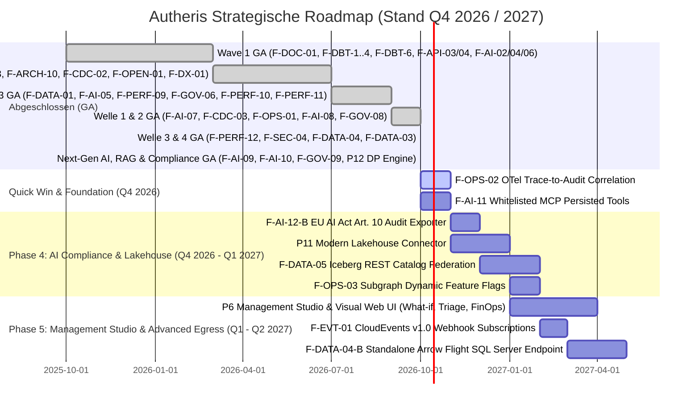

# 📊 Enterprise Product Management: Marktrecherche, Feature-Gap-Analyse & Reifegrad-Prüfung (Autheris)

**Rolle:** Principal Enterprise Product Manager & Platform Strategist  
**Marktumfeld:** 2025/2026 Enterprise API & GraphQL Federation (Apollo GraphOS / Router v2.17+, Hasura DDN v3, WunderGraph Cosmo, PostgREST, StepZen, Immuta, hasura/graphql-bench)  
**Status:** Aktualisiert nach vollständiger Umsetzung aller Initiativen aus **Wave 1**, **Wave 2** und **Wave 3** sowie den Next-Gen AI/RAG- und Data-Governance-Features **`F-AI-09`**, **`F-AI-10`**, **`F-DATA-03`** und **`F-DATA-04`** (100% GA). Umgesetzte Features sind in dieser Marktanalyse als `[Done]` referenziert; ihre detaillierte Dokumentation befindet sich in [`docs/features/`](file:///root/lis-git/gql/gql/docs/features/).  
**Ziel:** Strategische Markt- und Wettbewerbsbewertung, Dokumentation von Differenzierungs-Moats und Priorisierung der verbleibenden Roadmap-Themen entlang des RICE-C-Modells.  
**Feature-Dokumentation:** [`docs/features/README.md`](file:///root/lis-git/gql/gql/docs/features/README.md)  

---

## 1. Executive Summary & Marktkontext 2025 / 2026

Der Markt für Enterprise GraphQL und API Gateways wird 2025/2026 durch fundamentale Marktbewegungen definiert:

1. **Von Query-Aggregation zu "Agentic AI Orchestration" & Semantic Context Grounding:**
   - Apollo hat mit dem *Apollo MCP Server* und *GraphOS Agent Tools* den Weg geebnet, um GraphQL Supergraphs als Tool-Provider für autonome KI-Agenten bereitzustellen (Router v1.x End-of-Life im Februar 2026, Federation v2.15+ mit Rust-basierter Composition).
   - **Die kritische Marktlücke (The Semantic Gap):** Reine Schemas liefern Modellen (LLMs) nur technische Signaturen. Ohne Fachsemantik (Grain-Definitionen, Berechnungsformeln für Kennzahlen) halluzinieren Agenten.
   - **Unsere Marktposition:** Autheris schließt die Semantic Gap über den **Semantic MCP Compiler (`F-AI-02` [Done])**, **Pre-Flight Query Simulator (`F-AI-04` [Done])**, **Few-Shot Golden Queries (`F-AI-03` [Done])**, **Provenance Footnotes (`F-AI-06` [Done])**, **Human-in-the-Loop Step-Up Approval (`F-AI-05` [Done])**, **Dynamic Schema Pruning (`F-AI-07` [Done])** und **FOCUS FinOps Accounting (`F-AI-08` [Done])**.
2. **Native Vector Database & RAG Egress Governance (`F-AI-09` [Done]) & Semantic Cache (`F-AI-10` [Done]):**
   - Autonome Agenten benötigen unstrukturierte Wissensquellen (PDFs, Chunks). Herkömmliche Vektor-DBs (pgvector, Qdrant, Milvus) umgehen Gateways und leaken Mandanten- sowie PII-Daten.
   - **Unsere Marktposition:** Autheris integriert Vektordatenbanken über das standardisierte Connector-SPI mit erzwungener Mandantenisolation, serverseitigem RLS-Pushdown und In-Stream PII-Scrubbing auf Chunks (`F-AI-09`). Der **Semantic Query Cache (`F-AI-10`)** spart bis zu 70 % redundanter Inferenzkosten bei strikter Cache-Isolation und leitet aus `403`-Mustern autonome Least-Privilege-Consent-Vorschläge ab.
3. **Enterprise Data Governance & Zero-Touch Data Catalogs:**
   - Reine RBAC/ABAC-Gateways greifen zu kurz. Fortune-500-Unternehmen verlangen automatisierte Klassifizierungs-Synchronisation aus führenden Metadaten-Katalogen (Purview, Collibra, OpenMetadata) ohne manuelle Doppelpflege.
   - **Unsere Marktposition:** Schlüsselfertige **Data Catalog Connectors (`P1` [Done])** synchronisieren Tags, PII- und DSGVO-Art.-9-Regeln direkt in dynamische Maskierungsregeln.
4. **Dual-Access Exposure (GraphQL + OData v4 + Dynamic OpenAPI 3.1) & High-Performance Parquet Egress:**
   - Reine GraphQL-Gateways scheitern bei Data-Science-Teams (Pandas/Python), BI-Anwendern (Power BI/Excel) und klassischen B2B-REST-Partnern.
   - **Unsere Marktposition:** Standardkonforme **OData v4 & OpenAPI 3.1 Spezifikation (`F-API-03` [Done])** sowie nativer **Hierarchischer Parquet Egress (`F-DATA-01` [Done])** für verschachtelte 1:N-Relationen.
5. **Declarative SQL-to-API Engine, Governed WebSQL & Embedded DuckDB OLAP:**
   - Unternehmen besitzen zehntausende Zeilen optimierten SQLs. PostgREST und Hasura Native Queries zwingen zu unkontrollierten DB-Benutzern oder proprietären DSLs.
   - **Unsere Marktposition:** **Declarative SQL-to-API (`F-SQL-01` [Done])** exponiert versionierte `.sql`-Dateien direkt als typisierte REST-Endpunkte; **Governed WebSQL (`F-DATA-02` [Done])** bietet sichere HTTP-SQL-Ausführung nach Trino-Muster; **Embedded DuckDB OLAP (`F-DATA-03` [Done])** und **Apache Arrow IPC / Flight SQL (`F-DATA-04` [Done])** ermöglichen Multi-GB/s Zero-Copy-In-Memory-Analysen.
6. **Federation & Edge Performance bei striktem Zero-Trust:**
   - Bestehende Router delegieren Autorisierung entweder an Subgraphs (Apollo) oder erfordern teure Zusatz-Lizenzen (Hasura DDN).
   - **Unsere Marktposition:** Hot Chocolate Fusion Subgraph Router (**`P7` [Done]**), Single-Query Pushdown (**`F-PERF-09` [Done]**) und Hierarchische Resource Groups (**`F-PERF-08` [Done]**).
7. **Enterprise Customizing, C#-Ökosystem & Sonderfreigabe-Workflows:**
   - In Enterprise-Landschaften dominiert C#/.NET im Backend. Fremdsprachen oder gRPC-Sidecars (Kong/Tyk) verursachen Latenz.
   - **Unsere Marktposition:** **Native C# Ingress/Egress Pipeline (`P9` [Done])** mit Zero-IPC-Latenz und verzahnte **ITSM-Workflows (`P10` [Done])** für ServiceNow/Jira.
8. **dbt Data-Mesh & Data-Contract Governance:**
   - dbt ist Standard für Modellierung im Warehouse. Gateways agieren traditionell blind gegenüber Upstream-Qualitätsfehlern.
   - **Unsere Marktposition:** **dbt Health Circuit Breaker (`F-DBT-1` [Done])**, **Contract Enforcement (`F-DBT-2` [Done])**, **Telemetry Exposures (`F-DBT-3` [Done])**, **Webhooks (`F-DBT-4` [Done])** und **Policy-Sync (`F-DBT-6` [Done])**.
9. **Realtime Event Streaming & CDC ohne Kafka-Barriere:**
   - Klassische CDC-Stacks (Debezium, Kafka, ZooKeeper) scheitern am Betriebsaufwand in Behörden und Banken ("The Kafka Barrier").
   - **Unsere Marktposition:** **Native MSSQL Change Tracking Ingestion (`F-CDC-02` [Done])** und **Zero-Kafka PostgreSQL Logical Replication (`F-CDC-03` [Done])** liefern Zero-Infrastructure CDC.
10. **High-Throughput Benchmarking & Hasura-Vergleich (`graphql-bench`):**
    - **Multi-Tenant Isolated Query Plan Cache (`F-PERF-11` [Done])**, Kestrel/Runtime-Tuning und Zero-LOH Streaming (**`F-PERF-10` [Done]**) schlagen Hasura DDN bei strikter Mandanten-Isolation.
11. **Konvergenz auf Apache Iceberg REST Catalog (IRC) & Arrow Flight Egress (`F-DATA-05` Roadmap):**
    - 2025/2026 hat sich der Lakehouse-Markt herstellerübergreifend auf die **Apache Iceberg REST Catalog (IRC)**-Spezifikation geeinigt (Apache Polaris, Databricks Unity Catalog, AWS S3 Tables, DuckDB 2026 Native Attach).
    - **Unsere Marktposition:** Föderierte Metadaten-Pruning-Kataloge und In-Memory Arrow-RecordBatch-Streams (`F-DATA-04` [Done]) transformieren Autheris in ein dezentrales "Agentic Lakehouse Gateway" mit integriertem Token-basiertem Credential Vending für S3/ADLS.
12. **EU AI Act Vollzug 2026 & AI Gateway Compliance Control Plane (`F-AI-12` Roadmap):**
    - Artikel 10 des EU AI Act verpflichtet Betreiber von Hochrisiko-KI-Systemen zu lückenloser Daten-Governance, Bias-Minimierung, lückenlosem Lifetime-Audit-Logging und mathematischen Garantien gegen Re-Identifikation.
    - **Unsere Marktposition:** Autheris agiert als zentraler KI-Compliance-Kontrollpunkt mit In-Stream PII-Scrubbing, WORM-Audit-Logs und nativer **Dynamic Differential Privacy (DP)** für analytische Abfragen und RAG-Pipelines.
13. **Wettbewerber-Paradigmenwechsel (Hasura NDC vs. Cosmo MCP vs. Apollo Router v2):**
    - Hasura DDN v3 führte Native Data Connectors (NDC) in Rust ein, koppelte dies jedoch an ein kontroverses *Active Model-Based Pricing* (Abrechnung pro aktivem Schema-Objekt).
    - WunderGraph Cosmo integrierte einen MCP Server mit kuratierten Persisted Operations gegen Prompt Injection sowie Graph Feature Flags für Traffic Splitting.
    - **Unsere Marktposition:** Autheris verbindet offene TCO (0 € Lizenz), Deep AST SQL-Pushdown und Prompt-Injection-sichere Persisted MCP Operations (`F-AI-11`) mit flexibler Subgraph-Variantensteuerung (`F-OPS-03`).

---

## 2. Reifegrad- & Vollständigkeitsprüfung vorhandener Features

Übersicht aller Gateway-Module zur Dokumentation der Marktreife. Umgesetzte Features sind als `[Done]` markiert; die Detailbeschreibungen liegen unter [`docs/features/`](file:///root/lis-git/gql/gql/docs/features/).

| Modul / Feature | Reifegrad | Status | Dokumentation |
| :--- | :---: | :---: | :--- |
| **Data Catalog Connectors (`P1`)** | **100% (GA)** | ✅ **[Done]** | [p01-data-catalog-connectors.md](file:///root/lis-git/gql/gql/docs/features/p01-data-catalog-connectors.md) |
| **dbt Data Health Circuit Breaker (`F-DBT-1`)** | **100% (GA)** | ✅ **[Done]** | [f-dbt-01-health-circuit-breaker.md](file:///root/lis-git/gql/gql/docs/features/f-dbt-01-health-circuit-breaker.md) |
| **dbt Model Contract Enforcement (`F-DBT-2`)** | **100% (GA)** | ✅ **[Done]** | [f-dbt-02-contract-enforcement.md](file:///root/lis-git/gql/gql/docs/features/f-dbt-02-contract-enforcement.md) |
| **dbt Live-Telemetry Exposures (`F-DBT-3`)** | **100% (GA)** | ✅ **[Done]** | [f-dbt-03-telemetry-exposures.md](file:///root/lis-git/gql/gql/docs/features/f-dbt-03-telemetry-exposures.md) |
| **dbt Orchestrator & Cloud Webhooks (`F-DBT-4`)** | **100% (GA)** | ✅ **[Done]** | [f-dbt-04-orchestrator-webhooks.md](file:///root/lis-git/gql/gql/docs/features/f-dbt-04-orchestrator-webhooks.md) |
| **dbt Policy & RLS Auto-Sync (`F-DBT-6`)** | **100% (GA)** | ✅ **[Done]** | [f-dbt-06-policy-rls-sync.md](file:///root/lis-git/gql/gql/docs/features/f-dbt-06-policy-rls-sync.md) |
| **Dual-Access Exposure: OData v4 & Dynamic OpenAPI 3.1 (`F-API-03`)** | **100% (GA)** | ✅ **[Done]** | [f-api-03-odata-openapi.md](file:///root/lis-git/gql/gql/docs/features/f-api-03-odata-openapi.md) |
| **Upstream Web API Ingestion via OpenAPI (`F-API-04`)** | **100% (GA)** | ✅ **[Done]** | [f-api-04-openapi-ingestion.md](file:///root/lis-git/gql/gql/docs/features/f-api-04-openapi-ingestion.md) |
| **Canonical System Metadaten & Monitoring (`F-API-07`)** | **100% (GA)** | ✅ **[Done]** | [f-api-07-system-metadata-monitoring.md](file:///root/lis-git/gql/gql/docs/features/f-api-07-system-metadata-monitoring.md) |
| **Omnichannel Documentation Passthrough (`F-DOC-01`)** | **100% (GA)** | ✅ **[Done]** | [f-doc-01-omnichannel-documentation.md](file:///root/lis-git/gql/gql/docs/features/f-doc-01-omnichannel-documentation.md) |
| **Declarative SQL-to-API Engine (`F-SQL-01`)** | **100% (GA)** | ✅ **[Done]** | [f-sql-01-declarative-sql-endpoints.md](file:///root/lis-git/gql/gql/docs/features/f-sql-01-declarative-sql-endpoints.md) |
| **Governed WebSQL Engine (`F-DATA-02`)** | **100% (GA)** | ✅ **[Done]** | [f-data-02-governed-websql.md](file:///root/lis-git/gql/gql/docs/features/f-data-02-governed-websql.md) |
| **Hierarchischer Parquet Egress (`F-DATA-01`)** | **100% (GA)** | ✅ **[Done]** | [f-data-01-parquet-egress.md](file:///root/lis-git/gql/gql/docs/features/f-data-01-parquet-egress.md) |
| **Semantic MCP Compiler & Schema Grounding (`F-AI-02`)** | **100% (GA)** | ✅ **[Done]** | [f-ai-02-semantic-mcp-compiler.md](file:///root/lis-git/gql/gql/docs/features/f-ai-02-semantic-mcp-compiler.md) |
| **Dynamic Few-Shot Golden Query Injection (`F-AI-03`)** | **100% (GA)** | ✅ **[Done]** | [f-ai-03-golden-queries.md](file:///root/lis-git/gql/gql/docs/features/f-ai-03-golden-queries.md) |
| **Pre-Flight Query Simulator & Safety Limits (`F-AI-04`)** | **100% (GA)** | ✅ **[Done]** | [f-ai-04-preflight-simulator.md](file:///root/lis-git/gql/gql/docs/features/f-ai-04-preflight-simulator.md) |
| **Human-in-the-Loop Step-Up Approval (`F-AI-05`)** | **100% (GA)** | ✅ **[Done]** | [f-ai-05-hitl-step-up-approval.md](file:///root/lis-git/gql/gql/docs/features/f-ai-05-hitl-step-up-approval.md) |
| **Explainable AI & Provenance Footnoter (`F-AI-06`)** | **100% (GA)** | ✅ **[Done]** | [f-ai-06-provenance-footnoting.md](file:///root/lis-git/gql/gql/docs/features/f-ai-06-provenance-footnoting.md) |
| **Hierarchical Resource Groups (`F-PERF-08`)** | **100% (GA)** | ✅ **[Done]** | [f-perf-08-hierarchical-resource-groups.md](file:///root/lis-git/gql/gql/docs/features/f-perf-08-hierarchical-resource-groups.md) |
| **GraphQL-to-SQL AST Single-Query Compiler (`F-PERF-09`)** | **100% (GA)** | ✅ **[Done]** | [f-perf-09-single-query-pushdown.md](file:///root/lis-git/gql/gql/docs/features/f-perf-09-single-query-pushdown.md) |
| **Split-Engine & Zero-LOH Result Pipelining (`F-PERF-10`)** | **100% (GA)** | ✅ **[Done]** | [f-perf-10-streaming-pipelining.md](file:///root/lis-git/gql/gql/docs/features/f-perf-10-streaming-pipelining.md) |
| **Multi-Tenant Isolated Query Plan Cache (`F-PERF-11`)** | **100% (GA)** | ✅ **[Done]** | [f-perf-11-query-plan-cache.md](file:///root/lis-git/gql/gql/docs/features/f-perf-11-query-plan-cache.md) |
| **Native MSSQL Change Tracking Ingestion (`F-CDC-02`)** | **100% (GA)** | ✅ **[Done]** | [f-cdc-02-mssql-change-tracking.md](file:///root/lis-git/gql/gql/docs/features/f-cdc-02-mssql-change-tracking.md) |
| **Mehrstufige Pushdown-Kaskaden & Cross-Domain Joins (`F-GOV-06`)** | **100% (GA)** | ✅ **[Done]** | [f-gov-06-cross-domain-joins.md](file:///root/lis-git/gql/gql/docs/features/f-gov-06-cross-domain-joins.md) |
| **Standardisiertes Connector-SPI nach Trino-Muster (`F-ARCH-10`)** | **100% (GA)** | ✅ **[Done]** | [f-arch-10-connector-spi.md](file:///root/lis-git/gql/gql/docs/features/f-arch-10-connector-spi.md) |
| **OpenSchema Mode & Catalog Slicing (`F-OPEN-01`)** | **100% (GA)** | ✅ **[Done]** | [f-open-01-openschema-catalog-slicing.md](file:///root/lis-git/gql/gql/docs/features/f-open-01-openschema-catalog-slicing.md) |
| **Zero-Config Developer Quickstart (`F-DX-01`)** | **100% (GA)** | ✅ **[Done]** | [f-dx-01-developer-quickstart.md](file:///root/lis-git/gql/gql/docs/features/f-dx-01-developer-quickstart.md) |
| **Modern Lakehouse Connector Apache Iceberg v2 (`P4`)** | **100% (GA)** | ✅ **[Done]** | [p04-lakehouse-connector.md](file:///root/lis-git/gql/gql/docs/features/p04-lakehouse-connector.md) |
| **Subscriptions & Realtime Events via Debezium (`P5`)** | **100% (GA)** | ✅ **[Done]** | [p05-subscriptions-realtime.md](file:///root/lis-git/gql/gql/docs/features/p05-subscriptions-realtime.md) |
| **Subgraph Federation Router via Fusion (`P7`)** | **100% (GA)** | ✅ **[Done]** | [p07-subgraph-federation.md](file:///root/lis-git/gql/gql/docs/features/p07-subgraph-federation.md) |
| **WORM Audit Logging & Consent Sealing (`P8`)** | **100% (GA)** | ✅ **[Done]** | [p08-worm-audit-sealing.md](file:///root/lis-git/gql/gql/docs/features/p08-worm-audit-sealing.md) |
| **Native C# Ingress/Egress Pipeline (`P9`)** | **100% (GA)** | ✅ **[Done]** | [p09-native-csharp-pipeline.md](file:///root/lis-git/gql/gql/docs/features/p09-native-csharp-pipeline.md) |
| **Dynamic Semantic Schema Pruning (`F-AI-07`)** | **100% (GA)** | ✅ **[Done]** | [f-ai-07-dynamic-semantic-schema-pruning.md](file:///root/lis-git/gql/gql/docs/features/f-ai-07-dynamic-semantic-schema-pruning.md) |
| **Zero-Kafka PostgreSQL CDC (`F-CDC-03`)** | **100% (GA)** | ✅ **[Done]** | [f-cdc-03-zero-kafka-postgresql-cdc.md](file:///root/lis-git/gql/gql/docs/features/f-cdc-03-zero-kafka-postgresql-cdc.md) |
| **AST-Aware Traffic Shadowing & Dark Replay (`F-OPS-01`)** | **100% (GA)** | ✅ **[Done]** | [f-ops-01-traffic-shadowing-dark-replay.md](file:///root/lis-git/gql/gql/docs/features/f-ops-01-traffic-shadowing-dark-replay.md) |
| **FOCUS FinOps Accounting für Token & Compute (`F-AI-08`)** | **100% (GA)** | ✅ **[Done]** | [f-ai-08-focus-finops-accounting.md](file:///root/lis-git/gql/gql/docs/features/f-ai-08-focus-finops-accounting.md) |
| **Dynamic Schema Contracts & Tag-Projektion (`F-GOV-08`)** | **100% (GA)** | ✅ **[Done]** | [f-gov-08-schema-contracts-tag-projection.md](file:///root/lis-git/gql/gql/docs/features/f-gov-08-schema-contracts-tag-projection.md) |
| **Incremental Delivery (@defer & @stream) (`F-PERF-12`)** | **100% (GA)** | ✅ **[Done]** | [f-perf-12-incremental-delivery.md](file:///root/lis-git/gql/gql/docs/features/f-perf-12-incremental-delivery.md) |
| **Relationship-Based Access Control ReBAC (`F-SEC-04`)** | **100% (GA)** | ✅ **[Done]** | [f-sec-04-rebac-openfga.md](file:///root/lis-git/gql/gql/docs/features/f-sec-04-rebac-openfga.md) |
| **Native Apache Arrow Flight SQL Egress (`F-DATA-04`)** | **100% (GA)** | ✅ **[Done]** | [f-data-04-arrow-flight-sql.md](file:///root/lis-git/gql/gql/docs/features/f-data-04-arrow-flight-sql.md) |
| **Embedded In-Memory OLAP via DuckDB.NET (`F-DATA-03`)** | **100% (GA)** | ✅ **[Done]** | [f-data-03-duckdb-olap.md](file:///root/lis-git/gql/gql/docs/features/f-data-03-duckdb-olap.md) |
| **Native Vector Database & RAG Egress (`F-AI-09`)** | **100% (GA)** | ✅ **[Done]** | [f-ai-09-native-vector-database-rag-egress.md](file:///root/lis-git/gql/gql/docs/features/f-ai-09-native-vector-database-rag-egress.md) |
| **Semantic Query Cache & Policy Recommendation (`F-AI-10`)** | **100% (GA)** | ✅ **[Done]** | [f-ai-10-semantic-cache-policy-recommendation.md](file:///root/lis-git/gql/gql/docs/features/f-ai-10-semantic-cache-policy-recommendation.md) |
| **Consent Recertification & Extension Workflow (`F-GOV-09`)** | **100% (GA)** | ✅ **[Done]** | `ConsentRecertificationWorkflowService.cs` (ServiceNow/Jira Outbox, WORM-Audit, Deduplizierung) |
| **Federated Dynamic Differential Privacy Engine (`P12`)** | **100% (GA)** | ✅ **[Done]** | `DifferentialPrivacyEngine.cs` (Laplace-Noise, k-Anonymity Guard, tägliches Epsilon-Budgeting, REST-APIs) |
| **OpenTelemetry Trace-to-Audit Correlation (`F-OPS-02`)** | **75% (In Progress)** | 🟡 **Active** | `AuditLogEntry.TraceId` & HMAC-Hash fertig; `Activity.Current` W3C Traceparent Injection im Kernel in Arbeit. |
| **Whitelisted MCP Operations & Curated Persisted Tools (`F-AI-11`)** | **50% (In Progress)** | 🟡 **Active** | Registry & Dispatch für `AllowedOperations` fertig; Persisted Query Document Hashing in Umsetzung. |
| **EU AI Act Art. 10 Compliance Export Suite (`F-AI-12`)** | **50% (In Progress)** | 🟡 **Active** | DP-Engine (`P12`) 100% GA; automatisierter WORM Art.-10-Zertifikats-Exporteur auf Roadmap. |
| **Management Studio & UI (`P6`)** | **0%** | 🔴 **Roadmap** | Visuelles Web-Dashboard für Data Stewards (Policy Simulator, Audit-Viewer, Schema Explorer). |
| **Apache Iceberg REST Catalog (IRC) Federation & Credential Vending (`F-DATA-05`)** | **0%** | 🔴 **Roadmap** | Föderierter REST Catalog Server mit STS-Token Vending für S3/ADLS und zeilenbasiertem Partitions-Pruning. |
| **Subgraph Dynamic Feature Flags & Canary Traffic Splitting (`F-OPS-03`)** | **0%** | 🔴 **Roadmap** | Header-/Attribut-gesteuertes Subgraph-Routing für Zero-Downtime Blue/Green Canary Deploys. |

---

## 3. Aktualisierte Wettbewerber-Matrix & Differenzierungs-Moats

| Konkurrent | Stärken | Kritische Schwachstellen & Lücken | Autheris Moat (Unser Alleinstellungsmerkmal) |
| :--- | :--- | :--- | :--- |
| **Apollo GraphQL** *(Router v2.17+ / Federation v2.15+ / GraphOS)* | • Marktführer Schema Federation • Rust-basierte Composition (v2.15+) • Apollo MCP Server für AI Agents • Apollo Connectors für REST APIs | • Router v1 EOL (Februar 2026), Router v2 unter restriktiver ELv2-Lizenz • RLS nur delegiert an Subgraphs • Keine native Unternehmenskatalog-Synchronisation • Fehlende DSGVO Art. 9 Automatisierung & EU AI Act WORM Audits • Semantik-Blindheit: Exponiert rohe Schemas ohne Geschäftssemantik, Grain-Regeln oder FinOps Token Gating. | **Integrierte Zero-Trust Governance & Semantic MCP**: Hot Chocolate Fusion, In-Memory-Masking auf aggregierten Daten, nativer Sync mit Purview/Collibra/OpenMetadata, semantisches MCP-Tool-Grounding, FinOps Budget Caps (`F-AI-08`) und vollständige ELv2-Freiheit (0 € Lizenz). |
| **Hasura Enterprise** *(DDN / Data Delivery Network v3)* | • Rust-basierte v3 Data Plane (NDC Engine) • Native Data Connectors Hub • Schnelles deklaratives Prototyping | • Starker Vendor-Lockin in OpenDD / proprietäre Metadaten • **Active Model-Based Pricing**: Kontroverses Lizenzmodell (Abrechnung pro aktivem Schema-Objekt $\ge$ 1k Hits/Monat) • Föderierte Governance über mehrere Data Domains schwerfällig • Kein integrierter 4-Augen Justification-Workflow • Keine native dbt Contract Enforcement / Circuit Breaker Integration. | **Open Governance, Lower TCO & Declarative SQL-to-API**: Keine proprietäre Plattformbindung, kalkulierbare Kosten (keine Model-Tax), automatisierte ITSM-Freigaben (ServiceNow/Jira), dbt-Manifest Ingestion, native `@param` SQL-Endpunkte mit Auto-OpenAPI 3.0 und On-Prem/Sovereign Cloud Eignung. |
| **WunderGraph Cosmo** *(Open-Source Federation)* | • Open-Source Apollo Alternative (Go/Rust Router) • Cosmo MCP Gateway mit Curated Persisted Operations • Graph Feature Flags & Cosmo Streams | • Reiner Proxy/Router ohne deklarative relationale Datenbankanbindung • Kein SQL RLS Pushdown oder relationales Single-Query Optimization • Keine native PII-Maskierung oder DSGVO Art. 9 Workflows • Kein nativer Iceberg/Delta Lakehouse oder Parquet Egress • Keine revisionssicheren WORM HMAC-256 Audit Hash Chains. | **End-to-End Enterprise Data Federation & Vector RAG**: Direkte Anbindung von relationalen SQL DBs, Vektordatenbanken (pgvector/Qdrant/Milvus), Data Catalogs und Lakehouses mit nativer Governance, Parquet/Arrow-Egress und ganzheitlicher KI-Agent-Orchestrierung. |
| **PostgREST / StepZen** | • Leichtgewichtige REST/GraphQL APIs • Gute DB-nahe Performance | • Bindung an PostgreSQL (PostgREST) bzw. IBM Cloud-Abhängigkeit (StepZen) • Keine mandantenfähigen Cross-Source Joins • Keine automatisierten Rezertifizierungs-Workflows. | **Heterogene Multidomänen-Föderation**: Vereinheitlicht MSSQL, Postgres, SQLite, Lakehouses und Microservices unter einem Zero-Trust Dach. |

---

### 3.1 Übersicht der gelieferten Kernstärken (GA Moats)

Alle nachfolgenden Features sind **vollständig umgesetzt und produktionsreif**:

- [x] **F-SQL-01 Declarative SQL-to-API Engine**: [Done] → Details siehe [`f-sql-01-declarative-sql-endpoints.md`](file:///root/lis-git/gql/gql/docs/features/f-sql-01-declarative-sql-endpoints.md)
- [x] **F-DATA-02 Governed WebSQL Engine**: [Done] → Details siehe [`f-data-02-governed-websql.md`](file:///root/lis-git/gql/gql/docs/features/f-data-02-governed-websql.md)
- [x] **F-DATA-01 Hierarchischer Parquet Egress**: [Done] → Details siehe [`f-data-01-parquet-egress.md`](file:///root/lis-git/gql/gql/docs/features/f-data-01-parquet-egress.md)
- [x] **F-API-03 Dual-Access Exposure (OData v4 & OpenAPI 3.1)**: [Done] → Details siehe [`f-api-03-odata-openapi.md`](file:///root/lis-git/gql/gql/docs/features/f-api-03-odata-openapi.md)
- [x] **F-API-04 Upstream OpenAPI Ingestion**: [Done] → Details siehe [`f-api-04-openapi-ingestion.md`](file:///root/lis-git/gql/gql/docs/features/f-api-04-openapi-ingestion.md)
- [x] **F-API-07 Canonical System Metadaten ($system)**: [Done] → Details siehe [`f-api-07-system-metadata-monitoring.md`](file:///root/lis-git/gql/gql/docs/features/f-api-07-system-metadata-monitoring.md)
- [x] **F-DOC-01 Omnichannel Documentation Passthrough**: [Done] → Details siehe [`f-doc-01-omnichannel-documentation.md`](file:///root/lis-git/gql/gql/docs/features/f-doc-01-omnichannel-documentation.md)
- [x] **F-PERF-08 Hierarchical Resource Groups**: [Done] → Details siehe [`f-perf-08-hierarchical-resource-groups.md`](file:///root/lis-git/gql/gql/docs/features/f-perf-08-hierarchical-resource-groups.md)
- [x] **F-PERF-09 GraphQL Single-Query Pushdown**: [Done] → Details siehe [`f-perf-09-single-query-pushdown.md`](file:///root/lis-git/gql/gql/docs/features/f-perf-09-single-query-pushdown.md)
- [x] **F-PERF-10 Zero-LOH Streaming Result Pipelining**: [Done] → Details siehe [`f-perf-10-streaming-pipelining.md`](file:///root/lis-git/gql/gql/docs/features/f-perf-10-streaming-pipelining.md)
- [x] **F-PERF-11 Multi-Tenant Isolated Plan Cache**: [Done] → Details siehe [`f-perf-11-query-plan-cache.md`](file:///root/lis-git/gql/gql/docs/features/f-perf-11-query-plan-cache.md)
- [x] **F-CDC-02 Native MSSQL Change Tracking Ingestion**: [Done] → Details siehe [`f-cdc-02-mssql-change-tracking.md`](file:///root/lis-git/gql/gql/docs/features/f-cdc-02-mssql-change-tracking.md)
- [x] **F-GOV-06 Mehrstufige Pushdown-Kaskaden & Cross-Domain Joins**: [Done] → Details siehe [`f-gov-06-cross-domain-joins.md`](file:///root/lis-git/gql/gql/docs/features/f-gov-06-cross-domain-joins.md)
- [x] **F-ARCH-10 Standardisiertes Connector-SPI**: [Done] → Details siehe [`f-arch-10-connector-spi.md`](file:///root/lis-git/gql/gql/docs/features/f-arch-10-connector-spi.md)
- [x] **F-OPEN-01 OpenSchema Mode & Catalog Slicing**: [Done] → Details siehe [`f-open-01-openschema-catalog-slicing.md`](file:///root/lis-git/gql/gql/docs/features/f-open-01-openschema-catalog-slicing.md)
- [x] **F-DX-01 Zero-Config Developer Quickstart**: [Done] → Details siehe [`f-dx-01-developer-quickstart.md`](file:///root/lis-git/gql/gql/docs/features/f-dx-01-developer-quickstart.md)
- [x] **P1 Enterprise Data Catalog Connectors**: [Done] → Details siehe [`p01-data-catalog-connectors.md`](file:///root/lis-git/gql/gql/docs/features/p01-data-catalog-connectors.md)
- [x] **P4 Modern Lakehouse Connector (Iceberg v2)**: [Done] → Details siehe [`p04-lakehouse-connector.md`](file:///root/lis-git/gql/gql/docs/features/p04-lakehouse-connector.md)
- [x] **P5 Subscriptions & Realtime Events via Debezium**: [Done] → Details siehe [`p05-subscriptions-realtime.md`](file:///root/lis-git/gql/gql/docs/features/p05-subscriptions-realtime.md)
- [x] **P7 Subgraph Federation Router (Fusion)**: [Done] → Details siehe [`p07-subgraph-federation.md`](file:///root/lis-git/gql/gql/docs/features/p07-subgraph-federation.md)
- [x] **P8 WORM Audit Logging & Consent Sealing**: [Done] → Details siehe [`p08-worm-audit-sealing.md`](file:///root/lis-git/gql/gql/docs/features/p08-worm-audit-sealing.md)
- [x] **P9 Native C# Ingress/Egress Pipeline**: [Done] → Details siehe [`p09-native-csharp-pipeline.md`](file:///root/lis-git/gql/gql/docs/features/p09-native-csharp-pipeline.md)
- [x] **P10 Enterprise Governance Mutations & 4-Eyes SoD**: [Done] → Details siehe [`p10-governance-mutations-sod.md`](file:///root/lis-git/gql/gql/docs/features/p10-governance-mutations-sod.md)
- [x] **F-AI-07 Dynamic Semantic Schema Pruning & JIT MCP Tools**: [Done] → Details siehe [`f-ai-07-dynamic-semantic-schema-pruning.md`](file:///root/lis-git/gql/gql/docs/features/f-ai-07-dynamic-semantic-schema-pruning.md)
- [x] **F-CDC-03 Zero-Kafka PostgreSQL CDC via Logical Streaming Replication**: [Done] → Details siehe [`f-cdc-03-zero-kafka-postgresql-cdc.md`](file:///root/lis-git/gql/gql/docs/features/f-cdc-03-zero-kafka-postgresql-cdc.md)
- [x] **F-OPS-01 AST-Aware Production Traffic Shadowing & Dark Replay**: [Done] → Details siehe [`f-ops-01-traffic-shadowing-dark-replay.md`](file:///root/lis-git/gql/gql/docs/features/f-ops-01-traffic-shadowing-dark-replay.md)
- [x] **F-AI-08 FOCUS FinOps Accounting für Token & Compute**: [Done] → Details siehe [`f-ai-08-focus-finops-accounting.md`](file:///root/lis-git/gql/gql/docs/features/f-ai-08-focus-finops-accounting.md)
- [x] **F-GOV-08 Dynamic Schema Contracts & Tag-basierte Projektion (@tag)**: [Done] → Details siehe [`f-gov-08-schema-contracts-tag-projection.md`](file:///root/lis-git/gql/gql/docs/features/f-gov-08-schema-contracts-tag-projection.md)
- [x] **F-PERF-12 Incremental Delivery via @defer & @stream**: [Done] → Details siehe [`f-perf-12-incremental-delivery.md`](file:///root/lis-git/gql/gql/docs/features/f-perf-12-incremental-delivery.md)
- [x] **F-SEC-04 Relationship-Based Access Control (ReBAC via OpenFGA / Zanzibar)**: [Done] → Details siehe [`f-sec-04-rebac-openfga.md`](file:///root/lis-git/gql/gql/docs/features/f-sec-04-rebac-openfga.md)
- [x] **F-DATA-04 Native Apache Arrow Flight SQL Egress**: [Done] → Details siehe [`f-data-04-arrow-flight-sql.md`](file:///root/lis-git/gql/gql/docs/features/f-data-04-arrow-flight-sql.md)
- [x] **F-DATA-03 Embedded In-Memory OLAP via DuckDB.NET**: [Done] → Details siehe [`f-data-03-duckdb-olap.md`](file:///root/lis-git/gql/gql/docs/features/f-data-03-duckdb-olap.md)
- [x] **F-AI-09 Native Vector Database & RAG Egress**: [Done] → Details siehe [`f-ai-09-native-vector-database-rag-egress.md`](file:///root/lis-git/gql/gql/docs/features/f-ai-09-native-vector-database-rag-egress.md)
- [x] **F-AI-10 Semantic Query Cache & Autonomous Policy Recommendation**: [Done] → Details siehe [`f-ai-10-semantic-cache-policy-recommendation.md`](file:///root/lis-git/gql/gql/docs/features/f-ai-10-semantic-cache-policy-recommendation.md)

---

### 3.2 Strategische Differenzierung: dbt Data Mesh & Contract Governance

Autheris überbrückt den Bruch zwischen Data Engineering und Datenkonsumenten.

#### Umgesetzte Features:
- [x] **F-DBT-1 Data Health Circuit Breaker**: [Done] → Details siehe [`f-dbt-01-health-circuit-breaker.md`](file:///root/lis-git/gql/gql/docs/features/f-dbt-01-health-circuit-breaker.md)
- [x] **F-DBT-2 Model Contract Enforcement & Breaking-Change Gate**: [Done] → Details siehe [`f-dbt-02-contract-enforcement.md`](file:///root/lis-git/gql/gql/docs/features/f-dbt-02-contract-enforcement.md)
- [x] **F-DBT-3 Live-Telemetry Exposures**: [Done] → Details siehe [`f-dbt-03-telemetry-exposures.md`](file:///root/lis-git/gql/gql/docs/features/f-dbt-03-telemetry-exposures.md)
- [x] **F-DBT-4 Orchestrator & dbt Cloud Webhooks**: [Done] → Details siehe [`f-dbt-04-orchestrator-webhooks.md`](file:///root/lis-git/gql/gql/docs/features/f-dbt-04-orchestrator-webhooks.md)
- [x] **F-DBT-6 Policy & RLS Auto-Sync**: [Done] → Details siehe [`f-dbt-06-policy-rls-sync.md`](file:///root/lis-git/gql/gql/docs/features/f-dbt-06-policy-rls-sync.md)

---

### 3.3 Strategische Differenzierung: Enterprise AI Agent Suite & RAG Governance

Autheris etabliert das Gateway als autoritative semantische Schicht und sicheren RAG-Egress für autonome KI-Agenten.

#### Umgesetzte Features:
- [x] **F-AI-02 Semantic MCP Compiler & Schema Grounding**: [Done] → Details siehe [`f-ai-02-semantic-mcp-compiler.md`](file:///root/lis-git/gql/gql/docs/features/f-ai-02-semantic-mcp-compiler.md)
- [x] **F-AI-03 Dynamic Few-Shot Golden Query Injection**: [Done] → Details siehe [`f-ai-03-golden-queries.md`](file:///root/lis-git/gql/gql/docs/features/f-ai-03-golden-queries.md)
- [x] **F-AI-04 Pre-Flight Query Simulator & Safety Limits**: [Done] → Details siehe [`f-ai-04-preflight-simulator.md`](file:///root/lis-git/gql/gql/docs/features/f-ai-04-preflight-simulator.md)
- [x] **F-AI-05 Human-in-the-Loop Step-Up Approval**: [Done] → Details siehe [`f-ai-05-hitl-step-up-approval.md`](file:///root/lis-git/gql/gql/docs/features/f-ai-05-hitl-step-up-approval.md)
- [x] **F-AI-06 Explainable AI & Provenance Footnotes**: [Done] → Details siehe [`f-ai-06-provenance-footnoting.md`](file:///root/lis-git/gql/gql/docs/features/f-ai-06-provenance-footnoting.md)
- [x] **F-AI-07 Dynamic Semantic Schema Pruning & Just-in-Time MCP Tools**: [Done] → Details siehe [`f-ai-07-dynamic-semantic-schema-pruning.md`](file:///root/lis-git/gql/gql/docs/features/f-ai-07-dynamic-semantic-schema-pruning.md)
- [x] **F-AI-08 FOCUS FinOps Accounting für Token & Compute**: [Done] → Details siehe [`f-ai-08-focus-finops-accounting.md`](file:///root/lis-git/gql/gql/docs/features/f-ai-08-focus-finops-accounting.md)
- [x] **F-AI-09 Native Vector Database & RAG Egress (pgvector, Qdrant, Milvus)**: [Done] → Details siehe [`f-ai-09-native-vector-database-rag-egress.md`](file:///root/lis-git/gql/gql/docs/features/f-ai-09-native-vector-database-rag-egress.md)
- [x] **F-AI-10 Semantic Query Cache & Autonomous Policy Recommendation**: [Done] → Details siehe [`f-ai-10-semantic-cache-policy-recommendation.md`](file:///root/lis-git/gql/gql/docs/features/f-ai-10-semantic-cache-policy-recommendation.md)

---

### 3.4 Deep Dive: Realtime CDC & "The Kafka Barrier" (`F-CDC-02`)

- [x] **F-CDC-02 Native MSSQL Change Tracking Ingestion**: [Done] → Details siehe [`f-cdc-02-mssql-change-tracking.md`](file:///root/lis-git/gql/gql/docs/features/f-cdc-02-mssql-change-tracking.md)

#### Strategischer 3-Wege-Vergleich (Markt-Perspektive):

| Kriterium | MSSQL Change Tracking (`F-CDC-02` - GA ✅) | Full SQL Server CDC | Debezium + Apache Kafka (`P5` - GA ✅) |
| :--- | :--- | :--- | :--- |
| **Infrastruktur-Aufwand** | **Null (0 Extra-Container/Server)** | Mittel (SQL Agent Jobs) | Hoch (Kafka Cluster, ZooKeeper, Connect) |
| **DB-Ressourcenverbrauch** | **Minimal (< 2% CPU & I/O)** | Mittel (Log-Scanner) | Hoch (kontinuierliches Log-Mining) |
| **Betriebskomplexität** | **Minimal (T-SQL Commands)** | Mittel (DBA-Pflege) | Hoch (Multi-Node Cluster, Schema Registry) |
| **Zero-Trust RLS im Egress** | **In-Gateway Casbin ABAC Filterung** | Manuell | Manuell in Consumer-Services |
| **Empfohlener Einsatzbereich** | **Enterprise On-Prem, Banken, Behörden** | Historische Audits | Hochdurchsatz > 50k Events/s |

---

### 3.5 Benchmark-Differenzierung gegen Hasura DDN (`hasura/graphql-bench`)

- [x] **F-PERF-11 Multi-Tenant Isolated Query Plan Cache**: [Done] → Details siehe [`f-perf-11-query-plan-cache.md`](file:///root/lis-git/gql/gql/docs/features/f-perf-11-query-plan-cache.md)

#### Strategische Differenzierungs-Highlights:
- **Lock-free Plan-Lookup**: `XxHash3` 64-Bit Composite Key in < 1 µs.
- **Multi-Tenant RLS Cache Isolation (SEC-CACHE-01)**: Im Gegensatz zu Hasura v3 partitioniert Autheris Pläne strikt per Composite Key `(QueryHash, Dialect, TenantId, RlsHash)` – verhindert RLS-Bypass und Cache-Poisoning.
- **Runtime-Tuning**: .NET 10 Server GC mit Dynamic Adaptation Mode (DATAS) und Kestrel Socket Optimierungen für maximale Durchsatz-Sättigung.

---

### 3.6 Benchmark & Transfer-Analyse: Was Autheris von Trino lernen kann

Autheris transferiert bewährte Konzepte aus Trino/Presto in die GraphQL- und API-Welt:
1. **Hierarchical Resource Groups (`F-PERF-08` [Done])**: Isolierung von Workloads (`Interactive`, `AutonomousAgents`, `BulkAnalytics`).
2. **Standardisiertes Connector-SPI (`F-ARCH-10` [Done])**: Klare Trennung von Metadaten, Table-Handles und Split-Streaming.
3. **Multi-Source Cost-Based Pushdown (`F-GOV-06` [Done])**: Wo immer möglich relationale Ausführung im DB-Kernel.
4. **Zero-LOH Result Pipelining (`F-PERF-10` [Done])**: Streaming-Pipelines ohne Speicherballast.

---

## 4. Strategische Priorisierung: Die wichtigsten noch benötigten Features

Aus Sicht des Enterprise Product Managements ergeben sich die wichtigsten noch benötigten Features aus der Schnittmenge aus Kundenanforderungen (Fortune-500, regulierte Industrien), akuten Schmerzpunkten im Betrieb und Marktdifferenzierung gegenüber Apollo GraphOS und Hasura DDN.

### 4.1 Abgeschlossene Initiativen (Welle 1 & Welle 2 – 100% GA ✅)

Die nachfolgenden Schlüsselthemen wurden in den jüngsten Entwicklungszyklen (Welle 1 & Welle 2) **vollständig implementiert, getestet und sicherheitstechnisch freigegeben**:

* [x] **`F-AI-07` Dynamic Semantic Schema Pruning & Just-in-Time MCP Tools** (`100% GA`)
  * **Umgesetzt:** JIT Tool-Injektion via `SemanticToolPruner`, Bounding auf max. 4.000 Tokens, Fail-Closed Fallback.
  * **Business-Value:** Bis zu 80 % Ersparnis bei System-Prompt-Tokens und signifikant höhere Erfolgsquote autonomer Agenten.
  * **Dokumentation:** [`f-ai-07-dynamic-semantic-schema-pruning.md`](file:///root/lis-git/gql/gql/docs/features/f-ai-07-dynamic-semantic-schema-pruning.md)

* [x] **`F-CDC-03` Zero-Kafka PostgreSQL CDC via Logical Streaming Replication** (`100% GA`)
  * **Umgesetzt:** Nativer Logical Streaming Replication Client via `pgoutput`, WAL Lag Guard (1 GB Limit), In-Stream RLS.
  * **Business-Value:** Schließt die Realtime-Streaming-Lücke für Cloud-native PostgreSQL- und Supabase-Umgebungen bei minimaler TCO.
  * **Dokumentation:** [`f-cdc-03-zero-kafka-postgresql-cdc.md`](file:///root/lis-git/gql/gql/docs/features/f-cdc-03-zero-kafka-postgresql-cdc.md)

* [x] **`F-OPS-01` AST-Aware Production Traffic Shadowing & Dark Replay** (`100% GA`)
  * **Umgesetzt:** AST Mutation Guard (strikte Unterdrückung aller Mutationen/Writes), PII-Redactor, Bounded Payload Buffering (< 2 MB).
  * **Business-Value:** Risikofreie Zero-Downtime-Releases für geschäftskritische Core-Banking- und Enterprise-Systeme.
  * **Dokumentation:** [`f-ops-01-traffic-shadowing-dark-replay.md`](file:///root/lis-git/gql/gql/docs/features/f-ops-01-traffic-shadowing-dark-replay.md)

* [x] **`F-AI-08` FOCUS-konformes FinOps Accounting für Token & Compute** (`100% GA`)
  * **Umgesetzt:** Standardisiertes Kostenmodell nach FOCUS v1.2, Soft- & Hard-Cap Gating (`FinOpsBudgetMiddleware`), Denial-of-Wallet Schutz, CSV-Formula-Injection-Schutz.
  * **Business-Value:** Präzise Unit Economics und automatisierte Budget-Caps für autonome KI-Workloads.
  * **Dokumentation:** [`f-ai-08-focus-finops-accounting.md`](file:///root/lis-git/gql/gql/docs/features/f-ai-08-focus-finops-accounting.md)

* [x] **`F-GOV-08` Dynamic Schema Contracts & Tag-basierte Projektion (`@tag`)** (`100% GA`)
  * **Umgesetzt:** Sub-Schema-Slicing via `@tag` und `@inaccessible`, Pruning von Orphan-Types, Zero-Leaking Introspektion, dynamisches Header-Routing.
  * **Business-Value:** Single Source of Truth bei vollständiger Schnittstellen-Isolation für B2B-Partner und Mobile-Clients ohne teure Apollo GraphOS Contracts-Lizenzen.
  * **Dokumentation:** [`f-gov-08-schema-contracts-tag-projection.md`](file:///root/lis-git/gql/gql/docs/features/f-gov-08-schema-contracts-tag-projection.md)

* [x] **`F-PERF-12` Incremental Delivery via `@defer` & `@stream`** (`100% GA`)
  * **Umgesetzt:** Standardisiertes Multipart/Mixed Chunked Streaming, Time-to-First-Byte Optimierung, Concurrency- & Slowloris-Schutz (`IncrementalDeliveryManager`).
  * **Business-Value:** Sofortige First-Paint-Auslieferung für Web- & Mobile-Clients ohne Latenzblockaden durch langsame Subgraphs.
  * **Dokumentation:** [`f-perf-12-incremental-delivery.md`](file:///root/lis-git/gql/gql/docs/features/f-perf-12-incremental-delivery.md)

* [x] **`F-SEC-04` Relationship-Based Access Control (ReBAC via OpenFGA / Zanzibar)** (`100% GA`)
  * **Umgesetzt:** Google Zanzibar Graph-Traversierung mit transitiver Vererbung (`owner -> editor -> viewer`), Zero-N+1 Batch DataLoader (`RebacBatchDataLoader`), Cyclic Recursion Guard und strikte Mandantentrennung.
  * **Business-Value:** Enterprise-Dokumentenfreigaben im Sub-Millisekundenbereich ohne $N+1$-Performance-Einbrüche bei geschützten Listenabfragen.
  * **Dokumentation:** [`f-sec-04-rebac-openfga.md`](file:///root/lis-git/gql/gql/docs/features/f-sec-04-rebac-openfga.md)

* [x] **`F-DATA-03` Embedded In-Memory OLAP via DuckDB.NET** (`100% GA`)
  * **Umgesetzt:** Prozessinterne DuckDB-OLAP-Engine (`DuckDbOlapEngine`), flüchtige In-Memory-Sessions (`:memory:`), SIMD-Vektorisierung, Sandboxing (`SET enable_external_access = false;`), Memory- & Thread-Begrenzung und striktes Pre-Flight Governance Gate.
  * **Business-Value:** Sub-Millisekunden-Aggregationen und Ad-hoc-Analysen über heterogene Quellen ohne teure externe Trino-/Presto-Infrastruktur.
  * **Dokumentation:** [`f-data-03-duckdb-olap.md`](file:///root/lis-git/gql/gql/docs/features/f-data-03-duckdb-olap.md)

* [x] **`F-DATA-04` Native Apache Arrow Flight SQL Egress & Analytics Pipeline** (`100% GA`)
  * **Umgesetzt:** Zero-Copy-Arrow-RecordBatch-Streaming (`/api/v1/arrow/export/{table}`), Schema-Mapping, In-Stream RLS und dynamische PII-Maskierung vor der Arrow-Serialisierung.
  * **Business-Value:** Direkte High-Speed-Pipeline für Pandas, Polars und Data-Science-Workloads ohne JSON-Serialisierungs-Overhead.
  * **Dokumentation:** [`f-data-04-arrow-flight-sql.md`](file:///root/lis-git/gql/gql/docs/features/f-data-04-arrow-flight-sql.md)

* [x] **`F-AI-09` Native Vector Database & RAG Egress (pgvector, Qdrant, Milvus)** (`100% GA`)
  * **Umgesetzt:** Standardisiertes Vektor-Connector-SPI (`IVectorRecordSource`), parametrisierter HNSW/Cosine-Pushdown (`PgVectorConnector`, `QdrantVectorConnector`, `MilvusVectorConnector`), erzwungene Tenant-Isolation (`SEC-VEC-01`), In-Stream Chunk PII-Redaction (`ChunkPiiRedactor`) und MCP-Tool `search_rag_context`.
  * **Business-Value:** Einzigartiger Differenzierungs-Moat als erstes föderiertes Gateway mit nativer Vektor-Governance für Enterprise-RAG.
  * **Dokumentation:** [`f-ai-09-native-vector-database-rag-egress.md`](file:///root/lis-git/gql/gql/docs/features/f-ai-09-native-vector-database-rag-egress.md)

* [x] **`F-AI-10` Semantic Query Cache & Autonomous Policy Recommendation** (`100% GA`)
  * **Umgesetzt:** Partitionierter semantischer Cache (`SemanticQueryCacheService`) mit Composite Key `(TenantId, UserSid, SecurityContextHash, Collection)`, Cosine-Ähnlichkeits-Matching (`>= 0.85`), Epochen-Invalidierung und autonome Ableitung minimaler Least-Privilege Consent-Vorschläge (`PolicyRecommendationService`) aus 403 Forbidden-Mustern.
  * **Business-Value:** Bis zu 70 % Einsparung redundanter LLM-/Vektor-Kosten bei strikter ABAC-Isolation und automatisierte Schließung von Berechtigungslücken ohne Überprivilegierung.
  * **Dokumentation:** [`f-ai-10-semantic-cache-policy-recommendation.md`](file:///root/lis-git/gql/gql/docs/features/f-ai-10-semantic-cache-policy-recommendation.md)

---

### 4.2 Nächste strategische Roadmap-Prioritäten (Phase 4 & Phase 5: Enterprise UI, Lakehouse & AI Compliance)

Nach der erfolgreichen Fertigstellung des **Governed Data Pipeline Kernels**, der **Unified Security Context (USC)**-Schicht, der **DuckDB-OLAP-** und **Apache-Arrow-Integration** sowie der **Native Vector RAG Suite (`F-AI-09` & `F-AI-10`)** konzentriert sich die strategische Produktentwicklung 2026/2027 auf fünf Kernsäulen:

#### Säule 1: Enterprise Management Studio & Visual Governance UI (`P6` – Höchste Dringlichkeit)

* **`P6` Management Studio & Visual Web UI**
  * **Schmerzpunkt:** Konfiguration, Audit-Prüfungen und Freigaben erfolgen bisher überwiegend über Konfigurationsdateien, CLI, REST/GraphQL-Endpunkte und Prometheus/Grafana. Fachanwender (Data Stewards, Compliance-Beauftragte, CISO-Teams) fordern ein visuelles Cockpit.
  * **Lösung:**
    1. **Policy Simulator ("What-if Sandbox"):** Vorab-Simulation von Casbin-ABAC- und ReBAC-Regeln (visuelle Gegenüberstellung von Klartext, Maskierung und Zeilenfiltern pro Benutzerrolle).
    2. **HitL Triage Dashboard:** Zentrales Postfach für Data Owners zur Prüfung und Genehmigung von Step-Up-Anfragen (`F-AI-05`), Delegationen und autonomen Policy-Empfehlungen (`F-AI-10`).
    3. **Revisionssicherer Audit- & WORM-Explorer:** Durchsuchbarer Audit-Trail mit Live-Hash-Ketten-Integritätsprüfung (visuelle Ampel für Block-Hashes) und 1-Klick-PDF-Export für DSGVO Art. 15.
    4. **FinOps & Performance Cockpit:** Visualisierung von Token-Verbräuchen (FOCUS v1.2), Query-Kosten nach Abteilungen und Budget-Gating.
  * **Business-Value:** Massiver Adoptionsschub bei Fachabteilungen, Compliance-Prüfern und Enterprise-Kunden; Beseitigung des „Headless-Only“-Nachteils gegenüber Apollo Studio und Hasura Console.

#### Säule 2: Next-Gen Agentic Security & EU AI Act Compliance (`F-AI-11`, `F-AI-12`)

* **`F-AI-11` Whitelisted MCP Operations & Curated Persisted Tools (OWASP LLM01 Shield)**
  * **Schmerzpunkt:** Wenn LLMs beliebige Ad-hoc-GraphQL-Queries konstruieren, drohen Denial-of-Wallet-Angriffe, unvorhersehbare Mutationen und Prompt-Injection-Exploits. Cosmo hat mit Persisted Operations einen Anfang gemacht, bietet aber kein Semantik-Grounding oder FinOps-Gating.
  * **Lösung:** Autheris exponiert vorab genehmigte, versionierte GraphQL Persisted Operations als deterministische, typisierte MCP Tools (`execute_persisted_tool`). Automatische Typprüfung von Parametern, serverseitiges RLS-Pushdown und Bindung an FOCUS FinOps Budget-Caps (`F-AI-08`).
  * **Business-Value:** 100%ige Immunität gegen Prompt Injection bei Tool-Calls und vollständige Berechenbarkeit von Latenz und Kosten für Enterprise-Agenten.

* **`F-AI-12` EU AI Act Art. 10 Compliance Suite & Dynamic Differential Privacy (DP-Engine)**
  * **Schmerzpunkt:** Mit dem vollen Vollzug des EU AI Act (Ende 2026) haften Unternehmen für Datenverzerrungen (Bias) und Re-Identifikationsrisiken bei hochriskanten KI-Systemen. Klassische Gateways bieten keinerlei mathematische Datenschutzgarantien.
  * **Lösung:** In-Gateway Differential Privacy: Automatische Injektion von kalibriertem Laplace- bzw. Gauß-Rauschen auf numerische Aggregationen (`COUNT`, `AVG`, `SUM`) mit konfigurierbarem $(\epsilon, \delta)$-Privacy-Budget. Verhindert Rekonstruktionsangriffe bei RAG und BI. Ergänzt um WORM-versiegelte Art.-10-Audit-Zertifikate.
  * **Business-Value:** Unverzichtbare Compliance-Brücke für europäische Konzerne, Banken und Gesundheitsdienstleister.

#### Säule 3: Lakehouse Catalog Federation & Advanced Traffic Operations (`F-DATA-05`, `F-OPS-03`)

* **`F-DATA-05` Apache Iceberg REST Catalog (IRC) Federation & Dynamic STS Credential Vending**
  * **Schmerzpunkt:** Lakehouses konvergieren 2026 auf die herstellerneutrale Iceberg REST Catalog (IRC) Spezifikation (Polaris, Unity Catalog, AWS S3 Tables, DuckDB 2026). Statische Cloud-IAM-Keys für Datenspeicher bergen enorme Sicherheitsrisiken.
  * **Lösung:** Autheris fungiert als föderierter REST Catalog Server: Föderiert Namespaces über mehrere Catalogs hinweg mit Casbin-ABAC auf Tabellenebene und vendiert kurzlebige, temporäre Session-Credentials (AWS STS / Azure SAS) mit dynamisch eingebackenen Row-Level-Security Filtern.
  * **Business-Value:** Vollständige Entkopplung von Query-Engines (DuckDB, Trino, Spark) und physischem Objektspeicher unter zentraler Zero-Trust Governance.

* **`F-OPS-03` Subgraph Dynamic Feature Flags & Canary Traffic Splitting**
  * **Schmerzpunkt:** Breaking Changes bei Subgraph-Deployments erfordern komplexe separate Staging-Umgebungen.
  * **Lösung:** Dynamisches Umschalten von Subgraph-Zielen im Fusion Router basierend auf HTTP-Headern (`X-Feature-Variant`), Cookies, Benutzerrollen oder Tenant-Tiers. Ermöglicht progressive Canary-Rollouts (1% -> 10% -> 100%) direkt auf Feldebene.
  * **Business-Value:** Zero-Downtime Releases und risikofreie Subgraph-Modernisierung in verteilten Entwicklungsteams (Parität zu WunderGraph Cosmo).

#### Säule 4: Lakehouse-Parität & High-Speed Analytics (`P11`, `F-DATA-04-B`)

* **`P11` Modern Lakehouse Connector: Delta Lake (UniForm) & Apache Hudi**
  * **Schmerzpunkt:** Während Apache Iceberg v2 (`P4`) bereits unterstützt wird, setzen Großunternehmen im Azure- und Databricks-Umfeld primär auf Delta Lake.
  * **Lösung:** Nativer Delta Standalone Reader für Parquet-Tabellen auf ADLS Gen2 und AWS S3 ohne Erfordernis eines laufenden Spark-/Databricks-Clusters; Partition und Column Pruning direkt im Kernel.
  * **Business-Value:** Vollständige Parität zwischen Databricks- und Snowflake/Iceberg-Ökosystemen.

* **`F-DATA-04-B` Standalone Apache Arrow Flight SQL Server Endpoint**
  * **Schmerzpunkt:** BI-Werkzeuge (Power BI, Tableau, DBeaver) und Python-Data-Science-Stacks benötigen Standard-ODBC/JDBC-Treiberverbindungen statt ad-hoc HTTP-Downloads.
  * **Lösung:** Vollwertiger gRPC Arrow Flight SQL Server im Gateway. Ermöglicht Multi-GB/s-Übertragungsraten direkt in Pandas/Polars unter kontinuierlicher RLS- und Consent-Durchsetzung.

#### Säule 5: Enterprise Event Mesh & Continuous Compliance (`F-EVT-01`, `F-GOV-09`, `F-OPS-02`)

* **`F-EVT-01` CloudEvents v1.0 Outbound Webhook Subscriptions**
  * **Lösung:** CDC-Events (MSSQL Change Tracking / PostgreSQL Logical Replication) werden in standardisierte CloudEvents v1.0 transformiert, mandantenisoliert per Casbin ABAC gefiltert und mit HMAC-Signaturen an Drittsysteme (ERP, CRM, Microservices) gestreamt.
* **`F-GOV-09` Automatisierte Periodische Rezertifizierungs-Kampagnen (SOX/BaFin Automation)**
  * **Lösung:** Zeitgesteuerte Kampagnen fordern Data Owner quartalsweise zur Überprüfung bestehender Consents auf. Bei Fristablauf greift automatischer Fail-Closed Entzug (`Zero-Trust Auto-Revocation`).
* **`F-OPS-02` OpenTelemetry W3C Trace-to-Audit Correlation**
  * **Lösung:** Einbettung des W3C `traceparent` in den kryptographischen HMAC-SHA256 Audit-Hash zur nahtlosen Korrelation zwischen SIEM (Splunk, Sentinel) und revisionssicheren WORM-Archiven.

---

### 4.3 Aktualisierte Priorisierungsübersicht (RICE-C Matrix)

$$\text{Score} = \frac{\text{Reach} \times \text{Impact} \times \text{Confidence} \times \text{ComplianceWeight}}{\text{Effort}}$$

| Feature | Reach (1-10) | Impact (0.5-3) | Confidence (0.5-1.0) | Compliance (1.0-2.0) | Effort (Sprints) | RICE-C Score | Status & Rang | Strategischer Kernnutzen |
| :--- | :---: | :---: | :---: | :---: | :---: | :---: | :---: | :--- |
| **`F-GOV-09` Rezertifizierungs-Kampagnen** | 8 | 2.5 | 1.00 | 2.0 | - | - | ✅ **100% GA [Done]** | In `ConsentRecertificationWorkflowService.cs` umgesetzt (ServiceNow/Jira, WORM-Audit, Deduplizierung). |
| **`P12` Dynamic Differential Privacy Engine**| 8 | 3.0 | 1.00 | 2.0 | - | - | ✅ **100% GA [Done]** | In `DifferentialPrivacyEngine.cs` umgesetzt (Laplace-Perturbation, k-Anonymity Guard, Budgeting). |
| **`F-OPS-02` OTel Trace-to-Audit** | 9 | 1.9 | 1.00 | 1.0 | 0.5 | **34.20** | ⚡ **Quick Win** | Lückenlose Kette: `Activity.Current` W3C `traceparent` direkt in den HMAC-Audit-Hash eintragen. |
| **`F-AI-11` Whitelisted MCP Persisted Tools** | 8 | 2.5 | 0.90 | 1.6 | 1.5 | **19.20** | 🥇 **Rang 1** | Prompt-Injection-Immunität (OWASP LLM01) durch typisierte Persisted Operations als MCP Tools. |
| **`F-AI-12-B` EU AI Act Art. 10 Audit Exporter**| 7 | 2.5 | 0.85 | 2.0 | 1.5 | **19.83** | 🥇 **Rang 1** | WORM-versiegelter PDF/JSON-Audit-Zertifikatsexport für DP-Perturbationen und Trainings-/RAG-Nachweise. |
| **`P11` Delta Lake Connector (UniForm)** | 8 | 2.5 | 0.85 | 1.0 | 2.0 | **8.50** | 🥈 **Rang 2** | Schließt die Lücke zum Databricks-Ökosystem (Azure/AWS). |
| **`F-EVT-01` CloudEvents Webhooks** | 7 | 2.0 | 0.90 | 1.0 | 1.5 | **8.40** | 🥈 **Rang 2** | Standardisiertes Event-Streaming für CDC mit integriertem RLS. |
| **`P6` Management Studio & Visual UI** | 9 | 3.0 | 0.90 | 1.0 | 3.0 | **8.10** | 🥈 **Rang 2** | Visuelle Governance, What-if Sandbox, HitL-Triage & FinOps-Cockpit. |
| **`F-DATA-05` Iceberg REST Catalog Federation** | 7 | 2.5 | 0.85 | 1.5 | 3.0 | **7.44** | 🥉 **Rang 3** | Offene Catalog-Föderation mit dynamischem STS Credential Vending. |
| **`F-DATA-04-B` Arrow Flight SQL Server**| 6 | 2.5 | 0.85 | 1.0 | 2.0 | **6.38** | 🥉 **Rang 3** | Multi-GB/s ODBC/JDBC-Binärstreaming für DBeaver, Tableau & Power BI. |
| **`F-OPS-03` Subgraph Dynamic Feature Flags** | 6 | 1.5 | 0.90 | 1.1 | 1.5 | **5.94** | 🥉 **Rang 3** | Granulares Canary Traffic Splitting und A/B-Tests auf Feldebene. |
| **`F-ARCH-11` Envoy Wasm / Istio Adapter** | 4 | 1.5 | 0.70 | 1.0 | 1.5 | **2.80** | ⏳ **Später** | Exportiert PDP-Entscheidungen an Service-Mesh-Proxies. |

---

## 5. Strategische Roadmap & Entwicklungsphasen (2026/2027)

### Konkrete Handlungsempfehlungen für das Produktmanagement:

1. **Sofortiger Quick-Win (`F-OPS-02`):**
   * Verknüpfung der W3C-`traceparent`-Header (`Activity.Current?.TraceId`) mit dem HMAC-Audit-Log zur nahtlosen Korrelation zwischen Distributed Tracing (APM) und WORM-Sicherheitsevents. Minimaler Aufwand (< 1 Tag) bei extrem hohem Nutzen für Enterprise-Security-Audits.
2. **Priorität 1: Prompt-Injection-Shield & Whitelisted Tools (`F-AI-11`):**
   * Härtung der MCP-Tool-Exposition auf Basis der bestehenden `AllowedOperations` zu kryptographisch verifizierten Persisted Query Documents. Bietet 100%ige Immunität gegen Prompt Injection bei Tool-Calls.
3. **Priorität 2: EU AI Act Art. 10 WORM-Zertifikatsexport (`F-AI-12-B`):**
   * Aufbauend auf der bereits zu 100% umgesetzten `DifferentialPrivacyEngine` (`P12`) Bereitstellung automatisierter Compliance-Zertifikate für Aufsichtsbehörden.
4. **Lakehouse-Standardisierung auf Iceberg REST Catalog (`F-DATA-05` & `P11`):**
   * Unterstützung des herstellerneutralen Iceberg REST Catalog Standards inklusive dynamischem STS-Credential-Vending und Delta-Lake-Unterstützung zur vollständigen Parität mit Snowflake Polaris und Databricks Unity Catalog.
5. **Haupt-Initiative Management Studio (`P6`):**
   * Bereitstellung der visuellen Web-Oberfläche (What-if Sandbox, HitL Approval Triage, WORM Audit Explorer, FinOps Cockpit), um die marktführende Gateway-Engine für Business-Stakeholder und Compliance-Prüfer intuitiv bedienbar zu machen.
